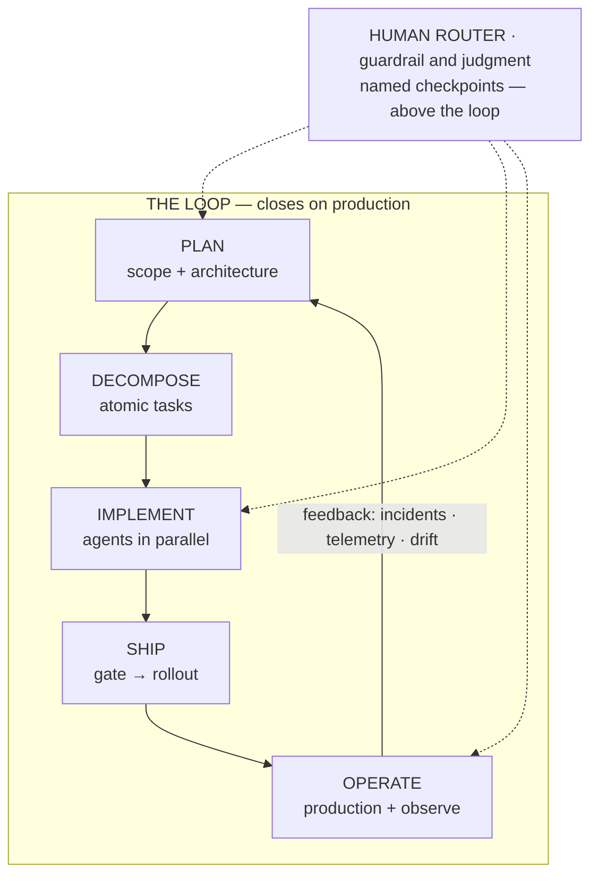

# How to read this course

Building software with fleets of coding agents is not a prompting problem. It is a verification problem.
Generation has become cheap; checking has not. Underneath, everything this course teaches is a mechanism for
making verification scale. And the learning loop it describes has to close on **production**, not on internal
QA. If you take one idea away before the lessons start, take this one. The constraint that decides whether all
this speed is worth anything is your capacity to check the output — not the model's capacity to produce it.

:::tip[▶ Video]

<YouTube id="4wMRXmLpdA8" title="AI in the SDLC: Rethinking AI Coding Tools & AI Agents — IBM Technology" />

IBM's framing of the same shift: what changes in the development lifecycle once coding tools become agents that
act, not just autocomplete that suggests.

:::

## The map for the whole course

One diagram carries the argument. Read it as a loop — the edge that returns from live operation
to planning is the whole point.

The band across the top is the person's job. In the community's vocabulary this is the **human-in-the-loop**.
This course calls it the **human router**: someone who sits above the loop and exercises guardrail and judgment
at a few named checkpoints, rather than standing in as one more stage inside it. The dotted lines say so — the
human touches the work at chosen seams, not everywhere.

Three things the diagram deliberately does *not* draw as boxes — because drawing them as boxes would teach the
wrong lesson:

:::note[Read into the diagram what it refuses to box]

- **Verification** is not a stage. It is woven through every seam of the loop — review between people, a critic
  pass on the generated work, executed gates that either pass or fail. Put it in a box and you invite the idea
  that you can "do the verification step" and move on. You cannot; it happens between the boxes, not inside them.
- **Foundation** (Part I, the Part you are in) sits under the whole loop: project memory, rules-as-code, and
  artefacts as the only interface between stages. It is what must already be true before any agent writes a
  line.
- **The three tiers** (soloist · small-team · enterprise) apply to every element — read each one at these three
  maturity scales. The practice stays constant; the mechanism that enforces it grows.

:::

*The map is the table of contents.* The top row — plan, decompose, implement, ship, operate — is Parts II
through IV, the doing. The foundation row is Part I. The three tiers are Part V. The same diagram reappears at
the opening of each Part with that Part's slice highlighted, so you always know where you are.

## The honest headline, and the honest method

Output is measurably up. Whether *value* is up is not established. And the thing that decides the sign is
review and verification capacity. That is not a hedge; it is where the strongest pro-AI numbers themselves
land. Microsoft's own researchers hold one of the largest measured throughput gains in the field. They still
write that a merged pull request is not the same as the value it delivers — and that the field lacks
agreed-upon measures for the difference.

So the course commits to a method rather than a conclusion:

- Every claim is graded — `MEASURED` (a controlled study found it), `REPORTED` (practitioners say it holds), or
  `ASSERTED` (someone argues it) — and the grade is stated in the prose, never quietly dropped so an assertion
  can pass as a fact. (The grading vocabulary is defined in full in Lesson 2.)
- Every number traces to a primary source with a date. Vendor numbers are read through a simple rule: whoever
  sells the tool cannot be the one who measures it.
- The field's second-hand layer distorts in *both* directions — boosters inflate, skeptics catch a stale
  number and freeze it. The remedy is the same either way: go to the primaries, grade what you find, and say
  so. That posture is the teaching.

One frame runs through all of it — the **three maturity tiers**: the practice is constant, the mechanism
scales. For each control the lessons state the invariant, then each tier's mechanism, then the specific failure
the upgrade prevents — never "enterprises are richer." A refined version of this idea recurs across the course:
the further a control sits from the blast radius, the more it is about *proof*; the closer it sits, the more it
is about *capability*.

## Why a loop, and not a pipeline

Most published schemes — including the practitioner corpus this course draws on — draw a pipeline that ends at
"production" and never feeds back. That is the framing this course corrects. It is worth flagging as a
correction, not a boast: the biggest structural gap in the current writing is that the learning loop closes on
internal QA rather than on live operation. A well-run loop detects and reverts a bad change *by the system*,
before a user has to complain.

There is a measured hint that the feedback edge is where the value hides. DORA's 2025 report finds that AI
adoption carries a negative relationship with delivery *stability* — acceleration can expose weaknesses
downstream. Read it carefully, though: that finding is `MEASURED` only in the weak sense of a self-reported
survey of roughly 5,000 respondents. It is perception, not telemetry, and it does not license "AI makes teams
faster" or "AI makes teams slower." It licenses exactly one thing: the closing edge deserves the attention
Parts IV and V will give it.

A last honesty note about the diagram itself. It is an organising frame, graded `ASSERTED` — the course's own
way of arranging the material, not a proven-optimal lifecycle. Use it to navigate; do not cite it as a result.

## Where to go next

Part I is the foundation — five lessons:

1. **[The verification bottleneck](./part-1-foundation/verification-bottleneck.md)** — the thesis above,
   argued from the evidence.
2. **[Reading the evidence](./part-1-foundation/reading-the-evidence.md)** — the grading ladder, and how the second-hand layer distorts in both
   directions.
3. **[Preparation over model](./part-1-foundation/preparation-over-model.md)** — why what you hand the agent beats which agent you hand it to.
4. **[Project memory and tiering](./part-1-foundation/project-memory-and-tiering.md)** — the durable context a fleet works against.
5. **[Rules that hold](./part-1-foundation/rules-that-hold.md)** — turning conventions into constraints a machine enforces.

Start with Lesson 1: it proves the claim the rest of the course is built on.
