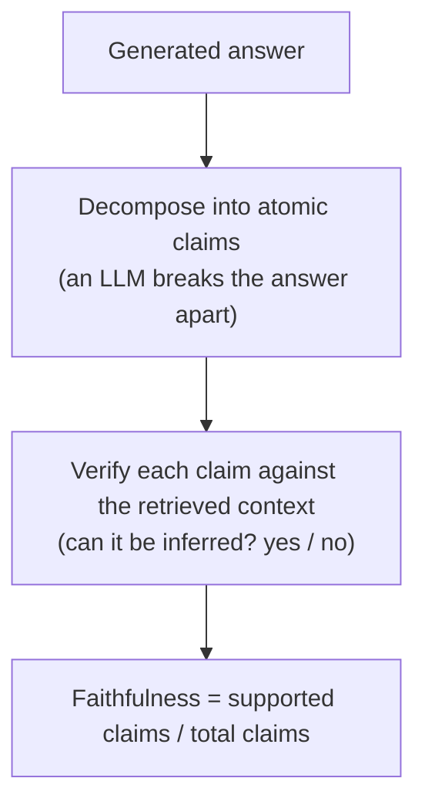

# When the metric is itself a judge, how you calibrate it, and the human labels under both

[Part 1](./index.md) set the frame: evaluate retrieval and generation separately, build a golden set, score free-form answers with an LLM judge, distrust that judge's biases and validate it against humans, and run both offline in CI and online in production. This page assumes all of that and opens the mechanics underneath it — what the named metrics actually compute, how you calibrate the judge you were just told to distrust, and how the human labels the whole stack rests on get made.

One boundary first. This page is about *measurement*, not about fixing the pipeline. The levers that move a metric — better chunking, better reranking, better grounding — live in the [Retrieval](../../retrieval/index.md) and [Generation](../../generation/index.md) layer pages; here the object under study is the measuring instrument itself. And the idea the whole page rests on is one Part 1 only gestured at: most modern RAG metrics *are* LLM judges under the hood, so a metric inherits the judge's fallibility. That is why calibration and human labels are the foundation every number here stands on.

## Opening the metric black boxes

In Part 1 the metric names were black boxes — "faithfulness," "answer relevance," a couple more — labels you trusted without seeing inside. At mastery level you need to know what each one *computes*, because the computation is what tells you what the number can and cannot catch, and every one of these metrics has a documented blind spot the name hides.

The reference implementation to reason about is **[Ragas](https://ragas.io)**, the framework that introduced this decomposition of RAG evaluation into named, separately-computed metrics (Es et al., "Ragas: Automated Evaluation of Retrieval Augmented Generation," arXiv 2309.15217, submitted 26 September 2023). Naming it matters because these four metrics are the field-standard way to cut the problem — the decomposition the field converged on, rather than one vendor's private recipe.

Four metrics, and the useful way to hold them is on two axes. The first is the one Part 1 already drew — *what stage* each metric watches: context precision and context recall grade retrieval; faithfulness and answer relevance grade generation. The second axis Part 1 left implicit, and it's the practically decisive one: whether a metric needs a reference — a human-written correct answer — or runs on the question, the retrieved context, and the answer alone.

| | **Reference-free** (question + context + answer) | **Reference-based** (needs a ground-truth answer) |
|---|---|---|
| **Retrieval** | context precision (an LLM decides relevance) | context recall |
| **Generation** | faithfulness, answer relevance | — |

The split has teeth. Faithfulness and answer relevance you can run on live production traffic with no labelled answer in sight; context recall you cannot compute at all without a reference. That axis decides what you can measure where, and it's the reason the golden set gets its own section at the end.

### Faithfulness — grounding as a claim-level ratio

**Faithfulness** is the number Part 1 and the Generation layer kept promising to formalize: does the answer rest on the retrieved context, or has the model wandered back into its own memory? Ragas computes it in three steps. First, an LLM decomposes the generated answer into atomic claims — the individual factual statements it asserts. Second, another LLM pass checks each claim against the retrieved context and asks a yes/no question: can this claim be inferred from what we retrieved? Third, it takes the ratio.

*faithfulness = (claims supported by the context) / (total claims in the answer)*, on a 0-to-1 scale.

The Ragas documentation's worked example makes it concrete. Ask "Where and when was Einstein born?" and an answer might assert two claims — the place, and the date "20 March 1879." If the retrieved context supports the place but not the date, one of two claims is grounded, and faithfulness is 1/2 = 0.5.



Now the blind spot. Faithfulness measures grounding, not correctness. A claim faithfully grounded in a *wrong* context scores a perfect 1.0 — the metric is content as long as the answer traces back to what was retrieved, even when what was retrieved is garbage. And because the metric is itself an LLM pipeline — decompose, then verify — its number carries the judge's own errors: a botched decomposition or a mistaken entailment call moves the score while the answer stays fine. So faithfulness catches the hallucination and parametric-override failure the Generation layer warned about, and a wrong-but-grounded answer sails straight past it. Closing that gap is a job for a reference, further down.

### How answer relevance runs the question backwards

**Answer relevance** measures something faithfulness never touches: whether the answer actually *addresses the question* — is it on-topic and complete? Correctness is a separate axis it deliberately leaves alone. Ragas computes it by reverse-engineering the question. From the generated answer, an LLM writes N artificial questions (three by default) that the answer would be a good answer to. Each generated question and the original question get embedded, and you take the cosine similarity of each generated question to the original. Answer relevance is the mean of those similarities.

```text
answer relevance = (1/N) · Σ cos(E_gen_i, E_orig)
```

The intuition explains what the metric rewards. A genuinely relevant answer lets you reconstruct the original question from it: regenerate the question and you land right back where you started, high cosine. An evasive, padded, or half-complete answer generates questions that drift somewhere else, and the mean similarity sags. That's why it penalises incompleteness and redundancy alike — filler dilutes the signal that would point back at the question.

Its blind spot is the honest limit of reference-free evaluation. Answer relevance explicitly does not assess factual accuracy; it's an intent-match, nothing more. Put it beside faithfulness and you have the full reach of reference-free eval: faithfulness certifies that an answer is *grounded*, answer relevance certifies that it's *on-topic*. Correctness is a third thing, and neither metric reaches it — that needs a reference, a known-correct answer, or a human in the loop. No amount of reference-free cleverness closes the gap; it's structural.

### Why context precision cares about rank order

**Context precision** moves to the retrieval side and asks a sharper question than "how many retrieved chunks were relevant?" It asks whether the relevant ones are ranked at the *top*. It is ranking-aware, which a plain relevant-fraction is not. The computation is a weighted mean over ranks. At each rank k, Precision@k is the share of the first k retrieved chunks that are relevant; you weight each rank by whether the chunk sitting there is itself relevant, sum across ranks, and normalise by the total number of relevant items in the top-K.

```text
Context Precision@K = Σ_k (Precision@k · v_k) / (total relevant items in top-K)
```

where v_k is 1 when the chunk at rank k is relevant and 0 otherwise. What the formula buys you is sensitivity to *order*, and the documented behaviour shows how sharp it is. Take a result set that scores near 1.0, then move a single irrelevant chunk from rank 2 up to rank 1 — nothing enters or leaves the set, only the ordering changes — and the score falls to roughly 0.5. Rank position dominates. This is the metric that rewards the reranker's ordering work from the Retrieval layer: getting the right chunks into the set is necessary, and putting them first is what context precision actually scores.

### Context recall is the one that needs a reference

**Context recall** asks the question that matters most for retrieval: did we bring back *everything* the correct answer needs? It is the most direct measure of the retrieval failure Part 1 named — the needed chunk that never made it into the results. But answering "did we retrieve everything needed" requires knowing what "everything needed" is, and that knowledge isn't free: this is the one metric here that is reference-based. The computation is again LLM-driven. Break the reference answer — the ground-truth answer — into claims; for each reference claim, check whether it can be attributed to the retrieved context; then take the ratio.

*context recall = (reference claims supported by the context) / (total reference claims)*

Part 1 called recall "the main one for RAG," and this is why: a low context recall means generation *physically cannot* answer, however good the model is — the evidence simply isn't in front of it. That dependence on a reference answer is also why the golden set isn't a nicety for the retrieval side; it's the thing that makes this metric computable at all.

Step back and the pattern across the four is the point. Three of them — faithfulness, answer relevance, context recall — are themselves small LLM pipelines that decompose, verify, or generate. The metric is a judge. A number from Ragas is therefore only as trustworthy as the LLM computing it, which turns "trust the metric" into "trust the judge" — and the judge, Part 1 was blunt, is not to be trusted on faith. So the next question is unavoidable: how do you calibrate a judge you were told to distrust?

## Calibrating the judge you were told to distrust

Part 1 gave the instruction — the judge has biases, validate it against humans — but left it as a *what*. This section is the *how*. The biases have names and mechanisms, there are two scoring protocols with different failure profiles, and "validate against humans" is a concrete procedure with a number attached. The source is the paper that established LLM-as-a-judge as a method and catalogued its failure modes: Zheng et al., "Judging LLM-as-a-Judge with MT-Bench and Chatbot Arena" (arXiv 2306.05685, submitted 9 June 2023).

### The biases have names, and each has a mitigation

**Position bias** is the judge favouring the answer shown first — or in a fixed slot — regardless of which answer is actually better. The mitigation is mechanical: run every pairwise comparison in both orders and count a win only when the verdict survives the swap. If flipping the order flips the winner, the slot decided it, and the result is noise.

Length is the lever behind the second one. **Verbosity bias** rates a longer, more elaborate answer higher even when the extra length adds nothing correct — padding reads as thoroughness. You mitigate it with rubrics that score substance over volume, and by watching for the tell: a score that tracks answer length is a score measuring the wrong thing.

The third is subtler. **Self-preference** — the paper's *self-enhancement bias* is the same failure under its formal name — is the judge rating outputs in its own style, often its own model family's generations, above the rest. The fixes are to judge with a model from a different family than the system under test, or to measure the offset against human labels and correct for it.

One more limit, without overclaiming it: the paper flags that LLM judges are weak graders on tasks demanding hard reasoning or math. A judge is least reliable exactly where the task is hardest — precisely where you would most want to lean on it. This one is a competence ceiling rather than a directional skew, so treat it apart from the three biases above.

Those three biases share a property that's easy to get backwards: they are *systematic*. Random error averages out as you run more examples; a systematic skew does not — run ten thousand comparisons and position bias tilts all ten thousand the same way. The correction is protocol design and calibration; more data does nothing for it.

### Two ways to score: one answer at a time, or two head to head

**Pointwise** grading — single-answer grading — hands the judge one answer and asks for an absolute score against a rubric, optionally reference-guided, meaning the reference answer rides along in the judge's prompt. It's cheap, it scales, and it gives you an absolute number you can threshold. The catch is that absolute scores drift: what the judge calls a 7 today it may call a 6 next week, and calibrating those numbers across runs is genuinely hard.

**Pairwise** comparison shows the judge two answers and asks which is better, or whether they tie. It is more reliable for *ranking* two systems — humans agree far more readily on "A is better than B" than on any absolute score, and so do judges — which makes it the protocol for A/B decisions. Its costs are two: ranking many systems is O(n²) in comparisons, and it is the protocol most exposed to position bias, which is why the swap-and-require-consistency mitigation exists specifically for it.

So the choice follows the question. Reach for pairwise when you're asking "did version B beat version A" — model selection, an A/B test. Reach for pointwise when you need an absolute "is this answer good enough" threshold in CI, where there's no second answer to hold it against. Reference-guided pointwise is the middle ground when you have golden answers to put in front of the judge: absolute scoring, but anchored to a known-correct reference.

### What "calibrate against humans" actually means

Calibration is the step that earns the judge its scale. Before you trust its numbers across thousands of examples, you measure the judge's agreement with human labels on a sample — how often judge and human reach the same verdict. The benchmark result to carry in your head sets the honest ceiling: strong judges (GPT-4, in the paper's experiments) reach over 80% agreement with human preferences — about the same as the agreement between two independent humans. Read that number the right way: the judge is about as consistent as a person here, no more. What it buys you is scale — the same human-level judgement applied to a volume no human team could reach.

The procedure follows directly. Hold out a slice of human-labelled examples; compute judge-versus-human agreement on it, and for pairwise, position-swap consistency alongside. If agreement clears your bar, you scale the judge to the volume no human team could label. If it doesn't, you fix the rubric, switch protocol, or change the judge model, and you measure again before trusting it. The thing you calibrate against is the golden set — the last piece, and the one everything else has quietly been leaning on.

Three cautions, then. An uncalibrated judge's absolute scores are unanchored numbers until a human sample says otherwise, so don't read them at face value. A judge from the same model family as the system under test can tip on self-preference, so keep the two in different families for any close comparison. And pairwise ranking of many systems drags in both the O(n²) blow-up and position bias, so budget for both before you reach for it.

## The human labels everything rests on

Follow both threads back and they meet in the same place. The reference-based metric (context recall) needs a ground-truth answer; the judge, whatever the protocol, needs human agreement to calibrate. Both bottom out in human-labelled ground truth — the golden set. Part 1 said to build one by hand or synthetically, and that clean beats big. Here is how it's actually built to a standard you can calibrate against.

### Building the golden set

A golden-set example is a question paired with its reference: the relevant chunks, the correct answer, or both. Two routes get you there. Hand-authored sets, written by domain experts, are the highest quality and the slowest to produce. Synthetic sets have an LLM generate question–answer pairs over your corpus, then put a **human-in-the-loop** (HITL) to review and edit every pair. The synthetic route scales the generation, but the human gate is what turns model output into ground truth: an un-reviewed synthetic set is just more model output wearing a reference's label.

This is where Part 1's "quality over size" stops being a slogan and gets its reason. The golden set is the ruler every other number is measured against. An error in the ruler doesn't stay put — it corrupts every metric computed against it and every judge calibrated against it, and it does so invisibly, because the corrupted numbers still look like numbers. A small, clean, domain-representative set beats a large noisy one because noise in the instrument propagates without bound to everything the instrument touches.

### Knowing the labels are trustworthy: inter-annotator agreement

There's a problem hiding inside the phrase "human-labelled." If two experts read the same answer and disagree on whether it's correct, the label hasn't earned the name ground truth yet — it's one expert's opinion. So you measure the disagreement, with **inter-annotator agreement** (IAA): the degree to which independent annotators assign the same labels. Two standard statistics carry it, and the glossary holds their canonical references.

- **Cohen's kappa** — agreement between two annotators, corrected for chance. Raw percent-agreement flatters you, because some fraction of any agreement happens by luck; kappa subtracts that expected-by-chance share out. κ = (p_o − p_e) / (1 − p_e), with p_o the observed agreement and p_e the agreement expected by chance.
- **Fleiss' kappa** generalises the same idea to more than two annotators.

Why the chance correction earns its keep: on a binary correct/incorrect label, two annotators agree about half the time by coin-flip alone, so "we agreed 80% of the time" can be a weak result once you subtract the roughly 50% that chance would have handed you anyway. A low kappa points at the *rubric*: the labelling instructions are ambiguous enough that two careful people read them differently. The fix is to sharpen the instructions and re-label, treating the disagreement as the signal it is rather than overruling a dissenter. It's the same rubric discipline the judge demanded in the last section, and the symmetry is exact: an ambiguous rubric poisons the human labels and the LLM judge in one and the same way.

### Spending the human budget where it pays

Human labelling is the scarce, expensive resource in the whole stack, so labelling at random wastes it. **Active sampling** — active learning — picks the examples whose labels will teach you the most, rather than drawing uniformly. In practice you label where the judge is least confident, where an ensemble of judges disagrees, or where production surfaced a failure the golden set never saw coming — the online-to-offline loop from Part 1, feeding real failures back into the labelled set. Uncertainty-driven selection buys more calibration signal per human hour than uniform random sampling, sometimes by a wide margin.

And that closes the loop the whole discipline turns on. Active-sampled human labels build a better golden set; a better golden set calibrates the judge more tightly; a tighter judge produces trustworthy metrics at scale; and trustworthy metrics are what let the eval-driven-development loop from Part 1 actually hold instead of drifting. Human effort is the seed. The judge amortises it across thousands of examples it could never afford to label by hand.

One caution to end on. You never automate the human away — you amortise them. The judge scales human judgement; the labels it was calibrated on stay load-bearing underneath, and the day you forget that is the day your metrics quietly stop meaning anything. Calibration rots, too: when the model, the corpus, or the distribution of questions drifts, the judge you calibrated last quarter is grading against a world that has moved. Stated once, plainly, the whole stack is this — humans define truth on a small clean set; that set calibrates the judge and grounds the reference-based metrics; the calibrated judge scales measurement to a volume no human team could reach; and you periodically re-seed the whole thing with fresh human labels. Take the humans out of that chain and every number downstream is measuring against nothing.

## What to take away

- The four Ragas metrics stop being black boxes once you see the arithmetic: faithfulness is supported claims over total claims; answer relevance is the mean cosine between the original question and the questions an LLM regenerates from the answer; context precision is a rank-weighted precision; context recall is supported reference-claims over total reference-claims.
- Two axes organise them — stage (retrieval versus generation) and reference-free versus reference-based. Faithfulness and answer relevance need no golden answer and run on live traffic; context recall can't be computed without a reference.
- Three of the four metrics are themselves LLM pipelines, so the metric *is* a judge and inherits the judge's fallibility — which is the whole reason calibration isn't a nice-to-have.
- Reference-free metrics take you only so far: faithfulness certifies "grounded," answer relevance certifies "on-topic," and neither certifies "correct." Correctness needs a reference or a human.
- Judge biases are systematic, so more examples won't wash them out: position bias (run both orders, require consistency), verbosity bias, and self-preference each need a protocol or a calibration fix.
- Pairwise ranks two systems more reliably but costs O(n²) and invites position bias; pointwise gives you an absolute CI threshold; either way you calibrate against humans, and a GPT-4-class judge tops out around human-level agreement — over 80%, not oracle.
- The golden set is the ruler everything rests on: measure inter-annotator agreement with chance-corrected kappa, spend the scarce human budget with active sampling, and re-calibrate when the model, corpus, or questions drift.

**New terms** → [Glossary](../../../glossary.md): context precision, context recall, faithfulness (formula), answer relevance (formula), reference-free vs reference-based evaluation, LLM-judge calibration, position bias, verbosity bias, self-preference / self-enhancement bias, pointwise vs pairwise evaluation, inter-annotator agreement (Cohen's kappa, Fleiss' kappa), active sampling / active learning.
