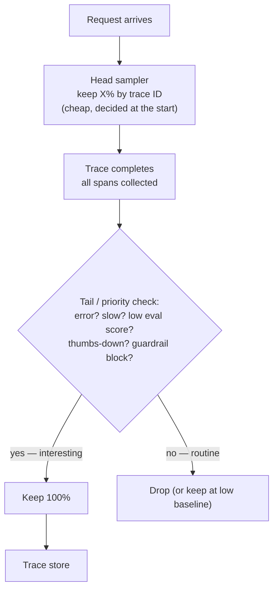
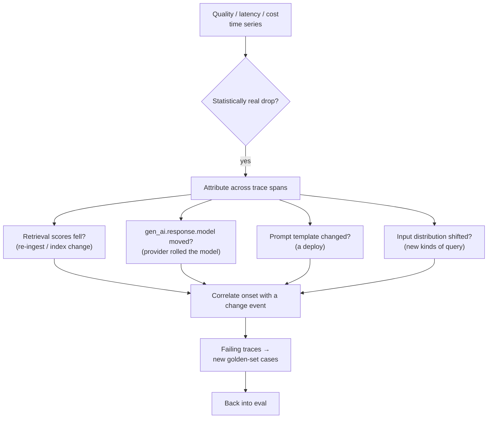

# Keeping the traces that matter, storing them without leaking, and knowing when a 200-OK system is quietly failing

[Part 1](./index.md) set the frame: a trace is the full record of one request, span by span through the pipeline; the three pillars are traces, metrics, and logs; you log the RAG specifics — the retrieved chunks and their scores, the final prompt, the raw output, latency and tokens and cost per step; cost and latency are first-class concerns rather than afterthoughts; and observability feeds eval, because a bad production answer is the next golden-set case. This page assumes all of that and turns to what changes once the traffic is real and continuous — when one trace becomes a million a day and every one of those decisions has to survive contact with scale.

One boundary first. This page is about running observability as a production discipline: at volume you cannot keep every trace, so you sample; you cannot store everything you capture, so you decide what is safe to keep; you cannot watch every chart, so you set targets and alert on the ones a user feels; you have to attribute a quality drop to a cause; and you have to cap what all of this spends. It is not a re-derivation of the trace primitive — Part 1 has that. It is not the tool catalogue, which is [Part III](../../../part-3-production/tooling-ecosystem/index.md), and it is not how to fix the pipeline, which lives in the [Retrieval](../../retrieval/index.md) and [Generation](../../generation/index.md) layer pages. Here the object under study is the observability system itself.

## You cannot keep every trace

At production volume, storing 100% of traces is prohibitively expensive — the observability store fills as fast as the traffic arrives, and most of what lands in it is unremarkable. So you keep a subset that is both representative and interesting, and throw the rest away. That is *sampling*, and the whole question is which traces you decide to keep.

The naive answer decides too early. **Head-based sampling** makes the keep-or-drop call at the *start* of a trace, on the root span, typically as a deterministic ratio on the trace ID — keep one in ten, drop the other nine. It is cheap, stateless, and gives you a volume you can predict to the byte. Its limitation is fatal for exactly the traces you care about: at the moment the decision is made you do not yet know how the request ended. You cannot preferentially keep the failures, because none of them have failed yet. Pure head sampling therefore drops most of the traces you would actually have wanted to look at, and keeps a random tenth of the boring ones.

**Tail-based sampling** inverts the timing. The collector buffers every span of a trace until the request is complete, and only then decides, using the whole trace — its latency, its error status, its span attributes. Now "keep the slow ones, keep the errors, keep the flagged ones" is expressible, because by decision time those properties are known. The cost is that the collector has become stateful: it must hold a trace's spans in memory and group them by trace ID, which means every span of a given trace has to reach the same collector instance — load-balancing by trace ID — and the memory and CPU bill climbs with it. The OpenTelemetry Collector Contrib distribution ships this as the `tail_sampling` processor.

What mature teams converge on is neither extreme but a **priority (or hybrid) sampling** policy: keep 100% of the traces you must never lose — errors, latency-budget breaches, answers a user or a guard flagged as bad — and sample the boring successes at a low baseline rate. A common arrangement chains the two: a head sampler first, to cut the raw firehose down to something affordable, then tail sampling over what remains to make the real keep-or-drop call on outcome.

Then the LLM twist on the word "interesting." For an ordinary service, an interesting trace is an error or a slow request, and both are visible in the transport. For an LLM system a 200-OK response can still be a hallucination, a subtly wrong answer, or a refusal to help — quality is invisible to the HTTP status. So the priority signal that decides whether to keep a trace has to carry a *quality* signal alongside latency and error: an online-eval score attached to the trace, a thumbs-down, a guardrail block, a refusal. This is why sampling for an LLM application is wired into the eval loop and not to error and latency alone — the thing worth keeping is often the request that looked perfectly healthy at the transport layer.

## What you most want to log is what you least want to keep

The single most useful thing to record for debugging an LLM application — the full prompt that went to the model and the full output that came back — is also the most sensitive thing you hold. Those payloads routinely carry user data and personal information; the most debuggable trace is, by construction, the most privacy-laden. You cannot store everything you are able to capture, and the tension is not incidental to the design — it *is* the design.

The standard treats this directly. In the OpenTelemetry GenAI semantic conventions, capturing message *content* — the input messages and the generated output text — is opt-in and off by default, precisely because of privacy and payload size. What stays on by default is the metadata: the model, the token counts, the duration. The raw text is the part you have to consciously switch on. (These conventions are in Development status — experimental, not yet stable, as of Semantic Conventions v1.41.x in 2026 — and you opt into the current experimental set with `OTEL_SEMCONV_STABILITY_OPT_IN=gen_ai_latest_experimental`.)

Controls come in layers, and they compose. First, redact or anonymise personal data *before* it reaches the trace store, using the same detection machinery the Guardrails layer already runs — a PII recogniser feeding an anonymiser, as in Microsoft [Presidio](https://microsoft.github.io/presidio)'s Analyzer-then-Anonymizer pipeline (the [Guardrails deep dive](../guardrails/deep-dive.md) has the mechanics). Second, set retention by tier: a short TTL on the content-bearing spans so the raw text expires fast, while the cheap metadata lives on for trend analysis. Third, put access control on the trace UI itself — production prompts are user data, and a trace viewer is a window onto it. And sampling helps here too, almost for free: fewer stored traces is a smaller surface to leak.

The masking choice reuses the axis the Guardrails layer drew, and it is a genuine tradeoff rather than a default. Irreversible masking — hashing, redaction, replacement — maximises privacy and destroys debuggability in the same stroke: you can no longer see what the user actually asked. Reversible masking — encryption — keeps a path back for authorised debugging, but a recoverable value is a larger liability, and it makes the data pseudonymised rather than anonymised, because the key is now a stored secret worth attacking. You pick per field and per retention tier: the phone number can be hashed and gone, the query body encrypted for a short window and then dropped.

## Deciding what to watch, and when to page someone

An LLM-system dashboard charts everything an ordinary service does — the **golden signals** of the Google SRE tradition, latency and traffic and errors and saturation — and then one pillar those four never anticipated. On the ordinary axis you want latency as a distribution, p50, p95 and p99, plus **TTFT**, time-to-first-token, which is what a user of a streaming answer actually experiences; cost and token usage per request; throughput; and error rate. The LLM-specific pillar is quality, charted as a first-class signal from the start: online-eval scores on sampled traffic (faithfulness pass-rate, answer relevance), the thumbs-down rate, the refusal rate, the guardrail-block rate. A dashboard that shows latency and cost but not quality is blind to the failure mode unique to this kind of system.

That quality signal is what lets you apply the SRE reliability frame honestly. You pick **SLIs** — service level indicators, the things you actually measure: availability, p95 latency, a quality pass-rate, a ceiling on cost per request. You set an **SLO** — a service level objective, a target on an SLI over a window: "p95 latency under three seconds over 30 days," "faithfulness pass-rate at or above 0.95." And the distance between that target and a perfect 100% is your **error budget** — the amount of failure you are permitted to spend before the objective is breached. The move that makes this fit an LLM system is insisting that at least one SLI is a *quality* SLI computed by online eval. A service that is 100% available and 30% hallucinating meets an uptime SLO and fails every user who trusted it; without a quality objective the dashboard stays green over exactly that.

Alerting follows from the budget rather than from the raw metrics. You page on what a user feels: the error budget's **burn rate** — how fast you are spending it, so a fast burn pages someone now while a slow drift merely warns — a p95 latency breach, a cost spike, a quality drop, a spike in guardrail blocks. The discipline here is restraint, because over-alerting is its own failure mode. Wire an alert to every metric and the real regression, when it comes, arrives buried in a stream of noise nobody reads any more — alert fatigue, and it is how a genuine incident goes unnoticed for an hour. Burn-rate alerting is symptom-based by design: it fires on the user-visible consequence, not on every twitch of every underlying number, and that is what keeps the pager credible.

## Tracing a quality drop back to its cause

When a quality metric sags, two questions follow in order: is the drop real, and what caused it. The first is detection. Online eval on sampled traces, together with collected user feedback, gives you a quality-metric time series; a statistically real fall in that series — not a single bad afternoon — is a quality regression, and the same reasoning applies to the latency and cost series. The point is to distinguish a trend from noise before anyone is paged.

The second question is where the structure of a trace earns its cost. Because a trace is decomposed into spans per stage, you can localise a regression to a stage instead of guessing at the whole pipeline — the retrieval-failure-versus-generation-failure decomposition from Part I, now applied to a production time series rather than a single answer. The candidate causes are concrete, and each leaves a mark in the trace record. Did retrieval scores drop, pointing at a corpus re-ingest or an index change — a retrieval failure? Did the model change under you, a provider silently rolling the version so that `gen_ai.response.model` moved while your code did not? Did the prompt template change in a deploy? Did the input distribution shift, a new class of query the system was never tuned for? You answer by correlating the onset of the regression with a change event — a deploy, a model-version-pin change, a re-ingest. (Pinning the model version so the provider cannot move it under you is an LLMOps practice; the [LLMOps lesson](../../../part-3-production/llmops/index.md) owns it.)

And here the loop from Part 1 becomes operational. The traces a regression flags are, by definition, the hard failing cases — which is exactly what a golden set is short of. They graduate into new golden-set cases, so that regression triage feeds eval and eval then guards the fix against coming back. The metric internals that turn those cases into numbers are the [Evaluation deep dive](../evaluation/deep-dive.md)'s subject; here the point is only that the pipe runs both ways, production into the golden set and the golden set back into production.

## Putting a cap on what a request spends

Cost begins with per-request token accounting: the bill is input tokens plus output tokens, each priced per model, and you cannot manage what you have not counted. The OpenTelemetry GenAI conventions give the exact instruments to count it with. The attributes are `gen_ai.usage.input_tokens` and `gen_ai.usage.output_tokens` for the token split, `gen_ai.request.model` and `gen_ai.response.model` for what you asked for versus what answered, `gen_ai.operation.name`, and `gen_ai.provider.name`; the metrics are `gen_ai.client.token.usage`, in units of `{token}`, and `gen_ai.client.operation.duration`, in seconds. As with message content, these are in Development status in Semantic Conventions v1.41.x (2026) and you opt in through `OTEL_SEMCONV_STABILITY_OPT_IN=gen_ai_latest_experimental` — stable enough to build on, not yet frozen.

Counting tokens is not the same as knowing where they go, and that is **cost attribution**. Tag the spans with the feature, the tenant, the route, and the model, and the monthly bill can answer "which feature — or which customer — is burning the budget," instead of the useless aggregate "we spent $X." Those same OTel attributes are the tagging mechanism. Without attribution a cost spike is undiagnosable: you know the number went up and nothing about why, which means you cannot even decide what to turn off.

Latency gets the same treatment on the time axis. You set p50 and p95 targets and you decompose latency by span — retrieval versus rerank versus generation, TTFT versus total elapsed — so that a breach points at the slow stage rather than at the pipeline as an undifferentiated whole. A budget is a cap, and a breach is a signal to reach for one of Part 1's optimisation levers: a cache, a cheaper model, fewer chunks in the prompt. (Streaming the answer so TTFT is short even when the full generation is slow is a serving concern; the [serving lesson](../../../part-3-production/serving/index.md) covers it.)

The policy that turns a budget from a chart into a control is the **soft cap** / **hard cap** distinction. A soft cap warns — it alerts, it colours a dashboard red — and lets the request through. A hard cap actually stops: it rejects the request, downgrades to a cheaper model, or truncates the context to fit. The hard cap is a runtime guard rather than a report after the fact, and it is the same shape as the step and token budgets an agent runs against in Part II — a limit the system enforces on itself while it is working, not one you read about the next morning.

## Where this goes wrong

The failure modes are worth stating plainly, because each is a place a team has actually landed.

- Observing the LLM app can cost like the LLM app. Keep 100% of content-bearing traces and the observability bill starts to rival the inference bill it was meant to watch. At scale, sampling is what makes observability affordable at all; treating it as a deferrable optimisation is how the bill escapes you.
- Tail sampling is not free either. At massive scale its stateful buffering and trace-ID load-balancing are themselves expensive and operationally heavy, and running it well takes meaningful investment. It buys you the ability to keep the interesting traces; it does not buy it cheaply.
- Logging raw prompts and outputs without redaction is a compliance incident waiting for its date. The most debuggable log is the one that will feature in the breach report — mask on the way in, or do not keep it.
- Alerting on every metric ends in alert fatigue, and alert fatigue ends with the real regression scrolling past unread. More alerts is not more safety past the point where anyone still reads them.
- A quality SLO with no online eval behind it is uptime theatre: a wall of green dashboards over a service that is confidently, measurably wrong. The objective is only worth as much as the measurement underneath it.

## What to take away

- Sampling is unavoidable at scale, and the strategy decides what you keep: head-based sampling is cheap and stateless but decides before the outcome is known, so it cannot preferentially keep failures; tail-based sampling buffers the whole trace and decides on outcome, at a stateful memory and load-balancing cost (the Collector Contrib `tail_sampling` processor); priority/hybrid keeps 100% of the must-not-lose traces and samples the rest.
- For an LLM system, "interesting" includes quality, not just errors and latency — a 200-OK can be a hallucination — so the keep decision is wired to an eval score, a thumbs-down, a guardrail block, or a refusal.
- The most debuggable payload is the most sensitive, so message content is opt-in and off by default in the OTel GenAI conventions while metadata stays on; you defend with redaction before the store, tiered retention, access control on the trace UI, and the exposure that sampling already removes.
- Masking is a per-field, per-tier choice: irreversible (hash, redact, replace) maximises privacy and kills debuggability; reversible (encrypt) keeps an authorised path back but is pseudonymisation, not anonymisation, and the key becomes a liability.
- Chart the golden signals plus a first-class quality pillar; set SLIs, SLOs and an error budget with at least one quality SLI computed by online eval; and alert on burn rate and user-felt symptoms rather than on every metric, or alert fatigue buries the real regression.
- Regression triage is detect then attribute: a statistically real drop in a quality, latency, or cost series, localised to a stage across the trace spans (did retrieval scores drop, did `gen_ai.response.model` move, did the prompt change, did the input distribution shift), correlated with a change event — and the failing traces become new golden-set cases.
- Cost is per-request token accounting via the OTel GenAI instruments, made diagnosable by cost attribution (tag spans with feature/tenant/route/model); latency budgets decompose by span; and a soft cap warns while a hard cap enforces at runtime.

**New terms** → [Glossary](../../../glossary.md): head-based sampling, tail-based sampling, priority / hybrid sampling, message-content capture (opt-in), retention tiers, golden signals, SLI / SLO, error budget, burn-rate alerting, alert fatigue, regression triage, cost attribution, token accounting, latency budget, soft cap / hard cap, OpenTelemetry GenAI conventions.
