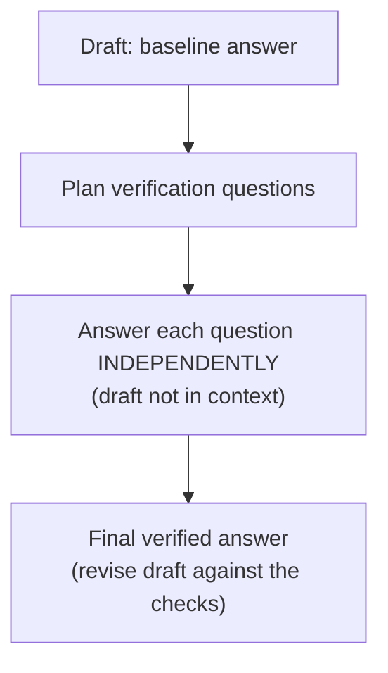
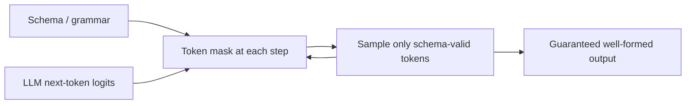

# Answers that check themselves, output that can't malform, and the packing behind both

[Part 1](./index.md) built the generation layer from one frame — answer **from the context, not from memory** — and handed you the base levers: grounding instructions, citations riding off chunk metadata, a permitted refusal, and faithfulness as the number that bridges to Evaluation. It also named the failure this whole layer exists to prevent: the chunk you needed *was* in the context, but the answer still came out wrong. This page assumes all of that and opens the mastery mechanics on top. The generation-failure frame is not re-taught here, only built on.

One boundary first, stated the way the retrieval deep dive states its own. Everything on this page is *single-pass* generation: the model composes one answer from a fixed context, and that context does not change. The self-verification below is the model auditing *its own draft* — not the agent going back to retrieve more. The moment your system loops back to *re-retrieve* because it judged the answer insufficient, you have left single-pass territory for the iterative, agentic kind (Self-RAG, CRAG, sufficient-context), and that lives in the [Agentic RAG deep dive](../../part-2-agents/agentic-rag/deep-dive.md). What this page does is make the one pass as good, as well-formed, and as verifiable as a single pass can be.

The spine, in order: spend inference compute to catch the model's own errors (self-verification); force the answer into a shape a parser and a citation-checker can trust (structured output and forced citations); handle the context-versus-memory conflict head-on instead of hoping grounding wins; pack a long context past the lost-in-the-middle rule; and shape the answer's format, tone, and length without letting the shaping override the grounding.

## Spend compute to catch the model's own mistakes

The grounding instruction from Part 1 lowers the *rate* of hallucination. It verifies no single answer. Two published techniques spend extra inference compute to check the answer itself — both generation-side, neither re-retrieving, and both trading tokens and latency for faithfulness. They solve different shapes of problem, and the fastest way to keep them straight: one samples and votes, the other generates and checks.

### Self-consistency: sample many paths, vote once

**Self-consistency** (Wang et al., "Self-Consistency Improves Chain of Thought Reasoning in Language Models", arXiv 2203.11171, submitted March 2022; ICLR 2023) replaces the single greedy decode of chain-of-thought with a small ensemble. You sample a *diverse set of reasoning paths* at a temperature above zero, then *marginalize over the reasoning paths* and take the *majority vote* on the final answer. The intuition is that a genuinely hard problem admits several valid routes that converge on the same correct answer, while wrong answers scatter — so agreement is evidence and a lone dissenter gets outvoted.

On the paper's own benchmarks the gains over greedy CoT are large: GSM8K +17.9%, SVAMP +11.0%, AQuA +12.2%, StrategyQA +6.4%, ARC-challenge +3.9%. Read those for what they are — chain-of-thought reasoning benchmarks, not RAG — because the RAG fit is narrower than the headline numbers suggest.

In a RAG system, self-consistency fits an answer with a *discrete, extractable* value you can actually vote on: a number, a name, a category, a yes/no grounded in the retrieved context. You run N grounded generations and keep the majority answer; a single divergent generation loses the vote. That is the whole applicability test.

Which tells you when *not* to reach for it. An open-ended, long-form answer has no single value to vote on — there is nothing to marginalize over, and self-consistency simply does not apply. It also multiplies cost by N: N full generations for every query. That makes it a deliberate latency-and-budget decision on a narrow class of question, never a default you switch on everywhere.

### Chain-of-verification: draft, then interrogate the draft

**Chain-of-verification (CoVe)** (Dhuliawala et al., "Chain-of-Verification Reduces Hallucination in Large Language Models", arXiv 2309.11495, submitted September 2023) is an explicit self-questioning loop in four steps. Draft a **baseline response**. Plan a set of **verification questions** that fact-check that draft. Answer each verification question *independently*. Then generate the **final verified response**, revising the draft against what the checks turned up.

The load-bearing step is the third one, and the word that carries it is *independence* — the paper's "factored" verification. The verification questions are answered *without the baseline response in context*, so the model cannot quietly repeat the very mistake it is supposed to be checking. Let it re-read its own wrong draft while "verifying," and it rubber-stamps the error: the draft's confident phrasing becomes the prior for its own audit. Isolating each verification question breaks that echo. This is why the paper's factored and factor-and-revise variants — which separate the verifications from the draft — are the ones that actually reduce hallucination, while the naive joint version, everything in one prompt, leaks the error straight back in.



In RAG the verification questions get re-grounded against the retrieved context — each one becomes a small "is this claim actually supported by the sources?" check. That turns Part 1's single grounding instruction into an explicit per-claim audit, which is exactly the granularity you want when one fabricated sentence in an otherwise correct answer is the failure you're chasing.

Set the two side by side and the division of labour is clean. Self-consistency is *sample-and-vote*: no critique, needs a votable answer, works where there's one discrete value. CoVe is *generate-and-check*: explicit self-questioning, works on long-form prose where there is nothing to vote on. Both cost extra passes. Neither re-retrieves.

## Stop asking for structure; enforce it

Part 1 asked the model to cite its sources and to answer cleanly. At mastery level you stop *asking* and start *enforcing* — the shape of the output becomes a hard guarantee instead of a hope.

The reason to bother is that "just ask" is best-effort, and best-effort breaks under load. A prompt that says "return JSON" or "cite your sources" gets you a trailing comma, a chatty prose preamble before the JSON, or a fabricated source id — and downstream a parser throws or a citation points at nothing. It works in the demo and fails in the tail, which is the worst failure mode to ship because you won't see it until production traffic finds it.

**Constrained decoding** removes the possibility rather than lowering its odds. It enforces structure *during* generation: at each decoding step the schema — compiled to a grammar — defines which next tokens are legal, and the sampler masks out every token that would break the schema, so only schema-valid tokens can be emitted at all. Malformed output stops being unlikely and becomes structurally impossible. (The term is already in the glossary from the tool-use lesson; this is the same mechanism, pointed at answer formatting.)



This is also where "JSON mode" and schema-guaranteed output part ways, and the difference matters. Plain JSON mode guarantees only that the output is *valid JSON* — it says nothing about whether that JSON matches *your* schema. OpenAI's **Structured Outputs** (`strict: true`, August 2024) compiles the JSON Schema you supply into a grammar and constrains decoding to it, so you get **schema adherence**: every required field present, the right types, no extra keys. Two costs come with that guarantee. It supports only a *subset* of JSON Schema, so not every schema you can write is one you can enforce. And the first request with a new schema pays a one-time grammar-compilation latency, cached for later requests that reuse the same schema — a cold-start tax you feel once per schema, not per call.

Forced citations come in two shapes, and they compose with everything above.

The first is to **structure the citation into the schema itself**. The answer object carries a `claims` array where each claim owns its `source_id`, so a citation becomes a required, typed field the parser can trust rather than a string you hope the model wrote. It rides the same metadata you laid down at chunking (Part 1, and the [Ingestion](../ingestion/index.md) layer) — the source id was always there; the schema just makes carrying it non-optional.

The second is **provider-native citations**. Anthropic's **Citations API** (January 23, 2025) takes source documents you pass and returns *structured citation objects* with character-level offsets into the source text — the exact sentences or passages a claim rests on, guaranteed at the API layer instead of prompted into existence. Anthropic reported up to +15% recall accuracy over a custom prompt-based citation scheme. One constraint belongs in the design conversation, not a footnote: on Anthropic, Citations and Structured Outputs are mutually exclusive — you can't force both at once, so you choose between API-guaranteed citations and API-guaranteed schema for a given call.

There is a tax on all of this, and knowing when *not* to pay it is the mastery move. Forcing the output distribution into a rigid schema can *degrade* the answer's reasoning: the model spends its budget satisfying the grammar instead of thinking. So keep the reasoning free and constrain only the final answer — let the model reason in an unconstrained scratchpad or thinking field, then emit the schema-locked answer at the end. Constrain the deliverable, not the deliberation.

## When the context and the model's memory disagree

Part 1 gave the rule: answer from the context, suppress parametric memory. The rule is not absolute, and pretending it is gets you a class of silent wrong answers.

RAG deliberately pins the answer to the supplied context, but the model still carries strong **parametric knowledge** — the priors baked in during training. Grounding instructions *bias* it toward the context. They do not switch the priors off, and no wording makes them.

So you get **knowledge conflict**, also called the context–memory conflict: the retrieved context contradicts what the model "believes," and the outcome is not guaranteed to favour the context. Which side wins depends on things like how confident and entrenched the parametric prior is, and how plausible and coherent the context looks. A model is likelier to override context that reads as implausible or that clashes hard with a strongly-held prior — even when that context is the correct, freshly-retrieved fact. That is precisely the failure an enterprise should fear: your fresh, permitted document loses to a stale training-time belief, and the answer sounds fine.

You have levers beyond the base grounding instruction, though none of them is a switch.

- **Instruct the conflict explicitly.** Tell the model the context is authoritative, and that when it contradicts prior knowledge it should defer to the context *and surface the discrepancy* rather than silently reconcile the two. Silent reconciliation is the exact mechanism by which a wrong answer hides — it papers over the seam you needed to see.
- **Make the sources legible.** Clear delimiting plus per-claim citations (the previous section) raise the cost of quietly substituting a prior, because every claim now has to point at a source, and a prior has none.
- **Measure it.** Whether the answer actually rested on the sources is the **faithfulness** metric, formalized in [Evaluation](../cross-cutting/evaluation/index.md). Faithfulness is the instrument that catches a parametric override a human reader would nod straight past.

One honest limit remains. No prompt makes grounding absolute — you *reduce and measure* parametric override, you do not eliminate it. That is exactly why faithfulness is a monitored number and not a solved problem.

## Packing a long context past lost-in-the-middle

Reuse the canon term rather than reinventing it: **lost-in-the-middle** (Liu et al., arXiv 2307.03172, TACL 2023). Part 1 gave you the rule of thumb — few best chunks, most relevant at the edges. Here is the mechanism and the discipline behind it.

Precisely: models use information best when it sits at the **start or end** of the input and worst when it is buried in the **middle** — a **U-shaped** positional curve, measured on multi-document QA and key-value retrieval. The part that catches people out is that it holds even for models built and sold as long-context. A big context window is not an evenly-usable one; the middle of it is where signal goes to be ignored.

```text
usable
signal
  ▲    ●                                   ●
  │      ●                               ●
  │        ●                           ●
  │          ●● ● ● ● ● ● ● ● ● ● ● ●●
  └──────────────────────────────────────▶  position in context
     start            middle             end
```

Which is why *more is not better*. Add retrieved documents past a point and it *hurts*: the extra chunks add noise, dilute the one that mattered, push it toward the lossy middle, and cost tokens on top. Effective context is not context-window size. Packing is a *selection* problem, not a "stuff the window" problem — and that is the reason reranking exists upstream in Retrieval. Reranking earns the right to pass *few* chunks.

Given the U-curve, ordering is not cosmetic. Place the packed chunks so the highest-ranked land at the *edges* — start and end — and the weakest in the middle where the model will half-ignore them anyway. The reranker already produced a score order; packing position maps directly onto it. The retriever ranks; the packer *places* according to that ranking.

Two more moves recover budget before you ever hit the window limit. **Deduplicate**: overlapping chunks from ingestion's chunk overlap, plus near-duplicate sources, waste tokens and re-bury the signal by repeating it — drop the redundancy before packing. And **compress** when it earns its keep: context-compression or summarisation of the retrieved chunks fits more signal per token, at the price of an extra LLM pass. Name it, reach for it when the window is genuinely the bottleneck, and don't pay for it otherwise.

The through-line: long-context packing is Part 1's "few best, at the edges" rule made rigorous — select (rerank), dedupe, order to the U-curve. The window got bigger. The discipline did not become optional.

## Shaping the answer without overriding the grounding

The generated answer is a product surface — the thing the user actually reads — and shaping controls how it lands. Hold one caveat from the start, because it is also the point: shaping must never override correctness.

Format is a real quality lever, not decoration. Choose the shape to the consumer: prose for a human reader, bullets or tables for a scannable comparison, and structured output (from the section above) when a machine is the reader. A wall of prose where the question wanted a table is a *worse* answer even when every fact in it is right — the reader can't extract what they came for.

Length is a dial you set to the task. Instruct a target length and cap it with `max_tokens`. An over-long answer dilutes the point, buries the caveat that mattered, and spends tokens; an over-truncated one drops a needed qualification or a nuance. A one-line lookup and a multi-paragraph explainer want different settings — length is not a fixed default you leave alone.

Tone is set in the system prompt and held steady. Match the register to the audience — plain for a support desk, precise for an analyst — and keep it consistent across answers, because tonal drift reads to a user as an unreliable system even when the facts are solid.

Now the rule this all serves. Answer-shaping is subordinate to grounding and faithfulness. "Be concise" must never drop the citation, the caveat, or the honest "that isn't in the documents." When a shaping instruction and a grounding instruction collide, grounding wins, every time. The reason is sharper than tidiness: a beautifully formatted, confidently-toned *wrong* answer is the worst outcome the whole layer can produce, because shaping makes a wrong answer *more* persuasive. That is exactly why shaping comes last and yields to correctness — it is the polish you apply to something you have already made true.

## What to take away

- Self-verification spends extra inference compute to check the model's own answer: self-consistency samples many reasoning paths and majority-votes a discrete value, while chain-of-verification drafts and then answers isolated verification questions so it can't rubber-stamp its own mistake — and neither one re-retrieves.
- Constrained decoding makes output shape a guarantee rather than a request: the schema masks illegal tokens at every step, so malformed JSON becomes impossible, and OpenAI's Structured Outputs (`strict: true`) guarantees adherence to *your* schema, not merely valid JSON.
- Citations are trustworthy only when they're a typed schema field or provider-native — Anthropic's Citations API returns character-level source offsets guaranteed at the API layer, not free-text hope — and because over-constraining reasoning carries a tax, you constrain the final answer and leave the thinking free.
- The context-versus-parametric-knowledge conflict is real: grounding instructions bias the model toward the context but never switch its priors off, so instruct it to defer to the context and surface the discrepancy, then measure whether it did with faithfulness.
- Long-context packing past lost-in-the-middle is a discipline in three moves — select few (rerank), deduplicate, and place the highest-ranked chunks at the start and end — because a bigger window is not an evenly-usable one.
- Answer-shaping (format, tone, length) is a genuine quality lever but stays subordinate to grounding: a well-shaped wrong answer is worse than an ugly right one, since shaping only makes a wrong answer more convincing.

**New terms** → [Glossary](../../glossary.md): self-consistency, chain-of-verification (CoVe), knowledge conflict (context–memory conflict), answer-shaping. (Structured output, constrained decoding, strict mode, lost-in-the-middle, faithfulness, parametric knowledge — from earlier lessons.)
