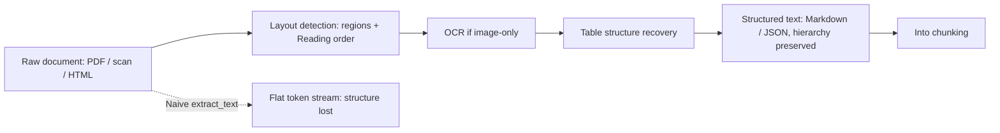
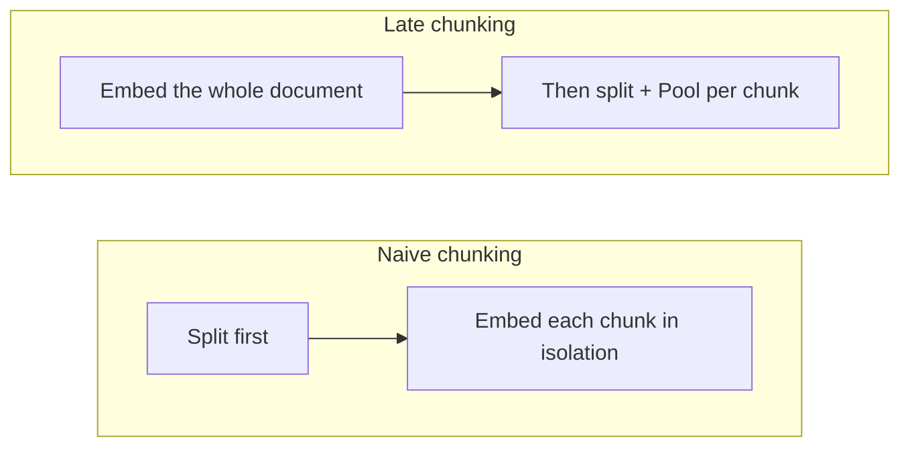

# Getting clean text out, and good vectors in

[Part 1](./index.md) built ingestion from two pillars: chunking — the size tradeoff, the strategies from fixed to structure-aware, the metadata you lay down — and embedding models — the bi-/cross-encoder split, the axes you choose along, cosine, the two pitfalls. Three things it left underdeveloped, and this page takes them on. First: Part 1 quietly assumed you already had clean text to chunk. In the enterprise that assumption is exactly where quality dies silently — the input isn't prose but PDFs, scans, tables, and HTML, and something has to turn that into the text you chunk. Second: even with clean text, a chunk torn out of its document loses the surrounding context, and there are techniques that give it back. Third: you took the embedding model off the shelf, but you can fit it to your domain, your budget, and your languages. So, in order: (1) document parsing; (2) advanced chunking — late chunking and contextual retrieval; (3) embeddings in depth — fine-tuning, Matryoshka dimensionality truncation, multilingual. Part 1 is assumed throughout — the chunk-size tradeoff and the bi-/cross-encoder distinction are not re-taught, only built on.

## Parsing: the stage that caps everything downstream

Part 1's pipeline started at "chunk the document." But something has to turn a document *into* the text you chunk, and that step is where enterprise RAG most often fails silently. The rule is unforgiving: garbage in, garbage out. Every chunking strategy and every embedding trick further down is capped by the quality of the text you extracted. If the parser mangled the input, no downstream cleverness recovers it — you're chunking nonsense and embedding nonsense faithfully.

The core problem is that **a document's visual layout carries meaning that flat text extraction throws away.** A PDF is not a logical document; it's a set of glyphs positioned on a page. A naive `extract_text` walks those glyphs and hands you a linear stream that quietly breaks in specific, predictable ways. Multi-column layouts get read straight across, interleaving two columns into nonsense. Tables collapse into unaligned token soup — the row and column relationships that gave each number its meaning are gone, which is the single worst failure for the financial and specification tables enterprise corpora are full of. Headers, footers, captions, and footnotes land in the wrong place or vanish. And the heading hierarchy disappears — the very hierarchy Part 1's structure-aware chunking and heading-path metadata depend on.

It helps to see document types as a ladder of escalating difficulty rather than one problem:

- **Native-text PDF, DOCX, HTML** — the characters are present; the problem is purely *structure and reading order*.
- **Tables** — the cell, row, and column structure has to be preserved explicitly, not linearized. Flatten a table row by row into text and you destroy the column that made each figure mean something — the structural cousin of Part 1's "in the third quarter it grew 20%" reference loss.
- **Scanned or image-only PDFs** — there is no text layer at all. You need **OCR** (optical character recognition — turning pixels of text back into characters) to recover any text before another stage can touch it.
- **Complex layout** — multi-column pages, forms, figures interleaved with text — every problem above at once.

The modern answer is **layout-aware parsing**: detect structure first, extract second. Instead of scraping glyphs in file order, a parser runs a vision or layout model that detects regions on the page — title, paragraph, table, figure, list, header, footer — and works out the reading order *before* it pulls any text. Then it emits structured Markdown or JSON that preserves the hierarchy and the tables. That reordering is the whole delta over a legacy flat extractor.

A few tools mark the landscape, and the point of naming them is the design idea each represents, not a buyer's guide.

- **Unstructured** ([unstructured.io](https://unstructured.io)) is the general-purpose workhorse: a document-ingestion library and platform that partitions many formats — PDF, DOCX, PPTX, HTML — into typed elements you can chunk and filter.
- **Docling** ([github](https://github.com/docling-project/docling)), open-sourced by IBM Research in 2024, pairs layout detection with a dedicated table-structure model (TableFormer) and reading-order recovery, and outputs structured Markdown or JSON. A small **Granite-Docling** vision-language model (IBM, 2025) later folded the whole page-to-structure conversion into one end-to-end model.
- **LayoutLM** (Microsoft, first version 2019; arXiv 1912.13318) is the research root the field grew from — a transformer that jointly models text, its 2-D layout position on the page, and the page image, seeding a whole family of document-understanding models.
- **Vision-language-model parsers** (2024–2025) take the end-to-end idea further: read the page image directly and emit structured text. They're the strongest on genuinely messy layouts, and you pay for it in latency and compute per page.

So the strategic choice is parse quality against cost, latency, and complexity — and the "when NOT to" matters as much as the "when to." A cheap flat extractor (pypdf and friends) is entirely fine for clean, single-column, text-native prose, and reaching for a heavyweight parser there is wasted money and latency. Layout-aware and table-structure parsers earn their cost exactly when documents are tabular, multi-column, or scanned — which describes most real enterprise corpora. VLM parsers buy the best quality on the messiest inputs and bill you in latency and dollars per page. One structural fact tilts the whole decision toward quality, though: **parsing is offline and one-time per document**, like the rest of ingestion. You run it once, before any query. So you can afford a far more expensive parser here than you could ever justify at query time — the cost amortizes across every future question.

:::warning[If the parser flattens the table, nothing downstream recovers it]

Parsing feeds Part 1's structure-aware chunking and its heading-path and table metadata. A chunker can only respect a structure that survived extraction. Flatten the table at the parsing stage and no chunking strategy, no embedding, no reranker later can rebuild the columns. Parsing decisions cap the quality of everything the rest of the layer can produce.

:::

## Advanced chunking: give a chunk back its context

Part 1's core chunking tension was that a chunk embedded in isolation loses the context around it — "in the third quarter it grew 20%" is useless once the paragraph naming the company and the year is in a different chunk. Two techniques from 2024 attack that loss, at different moments in the pipeline. They're worth setting side by side, because they're the same medicine applied at two different sites.

**Late chunking** (Jina AI, September 2024; arXiv 2409.04701) attacks it by inverting the order of operations. The standard pipeline splits first and embeds each chunk separately, so a chunk's embedding only ever sees its own tokens — the neighbours' context is already gone by the time the vector is computed. Late chunking runs the whole long document through the transformer *first*, so every token's representation is contextualized by self-attention over the entire text. *Then* it applies the chunk boundaries and mean-pools the token vectors within each chunk to get that chunk's embedding. The vector still corresponds to exactly one chunk — but it was built from token representations that had already "seen" the whole document, so the "it," "the company," and "that quarter" references are resolved inside the vector itself.

The appeal is how little it costs. Late chunking changes *when* you pool, not what model you run — it needs **no training and no LLM**, and adds almost nothing to the compute bill. Its one real precondition is also its main constraint: it requires a **long-context embedding model**, because the whole document has to fit the model's context window for that full-document attention to happen. When a document is longer than the window, you split it into "macro-chunks" first and apply late chunking within each — which is the honest bound on the technique. It's a mechanical fix for context loss; it resolves references that are *in* the document, and it invents nothing that isn't.

**Contextual retrieval** (Anthropic, September 2024) reaches the same goal by a different mechanism. Before embedding, it prepends to each chunk a short LLM-generated blurb — 50 to 100 tokens — that situates the chunk in the whole document ("this chunk is from ACME's Q2-2023 10-K, revenue section…"), then embeds *and* BM25-indexes the contextualized chunk; prompt caching keeps generating that per-chunk context cheap. The full mechanics, and the numbers on how much it cuts retrieval failures, are taught in the [retrieval deep dive](../retrieval/deep-dive.md) — this page won't restate them. What matters here is the contrast:

- **Late chunking** is *mechanical* — the context comes from the embedding model's own attention. No extra model, no generated text; the price is that it needs a long-context encoder.
- **Contextual retrieval** is *generative* — an LLM writes explicit context text that any embedding model can then encode. It works with any encoder; the price is LLM tokens, mitigated by prompt caching.

Neither excludes the other — both operate at index time, and you can run both. One naming trap is worth flagging so it doesn't confuse you: Jina's paper also describes late chunking as producing "contextual chunk embeddings," which is nearly the same phrase as Anthropic's **contextual retrieval** but a different technique entirely. Name them cleanly and the collision disappears. And note the third relative you already met: Part 1's parent-document / small-to-big retrieval fixes the *same* context loss, but at query time inside retrieval rather than at index time — one disease, now three treatment sites, with the query-time detail living in the [retrieval deep dive](../retrieval/deep-dive.md).

## Embedding depth: fine-tuning, Matryoshka, multilingual

Part 1 said retrieval quality is capped by embedding quality, and that you pick a model along a set of axes. This section is the three levers you pull on the embedding itself once picking off the shelf isn't enough.

### Fine-tuning the model to your domain

A general embedding model was trained on general web text. Your domain — legal, medical, internal jargon, product codes — may have query-to-passage relationships the base model simply gets wrong, mapping things near that should be far or far that should be near. **Fine-tuning** adapts the vector space to *your* data. The principled mechanism is **contrastive learning** on triples drawn from your domain — a query, a passage that truly answers it, and a passage that doesn't — pulling the true query–passage pairs together in the space and pushing the mismatched ones apart. The **hard negatives**, the plausible-but-wrong passages, are what actually make it work; easy negatives teach the model nothing it didn't already know. The training labels come from mined click and feedback logs, or, when you have none, from **synthetic generation** — an LLM writes plausible queries for each chunk, a common way to bootstrap with no labelled data.

Here Part 1's corollary bites hard. Fine-tuning changes the model, and **changing the model means re-embedding the entire corpus** — query and document must always be encoded by the same model version, or their vectors live in different spaces and retrieval returns garbage. So fine-tuning is a committing, offline decision, not a knob you turn casually. Which sets the "when NOT to": only fine-tune after the evaluation layer has actually shown that a strong general or retrieval-optimised model is the bottleneck. It's high-effort and needs enough domain data to be worth it. Try a better off-the-shelf retrieval model and hybrid search *first* — they clear the bar surprisingly often, and for a fraction of the commitment.

### Matryoshka Representation Learning and truncation

Part 1 framed dimensionality as a fixed tradeoff: more dimensions are more expressive but cost more memory, slower search, and more money — bigger isn't always better. **Matryoshka Representation Learning (MRL)** (Kusupati et al., arXiv 2205.13147, May 2022; NeurIPS 2022) turns that fixed tradeoff into a dial you can turn *after* the fact. Named for the nested Russian doll, it trains the model so that information is packed **coarse-to-fine into nested prefixes** — the first N dimensions of the vector already form a usable standalone embedding on their own. So you can **truncate** a vector to its first 256, 512, or 1024 dimensions and keep most of the semantic signal, with no re-embedding and no extra forward pass — you just slice the vector and renormalize.

The payoff is one embedding with many operating points. Store and search at a small dimension for speed and memory, and keep the option to use more dimensions where you need the accuracy. It's what makes **adaptive retrieval** practical: a cheap low-dimension first pass over the whole corpus, then a re-score of the shortlist with the full-dimension vectors. The clearest dated example is OpenAI's `text-embedding-3` models (January 2024), whose `dimensions` parameter is built on MRL; OpenAI reports that a `text-embedding-3-large` vector shortened to **256 dimensions still beats the older `text-embedding-ada-002` at its full 1536** on MTEB. The honest bound: truncation *does* cost some accuracy against the full vector — it's a controlled trade you measure against your own metrics, not a free lunch — and it only works on a model *trained* for MRL. You cannot chop a normal embedding and expect the prefix to hold up.

### Multilingual specifics

Part 1 flagged language and domain as a selection axis and called multilingual critical for the enterprise. The mastery detail is what "multilingual" actually has to buy you: a **shared cross-lingual vector space**, where the same meaning in different languages lands at nearby vectors, so a query in one language retrieves passages in another. That cross-lingual retrieval is exactly what an enterprise corpus mixing languages needs — and it's the property most easily assumed and least often verified. Three failure modes are worth checking for directly:

- **Uneven quality across languages.** A model strong on high-resource languages like English can sag badly on lower-resource ones. Verify on *your* languages; never trust a single aggregate score that averages over languages you don't care about.
- **Script and tokenisation.** Languages with rich morphology or non-Latin scripts — Russian among them — can tokenise inefficiently, burning context length and dragging quality down.
- **Alignment isn't automatic.** Some "multilingual" models embed each language *well on its own* but don't align meanings *across* languages — the same sentence in English and Russian lands far apart, and cross-lingual retrieval quietly fails. Cross-lingual alignment is a distinct training objective; check the model card or an eval for it rather than assuming it.

A handful of models are reasonable starting points, offered honestly and not as a benchmark: multilingual-E5 (Microsoft, 2024), BGE-M3 (BAAI, 2024, multilingual and multi-granularity), Cohere Embed multilingual, and IBM's granite-embedding multilingual (278M). And the bridge back to the first lever: for a specific language-plus-domain, fine-tuning — or picking a model explicitly trained for cross-lingual retrieval — beats a generic multilingual model. The practical enterprise line ties all of §3 together: measure on your own languages and domain in the [evaluation](../cross-cutting/evaluation/index.md) layer, because a published multilingual leaderboard averages over exactly the languages you may not have.

## What to take away

- **Parsing is the upstream cap on the whole ingestion layer.** The text you extract bounds every chunking and embedding technique downstream; a flattened table can never be un-flattened later, so this is where enterprise RAG most often fails silently.
- **Layout-aware parsing detects structure first and extracts second** — regions and reading order before text — preserving the tables and hierarchy that Part 1's structure-aware chunking and metadata depend on; use it (and OCR for scans) exactly when documents are tabular, multi-column, or scanned, and a cheap flat extractor when they aren't.
- **Late chunking embeds the whole document, then pools per chunk** — mechanical, needs a long-context encoder, costs almost nothing and needs no LLM or training.
- **Contextual retrieval is the same cure at a different site** — an LLM-written context prefix, working with any encoder at the price of tokens; both operate at index time and compose, with its numbers living in the retrieval deep dive.
- **Fine-tuning is contrastive learning on your domain's query–passage pairs** — powered by hard negatives, bootstrappable with synthetic queries, and a committing decision because it forces a full re-index; reach for a better off-the-shelf model and hybrid search first.
- **MRL trains nested coarse-to-fine dimensions so you can truncate the vector as a dial** — one embedding, many operating points (OpenAI's `dimensions` parameter is the live example) — while multilingual embeddings need a genuinely *shared* space, so verify quality and cross-lingual alignment per language instead of trusting an aggregate.

**New terms** → [Glossary](../../glossary.md): document parsing / layout-aware extraction, OCR, late chunking, embedding fine-tuning, Matryoshka Representation Learning (MRL), contextual retrieval, multilingual embeddings, dimensionality.
