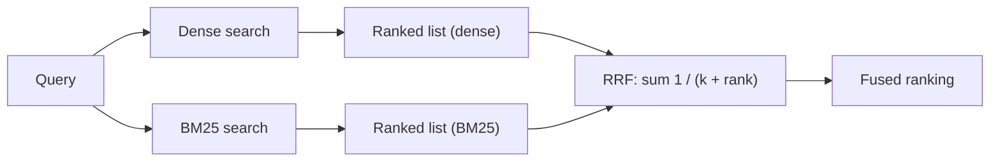
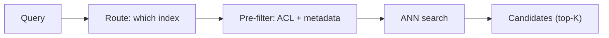

# Fusion internals, late interaction, and the filters that shape the candidate set

[Part 1](./index.md) built the retrieval layer up from naive vector top-K: query transformation, hybrid search, reranking, and filters with access control, arranged as a two-stage recall-then-precision scheme, all in service of driving down the retrieval failure — the needed chunk missing from what you returned. This page opens those boxes. How a hypothetical-document trick actually moves a query in embedding space and when it drags it the wrong way; why two retrievers' scores can't simply be added and what fusion does about it; what separates a cross-encoder reranker from an LLM one; where late interaction sits between the two encoders you already know; how the chunk you search on and the chunk you pass can come apart; and how routing and filter placement decide the candidate set before any of the ranking machinery gets a turn. Part 1 is assumed throughout — the four layers, the two-stage scheme, and the retrieval-failure frame are not re-taught, only built on.

One boundary first. Everything here is *static* retrieval: one pass, decided up front, no loop. The moment retrieval becomes something the model runs again — reformulate, re-retrieve, judge whether it has enough, stop — you are in the iterative version, and that territory (Self-RAG, CRAG, sufficient-context, the learned per-query route) belongs to the [Agentic RAG deep dive](../../part-2-agents/agentic-rag/deep-dive.md). This page makes the single pass as good as it gets.

## HyDE: what it moves, and when it backfires

Part 1 introduced **HyDE** as "sketch a hypothetical answer, embed that, search with it." The mechanism is more deliberate than the one-liner suggests (Gao et al., 2022). An instruction-following LLM writes a hypothetical answer document to the query, zero-shot. An unsupervised contrastive encoder — Contriever in the original work — embeds *that document*, and you search the corpus with its vector, not the query's. The fake document is often wrong on specifics; that's fine. The dense encoder is a lossy bottleneck that keeps the relevance pattern and discards the invented details, grounding the search back to real neighbours.

Why it helps is a geometry problem. A short question and its answer sit far apart in embedding space — different shape, different length, different vocabulary. That is the **query–answer asymmetry**: you are searching for answer-shaped chunks with a question-shaped vector. A document-shaped hypothetical answer lands in the neighbourhood of real answer chunks, so the nearest-neighbour search has an easier target. The paper's own framing is the tell for where this pays off most: HyDE matches fine-tuned retrievers *without any labels*, so the gains are largest in zero-shot and cross-lingual settings where you have no in-domain training data.

That same framing tells you when to leave it alone.

- **It's on the critical path.** HyDE adds a full LLM generation to every single query before the search even starts. On a latency budget that is often the whole objection.
- **It hallucinates you off-target.** On a niche, fresh, or genuinely unknown topic the model invents a plausible document pointing *away* from your corpus, and you retrieve against a fiction — worse than searching with the bare query.
- **The gains shrink as your retriever improves.** The big wins were measured against unsupervised retrievers. A well-tuned, in-domain dense retriever already closes much of the asymmetry, so HyDE's headroom narrows or disappears.
- **It dilutes exact-token queries.** For an error code, a part number, a person's name, a verbose hypothetical buries the one keyword that matters — and hybrid search with BM25 already nails those.

So the verdict is narrow: reach for HyDE when you have no in-domain labels and queries are short and underspecified. Skip it when you're latency-bound, when the retriever is already tuned, or for exact-match lookups.

## Why two retrievers' scores can't just be added

Hybrid search was Part 1's single biggest step up, and it hid a real problem inside the word "merge." Dense similarity is bounded — cosine lives in roughly [-1, 1], often squeezed to [0, 1]. BM25 is unbounded and its scale shifts with the corpus and the query. The two live on incompatible axes, so you cannot add them. Everything about fusion is a way around that.

One family fixes the scales. **Score fusion** normalises both retrievers onto a common range and then takes a weighted sum. Min-max maps each score to [0, 1] as `(s − min) / (max − min)`; z-score standardises as `(s − mean) / std`. Then `combined = α·norm(dense) + (1 − α)·norm(sparse)`, where α is the dial between meaning and exact match. It keeps score *magnitude* — a runaway-best match stays visibly best — which is exactly its appeal. It is also fragile: min-max over a single query's candidate set swings wildly when the top score is an outlier, and because score distributions differ query to query, one fixed normalisation miscalibrates the next query.

The other family refuses to trust the scores at all. **Reciprocal Rank Fusion (RRF)** (Cormack, Clarke, and Büttcher, SIGIR 2009) throws away raw scores and keeps only rank position:

```text
score(d) = Σ over lists  1 / (k + rank_i(d))
```

The constant `k = 60` is the paper's empirical default. It flattens how steeply a document's contribution falls with rank, so a single first-place finish can't dominate the fused order. A weighted variant, `Σ wᵢ / (k + rankᵢ(d))`, lets you favour one retriever. RRF is robust precisely because it needs no calibration — it sidesteps the normalisation problem entirely rather than solving it, which is why it's the default fusion in many vector databases.



The tradeoff is the mirror image of score fusion's. RRF is simple and robust but blind to magnitude — a match that beats the field by a mile is filed as "rank 1" and nothing more. Score fusion keeps that magnitude but demands careful, per-query, distribution-aware normalisation to be trustworthy. So make RRF the default, and only move to score fusion once you've actually measured that magnitude carries signal for your data *and* you can normalise it reliably per query. Reaching for score fusion first is how you inherit its fragility without its payoff.

## Which reranker, and when

Stage two reranks the top-K, and Part 1's cross-encoder joint-encodes the (query, passage) pair to do it. At mastery level the choice is which kind of reranker, and the split is a latency-quality curve.

The **cross-encoder reranker** is a purpose-trained model — trained on a relevance dataset like MS MARCO — that scores each (query, passage) pair jointly, one forward pass per candidate, O(K) for the batch. It's small, roughly the 100M-parameter class, cheap per pair, low-latency, and it emits a deterministic score you can threshold. That combination is why it's the production default: predictable cost, predictable output, high throughput.

The **LLM reranker** hands relevance judgement to a general model via a prompt, and it comes in three shapes worth telling apart:

- **Pointwise** — score each passage on its own, independently.
- **Pairwise** — compare two passages at a time and aggregate the wins.
- **Listwise** — rank a whole list inside one prompt (RankGPT-style).

Its strengths are the ones a trained cross-encoder can't offer: zero-shot, no training data, and it *follows instructions* — "prefer recent," "prefer the authoritative source" — bringing reasoning to the ordering. The costs are the ones a general model always carries: expensive, high-latency, token cost scaling with passages times length, nondeterministic output you then have to parse, and — for the listwise shape specifically — sensitivity to the input *order* and a ceiling set by the context window.

That fixes when each earns its place. The cross-encoder is the latency-bound, high-QPS default. The LLM reranker is for when quality outranks latency, volume is low, or the ranking genuinely needs instruction-driven relevance. A common arrangement keeps both: a cross-encoder does the first-pass rerank of the whole top-K, and the LLM reranks only the top handful that survives — you buy the instruction-following on a few candidates instead of paying for it across the batch.

## Where late interaction sits between the two encoders

Three retrieval paradigms sit on one axis, and naming them together makes the third one legible. A **bi-encoder** — Part 1's dense retriever — encodes each document into a single vector offline; at query time the interaction is one dot product. Cheap, precomputable, and coarse, because a whole passage is squeezed into one point. A cross-encoder sits at the far end: it jointly encodes query and document, so nothing precomputes, and it's the most accurate and the most expensive — which is why it only ever reranks K candidates, never searches the corpus.

**Late interaction**, introduced by **ColBERT** (Khattab and Zaharia, SIGIR 2020), lands between them. Instead of one vector per document it produces a *bag of per-token vectors* — a **multi-vector** representation — and the document's token vectors are precomputed offline, exactly like a bi-encoder. The interaction is deferred to scoring time. For each query token, **MaxSim** takes the maximum cosine similarity over all of the document's token vectors, and the relevance score is the sum of those maxima across the query tokens. "Late" is the load-bearing word: the fine-grained, token-level matching happens *after* independent encoding, at scoring time — as opposed to the "early" interaction a cross-encoder performs inside its transformer, where query and document tokens attend to each other from the first layer.

What you get is most of the cross-encoder's token-level precision — strong on exact and entity matching, and on out-of-domain generalisation — while keeping the document side precomputable, so it can search a full corpus rather than only rerank K. What you pay is storage, and the bill is steep: a vector *per token* instead of per chunk means hundreds of vectors per passage. ColBERTv2 (2021) adds residual compression to shrink that footprint, and the index isn't a plain ANN over one vector per document — it needs a specialised engine. That storage and infrastructure cost, not any weakness in quality, is why late interaction is a powerful middle ground rather than the default.

## The chunk problem, attacked from both ends

Ingestion left a tension unresolved. A small chunk embeds tightly and retrieves precisely, but hands the generator too little to work with. A big chunk carries the context the generator wants, but its embedding is blurry and unfocused, so it retrieves worse. The unit that searches well and the unit that generates well are not the same unit — and you can attack that gap at either end of the pipeline.

**Parent-document retrieval** — also called small-to-big — attacks it at query time. You index and search on small *child* chunks for a precise match, but what you return to the model is the enclosing *parent*: the larger section or document the child came from. The search unit and the context unit are deliberately decoupled. The sentence-window variant retrieves a single sentence and expands to a window around it; the parent-child variant retrieves a child chunk and returns its parent section. Either way, precision drives the match and the model still gets room to reason.

**Contextual retrieval** (Anthropic, September 2024) attacks the same disease at index time. Before embedding, it prepends to each chunk a short LLM-generated blurb — 50–100 tokens — that situates the chunk in the whole document: *"This chunk is from ACME's Q2-2023 10-K, revenue section…"* Then it embeds *and* BM25-indexes the contextualized chunk, so the embedding itself now carries document context that a bare chunk had thrown away. Prompt caching makes generating that per-chunk context cheap — on the order of $1.02 per million document tokens. The reported effect, measured as retrieval failure at top-20 against a 5.7% baseline, stacks cleanly:

- Contextual embeddings alone cut failures by 35% (5.7% → 3.7%).
- Adding contextual BM25 cuts them by 49% (→ 2.9%).
- Adding reranking on top cuts them by 67% (→ 1.9%).

Read that last row correctly: contextual retrieval is not a replacement for hybrid search and reranking, it's a multiplier that stacks with them. And set the two techniques side by side, because they're the same medicine at different sites — parent-document enriches what you *return*, decided at query time; contextual retrieval enriches what you *index*, decided at ingest time. Same disease, two treatment points, and nothing stops you from applying both.

## Getting into the right candidate set

Every technique above assumes the right chunk is somewhere in the candidate set. Routing and filtering decide whether it ever gets there — and that makes them the top of the funnel, where the cheapest mistakes are also the most unrecoverable.

**Query routing** is the up-front choice of *where and how* to search a given query: which index or collection, whether to retrieve at all, dense versus hybrid, which metadata scope. The router can be a hand-written rule, a classifier, or an LLM. The mastery point is about position, not mechanism: route wrong and the right chunk was never a candidate, and no amount of downstream reranking can recover a document that isn't in the set. (The learned, per-query version of this — Adaptive RAG — is a loop-time decision and lives in the [Agentic RAG deep dive](../../part-2-agents/agentic-rag/deep-dive.md); here the routing decision is static and made once.)

Filtering has a placement question that decides both correctness and speed: does the metadata or ACL predicate run before the vector search or after it?

- **Pre-filter** applies the predicate before or during the search, so only vectors that pass are even candidates. It *guarantees* K results that satisfy the filter, and it is mandatory for access control. The cost is performance: a highly selective filter fights the ANN index, because HNSW graph traversal keeps landing on nodes that the filter has excluded, and in the worst case it degrades toward brute force — unless the engine supports native filtered search.
- **Post-filter** runs a plain ANN first and drops the results that fail the predicate afterward. It's fast, because the search is unencumbered. But with a selective filter you retrieve K vectors and then discard most or all of them, so you finish with *fewer* than K results, sometimes zero — the empty-result problem, where a perfectly good query returns nothing because the filter ate the whole page.

So the tradeoff is pre-filter's correct-but-can-be-slow against post-filter's fast-but-can-under-return, and one case removes the choice entirely: access control is never post-filter. A permission check applied after retrieval has already ranked on content the user may not see, and can silently under-return — permissions have to cut before the search, exactly as Part 1's security requirement demanded. Modern vector databases increasingly offer a single-stage filtered ANN that integrates the predicate into the traversal, which is how you get correctness and speed together instead of trading one for the other.



## Which metric watches which stage

Part 1 promised the metrics get formalized in the Evaluation layer, and the full treatment does live in [Evaluation](../cross-cutting/evaluation/index.md). What a retrieval engineer needs at hand is which metric watches which stage. Recall@K — did the needed chunk land in the top-K — is the first stage's metric, the direct measure of the retrieval failure. Precision@K is the fraction of the top-K that's relevant. Two more grade the *ordering* the reranker produces.

**MRR** (mean reciprocal rank) takes `1 / rank` of the *first* relevant result and averages it over queries. It rewards putting one right answer high and is blind to everything after that first hit, which makes it the right metric when there is essentially one right answer — a known-item or navigational lookup where the second-best result is irrelevant by definition.

**nDCG** (normalized discounted cumulative gain) grades the whole ranked list with graded relevance. `DCG = Σ rel_i / log2(i + 1)` sums each result's relevance discounted by its position, so a relevant document deep in the list contributes less; dividing by the ideal ordering's DCG (IDCG) normalises the result to [0, 1]. Where MRR is binary, first-hit, and blind past that hit, nDCG is graded, whole-list, and position-discounted — it's the metric to reach for when relevance comes in degrees and the entire ordering matters.

The through-line ties the whole page together: measure the stage you're tuning. Recall@K tells you whether the first-stage retriever put the answer in the candidate set at all; nDCG or MRR tell you whether the reranker then ordered it correctly. Put the ranking metric on the recall stage, or the recall metric on the reranker, and you'll be blind to the exact failure you're trying to fix.

## What to take away

- HyDE searches with an embedded hypothetical answer to bridge the gap between a question's shape and its answer's; it wins most with no in-domain labels and short queries, and backfires on latency budgets, tuned retrievers, exact-token lookups, and unfamiliar topics where the model invents a document pointing away from your corpus.
- Dense and BM25 scores live on incompatible scales, so you can't add them: rank-based fusion is the robust default because it needs no calibration, and score-based fusion is worth its fragility only once you've measured that magnitude carries signal you can normalise per query.
- A trained cross-encoder is the low-latency, deterministic, high-throughput default reranker; an LLM reranker buys zero-shot, instruction-driven ordering at real cost and nondeterminism, and the two compose — cross-encoder over the K, LLM over the surviving few.
- Between a single-vector encoder and a joint encoder sits per-token, precomputed matching scored with MaxSim: it keeps most of the fine-grained precision and can search a whole corpus, and storage — a vector per token — is the only reason it isn't the default.
- The chunk that searches well and the chunk that generates well come apart; enrich what you return at query time, or bake document context into what you index before embedding, and the two stack with hybrid search and reranking rather than replacing them.
- Routing and filter placement decide the candidate set before ranking runs: a wrong route or a permission check applied too late loses the answer where nothing downstream can recover it, so access control cuts before the search, always.

**New terms** → [Glossary](../../glossary.md): score fusion / score normalisation, LLM reranker, late interaction / ColBERT, multi-vector retrieval, contextual retrieval, query routing, pre-filter / post-filter.
