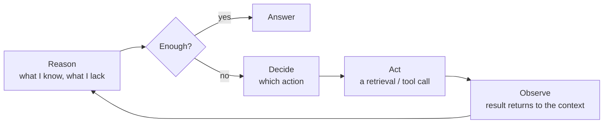

# Retrieval becomes a decision, not a step

Through all of Part I you held one picture in your head: a fixed pipeline. A query comes in and always takes
the same path, `retrieve → generate`. One search, one generation, done. The pipeline doesn't look at the
query and doesn't choose anything — it just turns the same crank every time.

Agentic RAG breaks exactly that. Retrieval stops being a rigid step and becomes an **action the model
chooses itself** — in a loop, looking at the intermediate result. The model decides: search or not, what to
search for, whether to reformulate the query, whether to go again, which source to pull from, whether it has
enough to answer yet.

One line for the whole lesson: **in static RAG the code is in control; in agentic RAG the model is.**

:::tip[▶ Video]

<YouTube id="JB2P5Gk23VI" title="RAG's Evolution: From Simple Retrieval to Agentic AI — IBM Technology" />

Exactly the shift this lesson is about: how retrieval grows from simple search into an agentic system.

:::

## Why — where static RAG breaks

Agency isn't added just to be fashionable. A fixed `retrieve → generate` genuinely fails on whole classes of queries.

- **Multi-hop questions.** "Who leads the department that issued policy X?" One search won't get it: first
  find policy X, from it learn the department, and only then the head. The second query is built from the
  result of the first. A static pipeline physically can't take that second step.
- **Queries that need no retrieval at all.** "Translate the previous answer into English," or "what's 15% of
  200." Static RAG will still dig into the database and mix in junk context. An agent can decide there's
  nothing to search here.
- **Different sources for different questions.** Some questions go to the knowledge base, some to SQL over a
  table, some to the fresh web. A fixed pipeline always goes to one place. An agent **routes** the query to
  wherever the answer lives.
- **A bad first result.** Retrieve irrelevant chunks, and a static pipeline still hands them to generation
  and produces a weak answer. An agent can look at what came back, see it's off, reformulate, and search
  again. That's **self-correction**, and going back to search with a refined query is called **iterative
  retrieval**.

The common denominator: a real query needs a **variable number of steps and a choice of path**, and the
pipeline offers a fixed one.

## The mechanism: the agent loop

At the core is a simple loop. It spins until the model decides it's ready to answer:

- **Reason** — the model assesses what it has gathered and what's missing.
- **Decide** — it picks the next action. In Part I it had no choice.
- **Act** — most often a retrieval call, but it can be another tool (those are the next lesson).
- **Observe** — the action's result returns to the context, and the loop repeats, now with new knowledge.

This "think → do → look → repeat" loop is what agency is. Retrieval here is **one action inside the loop**,
not the first rung of a fixed ladder.

:::tip[▶ Video]

<YouTube id="0z9_MhcYvcY" title="What is Agentic RAG? — IBM Technology" />

The same loop from another angle, walking through the agent's roles: planning, tool calls, reasoning.

:::

## What agency concretely adds

Let's unpack "the model is in control" into tangible abilities.

| Ability | Static RAG | Agentic RAG |
|---|---|---|
| Search or not | Always searches | Decides per query |
| Number of searches | Exactly one | Zero, one, or many |
| Reformulation | Query as-is (one transform beforehand at best) | Rewrites **between** steps, from the result |
| Source | One fixed | Routes to the right one (KB / SQL / web / API) |
| Reaction to a bad result | Passes it through | Sees it's off and goes again |
| Number of steps | Fixed | Variable, the model decides |

## A spectrum, not a switch

Don't think "static OR agentic." Between them is a smooth spectrum, graded by **how much freedom you hand
the model**.

1. **Router.** The lightest move into agency. The model makes one choice — where to send the query (which
   index, which tool, or "no retrieval needed") — and everything after is static. Cheap, predictable, and it
   handles most of the cases.
2. **Query planning.** The model decomposes a hard question into sub-queries up front.
3. **Full loop (ReAct-style).** A real `reason → decide → act → observe` in a loop, with self-correction and
   a variable number of steps.

One practical rule to lock in now: take the simplest level that solves the task. A full
agentic loop isn't a prize, it's a cost. Often a router on top of good static RAG beats a "full agent" on
cost, latency, and stability.

## The price — and the bridge back to Part I

Hand control to the model, and you pay for exactly that.

- **Latency and cost.** N steps means N LLM calls plus N retrievals. One question easily turns into 5–10
  calls to the model.
- **Unpredictability.** The number of steps and the path now depend on the model — behavior is harder to
  guarantee.
- **Debugging and eval get harder.** The failure can happen at any step of the loop: a bad routing
  decision, a bad reformulation, a loop that won't terminate.

Hence the direct bridge to the cross-cutting layer. **Observability** goes from useful to mandatory:
without a record of the whole chain of steps and calls, you simply can't debug the agent's bad answer. And
**eval** now measures not only "found / generated" but the quality of the trajectory — was the route chosen
right, did the agent loop forever. Part I isn't repealed: it becomes the foundation on top of which the
agent makes its decisions.

## What to take away

- Static RAG = a fixed `retrieve → generate` pipeline, the code in control. Agentic RAG = retrieval
  becomes an action in a loop, the model in control.
- Agency is needed where the pipeline breaks: multi-hop, "no retrieval needed", source routing,
  self-correction after a bad result.
- The mechanism is the "reason → decide → act → observe" loop, repeated until it's ready to answer.
- It's a spectrum: router → query planning → full loop. Take the simplest level that solves the
  task.
- You pay in latency, cost, unpredictability, and debugging difficulty — which is why observability
  and eval from Part I become mandatory.

**New terms** → [Glossary](../glossary.md): Agentic RAG, agent loop, ReAct (Reasoning + Acting),
routing / query router, multi-hop retrieval, query planning, self-correction / self-reflection, iterative
retrieval.

---

:::note[Next — going deeper]

🚧 Second pass: the ReAct pattern in detail and its alternatives (plan-and-execute, reflection), fighting
non-termination and step limits, passing history correctly between iterations, evaluating an agent's
trajectory.

How those same actions — web search, fetch, grounding — are built into Claude, OpenAI, and Gemini is what
the part's capstone works through: [Real agents](./real-agents.md).

:::
