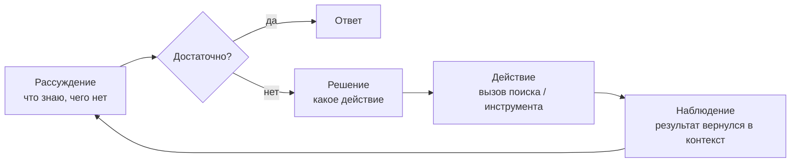

# Agentic RAG — retrieval становится решением, а не шагом

Всю Часть I ты держал в голове одну картинку: фиксированный конвейер. Запрос приходит — и всегда проходит
один и тот же путь `retrieve → generate`. Один поиск, одна генерация, конец. Конвейер не смотрит на запрос
и ничего не выбирает: он просто прокручивает те же шаги.

Agentic RAG ломает именно это. Retrieval перестаёт быть жёстким шагом и становится **действием, которое
модель выбирает сама** — в цикле, глядя на промежуточный результат. Модель решает: искать или нет, что
именно искать, переформулировать ли запрос, сходить ли ещё раз, из какого источника тянуть, хватает ли уже
собранного, чтобы отвечать.

Одна фраза на весь урок: **в статическом RAG управляет код, в агентном — модель.**

:::tip[▶ Видео]

<YouTube id="JB2P5Gk23VI" title="RAG's Evolution: From Simple Retrieval to Agentic AI — IBM Technology" />

Ровно тот переход, о котором урок: как retrieval вырастает из простого поиска в агентную систему.

:::

## Зачем — где статический RAG ломается

Агентность добавляют не ради моды. Фиксированный `retrieve → generate` честно проваливается на целых классах
запросов.

- **Многошаговые (multi-hop) вопросы.** «Кто руководит отделом, выпустившим политику X?» Одним поиском не
  вытянуть: сначала найти политику X, из неё узнать отдел, и только потом — руководителя. Второй запрос
  строится на результате первого. Статический конвейер физически не умеет сделать этот второй шаг.
- **Запросы, которым retrieval не нужен вовсе.** «Переведи прошлый ответ на английский» или «сколько будет
  15% от 200». Статический RAG всё равно полезет в базу и подмешает мусорный контекст. Агент может решить,
  что искать тут не надо.
- **Разные источники под разные вопросы.** Часть вопросов — в базу знаний, часть — в SQL по таблице, часть —
  в свежий веб. Фиксированный конвейер ходит всегда в одно место. Агент **маршрутизирует** запрос туда, где
  лежит ответ.
- **Плохой первый результат.** Достали нерелевантные чанки — статический конвейер всё равно отдаёт их в
  генерацию и выдаёт слабый ответ. Агент может посмотреть на выдачу, понять «не то», переформулировать и
  сходить снова. Это **самокоррекция**, а повторный заход в поиск с уточнённым запросом называют
  **iterative retrieval** (итеративный поиск).

Общий знаменатель: реальному запросу нужно **переменное число шагов и выбор пути**, а конвейер даёт
фиксированное.

## Механизм: цикл агента

В основе — простой цикл. Он крутится, пока модель не решит, что готова отвечать:

- **Рассуждение** — модель оценивает, что уже собрано и чего не хватает.
- **Решение** — выбирает следующее действие. В Части I у неё выбора не было.
- **Действие** — чаще всего вызов retrieval, но это может быть и другой инструмент (о них — следующий урок).
- **Наблюдение** — результат действия возвращается в контекст, и цикл повторяется, уже с новым знанием.

Этот цикл «подумал → сделал → посмотрел → повторил» и есть агентность. Retrieval здесь — **одно из действий
внутри цикла**.

:::tip[▶ Видео]

<YouTube id="0z9_MhcYvcY" title="What is Agentic RAG? — IBM Technology" />

Тот же цикл под другим углом, с разбором ролей агента: планирование, вызов инструментов, рассуждение.

:::

## Что конкретно добавляет агентность

Разложим «модель управляет» на конкретные способности.

| Способность | Статический RAG | Agentic RAG |
|---|---|---|
| Искать или нет | Всегда ищет | Решает по запросу |
| Число поисков | Ровно один | Ноль, один или много |
| Переформулировка | Запрос как есть (в лучшем случае одна трансформация до) | Переписывает **между** шагами, по результату |
| Источник | Один фиксированный | Маршрутизация к нужному (KB / SQL / web / API) |
| Реакция на плохую выдачу | Отдаёт как есть | Видит, что «не то», и идёт снова |
| Число шагов | Фиксированное | Переменное, решает модель |

## Спектр, а не переключатель

Не думай «статический ИЛИ агентный». Между ними — плавная шкала того, **сколько свободы отдано модели**.

1. **Маршрутизатор (router).** Самый лёгкий шаг в агентность. Модель делает один выбор — куда направить
   запрос (в какой индекс, в какой инструмент, или «retrieval не нужен») — а дальше всё статично. Дёшево,
   предсказуемо, берёт на себя бо́льшую часть задач.
2. **Планирование запроса (query planning).** Модель заранее раскладывает сложный вопрос на подзапросы.
3. **Полный цикл (ReAct-подобный).** Полноценный `рассуждение → решение → действие → наблюдение` в цикле, с
   самокоррекцией и переменным числом шагов.

Практический вывод усвой сразу: бери самый простой уровень, который решает задачу. Полный агентный цикл —
не приз, а расход. Часто маршрутизатор поверх хорошего статического RAG выигрывает у «полного агента» по
стоимости, латентности и стабильности.

## Расплата — и мост назад к Части I

Отдав управление модели, ты платишь ровно за это.

- **Латентность и стоимость.** N шагов — это N вызовов LLM плюс N поисков. Один вопрос легко превращается в
  5–10 обращений к модели.
- **Непредсказуемость.** Число шагов и путь теперь зависят от модели, гарантировать поведение труднее.
- **Отладка и eval усложняются.** Провал может случиться на любом шаге цикла: плохое решение о маршруте,
  плохая переформулировка, зацикливание.

Отсюда прямой мост к сквозному слою. **Observability** из «полезной» становится обязательной: без записи
всей цепочки шагов и вызовов плохой ответ агента просто не отладить. А **eval** теперь меряет не только
«нашлось / сгенерилось», но и качество траектории — верно ли выбран маршрут, не зациклился ли агент. Часть I
не отменяется: она становится фундаментом, поверх которого агент принимает решения.

## Что забрать из урока

- Статический RAG = фиксированный конвейер `retrieve → generate`, управляет код. Agentic RAG =
  retrieval становится действием в цикле, управляет модель.
- Агентность нужна там, где конвейер ломается: многошаговые вопросы, «retrieval не нужен», маршрутизация по
  источникам, самокоррекция после плохой выдачи.
- Механизм — цикл «рассуждение → решение → действие → наблюдение», повторять до готовности ответить.
- Это спектр: маршрутизатор → планирование запроса → полный цикл. Бери самый простой уровень, который решает
  задачу.
- Платишь латентностью, стоимостью, непредсказуемостью и сложностью отладки — из-за чего observability
  и eval из Части I становятся обязательными.

**Новые термины** → [Глоссарий](../glossary.md): Agentic RAG, agent loop, ReAct (Reasoning + Acting),
routing / query router, multi-hop retrieval, query planning, self-correction / self-reflection,
iterative retrieval.

---

:::note[Дальше — углубление слоя]

🚧 Второй проход: паттерн ReAct в деталях и его альтернативы (plan-and-execute, reflection), борьба с
зацикливанием и лимиты шагов, корректная передача истории между итерациями, оценка траектории агента.

:::
