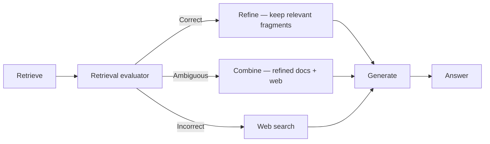
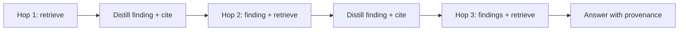

# Learned retrieval decisions, bounding the loop, and judging the trajectory

[Part 1](./index.md) laid out the shift — retrieval stops being a fixed `retrieve → generate` step and becomes an action the model chooses in a loop: search or not, reformulate, go again, route to a source, stop when it has enough. This page takes that loop to mastery: the named architectures that turn "decide whether to retrieve" into a *learned* decision, how you keep the retrieval loop from spinning on itself, how you hand retrieved context from one hop to the next without drowning the model, and how you evaluate a whole retrieval trajectory rather than just its last answer. Part 1 is assumed throughout — the `reason → decide → act → observe` loop, the router→planning→full-loop spectrum, self-correction, and iterative retrieval are not re-taught, only built on.

One boundary to set before we start, because two sibling lessons share this territory. The *general* loop-control layer — plan-and-execute versus ReAct as strategies, step budgets, loop detection, reflection over the whole trajectory — belongs to [planning & loops](../planning-loops/index.md). This page stays anchored on **retrieval as the action**: whenever a general idea is needed, it gets one retrieval-specific line and a pointer there, never a re-derivation.

## From self-correction to named retrieval patterns

Part 1's "self-correction" and "iterative retrieval" were mechanisms described in the abstract. They have concrete, published shapes. Three named architectures are worth learning, because each is a different answer to the same question — *when, and how, does the loop decide to retrieve, re-retrieve, or stop?*

**Self-RAG** trains the model to make that decision itself, inline, by emitting special **reflection tokens** as it generates. One token decides whether to retrieve for the current segment at all — some spans need a source, others the model can just write. When it does retrieve, three critique tokens grade what comes back: whether a passage is *relevant* to the query, whether the generated text is actually *supported* by that passage, and how *useful* the resulting answer is on a short scale. The judgments are woven into generation rather than bolted on as an external scaffold — the model reflects on its own retrieval and grounding token by token.

**Corrective RAG (CRAG)** externalizes the same instinct into a separate, lightweight **retrieval evaluator**. After retrieval, the evaluator grades the documents and produces a confidence score, which it buckets three ways. *Correct* means the documents are good enough to use — but not verbatim: a refinement step cuts each document into smaller pieces and keeps only the fragments that actually bear on the query, so noise doesn't ride along with the signal. *Incorrect* means the retrieved set is off, so CRAG discards it and falls back to a web search for a fresh source. *Ambiguous* — the evaluator isn't sure — combines both, using the refined internal documents and the web result together. The whole thing is plug-and-play: it sits on top of any existing RAG pipeline without retraining the generator.

Drawn out, the CRAG path is a three-way branch on the evaluator's score:

**Adaptive RAG** works one level up, at the query. A trained classifier predicts how complex the incoming query is and routes it to the cheapest strategy that will still answer it: no retrieval at all for something the model already knows from parametric memory, a single retrieval for a straightforward lookup, or full multi-step iterative retrieval for a genuinely multi-hop question. The point is economy — you don't pay for an iterative loop on a query a single search would have settled, and you don't starve a hard query by giving it one shot.

Set the three against Part 1's spectrum and the pattern resolves. Adaptive RAG is the router made per-query and *learned* — the routing decision from Part 1, but predicted by a trained classifier instead of a hand-written rule. Self-RAG is self-correction pushed down into trained tokens at the retrieve-and-ground level. CRAG is self-correction with an explicit evaluator and a web-search escape hatch. All three take the freedom Part 1 introduced and turn "decide whether to retrieve" into a decision the system *learns*, plus an explicit judge of relevance and support.

A note on where this sits, because it's easy to blur. Self-RAG's and CRAG's judgments are about *retrieval quality* — is this passage relevant, is the answer supported. That is the self-correction family from Part 1, and it is deliberately distinct from the *reflection* in [planning & loops](../planning-loops/index.md), which judges the whole trajectory: am I making progress, should I re-plan. Same word family, different altitude — one grades a passage, the other grades the plan.

There's also a strategy choice specific to retrieval. ReAct-style retrieval interleaves reason, retrieve, observe, and reformulates the next query from what each result actually returned — Part 1's iterative retrieval. Plan-and-execute goes the other way for a multi-hop question: decompose it into a sub-question plan up front, retrieve once per sub-question, then recompose the answer. Flexible versus structured is the general tradeoff, and the general treatment lives in [planning & loops](../planning-loops/index.md) — here the retrieval-specific point is **query decomposition**: a "who leads the team that shipped policy X" question becomes "which team shipped X" then "who leads that team," and each sub-question is a clean, single-hop retrieval.

When *not* to reach for any of this: Self-RAG needs a specially trained model. CRAG and Adaptive RAG add an evaluator or a classifier — extra cost, and a new failure surface: the evaluator can misfire, hiding a good passage or firing a needless web search that drags in worse context than it replaced. For many corpora a solid static retriever plus a simple relevance filter beats a learned evaluator outright. Same discipline as everywhere in Part 2 — take the simplest level that solves the task, and make the loop earn its complexity.

## Keeping the retrieval loop convergent, and bounding it

Once retrieval runs in a loop, it can fail to stop for the same reason any agent loop can — the general non-termination story is in [planning & loops](../planning-loops/index.md). Retrieval has its own two shapes of it.

The first is the **re-retrieval loop**: the agent issues a query, doesn't like the result, reformulates it into something trivially different, gets back the same documents, reformulates again — and no new information ever enters the context. It looks like progress and is really deterministic spinning. Note the name: this is a *bug* in the run, not a "refusal" — the loop that won't stop is a failure, never the system's decision to abstain.

The second is **over-retrieval**: the agent keeps searching well past the point where it had enough, padding the context with marginally-relevant material it will never use.

Both point at the real question, which is the termination criterion for a *retrieval* loop: **sufficient context** — do I have enough to answer this yet? Self-RAG's support and usefulness tokens are one way to implement that judgment; a standalone relevance grader is another. Get it wrong in either direction and it costs you. Stop too early and you under-retrieve: the answer is unsupported, a hallucination waiting to happen. Never stop and you over-retrieve: you pay for the extra calls, and you push the context long enough that **lost-in-the-middle** — the model attending worst to the middle of a long context — starts eating the evidence you did gather.

Because the smart criterion can misjudge, you back it with a dumb one. A **retrieval budget** is a hard cap — maximum hops, maximum searches, maximum retrieved tokens — that stops the loop regardless of what the model thinks. It mirrors the step budget and token budget from [planning & loops](../planning-loops/index.md); don't re-derive the general idea, just apply it to retrieval. This is the backstop that *guarantees* the loop terminates even when every smarter defence fails.

Between the two sits **loop detection** for retrieval. The general form is in [planning & loops](../planning-loops/index.md); the retrieval-specific handle is a signature — normalise the query and fingerprint the returned result set, and when the same query keeps yielding the same result set, break out rather than let it spin another lap. That catches the re-retrieval loop before the budget has to guillotine it.

When *not* to build any of this: a router-only system — one decision, no loop — physically cannot spin; there's nowhere to loop back to. The whole apparatus of budgets, sufficiency checks, and loop detection is a cost you only take on once you commit to running the full loop. If a single routing decision solves your task, you owe none of it.

## Handing retrieved context between hops

This is the part least covered by the sibling lessons, and the part that most decides whether a multi-hop agent works. Every hop dumps its retrieved passages into the context. Do that naively across a five-hop trajectory and the context bloats: cost climbs with every call, and lost-in-the-middle, from the generation lesson, starts to bite exactly when the agent has the most to keep straight.

The fix is to stop carrying raw material. What moves forward from a hop is not the chunks it retrieved but the **distilled finding** — the sub-question's answer, the extracted fact — together with its provenance, the citation back to the source. That keeps the working context small and on-topic. This is the multi-hop analogue of the scratchpad / working memory idea in [planning & loops](../planning-loops/index.md); the retrieval-specific twist is *what* you distill into that scratchpad — findings, not passages — and that you keep the citation attached so the final answer stays grounded.

Three habits keep the carried context clean. **Deduplicate** across hops — the same passage retrieved at hop 1 and again at hop 3 must not occupy the context twice. **Compact** as it grows — when the trajectory runs long, summarise the older hops' evidence down to what still matters, the retrieval-specific case of [planning & loops](../planning-loops/index.md)' "summarise the history." And mind the **order** — place the freshest, most relevant evidence where the model actually attends, at the ends instead of buried mid-context — lost-in-the-middle applied deliberately rather than suffered accidentally.

The failure mode this all guards against is concrete: carry the raw chunks from every hop and the context bloats until the model loses the thread and answers hop 3's question from hop 1's evidence. The answer is fluent, grounded in *something*, and wrong — the hardest kind of bug to catch downstream.

Drawn as a chain, each hop earns its keep by shrinking what it passes on:

## Evaluating the retrieval trajectory

Part 1 said eval now "measures the quality of the trajectory." For agentic RAG that splits in two — outcome and process — and the process half is where the retrieval-specific grading lives; keeping the two apart is what makes a failing run debuggable.

**Outcome versus process.** Outcome is the final answer's quality — faithfulness, response relevancy, the metrics from the eval lesson. Process is whether the *path* made sense: did the agent retrieve when it should and abstain when it shouldn't, did each hop pull the right documents, did it stop at the right time, and how many steps and how much cost did it take to get there. A right answer reached by a wrong path is luck, and luck doesn't survive contact with the next query.

**Retrieval quality, per hop.** Apply the retrieval metrics — context precision, context recall, relevance — at *each* hop rather than only over the final gathered set. This is Part 1's separation of failures carried into the loop: a trajectory can reach the right answer down a wrong path, or take a right path and still fail at generation, and per-hop grading is what tells the retrieval failure apart from the generation failure and localizes the bug to a specific step.

**Trajectory-level signals.** Number of steps and retrievals, as an efficiency signal — the agent that answers in eight hops what six would have settled is not a good agent. Whether it terminated at all. Whether it routed to the right source. And **sufficient context**: did the context the agent actually assembled contain the answer, independent of whether the generator then used it. That last one pins the murkiest failures — a right answer over insufficient context is the model falling back on parametric memory, not doing RAG.

Judging a path rather than a single answer is where an **LLM-as-a-judge over the trajectory** earns its place, and tooling exists for it. [Ragas](https://www.ragas.io) covers the retrieval metrics — context precision, context recall, faithfulness, response relevancy — and adds agent-oriented ones like agent goal accuracy, topic adherence, and tool call accuracy. Reach for it lightly; the general eval discipline and the observability it depends on are their own lessons, and this page only points at where trajectory eval plugs into them.

Which is the precondition worth stating plainly: *you cannot evaluate a trajectory you cannot see.* Per-hop grading, sufficiency checks, step counts — all of it assumes a full trace of the run to grade against. Observability is not a nice-to-have here; it is what makes trajectory eval possible at all, exactly as Part 1 said when it made observability mandatory for agents.

And the restraint, once more. A router-only system has no trajectory to evaluate — one decision, then a static path — so outcome eval alone is enough. Don't instrument a straight line as if it were a loop; the trajectory machinery is a cost you take on only when there's an actual trajectory to judge.

## What to take away

- Part 1's self-correction and iterative retrieval have named, published shapes: Self-RAG makes the retrieve-and-grade decision with trained reflection tokens inline; CRAG puts a separate evaluator in front of generation with a web-search fallback; Adaptive RAG classifies query complexity and routes to the cheapest sufficient strategy. All three turn "decide whether to retrieve" into a learned decision — and all three add cost and a new failure surface, so a good static retriever plus a relevance filter often wins.
- Keep the retrieval self-correction (grade *this passage*) distinct from planning's reflection (grade *the whole plan*) — same instinct, different altitude.
- The retrieval loop fails to converge two ways — re-issuing a query that returns nothing new, and searching well past the point of enough. The termination criterion is sufficient context; a hard retrieval budget is the backstop that guarantees the loop stops; a query-and-result signature is how loop detection catches the spin.
- Between hops, carry the distilled finding plus its citation, not the raw chunks — then deduplicate, compact as it grows, and order the evidence where the model attends. Carrying raw context bloats it until the model answers one hop's question from another's evidence.
- Evaluate outcome and process separately, grade retrieval at every hop rather than once, and add trajectory-level signals — step count, termination, routing, sufficient context — judged by an LLM-as-a-judge over the recorded trace. None of it is possible without that trace, so observability is the precondition, not an add-on.
- A router-only system can't loop and has no trajectory — it owes none of the loop-fighting or trajectory-eval machinery. Take the simplest level that solves the task.

**New terms** → [Glossary](../../glossary.md): Self-RAG, corrective RAG (CRAG), adaptive RAG, retrieval budget, sufficient context.
