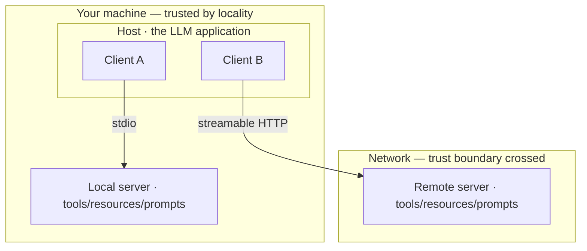
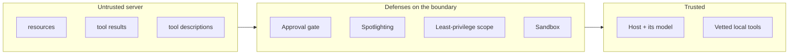

# Building a server, choosing a transport, and trusting nothing it sends

[Part 1](./index.md) made the case for the protocol: the M×N integration problem collapses to N+M when you wrap each tool once behind a server and implement the client once per app, a trade [MCP](https://modelcontextprotocol.io) frames as a USB-C port for AI applications; the client–server split standardizes three primitives — tools, resources, and prompts — over stdio locally or streamable HTTP remotely; MCP owns the agent↔tools axis while A2A owns agent↔agent; and every server you connect is a new attack surface. This page works that protocol layer out in full. It builds a server from the wire up and names what's different about building one *for* a model, then goes deep on the two capabilities that invert the usual direction of the connection. From there it weighs the two transports as trust decisions rather than deployment ones, separates finding a server from trusting it, places MCP and A2A on the protocol map without memorizing a roster, and spends its center of gravity on how you harden a deployment against servers you don't control — including when not to connect one at all.

One boundary before the build, because the sibling lessons hold the ground next door. Agent↔agent coordination — topologies, how a team is graded — is [multi-agent](../multi-agent/index.md) and its [deep dive](../multi-agent/deep-dive.md); packaging these connections into a library is [orchestration frameworks](../orchestration-frameworks/index.md) and its [deep dive](../orchestration-frameworks/deep-dive.md); the operations angle — gateways, allowlists, centralized policy — lives in [Part III tooling](../../part-3-production/tooling-ecosystem.md) and the [guardrails](../../part-1-rag/cross-cutting/guardrails.md) lesson; and MCP running on live agents is the [capstone](../real-agents.md). This page owns the protocol and transport layer, the agent-protocol landscape, and hardened deployment for untrusted servers. Part 1 is assumed throughout.

## Building a server

Part 1 named two roles, client and server. The working detail adds a third, and it changes how you read the other two. The **host** is the LLM application that initiates connections — an IDE, a chat app, an agent runtime. Inside the host live one or more **clients**, and each client holds a 1:1 connection to exactly one server. So an "MCP client" isn't the whole application; it's a connector *within* the host, one per server it talks to. Host, clients, servers — three roles, not two.

Underneath, the base protocol is **JSON-RPC 2.0** carried over a stateful connection. Messages come in three shapes: requests, which expect a response; responses; and notifications, which expect none. Nothing about that is exotic — it's the same message model a hundred other systems use, which is the point. The protocol-specific part is what happens when a connection opens.

A session begins with an **initialize handshake**. Client and server exchange their protocol version and their **capabilities** — each side declaring what it supports before any real work happens. Version negotiation lives here: both may support several revisions, but they must agree on one for the session, which is exactly why a single client can talk to servers built against different spec revisions without special-casing each. Only once the handshake settles does the server tell the client what it offers.

What a server offers is the three primitives from Part 1, now advertised rather than assumed: **tools** (functions the model can execute), **resources** (context and data for the model or user to read), and **prompts** (templated messages and workflows). The deep detail is *when* — the server declares them at connect time, so the client discovers them dynamically instead of being coded against a fixed list. A client that connected yesterday to a server with three tools sees four today if the server now advertises four.

You do not hand-write any of this. An **SDK** handles the JSON-RPC framing, the handshake, **capability negotiation**, and the transport; what you write are the handlers behind each tool, resource, and prompt. As of November 2025 the official SDKs are TypeScript, Python, C#, and Go at Tier 1, Java and Rust at Tier 2, with Swift, Ruby, PHP, and Kotlin below — each exposing the same capabilities in its own language idiom. Pick the one your host already lives in and the protocol mostly disappears.

:::note[Prerequisites]

This page teaches the shape of a server and the delta of building one for an agent, not the line-by-line SDK calls. Before you build, learn the official SDK for your language from the [MCP SDK documentation](https://modelcontextprotocol.io/docs/sdk) — it carries the current method names, types, and transport setup, which move faster than a book can.

:::

Which leaves the part a book *should* teach: what's different about authoring a server for a model instead of an API for a developer. Three things. A tool's **description is a prompt** — you write it for the model that will read it, not for a human skimming reference docs, and the description-as-prompt discipline from tool-use applies verbatim. You expose a curated, focused, non-overlapping toolset rather than every endpoint you happen to have — tool-use's "few, well-chosen tools." And the consumer is a model at runtime, so the names, descriptions, and argument schemas are its *only* guide: ambiguity doesn't surface as a compile error a developer fixes, it surfaces as a wrong tool call in production. This is the same craft that makes a hand-authored server read better than a raw Swagger dump, now stated as authoring guidance rather than an observation.

And the restraint that Part 1's economics imply: if a single app uses a single tool, the MCP indirection is pure overhead — call the API directly and move on. A server earns its keep at the N+M crossover, the moment a tool is reused across apps or agents. Wrap for reuse, not for ceremony.

*One host holds several clients, each with a 1:1 connection to one server over its own transport — stdio to a local subprocess, streamable HTTP to a remote server across the network. "Trusted by locality" is a default, not a guarantee: as the transport section argues, a local stdio server is still third-party code with your machine's privileges.*

## The capabilities that invert the connection

So far the flow runs one way: the client calls, the server answers. The current spec defines the opposite direction too. Alongside the features a server offers, the *client* offers features to the *server* — and this inversion is the deepest thing about MCP's session model. Three client capabilities carry it: sampling, elicitation, and roots.

**Sampling** is the sharp one. The server asks the client's model to generate text. A server has no model of its own; through sampling it borrows the client's. That flips the usual shape — now the server drives a generation on the client side, which is what lets a server build agentic, recursive behavior instead of just answering calls. It is also exactly as dangerous as it is powerful: a server you connected can make *your* model produce content. That is why the protocol wraps it in consent. The spec makes user approval mandatory — the user controls whether sampling happens at all, sees and controls the actual prompt sent, and controls what results the server is allowed to see. The protocol deliberately limits the server's visibility into the prompt. Human-in-the-loop isn't bolted on here; it's baked into the capability.

**Elicitation** inverts the direction a second way. Mid-operation, the server discovers it needs something from the human — a missing parameter, a confirmation — and requests it through a structured schema the client renders as a form. The server pauses and asks the person, by way of the client, then continues. Where sampling borrows the model, elicitation borrows the user's attention.

**Roots** is quieter and about scope. It's the capability by which the client tells the server which filesystem and URI boundaries it may operate within. The client sets the fence; the server works inside it. That makes roots a least-privilege primitive expressed at the protocol level rather than left to convention — the boundary is declared, not hoped for.

Both inverted capabilities are still moving, so date what you learn. The 2025-11-25 revision extended them: elicitation gained a URL-mode flow, and sampling gained tool-calling of its own (`tools` and `toolChoice` parameters), so a sampling request can itself invoke tools. Learn the durable shape — the server borrows the client's model, or asks the client's user — and treat the exact parameter list as this-year's detail, because it will grow again.

The reason the inversion matters beyond mechanics: a static API only ever answers the calls made to it. MCP's stateful session lets the server *initiate* — request a generation, request user input, push an update. And every server-initiated capability is a **consent surface**, a place where a party you don't fully trust can reach back toward you. Name it that way and the security section stops being a separate topic and becomes the direct consequence of this one.

## Two transports, two trust profiles

The same primitives ride either transport, and where the server runs is a deployment detail — Part 1's point stands. What Part 1 left for here is that the two transports carry sharply different trust and operations profiles.

**Stdio** is for a local server run as a subprocess beside the client, the two talking over stdin and stdout (a server may log on stderr, which 2025-11-25 clarified). It's trivial to start, stateful, single-client, and needs no authentication because there is no network hop to authenticate across. But read the trust profile plainly: a local stdio server is third-party code running on your machine, with your machine's privileges and no network boundary between it and everything you can reach. Convenience and exposure are the same fact seen from two sides.

**Streamable HTTP** is for a remote server reached over the network. It replaced the older HTTP+SSE transport in revision 2025-03-26 — HTTP+SSE is deprecated, so don't carry it forward as current. Streamable HTTP supports multiple clients and server-push streaming, and it forces two questions stdio never raised: who is allowed to connect, and what is now exposed to the network. A remote server needs authentication, and the spec supplies the framework: an OAuth 2.1-based authorization framework arrived in that same 2025-03-26 revision, and 2025-11-25 hardened it with OpenID Connect discovery, incremental scope consent signaled through `WWW-Authenticate`, OAuth Client-ID Metadata Documents, and RFC 9728 protected-resource-metadata discovery. Remote means you must authenticate and scope; expect the specifics to keep tightening.

So choosing a transport is choosing a trust posture. Reach for stdio when the server is local, single-user, and trusted by locality — a dev tool, a wrapper around a local file or database. Reach for streamable HTTP when the server is shared, remote, multi-tenant, or has to scale — and accept that authentication, token scoping, and network exposure become first-class concerns the moment you do. The transport choice is a trust decision wearing a deployment costume.

## Finding a server is not trusting it

**Server discovery** is how a client finds servers to connect to, and it happens on two levels. At connect time, a client discovers a *given* server's capabilities through the handshake above — that's discovery in the small. At the ecosystem level, a client finds *which servers exist at all* through a registry — discovery in the large.

The official **MCP registry** ([registry.modelcontextprotocol.io](https://registry.modelcontextprotocol.io)) launched in preview on 2025-09-08, a community metadata repository backed by Anthropic, GitHub, PulseMCP, and Microsoft. The important word is *metaregistry*: it hosts server **metadata**, not the code or binaries — a source of truth that sub-registries and clients build on top of, rather than a package store you install from. And it is young. As of that 2025-09 preview it's explicitly still a preview — breaking changes and data resets are on the table, with a GA release to follow — and it sits alongside private, curated, company-internal registries and third-party aggregators. Learn the concept; the current URL may not last.

Here is the load-bearing point: being listed on a registry is not vetting. A registry publishes metadata a publisher supplied about their own server; it does not audit what the server actually does, and a server can change its behavior after it's listed (see rug pull, below). Discovery answers "does this server exist, and how do I reach it" — never "is this server safe to trust." That second question stays yours.

## Placing MCP on the protocol map

MCP owns one axis: agent↔tools and data. There is a second axis it says nothing about — agent↔agent, one agent handing work to a peer — and that's a different problem with its own protocols. Don't re-derive it here; the coordination itself is [multi-agent](../multi-agent/index.md). But the protocol on that axis is worth placing.

**[A2A](https://a2a-protocol.org)** (Agent2Agent) is the leading agent↔agent standard: created by Google, announced 2025-04-09, and donated to the Linux Foundation on 2025-06-23, now at v1.0 with a technical steering committee spanning AWS, Cisco, Google, IBM, Microsoft, Salesforce, SAP, and ServiceNow. Its shape mirrors the discovery-then-work pattern: an agent publishes an **Agent Card** — its identity, capabilities, I/O modalities, and auth — so others can find it, and work is then exchanged as Tasks with a lifecycle, carried over JSON-RPC and HTTP.

The durable line is one sentence: MCP is agent↔tools and context; A2A is agent↔agent. This corner of the field churns, and A2A is one contender among several whose names will shift. As a snapshot dated to July 2026, MCP and A2A are the two most-adopted, both now under Linux-Foundation-family governance — but any specific name is a snapshot, and the skill that outlasts it is reading *which axis* a protocol serves. Get that and you can place any newcomer on the map without being told where it goes.

One dated caveat, held lightly: even the two axes are beginning to touch. MCP's own 2025-11-25 revision added experimental **tasks** — durable, pollable requests — which echo A2A's task lifecycle. Don't over-read it. As of late 2025 the axes remain distinct, and this is a convergence to watch, not a merger to predict.

## Hardened deployment for untrusted servers

Connecting an agent to a server you don't control connects it to input and behavior you don't control — it puts a trust boundary between your host and everything that server sends. That's Part 1's "new attack surface," and this section works it out as a catalog of failure modes and a defense-in-depth answer. One discipline sits under everything that follows: every byte a server sends is untrusted *data*, never trusted *instructions*.

Start with the attacks, because you defend against named things better than vague ones.

**Indirect prompt injection** via server content is the umbrella. A malicious or compromised server smuggles instructions into the material it returns — a resource, a tool result, or the tool description itself. The description vector has its own name, **tool poisoning**, and it's the nastiest because a description is a prompt: hidden text in a tool's docstring can instruct the model — *read this secret file and pass its contents as an argument* — while the user sees nothing but a benign "adds two numbers." Tool poisoning is the highest-impact client-side MCP vulnerability class, precisely because the injection rides in on the channel the model is *supposed* to trust.

**Data exfiltration** is the payoff for many injections. Through planted instructions or an over-broad tool, the server gets the agent to send out data it can reach — files, secrets, conversation history. The blast radius scales with what the agent holds: an agent with credentials or local file access can leak far more than one with neither.

**Permission over-reach**, and its sharpest form the **confused deputy**, is the third class. Over-reach is a server doing more than the one job you connected it for. A confused deputy is the mechanism behind the worst version of it: a component that holds legitimate authority is tricked into misusing that authority on an attacker's behalf. On remote MCP this shows up classically in OAuth token handling — a real 2025 class of CVEs turned on crafted OAuth metadata that compromised MCP clients. The counter is least privilege plus careful token scoping: authority the deputy never held can't be borrowed.

**Rug pull** is the class that defeats one-time review. The term is borrowed from crypto, where a project lures investment and then pulls the assets out from under it; here it means a server that presents a benign tool, waits for your approval, and then redefines the tool's behavior or description *after* approval. The trust you granted at connect time no longer describes what the tool does. "Approved once" is not "safe forever," and the counter follows from saying it that way: pin and version the servers you connect, re-review on change, and never auto-trust an update.

Now the defenses, layered — no single one is sufficient, which is the whole idea of depth.

**Least privilege** is the foundation. Give each server a minimal, task-scoped toolset and nothing the task doesn't need; use roots to bound its filesystem and URI reach; scope OAuth tokens tightly on remote servers. Most over-reach is impossible against a server that was never handed the reach to begin with.

**Vetted and pinned servers.** Connect only to servers you've actually reviewed, prefer trusted publishers, pin a version, and re-review on update — the concrete rug-pull counter. And, one more time because it's the tempting shortcut: being on a registry is not vetting.

**Human approval on sensitive actions.** Require explicit consent for tool calls with side effects, for sampling requests (mandatory per spec, from the capabilities section), and for elicitation of sensitive data. This is the veto from planning-and-loops, now standing on the MCP boundary.

**Server content as untrusted data.** The Part I discipline extends directly: an instruction hierarchy the model honors, plus **spotlighting** — marking untrusted text so the model treats it as content to reason over, never as commands to obey. A resource is content even when it's phrased like an order; the [guardrails](../../part-1-rag/cross-cutting/guardrails.md) lesson is where that discipline is built.

**Sandboxing.** Run untrusted servers with constrained privileges — containerized, network-restricted, filesystem-scoped — so that a compromise is contained instead of catastrophic. This matters most for local stdio servers, which otherwise inherit your machine's full privileges.

*Everything a third-party server sends — resources, tool results, and tool descriptions — arrives from the untrusted side and passes through the trust boundary, where the defenses sit: human approval, spotlighting and the instruction hierarchy, least privilege with roots, and a sandbox. Nothing reaches the model as a trusted instruction.*

Which leaves the mastery move, the one every capability on this page has been building toward: sometimes you don't connect the server at all. If a server is unvetted, over-privileged for the task, from a publisher you don't know, or the task is high-stakes and the server can't be sandboxed — don't add it. Not every capability is worth its attack surface, and the safest server is the one you never connected. The operations side of enforcing this at scale — gateways, allowlists, centralized logging, org-wide policy — is [Part III tooling](../../part-3-production/tooling-ecosystem.md) and [guardrails](../../part-1-rag/cross-cutting/guardrails.md); cross-link it rather than re-derive it. The judgment call itself is the point here.

## What to take away

- MCP has three roles, not two: a host (the LLM application) holds one or more clients, each with a 1:1 connection to a server. A session opens with an initialize handshake that negotiates version and capabilities over JSON-RPC 2.0; an SDK handles the wire and the handshake, and you write the tool, resource, and prompt handlers. Building for a model means the description is a prompt, the toolset is curated, and ambiguity becomes a wrong call at runtime — and if one app uses one tool, skip the server entirely.
- Two client capabilities invert the connection: sampling lets a server borrow the client's model to generate text, elicitation lets it ask the client's user for missing data. Both are consent surfaces — sampling requires mandatory user approval by spec — and both were still growing as of 2025-11-25. Roots is the quieter third: the client fences the server's filesystem and URI reach, least privilege at the protocol level.
- Transport is a trust decision. Stdio runs a local server as third-party code with your machine's privileges and no auth; streamable HTTP reaches a remote server, replaced HTTP+SSE back in revision 2025-03-26, and forces authentication (an OAuth 2.1 framework, hardened since) and network exposure into the design.
- A registry answers "does this server exist and how do I reach it," never "is it safe." The official MCP registry launched in preview 2025-09-08 as a metaregistry of metadata, not code — and being listed is not vetting.
- MCP is agent↔tools; A2A (created by Google, announced 2025-04-09, at the Linux Foundation since 2025-06-23, now v1.0) is agent↔agent. As of July 2026 they're the two most-adopted, but the field churns — learn the axis a protocol serves, not the current name, and note the two axes have started to touch without merging.
- Harden against servers you don't control by name: indirect prompt injection (tool poisoning is its worst form), data exfiltration, permission over-reach and the confused deputy, and the rug pull that defeats one-time review. Defend in depth — least privilege, vetted and pinned servers, human approval on sensitive actions, spotlighting on all server content, and sandboxing — and know when the right move is not to connect the server at all.

**New terms** → [Glossary](../../glossary.md): MCP host, capability negotiation, roots, sampling, elicitation, streamable HTTP, MCP registry, server discovery, tool poisoning, rug pull, confused deputy.
