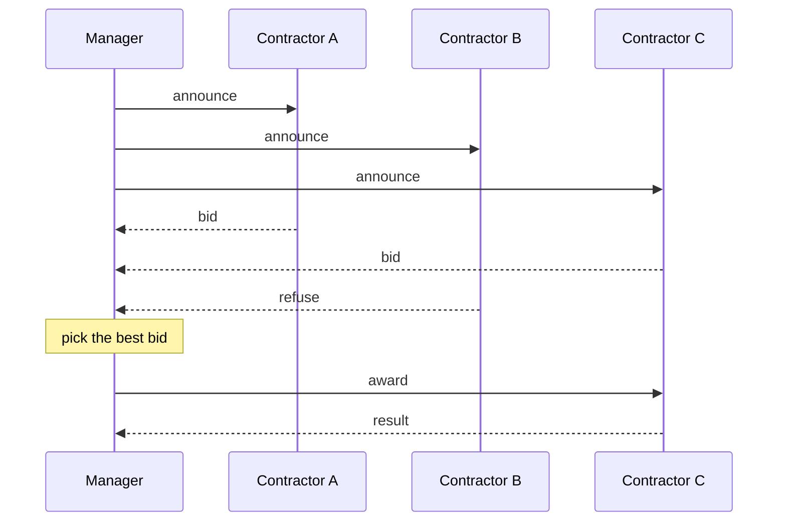
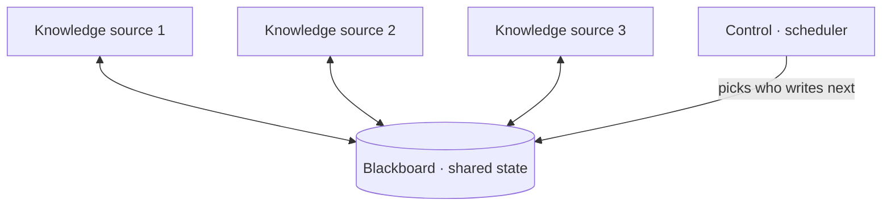
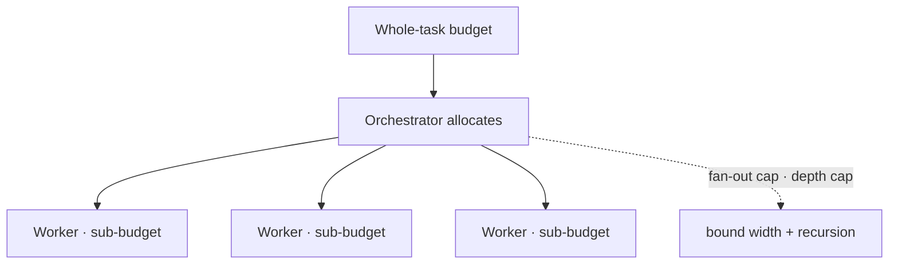

# Talking through a protocol, sharing a board, and grading the team

[Part 1](./index.md) made the case for and against turning one agent into several: split for specialization, context isolation, modularity, and parallelism; wire the team as orchestrator–workers, a chain, a hierarchy, or a debate; move work by handoff, which passes control *plus* context; and hold onto the fact that an orchestrator is itself just an agent that decomposes, routes, and synthesizes — against the brake that cost multiplies ~N×, errors propagate with no shared ground truth, coordination has overhead, and the whole thing is harder to eval. This page works that coordination layer out in full. It gives the inter-agent message a concrete shape, adds the shared-workspace primitive that handoff alone can't express, shows how roles get assigned and negotiated, works out how you grade a team whose trajectory is scattered across its members, and keeps the token bill from running away.

One boundary before we start, since the sibling lessons hold the ground next door. The *general* loop-control and budget layer — step budgets, loop detection, reflection, budget-as-policy, the foundations of trajectory eval — belongs to [planning & loops](../planning-loops/index.md) and its [deep dive](../planning-loops/deep-dive.md). This page owns the layer directly above a single agent: agent↔agent. Where the two axes meet transport, that's [MCP](../mcp.md) — MCP standardizes agent↔tool, and the agent↔agent axis is A2A, below; packaging any of these topologies into a library is the job of [orchestration frameworks](../orchestration-frameworks.md). Part 1 is assumed throughout.

## Giving the message a shape

In Part 1 agents "talked through messages," and the phrase did a lot of quiet work. Here the message gets a concrete shape — and it turns out there's thirty years of prior art that today's frameworks are busy re-discovering.

Start with the standard that named the pieces. **FIPA** — the Foundation for Intelligent Physical Agents, founded in 1996, its agent-communication suite released in 2002, and an IEEE Computer Society standards committee from 2005 — defined an Agent Communication Language, **FIPA ACL**. An ACL message is an envelope. The outer layer is a *performative*, the communicative act the message performs: `inform`, `request`, `propose`, `cfp`, `agree`, `refuse`, `query-if`, and the rest of a defined library of them. Inside sit the fields — `sender`, `receiver`, `content`, `language`, `ontology`, `protocol`, `conversation-id`, `reply-with`/`in-reply-to`, `reply-by`. The whole thing is grounded in speech-act theory, Austin and Searle's idea that an utterance is an *action* rather than mere data, with semantics defined over a belief–desire–intention model of the agent's mental state. Its predecessor, KQML, came out of the DARPA Knowledge Sharing Effort in the early 1990s as the first practical speech-act-based ACL; FIPA ACL added the formal semantics on top.

The reason to learn a 2002 standard is that it names something modern agents still need. Part 1's "the handoff message is a prompt" is a thin version of the same move — separate the *act*, what you want the other agent to do, from the *content* it acts on. And the envelope's fields map cleanly onto today's questions: who and whom, the payload, and which step of which multi-step protocol this message is a move in.

One protocol is worth pulling out by name, because it keeps getting reinvented. The **contract net protocol** (Reid G. Smith, *IEEE Transactions on Computers*, vol. C-29, no. 12, December 1980) allocates a task by negotiation rather than by decree. A manager announces a task; idle contractors bid on it; the manager awards it to the best bid; the winning contractor returns the result. FIPA later standardized the cycle as its Contract Net Interaction Protocol — `cfp`, then `propose` or `refuse`, then `accept-proposal` or `reject-proposal`, then `inform` or `failure`. This is dynamic task assignment expressed as an exchange of messages, and it's the alternative to a supervisor hard-routing every subtask by hand — a thread the role-assignment section picks back up.

Modern frameworks rebuild the envelope, usually much thinner. The message an LLM agent framework passes around is typically `{role, content, name}` plus some tool-call metadata — no explicit performative, ontology, or protocol field in sight. But the richer end of the spectrum is coming back, and it has a name. **A2A**, the Agent2Agent protocol, is an open standard for agents to interoperate without exposing their internals to one another. An agent publishes an **Agent Card** — its identity, capabilities, I/O modalities, and auth — so others can discover it. Work is exchanged as a Task with a lifecycle (`submitted`, `working`, `input-required`, `completed`, `failed`, `canceled`) that carries Messages built from Parts (text, file, or data), and results come back as Artifacts. Transport is JSON-RPC 2.0 over HTTP — the [1.0.0 spec](https://a2a-protocol.org/latest/specification/) adds gRPC and HTTP/REST bindings — with SSE for streaming.

The contrast with MCP is the useful part, and it's an axis, not a rivalry. MCP standardizes agent↔tool: a model reaching for tools and resources. A2A standardizes agent↔agent: two *opaque* agents coordinating, where opaque means neither has to reveal its internal state or its toolset. Google announced A2A on April 9, 2025 at Google Cloud Next, with 50-plus partners under Apache 2.0, donated it to the Linux Foundation mid-year, and framed it as complementary to MCP rather than competing with it — the agent↔agent counterpart the base MCP lesson pointed ahead to.

Whatever schema you land on, the live design question is the one Part 1 raised: *what context rides on each message.* Too little and the receiver can't act; too much and you're back in context bloat. The schema is plumbing; the payload discipline is the skill. And one field earns a special mention — the explicit conversation or task id is what later lets you stitch a scattered trajectory back together when it comes time to grade the team.

## The other primitive: a shared board

Handoff is point-to-point. One agent packages context and passes it to exactly one other, and everything outside that envelope stays private — which is the context-isolation win from Part 1, and also its limit. Some work wants the opposite: a common surface every agent can read and write. The classic name for that surface is the **blackboard**.

The model is older than it looks. Independent specialists — **knowledge sources** — collaborate not by calling each other but by reading from and writing to a shared global data structure, the blackboard, while a **control** component decides which specialist gets to act next. No specialist addresses another directly; each one watches the board and contributes opportunistically, whenever the current state is something it can improve. The architecture came out of the Hearsay-II speech-understanding system built at Carnegie Mellon around 1971–1976, and its canonical description is H. Penny Nii's two-part survey "Blackboard Systems" (*AI Magazine*, vol. 7, 1986), written at Stanford. Picture a team around a literal blackboard: everyone sees the same board, anyone adds a line when they can help, and a controller decides who writes next. Three parts, that's the whole architecture — the board (shared state), the knowledge sources (specialists), and the control (scheduler).

Today's frameworks re-materialize this as shared state, a shared scratchpad, or shared memory — a graph whose single state object every node reads and writes ([LangGraph](https://www.langchain.com/langgraph)-style), or a shared store the crew works against. The name changed; the shape didn't.

The choice between a shared board and message-passing is a genuine tradeoff — and the real decision this section turns on. A shared board buys you a lot: no N×N wiring to maintain, full visibility into the evolving state for every agent, and a new specialist added by simply pointing it at the board. But the same visibility is the cost. The board becomes a magnet for context bloat — everyone's intermediate noise is now everyone's problem, quietly undoing Part 1's context-isolation win — and the moment two agents write at once you need conflict control, because parallel workers editing the same slot collide. That collision isn't hypothetical; it's the write-contention failure the [capstone](../real-agents.md) flags, made concrete.

Message-passing pays the opposite bill. Handoff keeps each agent's context isolated — a worker sees only what it was handed — but you pay for the routing and wiring, and information can simply fail to reach an agent that needed it.

So reach for a shared board when the agents genuinely need a common evolving artefact: a shared plan, a running document, a solution being co-built. Prefer handoff when isolation is the point and the work divides into stages. Most production systems end up hybrid — the orchestrator holds the shared state while workers receive isolated handoffs — taking the visibility where it helps and the isolation where it matters.

## Who does what, and how that's decided

Roles can be fixed or fought over. Both are legitimate; they trade predictability for flexibility.

**Static roles** are set at design time. Each agent gets a role, a goal, a persona, and a toolset — [CrewAI](https://www.crewai.com)'s role/goal/backstory crews are the familiar example — and none of it changes at runtime. It's predictable, easy to reason about, and carries no negotiation overhead.

**Dynamic assignment** decides at runtime instead. Either the orchestrator hands subtasks to workers as it goes — Part 1's decompose-and-route — or the agents negotiate for the work themselves. The contract net protocol introduced earlier is exactly this second case: announce, bid, award is dynamic role assignment done as a message exchange, a small market where the best-suited or least-loaded agent wins the task on a bid.

Negotiation isn't only about who does the work; agents can also negotiate over the *answer*. **Multi-agent debate** has several model instances independently propose an answer, then critique and revise each other's across a few rounds, converging on something more accurate and consistent than any single pass produced. The original study (Du, Li, Torralba, Tenenbaum, and Mordatch, "Improving Factuality and Reasoning in Language Models through Multiagent Debate," arXiv:2305.14325, May 2023) reports gains on mathematical and strategic reasoning and on factuality, with fewer hallucinations, and frames the setup explicitly after Minsky's "Society of Mind." This is Part 1's debate/critic topology given an actual protocol — rounds of propose → critique → revise.

The catch is arithmetic. Debate multiplies cost by agents times rounds, so it earns its keep only on hard reasoning or factuality tasks with no cheap verifier — and it's pure waste on anything a single agent plus a quick check already gets right. The section's honest brake is that same shape: bidding, negotiation, and debate all add rounds of model calls, which is cost and latency. A supervisor that hard-routes is cheaper and, most of the time, enough. Reach for negotiation only when static routing genuinely can't make the call — heterogeneous workers, shifting load, or a setting where you want adversarial pressure on quality.

## Grading a team whose trajectory is scattered

Part 1 warned that multi-agent systems are harder to eval because the trajectory is spread across agents. This is how you actually do it. The foundations — outcome versus process, LLM-as-a-judge over a trace, observability as the precondition — are laid out for a single agent in the [agentic RAG](../agentic-rag/deep-dive.md) and [planning & loops](../planning-loops/deep-dive.md) deep dives; the new problem here is that the trace no longer lives in one place.

Each agent produces its own local trace — its reasoning, its tool calls, its sub-steps. To grade the team you have to stitch those into one end-to-end trace, and the thread that does the stitching is a shared correlation id: the conversation or task id the message envelope carried, threaded onto every message so that spans from every agent hang off a single tree — the orchestrator's span as the parent, each worker's span as a child, each tool call as a child of that. This is the concrete form of Part 1's "observability has to stitch the pieces." It's ordinary distributed tracing applied to a team, and the [OpenTelemetry](https://opentelemetry.io) GenAI semantic conventions already define the span kinds it needs — LLM calls, tool executions, and agent-orchestration spans — arranged as the parent–child trees that fold handoffs and tool loops into one trace. Tracing tools already reassemble multi-agent traces this way; the discipline is to thread the id through every message from the start, because a trajectory you never correlated is one you can't put back together.

With one trace in hand, grade it at three levels. *Outcome* is the easy one: did the team produce the right final answer, by whatever answer-quality metric the task uses. *Process*, at the team level, asks whether the coordination made sense — a sane decomposition, correct routing, no duplicated work, no deadlock, and termination in a reasonable number of agent-steps and dollars. *Per-agent attribution* is the level specific to teams, and the genuinely hard one: when the final answer is wrong, which agent or which handoff introduced the error? Localize it or you can't fix it. This is agentic RAG's per-hop grading moved up a level — per-agent now, instead of per-retrieval.

Teams also fail in ways a single agent never could, and those failures have been catalogued. The **Multi-Agent System failure Taxonomy** (MAST) comes from Cemri et al.'s "Why Do Multi-Agent LLM Systems Fail?" (arXiv:2503.13657, March 2025), built empirically from seven multi-agent frameworks across 200-plus tasks with strong annotator agreement (κ = 0.88). It sorts fourteen failure modes into three categories: **specification and system design**, **inter-agent misalignment** (miscommunication, ignored input, derailment), and **task verification and termination**. The categories map straight onto incidents you'll actually meet. A worker misreads a handoff and the orchestrator takes the mistake as fact — that's error propagation, an inter-agent-misalignment failure; so are two workers unknowingly doing the same job. A team that argues in circles and never converges lives under verification and termination. A worker quietly drifts off its assigned subtask. Naming the class a given incident belongs to is what turns "the team got it wrong" into something you can debug.

And the restraint, as everywhere. A two-agent chain barely has a trajectory to stitch, and a router plus one worker has almost none. The cost of correlation and attribution scales with the size of the team — instrument it once the team is big enough to have a trajectory worth grading.

## Keeping the bill bounded

Part 1 put the cost multiplier at roughly N×. There are numbers on it now. In Anthropic's June 13, 2025 write-up of its multi-agent research system, [agents use about 4× the tokens of a chat interaction and multi-agent systems about 15×](https://www.anthropic.com/engineering/multi-agent-research-system) — and on their eval, token usage alone explained about 80% of the performance variance, with tool-call count and model choice making up the rest. The lesson they draw is a gate, not a green light: multi-agent economics only work when the task is valuable enough to pay for the extra performance — heavy parallelization, context that overflows a single window, many complex tools — and they're a poor fit when every agent needs the same context or the agents have many interdependencies. That's Part 1's "~N×" with a measured constant on it.

The policy layer that keeps it bounded is Part 1's budget-as-policy, extended from one agent to a team. Planning & loops already made a budget a *policy* rather than a single number; across agents it grows a few extra knobs.

- The **whole-task budget** sits over per-agent sub-budgets. The orchestrator holds the total allowance and hands each worker a slice, so one runaway worker can't burn the pool before the others get a turn — and it reclaims whatever a worker leaves unspent. This is the supervisor holding the purse that the [planning & loops deep dive](../planning-loops/deep-dive.md) describes, now literal.
- A **fan-out cap** limits how many workers an orchestrator spawns per step — the width of the tree.
- A **depth cap** limits how deep the hierarchy goes, orchestrators of orchestrators, so recursion can't quietly explode.
- **Model tiering** puts a cheap model in the workers and a strong one at the orchestrator or synthesizer (or the reverse), so you're not paying frontier prices for every sub-agent call.
- The two-tier **soft cap / hard cap** carries straight over: soft warns or degrades, hard stops.

Which leaves the question the page has been circling: when is any of this worth it? The answer is the one from agentic RAG — take the simplest level that solves the task. Reach for a team only when you have real specialization to exploit, context that won't fit one window, or genuinely parallel subtasks. On most work a single well-designed agent, or a supervisor with static routing, beats a negotiating blackboard team outright and at a fraction of the cost. Protocols, shared memory, negotiation, team eval, and budget policy are what you add once the team is justified — not where you start.

## What to take away

- The inter-agent message is an envelope: a performative that says what you want done, wrapped around the content and the fields that route it — who, whom, and which conversation. FIPA ACL named those pieces back in 2002, the contract net protocol turned task allocation into announce → bid → award, and A2A is the modern agent↔agent version, with Agent Cards for discovery and Tasks that carry a lifecycle — the counterpart to MCP's agent↔tool.
- Two coordination primitives, one tradeoff. A shared blackboard gives every agent full visibility and spares you the N×N wiring, but it invites context bloat and write contention; point-to-point handoff preserves context isolation but can starve an agent of what it needed. Most real systems go hybrid — the orchestrator holds the state, the workers get isolated handoffs.
- Roles are static or negotiated. Fixed role/goal/toolset crews are predictable and cheap; contract-net bidding and multi-agent debate buy quality on hard problems at a cost of agents × rounds. Hard-route by default and negotiate only when static routing genuinely can't decide.
- Grading a team starts with threading one correlation id through every message and stitching the scattered spans into a single parent–child trace. Then grade at three levels — outcome, team process, and per-agent attribution, the which-agent-broke-it question — and lean on MAST's three failure categories for the vocabulary of that last one.
- Budget it. Multi-agent systems run around 15× the tokens of a chat, and token count alone drove ~80% of the performance variance in Anthropic's system — so hold a whole-task budget over per-agent sub-budgets, cap fan-out and depth, tier your models, and keep soft caps separate from hard caps.
- All of this is what you add once a team is justified, not a starting point. A single strong agent or a static-routing supervisor wins most tasks at a fraction of the cost.

**New terms** → [Glossary](../../glossary.md): FIPA ACL, contract net protocol, blackboard, A2A (Agent2Agent), multi-agent debate, trajectory stitching.
