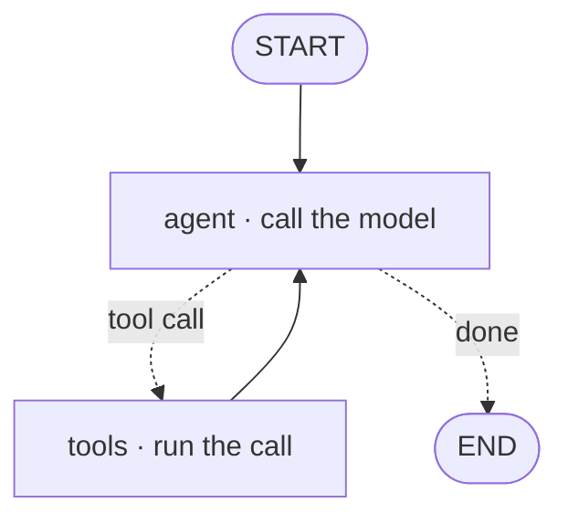

# Walking one graph, surviving a crash, and defining an agent two ways

[Part 1](./index.md) made the case for a framework: it deletes the boilerplate around the bare loop — the loop plumbing, the tool-calling glue, state and memory, control flow, multi-agent handoffs, and the tracing/streaming/checkpointing tail — and most frameworks land on the same core idea, the agent as a graph or state machine, where nodes are steps and edges are control flow with loop-backs included, so the AI-delta is the graph turning an opaque `while` loop into a machine you can inspect, pause, and resume. Sort the players by layer if you like, but treat the layering as a snapshot that's already going stale: the abstraction is the cost, so reach for primitives first. This page works that framework layer out in full. It walks one concrete graph node by node, shows what durable execution and the checkpoint backends underneath it actually are, sets a framework's own memory against its multi-agent constructs, contrasts the two ways you can define an agent — in code or in configuration — and closes on how tracing and eval plug in at the framework level.

One boundary before the walk, because the sibling lessons hold the ground next door. The *general* memory taxonomy, the step and token budgets, and the loop-control machinery belong to [planning & loops](../planning-loops/index.md) and its [deep dive](../planning-loops/deep-dive.md); the multi-agent topologies, their protocols, and how you eval a team live in [multi-agent](../multi-agent/index.md) and its [deep dive](../multi-agent/deep-dive.md); the transport underneath — agent↔tool is [MCP](../mcp.md), agent↔agent is A2A — is its own lesson; and the serving, observability, and eval *operations* are [Part III](../../part-3-production/overview.md). This page owns the framework layer and cross-links the rest rather than re-deriving it. Part 1 is assumed throughout.

## Walking one graph

Take the "agent as a graph" from Part 1 and make it concrete. [LangGraph](https://www.langchain.com/langgraph) models an agent as a **StateGraph**: a typed shared state object that every node reads from and writes to, plus the nodes and edges that move execution through it. That shared state is the whole trick — it's how one step's work reaches the next without you threading it by hand.

Two anchors bound the graph: START, the entry, and END, the exit. A **node** is just a function — it takes the current state and returns an update to it. Call the model, call a tool, make a decision: each is a node. The edges between them come in two kinds. A plain **edge** is an unconditional transition, A always goes to B. A **conditional edge** is a function that inspects the state and returns which node runs next — and that is where the loop's branch lives. Did the model ask for a tool? Route to the tools node. Did it answer? Route to END.

Wire those pieces into the canonical ReAct agent and the shape is small. You have an `agent` node that calls the model and a `tools` node that runs whatever the model asked for. START flows into `agent`. A conditional edge out of `agent` sends control to `tools` when the model emitted a tool call, and to END when it didn't. And an unconditional edge runs `tools` straight back to `agent`. That last edge — the loop-back — is the agentic cycle from [agentic RAG](../agentic-rag/deep-dive.md), now drawn as an explicit arrow instead of hiding inside a `while`. This is the tool-nodes-with-conditional-edges base shape Part 1 named.

:::tip[▶ Video]

<YouTube id="qAF1NjEVHhY" title="LangChain vs LangGraph: A Tale of Two Frameworks — IBM Technology" />

IBM on why LangGraph exists as the stateful-orchestration layer over [LangChain](https://www.langchain.com) — a good orientation for the graph walkthrough above.

:::

Most of the time you don't wire any of that by hand. LangGraph ships a **prebuilt ReAct agent** (`create_react_agent`) that returns exactly this graph pre-assembled; you drop in a model and a list of tools and you're running. That's Part 1's batteries-included tool-caller. You reach for the hand-built graph only when you need a shape the prebuilt one won't give you — custom branching, an extra node, an interrupt where a human steps in.

Once the loop is a graph, everything else below — checkpoints, durability, human-in-the-loop, tracing — is something you *attach* to that graph, not new machinery you build. All of it is wiring that hangs off nodes and edges you already have.

## Surviving a crash: durable execution

Persistence starts with the **checkpointer** — it saves a snapshot of the graph's state at every **super-step**, meaning each node transition, keyed by a thread. Resuming a run is then just loading the last checkpoint and continuing from it. This is LangGraph's short-term, thread-scoped memory: the state of one conversation, saved as it goes.

The **thread** — its `thread_id` — is what keeps one run from bleeding into another. Separate threads carry separate checkpoint histories, so two sessions never see each other's state. That's Part 1's "keeps separate threads apart," now precise about what a thread is.

Because every step is saved, resuming isn't the only thing you can do. You can rewind to an earlier checkpoint, inspect the state at that step, edit it, and resume down a new branch — time-travel over the run. That's the concrete form of Part 1's "checkpoints you can roll back to."

The checkpointer is one interface over swappable storage, and the storage is a **checkpoint backend**. As of July 2026 the concrete options are `InMemorySaver`, which holds state in RAM and loses it on restart — dev only; `SqliteSaver` (package `langgraph-checkpoint-sqlite`, v3.1.0, May 2026) for local single-node use; `PostgresSaver` (package `langgraph-checkpoint-postgres`, also v3.1.0) for production, where the state is shared and durable; and `RedisSaver` (`langgraph-checkpoint-redis`), another production option when you already run Redis. The choice is a dev-versus-prod decision and nothing more — in-memory for a notebook, a real database for anything that has to survive a restart.

That saved state is what makes **durable execution** possible: a run resumes from the last successful step instead of restarting from scratch after a crash, a restart, a deploy, or a long pause. It's built on the checkpointer — no checkpointer, no durability — and LangGraph exposes a **`durability`** setting with three modes as of July 2026. `"exit"` persists only when execution exits: fastest, but no recovery from a mid-run crash. `"async"` persists in the background while the next step runs: a good performance-versus-durability tradeoff, with a small risk of losing the last write if the process dies. `"sync"` persists synchronously before the next step starts: the highest durability, the most overhead. The modes only govern *when* the checkpointer writes; every one of them still assumes a checkpointer is there.

Why this matters for agents is the AI-delta again. Agent runs are long, non-deterministic, and expensive — a thirty-step research agent that dies at step 28 must not re-pay for 27 model calls to get back. Durability is also what makes human-in-the-loop real: an interrupt node persists the state and the run simply waits — hours, days — for someone to approve, then resumes exactly where it paused. That's Part 1's HITL node, now grounded in the same persistence. The general human-in-the-loop and budget layer is [planning & loops](../planning-loops/index.md); here it's just a node backed by a checkpoint.

And the restraint that comes with every capability on this page: a stateless single-shot agent needs none of this. No checkpointer, no backend, no durability mode. Durability earns its keep on long, resumable, or human-gated runs — don't stand up Postgres for a one-turn classifier.

## Two kinds of memory, and why they aren't the team

Framework memory splits along one axis into two scopes. Short-term, thread-scoped memory is the checkpointer's state — alive within a single thread, the conversation currently running, and gone when that thread ends. Long-term, cross-thread memory is a separate **store** that survives *across* threads, keyed by namespaces — one per user, say — so an agent can remember a person between sessions that share no thread. LangGraph calls that long-term side the Store.

The framework gives you the plumbing here — the persistence and a store API — and stops there. *Which* memory types to model (episodic, semantic, procedural) is the taxonomy in the [planning & loops deep dive](../planning-loops/deep-dive.md), and *what* to remember, when to summarize, when to evict — that belongs to the budget layer, beyond the framework's remit. The boundary is worth keeping sharp: cross-link it, don't re-derive it.

Frameworks differ in how opinionated the memory API is. LangGraph hands you the low-level split — checkpointer versus Store — and lets you decide how to use each. [CrewAI](https://www.crewai.com), as of July 2026, ships a single unified `Memory` API instead: it auto-categorizes what to save and scores recall by relevance, recency, and importance — a higher-level, more opinionated take on the same short-versus-long split. Which API wins matters less than the fact underneath: memory is a framework-provided capability with a persistence backend behind it, whichever shape the framework prefers.

Multi-agent constructs sit on a different axis entirely, and it's easy to blur them into memory if you're not careful. A framework also ships prebuilt *team* constructs — a **supervisor** that routes work to workers, crew-style role agents (CrewAI's model) — the topologies from [multi-agent](../multi-agent/index.md), pre-assembled so you configure them rather than code them.

So hold the two apart, because this is the load-bearing distinction of the section. Memory is **state persistence**: what survives across steps and across sessions. Multi-agent constructs are **work distribution**: how sub-agents are wired to each other. They're orthogonal — you can have a single agent with rich long-term memory, a stateless multi-agent team, or both at once. Reaching for a supervisor to "get memory" is a real design error. The framework packages each capability; the *concepts* live in planning-loops (memory) and multi-agent (topologies), and this lesson only shows how a framework surfaces them. The corollary: reach for a cross-thread store only when a thread-scoped checkpoint genuinely won't cover you. Match the construct to the need.

## Two ways to define the same agent

There are two styles for defining an agent, and the split runs through every framework. **Imperative** means you *build* the agent in code, step by step: instantiate the graph, `add_node`, `add_edge`, add a conditional edge, compile. You write the control flow yourself. LangGraph's Graph API is imperative in exactly this way. (LangGraph also offers a lighter imperative option, the Functional API — `@entrypoint` and `@task` decorators that give you an agent-as-a-function with state scoped to that function, for when you want imperative control without drawing an explicit graph.)

**Declarative** means you *describe* the agents and their wiring in configuration and let the framework assemble the runtime. As of July 2026, CrewAI's config files declare each agent's role, goal, and tools with no control-flow code — YAML in the classic project layout, JSONC by default in newer ones. [Microsoft Agent Framework](https://learn.microsoft.com/en-us/agent-framework/) ships declarative workflows whose own docs put it exactly right: *"you describe what your workflow should do rather than how to implement it."*

The tradeoff cuts both ways. Imperative buys control and expressiveness — arbitrary branching, custom nodes, anything you can express in code — and charges you more code and a steeper read for it. Declarative buys speed, uniformity, and accessibility: a non-engineer can read and edit a config-defined crew, the shapes stay consistent, and the config diffs cleanly and can be generated by tools. What it charges is a ceiling — the moment you need a flow the config vocabulary can't express, you drop back to code. Microsoft's own guidance splits the same way: declarative for standard patterns, frequently-changing workflows, and non-developers doing the editing; programmatic for complex custom logic and maximum flexibility.

None of this is new. It's the same declarative-versus-imperative line software has drawn everywhere else — SQL against procedural code, infrastructure-as-config against scripts. Declarative for the common shapes; imperative when you hit the wall. And most real frameworks give you both and let you mix them — a declarative crew with an imperative escape hatch for the one flow the config can't say. Which ties back cleanly: the hand-built graph from the first section is the imperative form, and a config-declared crew is the declarative form of the *same* multi-agent topology from [multi-agent](../multi-agent/index.md). One concept, two ways to write it down.

## One artifact, every production concern

Because the agent is a graph of *named* nodes, the framework can emit a trace on its own. Every node execution, model call, and tool call becomes a **span** in a parent–child tree, with little or no instrumentation from you. That's Part 1's "tracing hooks" boilerplate, paid off by the graph structure itself.

[LangSmith](https://www.langchain.com/langsmith) is the native example for LangChain and LangGraph: once tracing is switched on — an environment flag and an API key — LangChain-module calls inside a graph trace automatically, and it adds an eval harness wired to that same graph: datasets it frames as "unit tests for your LLM app," evaluators that are LLM-as-a-judge, heuristic, pairwise, or human, and run comparison across versions. LangSmith is one such tool among several.

The vendor-neutral standard is OpenTelemetry's GenAI semantic conventions ([OpenTelemetry](https://opentelemetry.io)), which define standard span kinds for LLM and agent workloads — `invoke_agent`, `execute_tool`, and model-inference and memory spans — so a framework can emit traces that any OTel backend reads and you aren't locked to one vendor's tracer (LangSmith itself speaks OTLP in both directions). One caveat on the date, though: as of July 2026 the GenAI conventions are still in "Development" status — an emerging standard that is still stabilizing. These are the same conventions the [multi-agent deep dive](../multi-agent/deep-dive.md) leans on to stitch a whole team's trajectory into one tree.

That captured trace is the eval *input*. You grade two things over it: the outcome — the final answer, by whatever metric the task uses — and the process — did the graph take a sane path, hit the right nodes, avoid a loop that never terminates. It's the outcome-versus-process split from the [agentic RAG deep dive](../agentic-rag/deep-dive.md), now fed by the framework's own trace. The framework *captures*; the eval discipline — the metrics, the judges, the golden sets — is [Part III](../../part-3-production/overview.md).

It all converges on one object. The graph you defined in the first section is the same one you checkpoint, remember with, define declaratively or not, and now trace and grade. One artifact, and every production concern hangs off it. That's the deepest form of Part 1's AI-delta: the graph isn't just something you can inspect — it's the single **seam** through which persistence, memory, and observability all attach.

The closing restraint mirrors Part 1's "primitives first." All of this is opt-in mastery. A simple agent needs none of it — no checkpointer, no store, no declarative config, no trace backend. Reach for each piece only when the run is long enough to need durability, stateful enough to need memory, or complex enough to need tracing. The framework makes each of them cheap to add; it doesn't make any of them free, and adding one you don't need is the same abstraction cost Part 1 warned about, paid twice.

## What to take away

- LangGraph models an agent as a StateGraph — a shared state object, nodes that call the model, call a tool, or decide, plain edges, and conditional edges that route on the state. The ReAct agent is an `agent` node plus a `tools` node, with a conditional edge out of `agent` and a loop-back edge from `tools` to `agent`; `create_react_agent` hands you that graph pre-assembled.
- A checkpointer saves state at every step keyed by a `thread_id`, so a run resumes from the last successful step instead of restarting — and that same persistence is what lets a human-in-the-loop interrupt wait hours and then resume. The `durability` modes (`exit`, `async`, `sync`) trade speed for safety; backends swap freely (in-memory for dev, Postgres or Redis for prod); a stateless single-shot agent needs none of it.
- Framework memory has two scopes, and neither is the team: short-term thread-scoped state (the checkpointer) versus long-term cross-thread memory (a store, keyed by namespace). The supervisor and crew constructs are a different axis — work distribution, not state persistence — and conflating the two is a design error.
- Imperative definition builds the graph in code for control and expressiveness; declarative definition describes agents in configuration — CrewAI's files, Microsoft Agent Framework's declarative workflows — for speed, uniformity, and edits by non-engineers, right up until you hit a flow the config can't express. Most frameworks offer both and let you mix them.
- A graph of named nodes emits a span tree on its own — LangSmith natively, or the OpenTelemetry GenAI conventions vendor-neutrally, though those are still an emerging standard as of July 2026. The framework captures the trace; Part III owns the eval discipline you run over it.
- The graph is the single seam every production concern attaches to — you checkpoint it, remember with it, define it two ways, and trace it. A simple agent skips every layer, and adding one it doesn't need is abstraction cost paid twice.

**New terms** → [Glossary](../../glossary.md): state graph, checkpointer, checkpoint backend, thread (thread_id), durable execution, conditional edge, framework long-term memory (store), declarative vs imperative agent definition.
