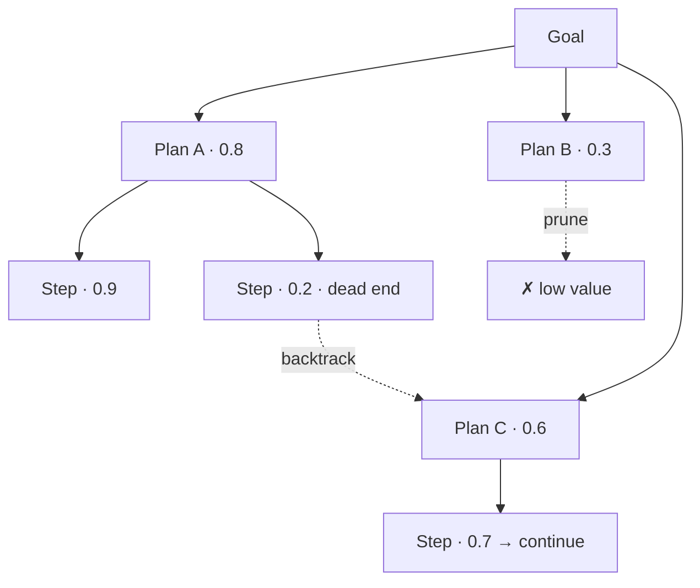
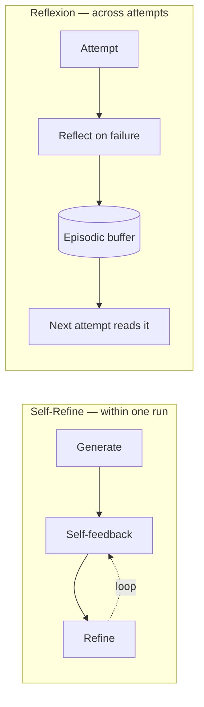
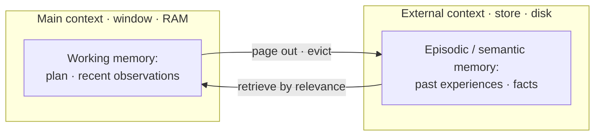

# Searching over plans, giving reflection a shape, and surviving long runs

[Part 1](./index.md) handed the agent one plan and a way to revise it: decompose the goal, sequence the steps with ReAct or plan-and-execute, watch for the three shapes of non-termination, and defend against them in layers. This page takes that control layer to mastery. It treats planning as *search* over many candidate plans, turns Part 1's reflection-as-concept into named published frameworks, hardens budgets from a single number into a policy, gives the scratchpad a real memory architecture behind it, and grades the whole trajectory rather than the final answer.

One boundary before we start, because a sibling lesson shares this ground. The retrieval-specific version of these same ideas — bounding a *retrieval* loop, distilling findings between hops, grading a *retrieval* trajectory — lives in the [Agentic RAG deep dive](../agentic-rag/deep-dive.md). This page owns the general form: loop control and planning for any agent, retrieval or not. Where the two meet, it points there instead of re-deriving. Part 1 is assumed throughout — decomposition, the ReAct-versus-plan-and-execute tradeoff, the three non-termination shapes, the layered defences, and reflection as a concept are built on, not re-taught.

## Planning as search, not a single line

Part 1 planned one sequence and re-planned when it broke. That is already enough for most agents. But there is a stronger move for the tasks that can afford it: stop committing to one plan at all, and treat planning as search over a space of candidate plans.

The shift is concrete. Instead of writing a plan and revising it, the agent *generates* several candidate next-steps — call them thoughts, or partial plans — *scores* each one with a value or heuristic, usually the model judging its own intermediate states, and *searches* the resulting space: expanding the branches that look promising, glancing ahead, and backing out of dead ends. Reasoning stops being a line and becomes a tree you explore.

**Tree of Thoughts (ToT)** (Shunyu Yao et al., arXiv:2305.10601, 17 May 2023) is the canonical form. It frames deliberate problem-solving as search over a tree of intermediate reasoning steps: the model proposes candidate thoughts, self-evaluates each state, and explores with breadth- or depth-first search plus lookahead and backtracking — where plain chain-of-thought commits to one linear path and lives or dies by it. The gap the paper reports is not subtle. On the Game of 24, ToT reached 74% success against 4% for standard chain-of-thought prompting. When a task genuinely needs deliberation, searching several paths and pruning is a different order of capability from writing one and hoping.

**Graph of Thoughts (GoT)** (Maciej Besta et al., arXiv:2308.09687, 18 Aug 2023) generalises the tree to an arbitrary graph. Thoughts become vertices and edges become dependencies, so branches can be aggregated and merged, not only forked. The motivation is that some problems want *combining* partial solutions — synthesize two half-answers into a better one — which a strict tree, where every node has a single parent, cannot express.

**LATS (Language Agent Tree Search)** (Andy Zhou et al., arXiv:2310.04406, 6 Oct 2023) carries the idea out of pure reasoning and into the acting loop. It runs Monte Carlo Tree Search over the agent's *actions*, with a language-model value function, self-reflection, and real environment feedback from tool results, unifying reasoning, acting, and planning under one search. This is the bridge from searching over thoughts to searching over trajectories: the agent tries an action branch, observes what the environment returns, and can back up and try another. The tree is no longer hypothetical — its edges are things the agent actually did.

State the cost plainly, because it decides where any of this belongs. Search multiplies model calls: you score many states and expand many branches, so a ToT or LATS run can cost several to many times a single pass. And it leans entirely on a *trustworthy* state evaluator. If the model cannot reliably tell a promising partial plan from a doomed one, search does not fix its judgment — it amplifies the misjudgment, spending more calls to chase worse branches with confidence.

Which is why most production agents do not search over plans. They run one plan and re-plan on failure, exactly as in Part 1, because it is far cheaper and usually enough. Reserve plan search for high-value tasks with verifiable intermediate steps and a reliable evaluator — math, code, puzzles, constrained optimisation — where a wrong branch is cheaply detectable and backtracking earns back its cost. On open-ended work with no clean success signal per step, the evaluator is the weak link and the extra calls rarely pay. The discipline is the one from Part 1: take the simplest level that solves the task.

## Reflection, given a shape

Part 1 introduced reflection as a concept — the agent judging its own trajectory. The research has given that concept named shapes, and there is one principle that decides whether any of them helps.

**Self-Refine** (Aman Madaan et al., arXiv:2303.17651, 30 Mar 2023) is the tight version. A single model, no training: it generates an output, gives itself feedback on that output, and revises — looping until the result is good enough. Across seven tasks spanning GPT-3.5, ChatGPT, and GPT-4, the paper reports roughly a 20% absolute average improvement. Its scope is one task, one episode: the loop lives inside a single run and makes that run's answer better.

**Reflexion** (Noah Shinn et al., arXiv:2303.11366, 20 Mar 2023) works at a different time scale, and here the name matters. Reflexion is a framework — capital R, the proper name — not to be confused with reflection the concept it implements. The paper calls its method verbal reinforcement learning: after a failed attempt, the agent writes a natural-language reflection on what went wrong and stores it in an episodic memory buffer; on the next attempt it reads those reflections back and does better. The agent learns across trials with no weight update at all — the lesson lives in text, not gradients. This is the point where reflection meets memory, and it sets up the memory architecture below.

So the distinction to hold is time scale. Self-Refine improves the current answer inside one run; Reflexion carries a lesson out of one run and into the next. Both are the agent critiquing itself — the difference is whether the critique stays local or persists.

Underneath both sits the principle that governs all reflection: it is only as good as the signal it reflects on. Pure self-critique — the same model that made the error also grading it — has a ceiling, because a model confidently wrong in generation tends to be confidently wrong in critique. Reflection grounded in an *external* signal is far stronger: a failed unit test, a tool error, a validator's rejection, ground-truth feedback. Reflect on evidence, not on the model's own opinion of itself.

That principle has a sharp edge, and it is the reason not to reflect everywhere. Reflection costs extra calls and latency, and on easy inputs it can actively hurt — a model asked to reconsider a correct answer will sometimes talk itself out of it. So gate reflection behind a real failure signal, a failed check or a stalled loop, rather than firing it every step. Same simplest-level rule, applied to self-critique.

## Budgets as a policy, not a number

Part 1 made budgets the non-negotiable backstop: a hard cap that guarantees the loop stops. The refinement is that a budget is a *policy*, and that what you do at the cap matters as much as the cap itself.

Start with the fact that budgets are multi-dimensional. A run can be capped on steps or iterations, on tokens, on wall-clock time, on money, and on tool-call count — and it can blow one while sitting comfortably under the others. A cheap-but-endless loop hits the step cap; an expensive-reasoning run hits the token or cost cap first. Production caps several dimensions at once, because any single one leaves a hole.

They also nest. A whole-task budget sits over per-subtask sub-budgets, so one runaway subtask cannot burn the entire allowance before the others get a turn. In a plan-and-execute or multi-agent setup the planner or supervisor allocates budget to steps and can reclaim what a step did not spend — the same supervisor role the multi-agent lesson describes, here holding the purse.

The move that turns a cap into a policy is the two-tier split:

- A **soft cap**, reached earlier, *triggers a corrective action* rather than stopping the run — summarise and compact the history, force a reflection, re-plan, or ask a human. It buys the run a chance to finish well. This is exactly where the reflection from the section above and the memory compaction from the one below get invoked deliberately instead of at random.
- A **hard cap** stops the run unconditionally. It is the guarantee, unchanged from Part 1.

And what you do *at* the cap is a design decision, not an afterthought. The worst outcome is the silent kill mid-trajectory: cost fully spent, nothing returned. Avoid it. Return the best-so-far partial result with an honest flag that the budget was hit; escalate to a human, Part 1's human-in-the-loop standing in as the last-resort budget; or return a typed "budget exceeded" and let the caller decide. Degrade gracefully — a silent kill that returns nothing is the one outcome to design out.

Finally, spend the budget where it pays. The expensive techniques above — plan search and reflection from the earlier sections — multiply calls, so applying them uniformly is waste. Route cheap, easy tasks to a single pass and reserve search and reflection for the hard ones. This is the general form of the query-complexity routing the [Agentic RAG deep dive](../agentic-rag/deep-dive.md) calls adaptive RAG; there it routes retrieval, here it governs the whole agent loop. One more knob deserves its own name: the *thinking budget* — how much extended-thinking or reasoning-effort spend a task gets — is separate from the step and token budgets, and it is tuned by task difficulty, not by loop length.

## Memory for long trajectories

The scratchpad from Part 1 — working memory — was one mitigation for context bloat. Behind it sits a whole memory architecture, with types that differ by how long they live and by where they physically sit.

**Working memory** is the scratchpad from Part 1: the in-context notes for the current task — the plan, the closed subtasks, the last few observations. It is ephemeral. It lives in the window and dies with the run.

**Episodic memory** is a store of past experiences — what happened, when, and how it turned out — that outlives the current context and gets retrieved when it is relevant to a new situation. Reflexion's reflection buffer from the reflection section is episodic memory in action. Two things separate it from working memory: lifetime, because it persists across runs and sessions, and location, because it lives in an external store rather than the live window.

Two more types round out the taxonomy. **Semantic memory** is durable facts the agent knows or has learned, often held in a knowledge base or vector store. **Procedural memory** is learned how-to — skills the agent has picked up. The full split — working and short-term on one side, long-term (episodic, semantic, procedural) on the other — is what the video below lays out.

:::tip[▶ Video]

<YouTube id="BacJ6sEhqMo" title="The Four Types of Memory Every AI Agent Needs — IBM Technology" />

Watch it for the taxonomy this section formalizes — working/short-term, long-term, episodic, and semantic/procedural memory, named and separated in four minutes.

:::

Retrieving from episodic memory is itself a RAG problem. You cannot pour every past episode into the window, so you retrieve the relevant ones — and *how* you rank them is a design question with a well-known answer. Generative Agents (Joon Sung Park et al., arXiv:2304.03442, 7 Apr 2023) scores memories by recency, importance, and relevance, and periodically synthesizes clusters of low-level memories into higher-level reflections that get written back into the same stream. Reflection and memory turn out to be one system: the agent reflects to compress its own history, and stores the reflection as another memory.

That leaves the ceiling every long run eventually hits — the context window itself. **MemGPT** (Charles Packer et al., arXiv:2310.08560, 12 Oct 2023) answers it by borrowing the operating system's memory hierarchy. Treat the context window as "main context" — fast, small, like RAM — and an external store as "external context" — large, slow, like disk — and let the model page information in and out with tool calls. The agent then works over data far larger than its window. This is virtual context management, and it is the mechanism that lets working memory effectively exceed the context limit instead of being trapped inside it.

The practical mechanics for a long trajectory are three, and worth naming even briefly. Summarise and compact older history rather than carrying it raw — the general form of the distilled-finding technique the [Agentic RAG deep dive](../agentic-rag/deep-dive.md) applies to retrieval. Retrieve the relevant episodic memories instead of stuffing all of history into the window. And keep a structured task-state — the explicit plan, once again earning its keep. Together they hold off the lost-in-the-middle problem from Part 1, where the early steps of a long trajectory fall out of the model's attention right when it needs them.

None of this is free, and most tasks do not need it. Episodic memory adds a whole retrieval subsystem with its own failure modes — a stale or mis-retrieved memory poisons the context and can be worse than having no memory at all. Single-shot tasks need only working memory. Add long-term memory when the agent genuinely has to learn across sessions — a personal assistant, a long-running project — and not a moment before.

## Grading the whole path

Eval now measures the trajectory, Part 1 said. What that comes to concretely is a handful of metrics — and a reliability trap that catches teams who stop at a single successful run.

The first cut is outcome versus process — the general form of the split the [Agentic RAG deep dive](../agentic-rag/deep-dive.md) drew for retrieval. Outcome is whether the agent reached the goal: the task success rate. Process is whether the path was sound — the right steps, the right tools, the right order, a sensible place to stop. A correct answer down a wrong path is luck, and luck does not survive the next input. Grading only the outcome hides that; grading the process is what makes a failing run debuggable, because it localizes the failure to a step.

The concrete trajectory metrics, one at a time. **Task success rate** — did the agent achieve the user's objective. **Step efficiency** — steps taken against steps needed; the agent that solves in forty steps what six would settle is not a good agent, straight from Part 1. **Tool-call accuracy** — the right tool, the right arguments, the right order. **Termination** — did it stop at all. And **cost or tokens per task**. The process metrics are the ones that pin a failure to a specific step; outcome alone cannot.

Then the trap. Agents are non-deterministic, so a single successful run — pass@1 — overstates how reliable the agent really is. **pass^k** measures the fraction of tasks solved on *all* k independent attempts: consistency, not best-case. The numbers from τ-bench (Shunyu Yao et al., arXiv:2406.12045, 17 Jun 2024), a tool-agent-user benchmark, make the gap vivid: frontier models score below 50% success, and pass^8 drops below 25% in the retail domain. An agent that looks decent once is often unreliable run to run — and production cares about run to run, because your users each get one run. Measure consistency, not a lucky single pass.

How you actually grade a path is an LLM-as-a-judge over the trajectory: a capable model reads the recorded trace against a rubric. Which makes one precondition non-negotiable — you cannot evaluate a trajectory you cannot see. Trajectory eval requires a full trace of the run, so observability is not an add-on you bolt on later; it is what makes the evaluation possible at all, sharpening the point Part 1 first made. Tooling exists: [Ragas](https://www.ragas.io) documents agent-oriented metrics — agent goal accuracy, tool-call accuracy, topic adherence — computed over a run. Reach for it lightly; the general eval and observability disciplines are lessons of their own.

And the restraint, once more. A simple, short agent does not need full trajectory grading — outcome eval plus a step count can be plenty. The trajectory machinery is a cost you take on when there is a real multi-step path whose soundness can fail independently of its final answer. When there is, the [capstone](../real-agents.md) shows the whole loop — planning, budgets, memory, and eval — running across Claude, OpenAI, and Gemini.

## What to take away

- Planning can become *search* over many candidate plans — Tree of Thoughts explores a tree of reasoning steps, Graph of Thoughts a graph that merges branches, LATS a search over actions with environment feedback. It is a different order of capability on verifiable-step tasks (ToT hit 74% on Game of 24 against 4% for chain-of-thought), but it multiplies calls and lives or dies by a trustworthy evaluator. Most agents just re-plan, and should.
- Reflection has named shapes at two time scales: Self-Refine refines within a single run, Reflexion carries a lesson across runs through an episodic buffer. Whatever the shape, reflection is only as good as the signal beneath it — prefer an external one, and gate it behind a real failure, or it will talk a right answer wrong.
- Treat a budget as a policy. Cap several dimensions at once, nest per-subtask budgets under the whole-task one, split soft caps (trigger a fix) from hard caps (stop), and at the cap degrade gracefully rather than kill silently. Spend the expensive techniques only where they pay.
- Memory is an architecture, not a scratchpad — working memory in the window versus episodic memory in an external store, plus semantic and procedural. MemGPT pages between window and store so working memory can outgrow the context limit; retrieve the relevant memories instead of stuffing all history; and add long-term memory only when the agent must learn across sessions.
- Grade the whole path: outcome versus process, step efficiency, tool-call accuracy, termination. Measure reliability with pass^k, not a single lucky pass@1 — τ-bench's frontier models fall below 50% once, and pass^8 below 25% in retail. All of it needs a full trace, so observability is the precondition.

**New terms** → [Glossary](../../glossary.md): Tree of Thoughts (ToT), Graph of Thoughts (GoT), LATS, Self-Refine, Reflexion, plan search, episodic memory, semantic memory, virtual context management (MemGPT), trajectory evaluation, pass^k.
