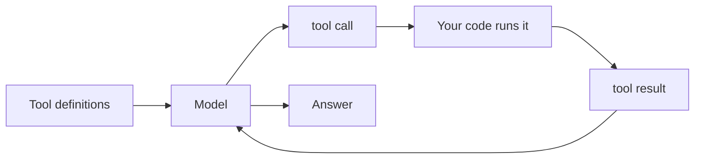

# Claude, OpenAI, Gemini illustrate the techniques

Part II built the agent one capability at a time: the loop that decides for itself in
[agentic-rag](./agentic-rag/index.md), the tools it acts with in [tool-use](./tool-use/index.md), a way to plan and
actually stop in [planning-loops](./planning-loops/index.md), teammates to divide the work in
[multi-agent](./multi-agent/index.md), the frameworks that package all of it in
[orchestration-frameworks](./orchestration-frameworks/index.md), and the protocol that wires it to the world in
[mcp](./mcp/index.md). This lesson teaches nothing new. It takes that whole toolkit to the three agents you meet
first — Claude, OpenAI, and Gemini — and shows that each technique is the same durable move under a
different name and a different wire shape.

That framing is the point, so read every section the same way. The **durable pattern** comes first — the
part that survives API churn. Then how each vendor does it *today*, dated on purpose, because those
specifics rot fast and this page is honest that it will age. Then what differs and why, which is where the
engineering actually lives. Then where it breaks, tied back to the lesson that taught the failure.
Learn the pattern and any vendor's docs become a lookup, not a re-education.

:::tip[▶ Video]

<YouTube id="fCHe_fOqlYA" title="Building AI Agent Systems and Scaling Challenges in Agentic AI — IBM Technology" />

Watch this first: IBM frames the same tension this whole capstone lives on — real agents cost latency and
complexity, so the engineering is choosing the *least* agency that does the job, not the most.

:::

## Tool use — the same round-trip, three wire shapes

Every agent grows hands the same way. You declare a tool as a name, a description in words, and a
JSON Schema of its arguments; the model emits a **structured intent** — which tool, what arguments — but
never runs anything; your runtime executes the call and feeds the result back; the loop continues. That is
the tool-use round-trip from [tool-use](./tool-use/index.md), and it is identical across all three vendors. Only
the shape on the wire changes.

As of mid-2026, Claude declares tools in a `tools` array (`name`, `description`, `input_schema` as JSON
Schema), and the exchange travels as **content blocks**: the model returns `stop_reason: "tool_use"` with
`tool_use` blocks, and you reply with a user message carrying `tool_result` blocks. The `tool_choice`
parameter runs `auto` / `any` / a forced single tool / `none`; strict tool use is
`tool_choice:{type:"any"}` with `strict:true`; parallel tool use is on by default. OpenAI declares a tool as
`{type:"function", name, description, parameters, strict}`, and in the Responses API the exchange is
**typed items** instead of blocks: the model emits `function_call` items (each with a `call_id`, a `name`,
and JSON-string `arguments`), and you return `function_call_output` items keyed by the matching `call_id`.
Setting `strict:true` enforces the schema through Structured Outputs; `tool_choice` takes
`auto` / `required` / `none` / a forced tool, and `parallel_tool_calls` defaults to true.
Gemini's **function declarations** use a *subset* of the OpenAPI schema; the model returns a `functionCall`
and — the docs are explicit — "does not execute the function itself," so you run it and return a
`functionResponse`. Its modes are `auto` / `any` / `none` (the older API spelled them `AUTO` / `ANY` /
`NONE` under `function_calling_config`, same semantics — don't mix the two), and, per the docs last updated
2026-07-07, the Google Gen AI SDK can *auto-call* a Python function you hand it directly, which you switch
off with `AutomaticFunctionCallingConfig(disable=True)`.

What differs is the shape of the round-trip, not the idea: content blocks threaded through a message,
discrete typed items, or a `functionCall`/`functionResponse` pair over an OpenAPI-subset schema. Claude and
OpenAI both expose an explicit strict-schema mode, and Gemini pins arguments to its OpenAPI-subset schema —
tool-use's "a strict schema cuts invalid calls" made real across all three. And the durable rule holds
everywhere — **a tool description is a prompt**, not a signature, so a
vague description misfires the same way whichever vendor you picked.

Which is exactly why the failure modes are vendor-independent. The wrong tool or no call at all, invalid
arguments, a model confabulating on top of the result — those come from tool *design*, not from the API
that carries them. Strict schemas and a small, non-overlapping tool set are the fix on all three, and no
vendor sells you out of doing that work ([tool-use](./tool-use/index.md)).

## Getting data — retrieval is a tool with citations

Retrieval is just a tool the agent chooses. It reaches for the web or a file the same way it reaches for
any function, and the answer comes back with **citations** so a human can check the grounding. This is
Agentic RAG's "retrieval becomes an action," now shipped as a built-in ([agentic-rag](./agentic-rag/index.md)).

As of mid-2026, Claude offers a **web search** server tool with citations always on (priced around $10 per
1,000 searches plus tokens, versioned through `web_search_20260318`) and a separate **web fetch** tool that
retrieves a URL already seen in the conversation — no JavaScript rendering, citations off by default —
alongside a code-execution sandbox and a Files API as first-class server tools. OpenAI ships a hosted web
search tool, `{type:"web_search"}`, that returns inline `url_citation` annotations, plus a **file search**
tool over **vector stores** (`{type:"file_search", vector_store_ids:[…]}`) — semantic RAG as a managed
built-in, handing back `file_citation` annotations. Gemini's **grounding with Google Search** is a
first-class tool (`google_search`) wired straight to Google's live index, returning grounding metadata and
inline `url_citation` annotations automatically; a **URL context** tool takes up to 20 URLs per request; a
File API stores uploads for 48 hours; and a managed Vertex AI RAG Engine grounds the model on your own
data.

All three ship native web search with citations — that's the durable part. The emphasis is where they
differ. Claude adds a URL-fetch tool and a code sandbox; OpenAI leans on vector-store file search, i.e.
managed RAG; Gemini's edge is that the grounding source is *its own* search index, backed by a managed RAG
Engine for private corpora. The Part I lens still applies: a built-in retriever doesn't cure a
retrieval failure; it only moves who runs the retriever.

Grounding is only ever as good as what came back. Stale or irrelevant hits still poison the answer,
and a model can cite a source it didn't actually use. Citations let a human verify faithfulness; they don't
guarantee it — the retrieval-failure-versus-generation-failure split from Part I is exactly the tool for
telling those two apart ([agentic-rag](./agentic-rag/index.md)).

## Planning and loops — spend compute to decide better, then cap it

The agent loop is reason → decide → act → observe, repeated until a stop condition fires. Explicit
reasoning before acting makes the decide step sharper; a turn or step cap is the guard against a loop that
never ends. Both are vendor-independent ([planning-loops](./planning-loops/index.md)).

Claude runs the loop until `stop_reason:"end_turn"`; the Claude Agent SDK's `query()` runs the same loop —
"turns continue until Claude produces output with no tool calls" — bounded by `max_turns` and
`max_budget_usd`. Its reasoning is visible: **extended thinking** surfaces as `thinking` blocks, and
**interleaved thinking** lets the model reason *between* tool calls, automatic on adaptive-thinking models
as of mid-2026. OpenAI takes the opposite stance on visibility. Reasoning is gated by **reasoning effort** —
`reasoning.effort` set to `none` / `minimal` / `low` / `medium` / `high` / `xhigh` on the GPT-5.x family — and the
reasoning tokens themselves are internal and opaque, billed as output but never shown. Its Agents SDK
`Runner.run()` drives the tool loop, stopping on a final output with no tool calls, switching agent on a
handoff, otherwise running tools and going around again; `max_turns` caps it and raises `MaxTurnsExceeded`.
Gemini exposes the dial as a number. A **thinking budget** (`thinkingBudget`; `-1` means dynamic, `0`
disables it on models that allow that, within hard per-model ranges) is shifting in Gemini 3 to discrete
`thinking_level` tiers (`minimal` / `low` / `medium` / `high`), per docs last updated 2026-07-07. In Gemini's
ADK (Agent Development Kit) the loop is an Event Loop: the agent runs until it has something to report,
yields an `Event`, and pauses at the
yield until the Runner commits state.

Same durable idea — spend more compute to decide better — three control surfaces over it. Claude makes the
reasoning *visible* and interleaved; OpenAI keeps it *opaque* behind an effort setting; Gemini gives you a
*numeric* budget that's becoming a set of named levels. What none of them removes is the turn or step cap.

More thinking is not a termination guarantee. The loop that never stops, or that drifts off the goal, is the
failure planning-loops warned about, and the step budget is the backstop that catches it regardless of how
much reasoning you bought ([planning-loops](./planning-loops/index.md)).

## Self-recovery — feed the error back, and make the run resumable

A good agent recovers instead of dying. A tool error is fed back as *model-visible text* so the model
corrects itself and retries, and longer work is made **resumable** by persisting state, so a run can pick up
from a checkpoint instead of restarting from zero. This is tool-use's "clear errors → the loop self-heals,"
scaled up from one call to a whole run ([tool-use](./tool-use/index.md)).

As of mid-2026, Claude returns a tool error through `tool_result` with `is_error:true` and an instructive
message; the docs note it "will retry 2–3 times with corrections before apologizing." The Agent SDK persists sessions as local
JSONL and offers *continue* (the most recent session), *resume* (an explicit session id), and *fork* (branch
a copy) — and a run that stopped on `error_max_turns` or `error_max_budget_usd` can be resumed with a higher
limit. OpenAI keeps continuity server-side instead: `previous_response_id` chains a call onto a prior
response, and the Conversations API gives durable state without a 30-day store TTL. In its Agents SDK a
tool's `failure_error_function` returns a model-visible error string so the model recovers or re-raises.
Gemini's ADK wraps the same move in a `ReflectAndRetryToolPlugin` that intercepts a tool failure, feeds
structured guidance back, and retries (default `max_retries = 3`); ADK Sessions hold events and state
through a `SessionService`, and with a persistent backend
(`DatabaseSessionService` / `VertexAiSessionService`) a session reloads and continues rather than rebuilds.

The interesting delta is *where the state lives*. Claude keeps it in local session files; OpenAI keeps it
server-side; ADK swaps a backend behind one `SessionService` interface — in-memory, database, or managed.
One move, three storage models — each with its own failure and portability tradeoff.

The catch is the obvious one, and it splits in two. State you never persisted is state you cannot resume —
and even when you did persist it, "resume" is only safe if you can tell *what actually completed*. That
second half is not an API feature; it's a discipline, and it leads straight into the war-story on judging
progress by real state rather than a timestamp ([planning-loops](./planning-loops/index.md)).

## Hooks and guardrails — interpose checks, don't trust the loop

You don't trust the loop blindly. You interpose checks around tool calls and I/O: a pre-hook that can block
or demand approval before a dangerous action, a post-hook that inspects output, a policy layer that gates
what's even allowed. It is the least-privilege principle from tool-use turned into machinery
([tool-use](./tool-use/index.md)).

Claude ships this at the harness level. **Claude Code hooks** are lifecycle events you shell out from —
`PreToolUse` (which can block), `PostToolUse`, `PermissionRequest`, `Stop`, `SubagentStop`, and more — and
the Agent SDK adds **permission modes** (`default` / `acceptEdits` / `plan` / `bypassPermissions` and
others) evaluated in a fixed order: Hooks → Deny → Ask → mode → Allow → the `canUseTool` callback, where a
`deny` rule blocks even under `bypassPermissions`. OpenAI puts the control inside the SDK. Its
input/output guardrails (`@input_guardrail` / `@output_guardrail`) raise a *tripwire* exception when tripped
— input guardrails run in parallel with the agent, output ones after it completes — backed by lifecycle
hooks (`RunHooks` / `AgentHooks`) and tool-level human approval (`needs_approval` pauses the run to
approve or reject), with a separate free Moderation API (`omni-moderation-latest`, 13 categories) alongside.
Gemini's ADK exposes a fixed six-point matrix of **ADK callbacks** — `before`/`after` each of agent, model,
and tool — where returning an object short-circuits the call (a `before_tool` callback that returns a dict
skips execution entirely), plus in-model safety settings (four harm categories with thresholds, defaulting
Off on Gemini 2.5 and 3 per docs updated 2026-06-01) and Model Armor, a separately deployed service that
screens prompts and responses for injection, PII, and malicious URLs (overview updated 2026-07-10).

The control lives in a different *layer* for each vendor. Claude gives you harness-level hooks and a layered
permission pipeline; OpenAI gives you in-SDK tripwire guardrails and a standalone Moderation API;
Gemini/ADK gives you a fixed callback matrix, in-model safety, and a bolt-on Model Armor. The idea is constant
— interpose checks, grant least privilege — but there are three places to put them.

And the same durable failure: a guardrail you can bypass isn't one. The dangerous surface is the tool that
*writes or acts*, reached through prompt injection, so human-in-the-loop approval on sensitive actions is
the real backstop. A hook that only logs stops nothing ([tool-use](./tool-use/index.md)).

## Multi-agent — split into an orchestrator and isolated workers

When one loop takes on too much, split it: an orchestrator plus isolated workers, each worker with its own
context, doing one job and returning a result the orchestrator composes. Isolation is the whole point — a
worker's intermediate mess never pollutes the others ([multi-agent](./multi-agent/index.md)).

:::tip[▶ Video]

<YouTube id="ZVPlLaehjLk" title="Agentic AI Frameworks Explained: Workflows, Multi-Agent, & Production — IBM Technology" />

Watch this for the jump this section makes concrete: IBM walks the same move from a single loop to
multi-agent workflows running in production.

:::

As of mid-2026, Claude's **subagents** run in an isolated fresh context — "only the subagent's final message
returns to the parent" — defined through an `agents` parameter or `.claude/agents/*.md` files, and multiple
subagents run concurrently. Strong context isolation is the model. OpenAI names two patterns and keeps them
distinct: **handoffs** (`handoff()`, surfaced to the model as a `transfer_to_<agent>` tool, so control
*transfers* to the peer) and **agents-as-tools** (`Agent.as_tool()`, where the manager stays in control and
just gets a result back); running independent agents in parallel is explicit user code over
`asyncio.gather`. Gemini's ADK lets a coordinator delegate to sub-agents (it auto-injects the delegation
tools) and adds **workflow agents** — `SequentialAgent`, `ParallelAgent`, `LoopAgent` — as *deterministic*
orchestration primitives that set execution order "without consulting an AI model," plus an `AgentTool`
wrapper for agent-as-a-tool.

Who drives the topology is the difference. Claude gives you isolated subagents, parallel in the background
by default. OpenAI draws a sharp line between handing *off* control and keeping it. ADK adds control flow
the *framework* runs rather than the model — the exact point orchestration-frameworks made: a framework
packages the loop, and the topology is a design choice you make deliberately
([orchestration-frameworks](./orchestration-frameworks/index.md)).

The failure is over-eager division. Don't split when one agent would do — every worker adds latency, cost,
and coordination bugs, and parallel workers sharing a mutable workspace collide. That's multi-agent's "when
NOT to divide," and it leads to the war-story on giving each worker its own worktree
([multi-agent](./multi-agent/index.md)).

## MCP — one protocol so any agent talks to any tool

The last technique is the standard that stops you re-gluing every tool to every agent. Wrap a tool once as
an MCP server and implement the client once, and any agent talks to any tool: M × N pairwise connectors
collapse to N + M. The standard's own phrasing is "build once and integrate everywhere," and its metaphor is
**a USB-C port for AI applications** ([mcp](./mcp/index.md)).

The governance is worth dating precisely, because it shows how fast this moved. Anthropic introduced [MCP](https://modelcontextprotocol.io) on
25 November 2024 and, on 9 December 2025, donated it to the Agentic AI Foundation — a directed fund under
the Linux Foundation — co-founded with Block and OpenAI. All three vendors are MCP *clients* today. Claude
exposes an API **MCP connector** (remote HTTP only, tool-calls only) and Claude Code as an MCP client that
also speaks local stdio. OpenAI's Agents SDK connects MCP servers (`MCPServerStdio` / `…StreamableHttp` /
hosted) and the Responses API carries a hosted `{type:"mcp"}` tool over a catalogue of OpenAI-maintained
connectors. Gemini/ADK connects through **`McpToolset`**, which converts a server's schemas into ADK tools,
and the Gemini API has a native `mcp_server` remote tool type — with an honest dated caveat: as of mid-2026
the docs state "Gemini 3 does not support remote MCP, this is coming soon." Underneath all three, the
transports are stdio for local and streamable HTTP for remote — the latter replaced HTTP+SSE in the
2025-03-26 spec revision (SSE is now deprecated across every vendor's tooling), and the latest spec revision
is `2025-11-25`.

The differences are ones of role. Anthropic *authored* MCP and co-governs it, and its API connector is
remote-only while Claude Code covers local stdio. OpenAI is a co-founding *consumer* with the widest
transport range and a hosted connector catalogue. Gemini/ADK supports it through `McpToolset`, with the frank
"remote MCP coming soon" gap. None of that touches the durable point: *MCP is agent ↔ tools; A2A is
agent ↔ agent* ([A2A](https://a2a-protocol.org): Google-originated, now under the Linux Foundation, at v1.0).

The durable failure comes bundled with it. Every MCP server is a new attack surface — a malicious one can inject
instructions through tool poisoning, exfiltrate data, or over-reach its grant. The defence is unchanged from
[mcp](./mcp/index.md): least privilege, only servers you trust, and human approval on sensitive actions.

## The seven techniques, three agents

| Technique | Claude | OpenAI | Gemini |
|---|---|---|---|
| Tool round-trip | `tool_use`/`tool_result` content blocks | `function_call`/`function_call_output` items (Responses API) | `functionCall`/`functionResponse`, OpenAPI-subset schema |
| Web and files | web search + web fetch + code sandbox | web search + vector-store file search | grounding with Google Search + RAG Engine |
| Reasoning control | visible thinking + interleaved | opaque `reasoning.effort` | numeric `thinkingBudget` → `thinking_level` |
| Self-recovery and state | local session JSONL (continue/resume/fork) | server-side `previous_response_id` / Conversations | ADK SessionService (memory/db/managed) |
| Hooks and guardrails | Claude Code hooks + permission modes | in-SDK tripwire guardrails + Moderation API | ADK callbacks + safety settings + Model Armor |
| Multi-agent | isolated subagents (final message returns) | handoff vs agent-as-tool | coordinator + deterministic workflow agents |
| MCP | authored it; API connector remote-only | co-founder; widest transports + connectors | `McpToolset`; remote MCP "coming soon" |

## War-stories — the techniques when you actually run agents

These techniques aren't abstract. Here is what they look like when you run agents to build real things —
generic on purpose: public tools only, no secrets.

- **Checkpoint-resume after a session limit (self-recovery).** An agent building a feature hit the model's
  session limit mid-run. Because it had committed a work-in-progress checkpoint to its branch and the
  harness could resume the session from persisted state, nothing was lost — the next run continued from the
  checkpoint instead of restarting. Persist enough state that a hard stop is a pause, not a loss.
- **Judge progress by real state, not a timestamp (self-recovery, guardrails).** "Did it finish?" has to be
  answered from ground truth — a PR's merged state, a deploy's status — never inferred from a file's
  modification time or from the mere fact that you *ran* the merge command, which can decline softly. Verify
  `state == MERGED`, not "the mtime looks recent." Self-recovery is only safe when you can tell what actually
  completed.
- **Worktree isolation for parallel workers (multi-agent).** Several agents building branches in one repo
  collide, because a shared checkout has exactly one checked-out branch. Give each worker its own git
  worktree so parallel work doesn't stomp a shared workspace — the concrete form of multi-agent's "isolate
  the workers."
- **A leak-scan pre-commit hook (guardrails).** A deterministic grep gate runs as a pre-commit hook, and
  again in CI, to block secrets, credentials, and local paths before they can ever be published. A hook that
  *blocks* is worth more than a scan that reports after the fact — the guardrail pattern turned on your own
  pipeline.

---

Part II handed you the loop, the tools, the plan, the recovery, the guardrails, the teams, and the plug. On
real agents these are the same moves wearing different names and wire shapes — Claude's content blocks,
OpenAI's typed items, Gemini's functionCalls. The APIs will shift, and shift again; the pattern is what you
keep. Once you can see it, a new vendor's documentation is something you consult, not something you relearn.

## What to take away

- Every agent grows hands the same way: declare tools (name, description, JSON Schema), the model emits a
  structured intent, your code runs it, the result goes back. Only the wire shape differs — Claude content
  blocks, OpenAI typed items, Gemini `functionCall`/`functionResponse`.
- Retrieval is a tool with citations. All three ship native web search; Claude adds web-fetch and a code
  sandbox, OpenAI leans on vector-store file search, Gemini grounds on Google Search with a managed RAG
  Engine.
- The loop is reason → decide → act → observe, capped by a turn or step budget. Reasoning control is where
  they split: Claude's visible thinking, OpenAI's opaque `reasoning.effort`, Gemini's numeric thinking
  budget.
- Recover, don't die: tool errors feed back as text for self-correction, and you persist state to resume —
  local session files on Claude, server-side `previous_response_id` on OpenAI, a SessionService backend on
  ADK.
- Interpose checks: Claude Code hooks with permission modes, OpenAI in-SDK guardrails with a Moderation API,
  ADK callbacks with safety settings and Model Armor. Least privilege and human approval on dangerous
  actions are the constant.
- Split into an orchestrator plus isolated workers only when one loop won't do: Claude subagents, OpenAI
  handoff versus agent-as-tool, ADK coordinator plus deterministic workflow agents.
- MCP ties it together — authored by Anthropic in 2024, donated to the Linux Foundation's Agentic AI
  Foundation in December 2025; all three are MCP clients today. Learn the durable pattern; the vendor is a
  dated case.

**New terms** → [Glossary](../glossary.md): extended thinking, interleaved thinking, reasoning effort, thinking budget, Claude Code hooks, ADK callbacks, permission modes.

---

:::note[Next — going deeper]

🚧 Second pass: per-vendor deep dives (each SDK hands-on), a fact-rot sweep cadence for this fast-ageing page, computer-use and browser tools, evals across vendors, and cost/latency benchmarking of the three.

:::
