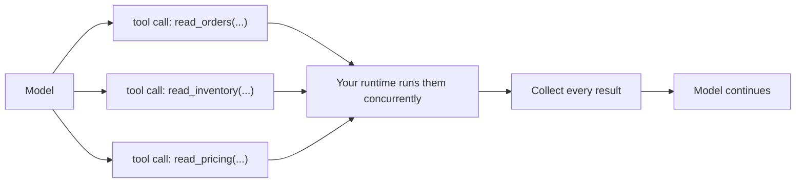
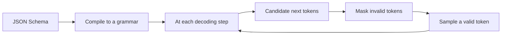

# Parallel calls, constrained decoding, retries, and the cost of a large toolset

[Part 1](./index.md) laid out the mechanism — tool definition → tool call → tool result → continue. This page takes that same round-trip to mastery: what happens when the model fires several calls at once, how a schema gets enforced token by token, how a loop recovers from a bad call instead of dying, and what breaks once the toolset grows to dozens. Part 1 is assumed throughout — the round-trip, the security boundary, "a tool definition is a prompt," and the good-tool checklist are not re-taught here, only built on.

## When the model fires several calls at once

A single turn is not one call. The model can emit several independent tool calls in one response — three database reads, two API lookups — instead of dribbling them out one per turn. Your runtime then does two things in order: it fans them *out*, running them concurrently, and fans them *in*, collecting every result and handing them back together before the model continues. That is the **fan-out / fan-in** shape: one turn explodes into N parallel calls, N results collapse back into a single message, the loop goes on.

The word doing the work is *independent*. Parallelism is valid only when no call needs another's result and no call's side effect changes what another call sees. The model assumes that independence when it decides to batch — and your runtime does not check it. Nothing verifies that the three calls really don't interfere; if they do, you get a race, not an error message.

The knobs that control this differ by vendor, and the exact names matter.

- **Anthropic Claude** batches by default — Claude 4 models fire parallel calls whenever a request benefits. You turn it off with `disable_parallel_tool_use: true` — and note where it lives: inside the `tool_choice` object, not as a top-level request parameter. With `tool_choice` type `auto`, the model calls at most one tool per response; with type `any` or `tool`, exactly one.
- **OpenAI** exposes `parallel_tool_calls`, which defaults to allowing several calls per turn; set it to `false` to force zero-or-one.
- **Gemini** supports **parallel function calling** — several independent functions in one turn — and, kept deliberately distinct, **compositional function calling**, where calls chain in sequence and one's output feeds the next: `get_current_location()`, then `get_weather(location)`. The first is a batch; the second is a dependency chain, and telling them apart is the whole discipline of this section.

Collecting the results has a contract of its own, and Anthropic's is worth stating concretely. You return one `tool_result` per `tool_use` block, all together in the next user message, each matched to its call by `tool_use_id`, and every `tool_result` comes before any text in that message. If you chose not to run a call — say you executed the batch sequentially and an earlier one failed — you still return a `tool_result` for it, with `is_error: true` and a short reason, rather than silently dropping it. Gemini works the same way in spirit: each response maps back to its call by an `id`, and you must return all of them.

Now the restraint, because two kinds of call have no business in a parallel batch.

Do not parallelise **dependent calls** — where one needs a previous result. That is compositional, sequential calling; run it in order. Batching it is simply wrong, because the second call needs an argument that does not exist yet.

Do not blindly parallelise **side-effectful writes**. Concurrent writes to shared state race, and ordering across a batch is undefined — you cannot say which one landed first. For write tools, either disable parallel calls (`disable_parallel_tool_use` / `parallel_tool_calls: false`) or serialise execution in your own runtime. We return to this under idempotency.

When the model keeps batching things it shouldn't, the documented fix is the prompt itself: instruct it in the system prompt — "Only batch tool calls that are independent of each other." The model batches on an assumption; the system prompt is where you correct the assumption.

The batch, drawn out — three calls fan out to the runtime and their results fan back in as one message:

## How a schema is actually enforced

A tool's arguments are described by a **schema** — usually **JSON Schema** (Gemini uses an **OpenAPI-subset** schema). Part 1 treated that schema as the typed menu the model fills in. It is more than documentation: in **strict** mode the schema is *enforced*, and the model cannot emit arguments that violate it. What follows is how "cannot" is made literally true.

The mechanism is **constrained decoding**. The provider compiles your schema into a **grammar** — a formal grammar, a context-free grammar in the general case. Then, at every decoding step, the sampler masks out every token that would break the grammar given what has been emitted so far, and samples only from what survives. A closing brace where the grammar demands a digit is not on the menu of next tokens at all. The output matches the schema by construction — not because the model tried hard and got lucky, and not because you validated it afterward and discarded the bad ones.

How each vendor exposes strict mode:

- **OpenAI**: `strict: true` inside the function definition makes calls reliably adhere to the schema rather than best-effort, implemented through Structured Outputs — constrained decoding under the hood. It carries two requirements: `additionalProperties: false` on every object, and every property listed as `required`.
- **Anthropic Claude**: strict tool use via `tool_choice` with `strict: true`.
- **Gemini**: arguments are pinned to the OpenAPI-subset schema in the function declaration.

Constrained decoding is not free. Here is what it costs, and when to skip it:

- **First-call compile cost.** The first request carrying a *new* schema pays a latency penalty while the grammar artefact is computed and preprocessed for sampling; later requests with the same schema hit a cache and run fast. OpenAI documents exactly this — schema to grammar on first sight, cached thereafter. The consequence is practical: churn a freshly generated schema on every call and you defeat the cache, paying the compile tax every single time.
- **Unsupported schema features.** Strict mode covers only a subset of JSON Schema, and the `additionalProperties: false` plus all-required constraints mean some expressive features are unavailable or have to be reshaped to fit.
- **Parallelism, as a dated fact.** Parallel function calling did not originally work together with strict mode on OpenAI — to keep strictness you set `parallel_tool_calls: false`. That was later fixed, and parallel calls now work with strict mode.

So be exact about what strict decoding buys. It guarantees well-formed, schema-valid arguments: the JSON parses, the types line up, the enums are honoured. It does not guarantee the arguments are *correct*, or that the model reached for the *right* tool. Structure is not semantics — and closing that gap is the entire job of the validation section below.

The same mechanism as a loop — schema compiles once, then every decoding step masks and samples:

## When a call fails — and how the loop recovers

A tool call fails in more than one way, and lumping the ways together is the first mistake, because the recovery that fixes one makes another worse. The taxonomy:

- **Malformed arguments** — the args don't parse or violate the schema. Strict decoding largely prevents these, but only for strict tools; a non-strict tool can still receive junk.
- **Validation failure** — the args are well-formed but fail your checks: out of range, an unknown id (argument validation, below).
- **Tool exception** — the tool ran and threw: a downstream 500, a bad query.
- **Timeout** — the tool did not answer inside its budget.
- **Empty or ambiguous result** — the tool returned nothing useful, or something the model can misread. This is the confabulation risk Part 1 named — the model building confidently on top of a muddled or empty result. It earns a place on the failure list even though nothing technically failed.

The single most important move when a call fails has a shape you have already met. Part 1 called a tool definition a prompt; the same is true of an error. **Error as prompt**: you return the failure to the model as a message it can read and act on — a **recoverable error**, phrased as guidance ("date must be YYYY-MM-DD"; "unknown user_id, call list_users first"), not an opaque stack trace and not a bare non-zero exit code. Then the loop repairs itself: bad call → clear error → the model reformulates → retry. It is Part 1's "clear errors → the loop self-heals," taken to the level where you write the error text on purpose. In Anthropic's form, that is a `tool_result` with `is_error: true` and an instructive message; the model reissues a corrected call on the next turn.

Not every failure is the model's fault, and those get different handling. For **transient** failures — a timeout, a rate limit, a downstream 5xx — retry, but retry with **backoff**: space the attempts out, exponential backoff being the usual form. A tight immediate loop only hammers a dependency that is already struggling and turns a blip into an outage.

And cap it. A **retry budget** — a hard ceiling on attempts, per call and per run — mirrors the step budget and token budget from the planning lesson. Without a ceiling, a call that fails deterministically becomes an **infinite retry loop**: the agent reissues the same doomed call forever and never terminates.

Which points at the real distinction. Retrying earns its keep only when the input to the retry is *different* — a corrected argument, or a transient fault that has since settled. Retry the identical call after a deterministic failure and it fails identically; you have burned budget and money to relearn what you already knew. Recognise the non-progressing case and stop: surface the failure, hand it to a human, or try a different tool. And name it correctly — a loop that won't stop is a failure, a bug in the run, never a "refusal."

That leaves two things not to retry. Do not retry a deterministic failure unchanged; nothing has changed, so the outcome won't either. And do not retry a side-effectful write that might have partially succeeded without an idempotency guarantee behind it — the retry can double-apply what the first attempt already did. Retries are for transient faults and self-corrected arguments; they are not a way to avoid fixing the call. The idempotency section below makes that concrete for writes.

## The context cost of dozens of tools

Every tool definition costs tokens in every request: the name, the description, and the full parameter schema of each tool are serialised into the prompt on every call, used or not. A dozen tools is a standing tax — tokens, latency, money — paid whether or not the model touches any of them. That is the concrete price behind Part 1's "few, non-overlapping tools."

The tax is not only fiscal. **Tool selection** degrades as the set grows: with many close-in-meaning tools the model picks the wrong tool more often, and fails to call when it should — the wrong-tool and no-call failures Part 1 named. A large flat toolset actively makes the agent worse at choosing.

The fix at scale is to stop shipping every tool every time. **Dynamic tool loadout** — also called **tool-RAG** — retrieves only the tools relevant to the current query and loads just those into the request. It is RAG applied to the tool menu instead of to documents: a retrieval step over your tool catalogue that keeps the active set small and on topic, turn by turn.

**Namespacing** works the same problem from the other side. Give tools structured names and group them — by domain, by server — so the model and your retrieval step can both reason about them; it cuts name collisions and overlap once the catalogue is large.

Past some point the answer is not a longer list at all. When one agent is hauling dozens of tools, the fix is to split into **specialised agents**, each with a small, orthogonal toolset — the specialisation argument from the [multi-agent](../multi-agent/index.md) lesson. A tool list that keeps growing is itself the signal that you have outgrown a single agent.

The restraint runs the other way too. Do not reach for tool-RAG prematurely. For a handful of tools it is needless machinery with its own failure surface — a retrieval step that can now misfire and hide a tool the model needed. The simplest thing that works is the full static set; dynamic loadout earns its complexity only when the catalogue is genuinely large. Same discipline as everywhere in Part 2: take the simplest level that solves the task.

## Idempotency and the writes that leave a mark

Retry safety is not a property of your retry policy. It is a property of the tool. Read tools and write tools differ on retry: re-running a read costs you nothing but latency, while re-running a write — create the order, send the email, charge the card — can duplicate the side effect. Whether a retry is safe is decided by what the tool does, not by how you retry it.

The property you want is **idempotency**: running a write twice with the same input has the same effect as running it once. The standard mechanism is an **idempotency key** — the caller attaches a unique key per intended operation, and the server dedupes repeats of that key. With a key in place, a retry after an ambiguous timeout is safe: if the first attempt actually succeeded, the second is a no-op.

For writes that are dangerous or irreversible, split the operation in two. A **dry-run** computes and shows what *would* happen, with no effect; a **confirm** step then commits it — and that confirm step is often the human-in-the-loop approval point. It is Part 1's least privilege and "require confirmation for dangerous actions" turned into a two-call shape.

Keep that separation structural, as Part 1 argued: keep read tools and write tools distinct so you can hand the agent broad read access and gate the writes. Least privilege stops being a slogan once the tools themselves are split along the line you mean to guard.

Here the parallel section and this one meet. A fan-out batch has undefined ordering, so two writes dropped into one batch can race or land out of order. Never put order-dependent or conflicting writes in the same parallel batch — serialise them, or disable parallel calls for write tools. Parallelism was the win earlier; on writes it is the trap.

And the rule that ties retries back to writes: do not lean on retries for a write tool that is not idempotent and has no key. A retry after a timeout that had in fact succeeded double-applies the effect — a second charge, a second email. Fix idempotency first, then allow retries. That order does not flip.

## Validating arguments before you act

Strict decoding gets you well-formed arguments. It does not get you *acceptable* ones — and the place to tell the difference is between "the model emitted arguments" and "you run the tool." Validate before you execute: insert a gate that inspects the arguments before any side effect can fire.

The gate has two levels, and they catch different things.

- **Schema-level validation** — types, required fields, enums, formats. Strict, constrained decoding largely covers this at generation time, but validate anyway: for non-strict tools, and as defence in depth.
- **Semantic validation** — the arguments are well-typed and still wrong for the context: an id that doesn't exist, a date in the past, an amount over a limit, a path outside the allowed root. A schema cannot express most of this; your code has to. This is precisely the gap the schema section flagged — structure passing while semantics fail.

When validation rejects an argument, it feeds back the same way an execution error does. A failed check returns a recoverable, model-readable message — error as prompt again — so the model corrects the argument and retries. Same self-healing loop, only now it guards the boundary before execution instead of catching a failure after it.

That fixes the line between the two levels. Don't push semantic checks into the schema, where most of them are unrepresentable; and don't skip validation because decoding is strict, since strict guarantees well-formed, never correct. The two layers are complementary, and neither stands in for the other.

## What to take away

- In one turn the model can fire several independent calls; your runtime fans them out to run concurrently and fans the results back in together. That is valid only when the calls truly don't depend on or interfere with each other — and nothing enforces it but you.
- Strict mode enforces a schema by constrained decoding: the schema compiles to a grammar, and the sampler masks every token that would break it. It buys well-formed arguments, not correct ones, and the first call on a new schema pays a compile cost before the cache warms.
- A failed call recovers when you hand the error back as a prompt — a readable, actionable message the model can correct against. Retry transient faults with backoff under a hard retry budget; retrying an unchanged deterministic failure is an infinite loop, not a recovery.
- Every tool definition is tokens on every request, and selection accuracy drops as the set grows. Retrieve a small, relevant loadout (tool-RAG) only once the catalogue is genuinely large — and past that point, split into specialised agents rather than growing one.
- A read is safe to retry; a write is not, unless it is idempotent — give write tools an idempotency key, a dry-run/confirm split for the dangerous ones, and never a seat in a parallel batch beside another write.
- Validate arguments before executing, at two levels: schema-level for shape, semantic for meaning. Strict decoding covers the first; your code has to cover the second; and a validation error feeds back to the model exactly like an execution error.

**New terms** → [Glossary](../../glossary.md): parallel tool calls, constrained decoding, strict mode / Structured Outputs, idempotency / idempotency key, tool-RAG / dynamic tool loadout, argument validation, retry budget.
