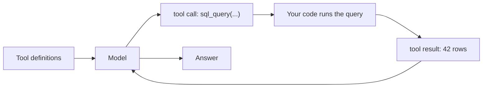

# How the model acts on the outside world

In the Agentic RAG lesson you took in the key shift: retrieval stopped being a step and became an **action**
the model chooses inside a loop. But retrieval is just one action. **Tool use** — also called **function
calling** — is the general mechanism: the model can call any external function. Search over a knowledge
base, a SQL query against a table, an HTTP API call, a calculator, code execution, sending an email.
Retrieval turns out to be a special case — one tool among many.

Tool use is exactly what turns the model from a "text generator" into something that can **act**: read live
data, do exact arithmetic, change the state of external systems.

:::tip[▶ Video]

<YouTube id="h8gMhXYAv1k" title="What is Tool Calling? Connecting LLMs to Your Data — IBM Technology" />

The same mechanism from IBM: how a tool call wires the model into your data and systems.

:::

## Why the model needs an intermediary — it only produces text

The model executes nothing itself — it only emits text. It won't reach into a database or hit an API; it
physically doesn't run code. Tool use is the bridging protocol:

1. The model emits a **structured intent**: "call function X with arguments Y."
2. **Your code** runs the call and gets the result.
3. The result goes back to the model as context.
4. The model continues, now seeing the result.

The split is strict: the model decides what to call; your runtime does the calling. The model never
touches the real systems — and that very split will turn out to be the security boundary (more below).

## The mechanism: a tool call

It has a few parts. It's the same loop as in Agentic RAG, only the action is now anything.

- **Tool definition** — a name, a description in words, and a parameter schema (usually JSON Schema). This
  is the "menu": which tools exist, what they do, what arguments they take. You pass it to the model along
  with the query.
- **Tool call** — instead of ordinary text (or alongside it), the model emits **structured output**: JSON
  with the tool name and the arguments.
- **Tool result** — your runtime runs the tool and appends the result to the conversation as a separate
  message.
- The model **continues**: seeing the result, it either calls another tool or answers.

## A tool definition is a prompt, not just a signature

Here's the main AI delta versus ordinary API design. The model selects a tool and fills its arguments by
**reading the description in words** — it cannot look into your implementation. The name, the description
text, and the parameter descriptions are what a probabilistic model uses to decide *when* and *how* to
invoke the function. A vague description, and the model calls at the wrong time, picks the wrong tool, or fills in junk
arguments. So tool descriptions are part of prompt engineering, and the "caller" here isn't deterministic
code — it's a model reading natural language.

## What makes a tool good

- **A clear, unambiguous description** — the model tells tools apart by their description, not by the code
  behind them.
- **Strictly typed, constrained parameters** (JSON Schema, `enum`, formats) narrow what the model may emit
  and cut the rate of malformed calls.
- **Few tools, and non-overlapping.** A dozen functions close in meaning confuse the model — tool-selection
  errors climb. Curate the set; don't grow it.
- **Clear errors.** When a tool fails, return a message the model can recover from ("date must be
  YYYY-MM-DD"). Then the loop repairs itself: bad call → clear error → reformulation → retry.
- **The right granularity** — not too fine (ten calls for one task), not too coarse (one tool for
  everything).

## Where it breaks

- **The wrong tool — or none.** The model took the wrong function, or answered from memory instead of
  calling. Fixed by descriptions and a smaller set.
- **Invalid arguments** — invented or wrong parameters. Fixed by a strict schema, validation, and clear
  errors for self-correction.
- **Making things up on top of the result.** The model may confabulate on top of a result — especially a
  muddled or empty one. Return the result as a separate message, explicitly marked as tool output; that
  lowers the risk but doesn't remove it.
- **Security — a new and serious risk.** A tool that **acts** (writes, sends, executes code) is now driven
  by the model's output, and that output can be hijacked via prompt injection — including the indirect kind
  hidden in retrieved content. Hence the defense: **least privilege** — limit the tool set available to the
  agent, separate read tools from write tools, require confirmation for dangerous actions. Then even a
  successful injection can do very little.

## The link back to RAG

The circle closes: **retrieval is a tool.** Agentic RAG from the previous lesson is a special case of tool
use where the main tool is search. Once the agent has several tools, it covers that "different sources for
different questions" case: retrieval into the knowledge base, SQL into tables, web search for what's fresh,
a calculator for exact arithmetic. The router from the previous lesson is precisely what picks which tool to
use.

## What to take away

- Tool use (function calling) — the general mechanism: the model calls any external function; retrieval
  is a special case of it.
- The model only produces the intent — your code executes it: the model decides "what," your runtime
  does "how." That is also the security boundary.
- The mechanism is "tool definition → tool call → tool result → continue"; the same loop as Agentic RAG,
  with any action.
- A tool definition is a prompt: the model chooses by the words, not the code. A good tool: clear
  description, strict schema, few and non-overlapping, clear errors.
- New failure modes: the wrong tool, invalid arguments, making things up on top of the result, and
  security — a write tool plus prompt injection, hence least privilege.

**New terms** → [Glossary](../../glossary.md): tool use / function calling, tool definition, tool call, tool
result, tool selection, JSON Schema, structured output.

---

:::note[Next — part 2 of the lesson]

**[Reliability & scale](./deep-dive.md)** — taking tool calls to production: parallel calls, schema formats
and constrained decoding, error-and-retry handling, and the context cost of dozens of tools.

See also: connecting tools through a shared standard — [MCP and agent protocols](../mcp.md); how it looks
across Claude, OpenAI, and Gemini — [the part's capstone](../real-agents.md).

:::
