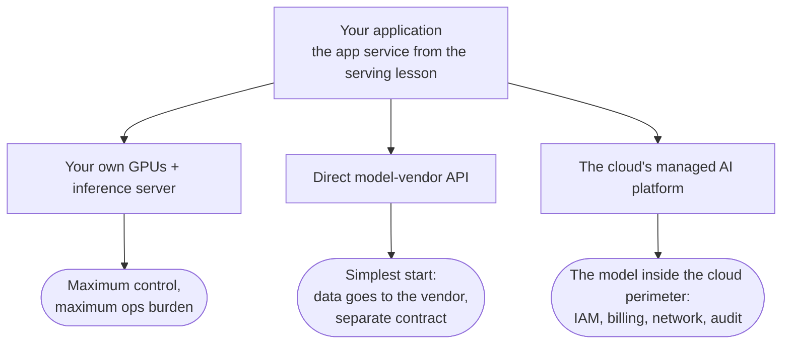

# Where your tokens get computed

[Serving](./serving.md) ended at a fork. The application layer — auth, the RAG pipeline, guardrails,
streaming — is yours either way; the open question was the second box in the diagram: do you run the model
on your own GPUs, or rent it? This lesson walks the rent branch properly, because renting turns out to have
a fork of its own.

There are three ways to get tokens out of a model, and they line up along one axis: control versus
convenience. At one end sits self-hosting — an inference server on your own GPUs, the option serving already
covered: maximum control, and the full ops burden that comes with it. At the other end sits the direct
model-vendor API — OpenAI's, Anthropic's, Google's: the simplest integration there is, but your data travels
to the vendor, and the relationship lives in a separate bilateral contract your legal team now negotiates
and tracks. Between them sits the option this lesson is about: your cloud's managed AI platform, where
models run as **managed endpoints** inside the cloud you already use.

:::tip[▶ Video]

<YouTube id="XtT5i0ZeHHE" title="AI Inference: The Secret to AI's Superpowers — IBM Technology" />

A clean take on what inference — the thing every platform on this page is selling — actually is, and why
serving it at scale is a discipline of its own.

:::

## The platform's product — the perimeter

What does the platform add over calling the vendor directly? The model itself is often the same weights you
would reach over the vendor's API. What you are buying is the model behind your existing cloud's perimeter:

- **Unified auth.** The same IAM roles that already guard your buckets and databases now guard the model —
  no second set of API keys living a life of its own.
- **Unified billing.** Tokens land on the same cloud invoice as VMs and databases, with enterprise
  discounts applying.
- **Network isolation.** Private endpoints: traffic to the model never crosses the public internet.
- **Inherited compliance.** The cloud's certifications extend to the platform: SOC 2, HIPAA-eligible
  services, GDPR tooling.
- **Audit logs and quotas.** Per project and team: you can see who burned what, and cap who may burn how
  much.

None of that changes what the model says. All of it changes whether your enterprise is allowed to say
things to the model.

## The three platforms — and a lesson about names

As of mid-2026 the big three look like this. **[Azure OpenAI](https://azure.microsoft.com/en-us/products/ai-services/openai-service)** is Microsoft's offering, historically the way
to consume OpenAI models as a first-party Azure service; the platform around it was renamed from Azure AI
Foundry to Microsoft Foundry at Ignite in November 2025, and models in it are now offered as "Foundry
Models," split between "Models sold by Azure" and marketplace listings. **[AWS Bedrock](https://aws.amazon.com/bedrock/)** is Amazon's — the
one name of the three that has held still. **[Vertex AI](https://cloud.google.com/vertex-ai)** is Google Cloud's, and it is mid-rename as this
page is written: the Gemini Enterprise Agent Platform, announced in April 2026. The console migration
finished in May 2026, the API endpoints didn't move, and the documentation is genuinely caught between the
two names.

Read that paragraph again and notice what it is really telling you: two of the three platforms were renamed
within about a year. Product names and bundle boundaries get reshuffled constantly in this market. What
survives the renames are the capability categories — the model catalog, the privacy and residency
guarantees, the managed RAG tier, the platform guardrails, the throughput and pricing model. The rest of
this lesson is organized by those categories, and that is deliberate: learn the categories, and treat any
product name — including every name on this page — as a snapshot. The [MCP lesson](../part-2-agents/mcp/index.md)
made the same move for agent protocols, and it holds here just as well.

## Model catalogs — who serves whose models

The **model catalog** is the first category: which models can this platform serve to you as managed
endpoints?

Azure OpenAI's founding pitch was exclusive: GPT models with Azure's
enterprise wrapper, and for years that was precisely why enterprises used it. The Foundry catalog has since
gone broad — around 1,900 models, with Anthropic joining at Ignite 2025 alongside Microsoft, OpenAI,
Mistral, xAI, Meta, DeepSeek, and Hugging Face. Bedrock was multi-vendor
from the start, and the old rule of thumb "no OpenAI on AWS" is now simply false: OpenAI's open-weight
gpt-oss models arrived in August 2025, and frontier GPT models went GA on Bedrock in June 2026. On Google's
side, Gemini is the first-party anchor and Model Garden carries the third-party and open models — a name
that, notably, survived the platform rename around it.

| Platform | First-party anchor | Catalog breadth |
|---|---|---|
| Microsoft Foundry (Azure OpenAI) | OpenAI GPT family as a first-party Azure service | ~1,900 models: Microsoft, OpenAI, Anthropic, Mistral, xAI, Meta, DeepSeek, Hugging Face |
| AWS Bedrock | Amazon's own Nova family | Multi-vendor from day one: Anthropic, Meta, Mistral, Cohere, and more — now including OpenAI |
| Gemini Enterprise Agent Platform (Vertex AI) | Gemini | Model Garden: third-party models (including Claude) plus open models |

The consequence is bigger than any single row. Model choice used to dictate cloud choice: if you needed GPT,
you went to Azure, and that was the end of the conversation. That exclusive-catalog era is ending — OpenAI
frontier models run on Bedrock, Anthropic sits in the Foundry catalog, and Claude is now available on all
three platforms. As the coupling between model and cloud weakens, the differentiators shift to the wrapper:
residency guarantees, the managed RAG tier, capacity economics. That is exactly where the rest of this
lesson goes.

## Privacy and data residency

All three platforms make the same core commitment for their enterprise AI offerings: your prompts and
outputs are not used to train foundation models, and they are processed within the service boundary. The
fine print differs enough to matter. Google qualifies its commitment with "by default." Azure's carries an
abuse-monitoring caveat: in the default configuration, content flagged by abuse monitoring can be reviewed
by humans unless your organization has opted out. Read the current data-privacy page of whichever platform
you deploy on — this is one of the places where the exact wording is the product.

**Data residency** is the guarantee about *where* inference happens. You choose the region or geography that
processes your requests — with the standing caveat that model availability varies by region and lags the
newest models. Each platform then offers a residency-versus-capacity dial under its own names: Azure has
deployment types (Standard regional, Data Zone, Global), Bedrock has cross-Region inference (geographic
profiles bounded to US, EU, or APAC versus global profiles), and Vertex offers regional endpoints versus the
global endpoint — where global explicitly means no residency guarantee. The names will churn; the dial
itself — pinned geography with tighter capacity at one end, pooled worldwide capacity with no residency
promise at the other — is the durable mechanism.

Why enterprises care is not abstract. Regulatory regimes — GDPR, sector rules in finance and healthcare —
bind where personal and regulated data may be processed. Residency plus the no-training commitment plus
private networking form the compliance triad that lets a legal team sign off, and in practice this triad is
often the deciding argument for a platform over a direct vendor API. You have met this fork before:
[ingestion](../part-1-rag/ingestion/index.md) posed the self-hosted-versus-API choice for embedding models. This
is the same fork, now at the level of the model itself.

The third leg deserves one concrete sentence. All three platforms support private connectivity, so prompts
never traverse the public internet: Azure Private Link, AWS PrivateLink with VPC endpoints, and Google
Private Service Connect.

## Managed RAG and platform guardrails

Each platform also sells a **managed RAG** tier — Part I's pipeline (ingestion → chunking → embedding →
vector store → retrieval, sometimes reranking) packaged as a product. On AWS that is the classic Bedrock
Knowledge Bases, joined in June 2026 by the fully managed Amazon Bedrock Managed Knowledge Base, with native
connectors and AgentCore integration. On Azure, Azure AI Search is the retrieval backbone, and Foundry IQ is
the current packaged grounding tier; its predecessor, "On Your Data," is retiring in October 2026. On
Google, RAG Engine covers the pipeline, next to the enterprise search product (Vertex AI Search, being
relabeled under the Agent Platform). As everywhere on this page: capability first, names in parentheses,
expiration dates assumed.

The tradeoff is the one to internalize. Managed RAG buys speed — a working pipeline in days, no
infrastructure of your own — and pays for it with the knobs Part I taught you to turn. Chunking strategy,
hybrid weighting, reranker choice, and eval hooks vary by product and may be fixed or opaque. Teams that
need to tune quality through the eval loop from [evaluation](../part-1-rag/cross-cutting/evaluation/index.md)
often outgrow the managed tier, or keep it only for ingestion and storage while owning retrieval themselves.
A fair default reading: managed for standard corpora, custom when eval says the defaults fail.

Guardrails have been productized the same way. Bedrock ships Guardrails — configurable filters for harmful
content, PII, and denied topics, plus contextual grounding checks that score an answer against the retrieved
context and enforce a threshold. Azure ships AI Content Safety, including Prompt Shields for
prompt-injection detection, surfaced in Foundry as "Guardrails + controls" — and yes, Azure renamed its
content filters to "Guardrails," a bonus data point for the names-are-snapshots rule. Google ships Model
Armor. All of these implement the concepts from the
[guardrails lesson](../part-1-rag/cross-cutting/guardrails/index.md) as managed services — which sets up the
make-or-buy question that the [tooling ecosystem](./tooling-ecosystem.md) lesson takes on directly.

## Throughput and pricing models

You will not find a single price in this section, because absolute prices rot faster than platform names.
The pricing *models*, though, are stable, and every platform offers the same two consumption modes.
On-demand is pay-per-token on shared capacity, subject to rate limits and quotas. Reserved capacity buys
dedicated throughput with predictable latency for steady high load — generically, **provisioned
throughput**; locally: PTU (provisioned throughput units) on Azure, Provisioned Throughput on Vertex, and on
Bedrock the Reserved service tier, after Bedrock restructured its pricing into Reserved, Priority, Standard,
and Flex tiers in November 2025 (the legacy "Provisioned Throughput" name survives for older and custom
models).

There is a third tier worth knowing: batch. All three platforms document discounted asynchronous batch
processing for non-interactive workloads — roughly half the on-demand price, for supported models (Azure
Batch, Bedrock batch inference, Vertex batch predictions). If a workload doesn't need an answer in seconds —
nightly document processing, bulk classification, offline eval runs — batch mode is the cheapest tokens the
platform will sell you. Don't confuse it with continuous batching from the [serving](./serving.md) lesson:
that lives in the inference server's GPU scheduler, while batch mode is a pricing tier at the API level.

One operational constant ties the section together: quotas are per-region and per-model, and a production
design must handle 429s no matter which platform serves it. That is the retry-and-rate-cap checklist from
[serving](./serving.md), and it is the opening problem of [LLMOps](./llmops.md), where routing and fallbacks
pick up what a single endpoint can't guarantee.

## How to choose

Start with how the decision actually gets made. In practice, the platform is usually chosen by
existing cloud commitment — where your data, IAM, and enterprise agreement already live — and not by model
benchmarks. That is less lazy than it sounds: the wrapper is the product, and the wrapper is worth the most
where your infrastructure already is. Given that, the differentiators actually worth comparing are four:
does it serve the models you need, in your region; does the residency and compliance story fit your
regulator; does the managed RAG tier fit, or will you run your own pipeline; and what do the
provisioned-capacity economics look like at your load.

Whichever platform wins, keep one architectural hedge: leave the application layer provider-agnostic.
OpenAI-compatible clients and a gateway or router layer — the pattern [LLMOps](./llmops.md) develops with
[LiteLLM](https://www.litellm.ai) and friends — preserve the option to move. Note where the **vendor lock-in** actually lives: the
endpoints are increasingly interchangeable, while the platform SDKs and managed tiers are the sticky parts.
Lock-in lives in the batteries, not in the endpoint.

## What to take away

- Three ways to consume a model: self-host on your GPUs, call the model vendor's API directly, or use your
  cloud's managed AI platform — a control-versus-convenience axis.
- The platform's product is the model behind your cloud's existing perimeter: IAM, billing, private
  networking, inherited compliance, audit logs, quotas.
- Names are snapshots — two of the three platforms renamed within about a year. The durable things are the
  capability categories: catalog, privacy/residency, managed RAG, guardrails, pricing model.
- Catalogs differ but converge: Claude on all three, OpenAI models on Bedrock. As exclusivity fades, the
  wrapper becomes the differentiator.
- The compliance triad — data residency, no-training commitments, private networking — is what lets legal
  sign off, and often what decides platform versus direct API.
- Managed RAG trades Part I's knobs for speed: a fine default for standard corpora, outgrown when eval says
  the defaults fail.
- Learn the pricing models and skip the prices: on-demand per-token, provisioned throughput for steady
  load, batch at roughly half price for asynchronous work. Quotas are per-region, per-model; design for
  429s.
- Choose by cloud commitment plus the four real differentiators: models in your region, compliance fit,
  managed-RAG fit, capacity economics.
- Keep the app layer provider-agnostic — lock-in lives in the batteries, not the endpoint.

**New terms** → [Glossary](../glossary.md): managed endpoint, model catalog, data residency, provisioned
throughput, batch mode, managed RAG, vendor lock-in.

---

:::note[Next — going deeper]

🚧 Second pass: fine-tuning offerings on the platforms, the agent platforms (Bedrock AgentCore, Foundry
Agent Service, Vertex Agent Engine), cost modeling and FinOps for LLM workloads, multi-cloud gateway
patterns, and sovereign-cloud offerings.

:::
