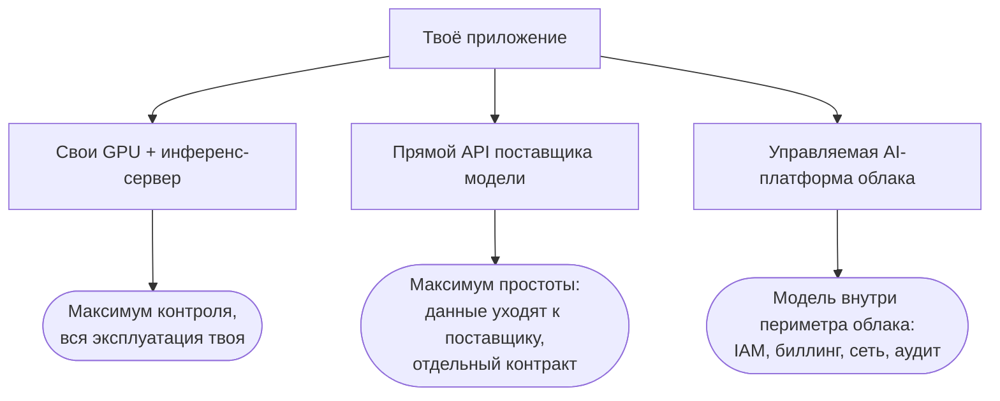

# Облачные AI-платформы — где считаются твои токены

[Урок про сервинг](./serving.md) закончился развилкой: нижний блок архитектуры — инференс-сервер
(inference server) — можно держать у себя, а можно арендовать, и тогда на его месте остаётся чужой
эндпоинт. Сегодня разбираем ветку «арендовать» всерьёз. Дело в том, что арендовать модель можно двумя
очень разными способами, и разница между ними не техническая, а организационная: кто подписывает
контракт, чьи роли доступа действуют и в какой счёт за облако ложатся расходы на токены.

Всего же способов потреблять модель три, и они выстраиваются вдоль одной оси «контроль — удобство».
Self-host: свои GPU, свой инференс-сервер, максимум контроля — и вся эксплуатационная ноша твоя. Прямой
API поставщика модели — OpenAI, Anthropic, Google: самый простой путь, но запросы уходят на серверы
поставщика, а отношения с ним — отдельный двусторонний контракт мимо твоего облачного договора. И третий
способ, герой этого урока: **управляемая (managed) AI-платформа** твоего облака — те же модели, но
выставленные как **управляемые эндпоинты (managed endpoints)** внутри облака, где уже живут твои данные и
сервисы.

:::tip[▶ Видео]

<YouTube id="XtT5i0ZeHHE" title="AI Inference: The Secret to AI's Superpowers — IBM Technology" />

Что такое инференс (единственное, что все эти платформы на самом деле продают) и почему гонять его под
нагрузкой — отдельная дисциплина.

:::

## Продукт платформы — периметр

«Погоди, — скажешь ты, — модель-то та же. Claude на Bedrock отвечает ровно так же, как Claude по прямому
API Anthropic. За что тогда платить платформе?» За периметр. Продукт здесь — не модель, а обвязка,
которую облако выстраивает вокруг неё:

- **Единая аутентификация.** Доступом к модели управляют те же IAM-роли, что и остальной
  инфраструктурой, — без второго набора API-ключей, живущего своей жизнью.
- **Единый биллинг.** Расходы на токены попадают в тот же облачный счёт, что виртуалки и базы, и на них
  распространяются корпоративные скидки по общему договору.
- **Сетевая изоляция.** Частные эндпоинты: трафик к модели вообще не выходит в публичный интернет.
- **Соответствие требованиям — в наследство.** Сертификации облака распространяются на платформу: SOC 2,
  HIPAA-eligible сервисы, инструменты для соблюдения GDPR.
- **Журналы аудита и квоты.** Ведутся по проектам и командам: видно, кто сколько сжёг, и задано, кому
  сколько можно.

Для инженера это скучный список. Для корпоративной среды — ровно то, что отличает «попробовали в
песочнице» от «подписано в прод».

## Три платформы и урок о переименованиях

Игроков три — по числу больших облаков, и у каждого своя история с именем.

**Azure OpenAI** у Microsoft начинался как отдельный сервис с моделями OpenAI, затем стал частью
платформы Azure AI Foundry, а на Ignite в ноябре 2025-го платформу переименовали в **Microsoft Foundry**.
Модели в ней доступны как Foundry Models, с внутренним делением на «Models sold by Azure» (модели, которые
продаёт сам Azure) и модели маркетплейса.

**AWS Bedrock** у Amazon — единственное из трёх имён, которое пока никто не трогал.

**Vertex AI** у Google Cloud в апреле 2026-го получил новое имя — **Gemini Enterprise Agent Platform**
(сокращённо GEAP); к маю переехала консоль, API-эндпоинты остались прежними, а документация пока честно
живёт на два дома: часть страниц под старым именем, часть под новым.

Заметь, что произошло: две платформы из трёх сменили имя примерно за год. Это нормальный темп индустрии,
и он подсказывает, как учить материал. Имена продуктов и состав пакетов тасуются постоянно; эту чехарду
переживают только категории возможностей — каталог моделей, гарантии приватности и резидентности,
управляемый RAG, платформенные ограничители (guardrails), устройство тарифов и ёмкости. Выучи категории — и
любое свежее имя само разложится по полкам, а любое название из этого урока считай снимком на дату. В
[уроке про MCP](../part-2-agents/mcp.md) мы уже договаривались держаться разделительных черт — границ
между категориями, а не имён, — потому что списки имён устаревают быстрее, чем печатается страница. Здесь
тот же приём.

## Каталоги моделей — кто чьи модели выставляет

**Каталог моделей (model catalog)** — первое, что смотрят на платформе: какие модели она вообще умеет
поднимать как управляемые эндпоинты.

У Azure отношения с OpenAI особые: GPT-семейство живёт там на правах родного сервиса самого Azure, и
долгое время именно доступ к GPT в корпоративном периметре был главной причиной идти в Azure OpenAI.
Сегодня каталог Foundry куда шире — порядка 1 900 моделей: Microsoft, OpenAI, Anthropic (добавлены на том
же Ignite 2025), Mistral, xAI, Meta, DeepSeek, Hugging Face.

Bedrock с самого начала строился как мультивендорная платформа: Anthropic (Claude), Meta (Llama), Mistral, Cohere,
собственные модели Amazon (Nova) — а с недавних пор и OpenAI. Сначала модели с открытыми весами gpt-oss в
августе 2025-го, затем, с июня 2026-го, флагманские GPT-модели в общем доступе. Тезис «моделей OpenAI на
AWS не бывает» устарел — не повторяй его на собеседовании.

У Google родная модель — Gemini, а сторонние и открытые живут в Model Garden, в том числе Claude. Имя
Model Garden, кстати, пережило переименование всей платформы.

| Платформа | Родные модели | Каталог |
|---|---|---|
| Microsoft Foundry (экс-Azure AI Foundry) | GPT-семейство OpenAI как родной сервис Azure | ~1 900 моделей: OpenAI, Anthropic, Mistral, xAI, Meta, DeepSeek, Hugging Face и др. |
| AWS Bedrock | Amazon Nova | Anthropic, Meta, Mistral, Cohere, OpenAI (gpt-oss, флагманские GPT) и др. |
| Gemini Enterprise Agent Platform (экс-Vertex AI) | Gemini | Model Garden: Claude, открытые модели и др. |

Отсюда следствие, которое пару лет назад прозвучало бы странно. Раньше выбор модели диктовал выбор
облака: нужен GPT — иди в Azure, нужен Claude — смотри на AWS. Эпоха эксклюзивных каталогов заканчивается:
Claude теперь есть на всех трёх платформах, флагманские GPT добрались до Bedrock, Anthropic — до каталога
Foundry. Связка «модель → облако» слабеет, и центр тяжести сравнения смещается в сторону обвязки: резидентность,
надстройка управляемого RAG, экономика выделенной ёмкости. К ним и переходим.

## Приватность и резидентность данных

Первый вопрос корпоративного заказчика к любой из трёх звучит одинаково: «Вы учитесь на наших данных?»
И ответ у всех трёх одинаковый: нет. Каждая платформа фиксирует в документации, что твои промпты и ответы
модели не используются для обучения фундаментальных моделей и обрабатываются внутри границы сервиса.
Мелкий шрифт при этом различается: у Google обещание действует «по умолчанию», а у Azure есть оговорка про
мониторинг злоупотреблений — содержимое, на котором сработали фильтры, может просмотреть живой человек, если этот
механизм не отключён по отдельной заявке. Честная формулировка поэтому такая: «на твоих данных не учатся
в базовой конфигурации» — а перед подписанием контракта мелкий шрифт читают целиком.

Второй вопрос — где. **Резидентность данных (data residency)** — это про то, где физически считается
инференс: ты выбираешь регион или геозону, которая обрабатывает запросы. Тонкость в том, что
доступность конкретной модели в конкретном регионе — вещь переменчивая, и новинки добираются до регионов
с запозданием. Поэтому у каждой платформы есть свой ползунок «резидентность или ёмкость», под своими
именами. У Azure это типы развёртывания: Standard regional, Data Zone, Global. У Bedrock — межрегиональный
инференс с географическими профилями: ограниченными US / EU / APAC либо глобальными. У Vertex/GEAP —
региональные эндпоинты либо глобальный: он даёт больше ёмкости — и никаких гарантий резидентности.

Зачем всё это нужно? Регуляторика. GDPR и отраслевые режимы привязывают обработку персональных и
регулируемых данных к географии; резидентность плюс обязательство не обучать плюс частная сеть — триада
соответствия, после которой юридический отдел даёт системе зелёный свет. На практике именно эта триада чаще
всего и решает спор «платформа или прямой API» в пользу платформы. Причём развилку ты уже проходил: в
[уроке про ingestion](../part-1-rag/ingestion.md) мы выбирали между self-hosted эмбеддингами и
эмбеддингами по API. Тот же выбор, теперь на уровне модели.

Третий элемент триады — **частное подключение (private networking)**: у всех трёх есть механизм, при котором
промпты не выходят в публичный интернет даже по дороге к эндпоинту. Имена опять свои: Azure Private Link,
AWS PrivateLink с VPC-эндпоинтами, у Google — Private Service Connect.

## Управляемый RAG и платформенные ограничители

Поверх голых эндпоинтов платформы продают готовые надстройки, собранные из знакомых тебе деталей.

Первая надстройка — **управляемый RAG (managed RAG)**: весь конвейер Части I — загрузка документов,
чанкинг, эмбеддинги, векторное хранилище, поиск, местами и реранкинг — упакованный в один продукт. У AWS
это классические Bedrock Knowledge Bases плюс Amazon Bedrock Managed Knowledge Base (сервис общедоступен с
июня 2026-го: полностью управляемый, с готовыми подключениями к источникам данных и стыковкой с AgentCore).
У Azure поисковой основой служит Azure AI Search, а готовая надстройка, которая опирает ответы на твои
данные, сейчас называется Foundry IQ; её предшественник On Your Data доживает последние месяцы — до октября 2026-го.
У Google — RAG Engine плюс корпоративный поиск Vertex AI Search, который прямо сейчас переезжает под
вывеску агентной платформы.

Что покупаешь и что отдаёшь? Покупаешь скорость: работающий RAG за дни, без собственной инфраструктуры.
Отдаёшь настройки, которым была посвящена половина Части I, — стратегию чанкинга, веса гибридного поиска,
выбор реранкера, точки для подключения оценки; что из этого доступно, зависит от продукта, а часть
просто зашита. Отсюда трезвое правило: управляемая надстройка — разумное умолчание для стандартного
корпуса, собственный конвейер — когда [оценка](../part-1-rag/cross-cutting/evaluation.md) показывает, что
умолчания не дотягивают. Команды, которым нужно всерьёз докручивать качество по eval-циклу, из управляемого
RAG нередко вырастают — или оставляют ему только загрузку и хранение.

Вторая надстройка — ограничители как продукт. Bedrock Guardrails — настраиваемые фильтры: вредный контент,
PII, запретные темы и проверка опоры на контекст (contextual grounding check), которая выставляет ответу
балл за опору на найденные чанки и режет по порогу. У Azure — AI Content Safety, включая Prompt Shields
для обнаружения prompt injection (внедрения инструкций в текст); в Foundry всё это идёт под шапкой
«Guardrails + controls» — да, Azure переименовал свои контент-фильтры в Guardrails, ещё одно очко в пользу
тезиса о категориях и именах. У Google — Model Armor. Всё это концепции
[урока про guardrails](../part-1-rag/cross-cutting/guardrails.md), реализованные как управляемые сервисы;
строить самому или брать готовое — развилка, к которой мы вернёмся в
[уроке про экосистему инструментов](./tooling-ecosystem.md).

## Пропускная способность и модели оплаты

Конкретные цены протухают быстрее, чем имена платформ, поэтому здесь их не будет — а вот устройство
тарифов у всех трёх общее, и оно-то как раз долговечно.

Режимов потребления везде два. On-demand (по требованию): платишь за токены, ёмкость общая, поверх неё —
квоты и лимит частоты запросов (rate limit). И зарезервированная ёмкость: **выделенная пропускная способность
(provisioned throughput)** с предсказуемой задержкой — для ровной высокой нагрузки. Имена свои: у Azure
это PTU (provisioned throughput units), у Vertex — Provisioned Throughput, у Bedrock — уровень Reserved.
В ноябре 2025-го Bedrock перекроил тарифную сетку — теперь это четвёрка Reserved / Priority / Standard /
Flex, — а старый Provisioned Throughput оставил для моделей постарше и моделей, которые заказчик дообучил
под свои задачи.

Есть и третий режим — **пакетный (batch)**: асинхронная обработка для неинтерактивных задач вроде ночной
разметки корпуса или массовой суммаризации. По документации всех трёх, цена в нём примерно вдвое
ниже on-demand — для поддерживаемых моделей (Azure Batch, batch inference в Bedrock, batch predictions у
Vertex/GEAP). Не путай его с непрерывным батчингом из [урока про сервинг](./serving.md): тот живёт в
GPU-планировщике инференс-сервера, а пакетный режим — тариф на уровне API.

И одно объединяет все тарифы: квоты считаются на регион и на модель, и прод обязан уметь жить с
ответом 429 на любой платформе. Дисциплина повторных попыток и собственных лимитов из урока про сервинг
никуда не девается, а в [уроке про LLMOps](./llmops.md) мы достроим её: добавим маршрутизацию запросов
между моделями и резервные маршруты (fallbacks).

## Как выбирают на самом деле

Скучная правда: чаще всего платформу определяет уже сделанный облачный выбор. Данные, IAM-роли и
корпоративный договор уже живут в каком-то облаке — туда и идут за моделями; бенчмарки моделей
решают этот вопрос редко. А вот что действительно различается и заслуживает честного сравнения — четыре
вещи:

1. модели: есть ли у платформы те, что тебе нужны, и доступны ли они в твоём регионе;
2. резидентность и соответствие: сходится ли триада с требованиями твоих регуляторов;
3. управляемый RAG: ложится ли он на твой корпус — или тебе в любом случае строить своё;
4. экономика выделенной ёмкости на твоей реальной нагрузке.

И последний совет. Держи слой приложения независимым от поставщика: OpenAI-совместимый клиент и
шлюз-маршрутизатор между приложением и эндпоинтами сохраняют право переехать (в
[уроке про LLMOps](./llmops.md) посмотрим на LiteLLM и шлюзы подробнее). Сильнее всего привязывают
собственные SDK платформ и управляемые надстройки: **привязка к поставщику (vendor lock-in)** живёт в
надстройках, а вот сам эндпоинт переносится легко.

## Что забрать из урока

- Потреблять модель можно тремя способами: свои GPU (контроль и вся эксплуатация), прямой API поставщика
  (просто, но данные у него и контракт отдельный), управляемая платформа облака (модель внутри твоего
  периметра).
- Продукт платформы — периметр: единые IAM и биллинг, частные эндпоинты, унаследованные сертификации,
  аудит, квоты. Модель та же самая.
- Имена тасуются (две платформы из трёх переименовались примерно за год) — учи категории: каталог
  моделей, приватность и резидентность, управляемый RAG, ограничители, устройство тарифов.
- Каталоги различаются, но эпоха эксклюзивов заканчивается: Claude на всех трёх, GPT добрался до Bedrock.
  Различия переезжают в обвязку.
- Триада соответствия — резидентность + обязательство не обучать + частное подключение; чаще всего именно
  она и решает в пользу платформы.
- Управляемый RAG — скорость в обмен на настройки: умолчание для стандартного корпуса; своё — когда оценка
  показывает, что умолчания не дотягивают.
- Тарифы: on-demand с квотами и лимитами, выделенная пропускная способность для ровной нагрузки, пакетный
  режим примерно вдвое дешевле. Закладывайся на ответ 429 на любой платформе.
- Выбирают по облачной прописке, а сравнивают четыре вещи: модели в регионе, соответствие, RAG-надстройку,
  экономику ёмкости. Слой приложения держи переносимым — привязка живёт в надстройках.

**Новые термины** → [Глоссарий](../glossary.md): managed endpoint, model catalog, data residency,
provisioned throughput, batch mode, managed RAG, vendor lock-in.

---

:::note[Дальше — углубление слоя]

🚧 Второй проход: дообучение (fine-tuning) моделей на платформах, агентные платформы (Bedrock AgentCore,
Foundry Agent Service, Vertex Agent Engine), моделирование стоимости и FinOps для LLM-нагрузок,
мультиоблачные шлюзы и суверенные облака.

:::
