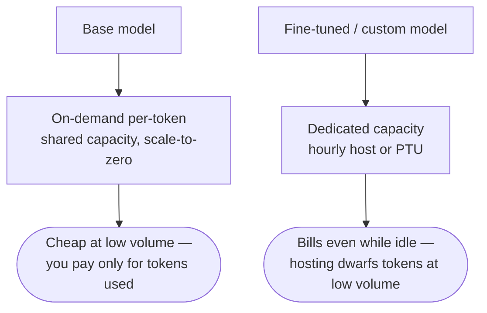
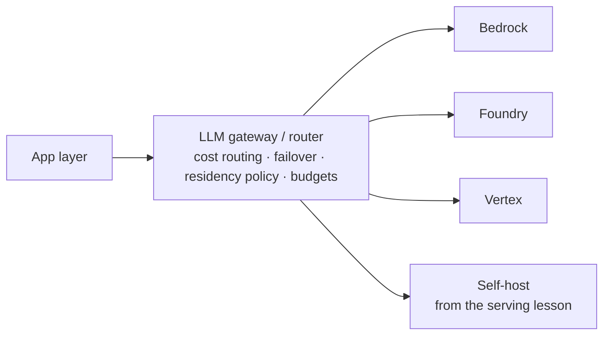

# The bill, the agent runtime, and who is allowed to read your prompts

[Part 1](./index.md) laid the ground: the three ways to consume a model, the perimeter a platform actually sells, the big three and the rule that their names are only snapshots, the model catalogues, the privacy-and-residency triad, managed RAG and platform guardrails, the three pricing models — on-demand, provisioned, batch — and how the choice really gets made. This is the deep second pass, the mastery layer over the same platforms. It answers five questions Part 1 left open: what you customise when prompting and RAG aren't enough, what runs the agent once you've built it, what the whole thing costs and how to model that, how to stay portable across clouds, and who is legally allowed to touch any of it. Part 1 is assumed throughout and none of it is re-taught here. Everything below is a snapshot as of mid-2026 (July 2026); as in Part 1, the product names are dated and the durable thing is the category under them.

## What a custom model costs to serve

Every hyperscaler offers the same **customisation ladder**, and it climbs in one direction — cheaper and looser to more expensive and tighter. Prompt engineering and RAG sit at the bottom, then parameter-efficient tuning (LoRA and other PEFT methods), then full supervised fine-tuning (SFT), then preference and reinforcement methods (DPO, reinforcement fine-tuning), then distillation, and at the top continued pre-training. The rung names and the list of eligible base models churn quarterly, so treat the specifics as a snapshot and hold onto the ladder.

As of mid-2026 the three platforms populate it like this:

- **[AWS Bedrock](https://aws.amazon.com/bedrock/)** — SFT, reinforcement fine-tuning (a reward function you supply as a Lambda), Model Distillation (a teacher model labels data for a smaller student; it opened in preview at re:Invent 2024 and is now GA), and continued pre-training on unlabelled data. Training is billed per token times epochs, plus a monthly storage fee for the custom model.
- **[Azure OpenAI](https://azure.microsoft.com/en-us/products/ai-services/openai-service) / Microsoft Foundry** — SFT, DPO (Direct Preference Optimization), and reinforcement fine-tuning with model graders. You can stack them, SFT then DPO. An RFT job is capped at $5,000: it pauses at the cap and emits a deployable checkpoint rather than billing on unbounded.
- **[Vertex AI](https://cloud.google.com/vertex-ai)** (now folded into the Gemini Enterprise Agent Platform) — supervised tuning for Gemini, LoRA-based parameter-efficient tuning where `adapter_size` sets the LoRA rank, and distillation tuning.

The spine of this section is the part the tuning tutorials tend to skip: a custom model almost always needs a dedicated serving path, and dedicated capacity is not cheap tokens. Azure makes the trap the most legible. A fine-tuned deployment there bills per token *plus* an hourly hosting fee — around $1.70 an hour on Standard or Global Standard — or against PTU-hours on Regional Provisioned Throughput, or on a Developer tier that carries no hourly fee but auto-deletes the deployment after 24 hours with no SLA or residency guarantee, which makes it an evaluation-and-proof-of-concept option only. Microsoft's own worked example does the arithmetic: 20M input and 40M output tokens a month comes to $1,422, of which $1,224 — that is 1.70 × 24 × 30 — is pure hosting. At low volume the hosting fee dwarfs the token cost. A fine-tuned endpoint left running on light traffic is a zombie that bills around the clock for capacity it barely uses.

Bedrock long carried the same shape from the other direction: custom models *required* Provisioned Throughput to serve at all. That has softened. As of 2026 there is an on-demand deployment path for custom models — but only for a short list of base models (Amazon Nova Lite, Nova 2 Lite, Nova Micro and Nova Pro, plus Meta Llama 3.3 70B), only when customised on or after 16 July 2025, and only in us-east-1 and us-west-2. Everything outside that window still needs Provisioned Throughput, so the gotcha holds with a narrowing exception rather than vanishing. Vertex sits in the same place directionally: tuned models and their LoRA adapters are hosted on the managed endpoints, and production-grade custom serving leans on provisioned capacity. The exact billing sentence moves around; the dedicated-capacity cost does not.

All of which decides *when* the ladder is worth climbing. The order is prompt first, then RAG, and fine-tuning only when neither is enough — and when you do reach for it, fine-tune for form, not for facts. Style and tone, a rigid output schema, refusal and formatting behaviour, or a smaller specialised model that is cheaper and faster at scale are all good reasons. Injecting knowledge that changes is not; that is RAG's job, and baking a moving fact into weights only guarantees it goes stale. This is the same self-hosted-versus-API fork [ingestion](../../part-1-rag/ingestion/index.md) drew for embedding models, and the same managed-versus-own call Part 1 made for RAG, now at the level of the model itself.

## The runtimes that host the agent loop

Part 1's platforms serve models. A **managed agent runtime** serves something one layer up: it hosts the agent loop for you and wraps it in session and memory persistence, a tool and identity and gateway layer, observability, and scale-to-zero. Those are precisely the deltas over running your own agent in a container the way the [serving](../serving/index.md) lesson described. As with the platforms, the product names are a snapshot; the category is the thing to learn.

- **Bedrock AgentCore** — GA on 13 October 2025, a managed serverless runtime built from named components. Runtime gives execution windows up to eight hours with per-session isolation in a dedicated microVM and support for the A2A protocol; Memory handles managed extraction and consolidation; Gateway turns APIs, Lambdas and MCP servers into agent tools behind IAM and OAuth; Identity provides identity-aware authorisation and a token vault; Observability lands in CloudWatch over OpenTelemetry. There are also sandboxed browser and code-execution tools under the AgentCore umbrella.
- **Microsoft Foundry Agent Service** — GA'd in 2025 (at Build, in May). A fully managed, session-isolated runtime with built-in identity and observability, production SDKs, more than 1,400 data-source connectors, bring-your-own-framework support, and one-command deploy.
- **Vertex AI Agent Engine** — GA'd in 2024, now sitting under the Gemini Enterprise Agent Platform. A managed runtime that deploys and autoscales agents built with ADK or another framework, with managed Sessions and a Memory Bank for long-term memory; `adk deploy` ships an agent in a single command.

Line them up and the durable teaching point is the delta, not the feature list. Against hand-rolling the loop in a container you get six things out of the box: the loop hosted with long-running execution windows, session plus short- and long-term memory, a tool gateway that adapts an MCP server or an API into a callable tool alongside an identity layer for act-on-behalf-of and token vaults, built-in OpenTelemetry, session isolation for multi-tenant safety, and scale-to-zero economics. What you pay for it is platform lock-in and less control over the loop — the same make-or-buy tension the guardrails and managed-RAG decisions posed in Part 1, and the one the [tooling ecosystem](../tooling-ecosystem.md) lesson takes head-on.

## Modelling the bill

LLM spend has the same levers on every cloud, and **FinOps** is the discipline of driving them to a number you can defend: the **unit economics** of the feature — cost per request, per active user, per feature shipped. The exact discounts and dollar figures below are a snapshot; re-quote the live pricing page for any hard number. The levers themselves are stable.

Start with the shape of the invoice. Output tokens cost several times more than input — commonly three to five times, and two to ten across the model range — because output is generated one token at a time in the decode phase while input is consumed in a single parallel prefill. The prefill-versus-decode split the serving lesson taught inside the GPU now shows up on the bill: a chatty, long-answer workload costs far more per turn than its input length suggests.

**Committed capacity** is one idea wearing three names. It buys dedicated throughput at an hourly rate you pay regardless of how much you use, in exchange for a lower effective per-token price at sustained load. Azure sells it as PTU (provisioned throughput units), discountable further with monthly or annual reservations; Vertex as Provisioned Throughput across Standard, a roughly 1.8× Priority tier, and a roughly 0.5× Flex-Batch tier; Bedrock as Provisioned Throughput and Reserved terms of no commitment, one month, or six. The economics come down to a break-even utilisation threshold. Below it, on-demand wins, because you are not paying for idle reserved capacity; above a sustained high load it flips, and committed capacity is cheaper. Secondary estimates put Azure's break-even somewhere around $10–12K a month of steady spend, with 30–45% savings past it — useful as the shape of a threshold, not as a number to quote.

Batch is the cheapest tier the platform will sell you. All three run a discounted asynchronous mode at roughly half the on-demand price — Bedrock batch inference, the Azure Batch API (50% off Global Standard with a 24-hour turnaround), and the Gemini Batch API (50%). It is worth repeating Part 1's warning because the word collides: this batch is an API pricing tier, not the continuous batching from the [serving](../serving/index.md) lesson, which is a GPU scheduler doing something entirely different.

Then there is the lever that most often moves the bill more than any pricing tier: caching. Reusing a stable prompt prefix — a shared system prompt, a long RAG preamble, a fixed set of few-shot examples — is billed far below fresh input. **Prompt caching** on Bedrock reads cached tokens at roughly 90% below the input price, though writes carry about a 25% premium (around double for the one-hour TTL). Azure and OpenAI discount cached input by 50–90%, and, importantly, cached tokens do not consume PTU capacity, which frees provisioned headroom for real work. Gemini's context caching charges cached input at about 10% of standard input — again around 90% off — plus a small per-token-per-hour storage fee. Where a large prefix is shared across many requests, caching is frequently the single biggest saving available, and it costs one configuration change to turn on.

Geography carries a cost axis too. Data egress between regions or clouds is billed, cross-region inference routing trades a residency guarantee for capacity and price, and pinning data in-region for residency can forfeit access to cheaper cross-region or global capacity. The residency-versus-capacity dial from Part 1 is not only a compliance control; every notch on it has a price.

Discipline is what turns these levers into a managed number. Attribute token spend by tagging it to model, prompt, team and product, and hold each feature to a cost-per-request or cost-per-user target the way you hold it to a latency target. The stakes are not marginal: the FinOps Foundation reports a 30× to 200× cost variance between an unoptimised and an optimised AI deployment. This section is the platform-cost view of that work; the org-level side — spend governance, budgets, and cross-model routing that sends cheap traffic to a cheap model — lives in the [LLMOps](../llmops.md) lesson.

The overspend, when it comes, is usually one of three failures. A runaway agent loop re-sends a growing context every turn, so token spend compounds — the non-termination and step-budget problem from Part II, now denominated in dollars. RAG context creep quietly inflates every input by stuffing in more retrieved passages than the answer needs. And the most common of all is the cheapest to fix: leaving the free levers, batch and caching, switched off.

## Staying portable — the multi-cloud gateway

Part 1 closed on a hedge: keep the application layer provider-agnostic. The concrete form of that hedge is a **multi-cloud gateway** — a unified router in front of many providers and clouds that speaks one wire standard, the OpenAI-compatible API the serving lesson already named, so your application talks to one interface while the gateway fans out behind it. You get lock-in avoidance, cross-cloud failover, cost-based routing, and a central place for rate limits, quotas, budgets and observability. Which specific gateway leads is a snapshot; the pattern is not.

[LiteLLM](https://www.litellm.ai) is the reference open-source tool: one OpenAI-format interface to more than a hundred providers — Bedrock, Azure, Vertex, Anthropic and the rest — run as a self-hosted proxy or an SDK, with ordered fallback chains, retries, budget-based routing, per-key and per-tenant cost tracking, and virtual keys. Portkey and OpenRouter are peers in the same space. LiteLLM is developed in depth in the [LLMOps](../llmops.md) lesson, so it is named here and left there.

The clouds have started shipping their own gateways. The clearest example is Azure API Management's AI Gateway, which added a Unified Model API (public preview, 2026): clients speak a single format — OpenAI Chat Completions — while APIM transforms the call out to Anthropic, Google Vertex AI, Amazon Bedrock and others, and layers on token metrics, load-balancing across PTU endpoints, and content safety on MCP and A2A traffic. Google's analogue is Apigee positioned as an LLM gateway, and AWS aims AgentCore Gateway at tools rather than cross-provider model routing. Azure's cross-provider case is the concrete one today; treat the others as moving in the same direction rather than as settled parity.

A gateway is not free, and there is a real case for not building one. It pins you to a lowest-common-denominator feature set, so a provider's native prompt caching or its particular tool-call format can fall away behind the uniform interface. It adds a latency hop. It becomes a single point of failure that now needs its own high availability. And it hides the fact that the same prompt can behave differently across providers, which a uniform API papers over precisely where you most want to see it. When a single cloud and a thin provider-agnostic client already meet your needs, a full gateway is over-engineering. Where it does earn its place, note the bonus: the same router that picks the cheapest endpoint can enforce residency, keeping traffic in-region or pinning it to a sovereign endpoint by policy — which is the bridge to the last section.

## Who is allowed to touch it

**Digital sovereignty** asks a harder question than residency. Where residency (from Part 1) tells you *where* your data sits, sovereignty is about *who controls it* — who can access, operate and legally compel your data and workloads, and under whose jurisdiction. The distinction is the whole point: residency is a location, sovereignty is a chain of control, and the two come apart under a specific threat model — extraterritorial compulsion. The US CLOUD Act, for instance, can reach data held by a US-owned provider even when it physically sits in an EU region. Sovereignty is what closes that gap, delivered through EU- or nationally-operated regions, partner "trusted clouds", and fully air-gapped deployments. The entities and dates here move faster than anything else on the page.

- **AWS European Sovereign Cloud** — GA on 15 January 2026, first region in Brandenburg, Germany. It is a separate, independent EU cloud operated through European legal entities under German law, with EU-resident managing directors, an all-EU-citizen advisory board, and a stated goal of operation exclusively by EU citizens inside the EU, behind a €7.8B-plus investment and expanding towards Belgium, the Netherlands and Portugal. The public target had been end of 2025 and slipped to mid-January — a small dated detail that is itself a reminder of how young this market is.
- **Microsoft Sovereign Cloud** — announced 16 June 2025, in three shapes: a Sovereign Public Cloud, a Sovereign Private Cloud on Azure Local, and National Partner Clouds. The partners are named and worth knowing apart: Bleu in France, a Capgemini-and-Orange joint venture targeting SecNumCloud qualification, and Delos Cloud in Germany, an SAP subsidiary aligned to the BSI's C5 criteria for public administration.
- **Google** — connected and air-gapped modes through Google Distributed Cloud (GDC), where the air-gapped variant runs fully offline for regulated and defence workloads. Its partner clouds include S3NS / PREMI3NS in France, a Thales-majority venture with Google on separate partner-operated infrastructure and SecNumCloud-qualified; a newer Thales-fully-owned German entity partnering with Google, announced 20 May 2026 with GA targeted for end of 2026; and, separately, an older T-Systems-and-Google German "Sovereign Cloud" partnership from 2021 — don't conflate the two German offerings. Gemini has been available on GDC air-gapped since its 2025 GA.

The part that matters most for this handbook is the AI angle, and it cuts against the instinct that sovereignty is a solved networking problem. Frontier models lag, or are simply absent, in sovereign and **air-gapped** environments; inference and tuning there run on whatever is in-jurisdiction, which is often an older or open-weight model. And AI residency is not the same as data residency: even with in-region GPUs, prompts, telemetry and outputs can still travel, so sovereignty has to cover where the *model* runs, not only where the data rests. Mistral AI is a common EU-resident, self-hostable option in regulated and government deployments for exactly this reason — [Mistral AI](https://mistral.ai) as the model you can keep inside the perimeter. This is the residency-versus-capacity dial of Part 1 pushed to its strictest end, where the price of sovereignty is measured in model capability.

One caution on how to read the market. The exact roster of frontier models on air-gapped GDC, any claim that a model is approved for US Secret or Top Secret work, and which specific Claude or GPT versions are live in a named sovereign region all change fast and are easy to get wrong. Learn the pattern — frontier capability lags sovereignty — and treat any per-model, per-region matrix as a snapshot to verify live, never as a fact to assert.

:::tip[▶ Video]

<YouTube id="Chq1LI-3d0A" title="What is Sovereign Cloud? — IBM Technology" />

A clean conceptual take on what sovereign cloud actually means — the access-and-jurisdiction perimeter this whole section turns on, separated from the residency question it is so often confused with.

:::

## What to take away

- Climb the customisation ladder in order — prompt, then RAG, then fine-tune — and tune style and schema rather than facts that change. The hidden cost is serving: a custom model usually needs dedicated capacity that bills by the hour, and at low volume the hosting fee dwarfs the tokens, as Azure's own $1,422 example (with $1,224 pure hosting) shows.
- A managed agent runtime hosts the loop and hands you session and memory persistence, a tool-and-identity gateway, observability, session isolation and scale-to-zero out of the box — Bedrock AgentCore, Foundry Agent Service, Vertex Agent Engine — in exchange for lock-in and less control over the loop.
- LLM spend has the same levers everywhere: output costs several times input, committed capacity beats on-demand only past a break-even load, batch is roughly half price, and geography carries an egress cost. FinOps is driving all of it to a unit-economics number you tag and defend.
- Caching is usually the biggest single lever — cache reads run around 90% below input on Bedrock and Gemini, and on Azure cached tokens don't even consume PTU capacity. Leaving caching and batch switched off is the most common overspend.
- A multi-cloud gateway keeps you portable behind one OpenAI-compatible wire, with cost routing, failover and residency policy in one place — at the price of a lowest-common-denominator feature set, a latency hop, and a component that now needs its own HA. Don't build one when a single cloud and a thin client already suffice.
- Residency is where your data sits; sovereignty is who controls it and under whose law — the gap the CLOUD Act opens and sovereign regions, partner clouds and air-gapped deployments close. The AI catch: frontier models lag sovereign environments, so the strictest residency is paid for in model capability.
- Part 1 chose a platform; Part 2 is the mastery layer over it — what you tune, what runs your agents, what it costs and how to model that, how to stay portable, and who is allowed to touch it.

**New terms** → [Glossary](../../glossary.md): fine-tuning, LoRA / PEFT, DPO, reinforcement fine-tuning (RFT), model distillation, continued pre-training, managed agent runtime, FinOps, cost modelling, unit economics, committed-use discount, prompt/context caching, cross-region egress, multi-cloud gateway, digital sovereignty, sovereign cloud, air-gapped.
