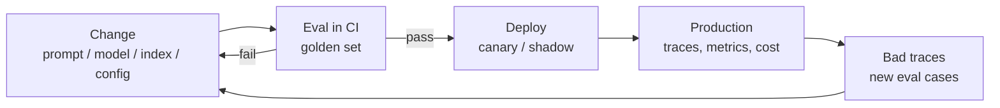
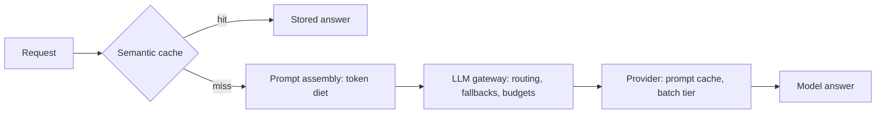

# The LLM system's life after release

[Serving](./serving/index.md) wrapped the pipeline in a service. [Cloud platforms](./cloud-platforms/index.md) decided
where the model runs. [The tooling ecosystem](./tooling-ecosystem/index.md) gave you eval, guardrails, and
observability as products. One question remains, and it's the one that fills the rest of the system's
life: what does it mean to *operate* this thing — to change it safely, watch it, and pay for it, week
after week?

**LLMOps** is the industry's name for that discipline: MLOps specialised for LLM applications. In IBM's
framing — and most definitions follow it — the scope covers the full lifecycle, fine-tuning included. This
handbook cuts a sharper angle, because as an application builder you rarely train anything: what you
compose and operate are prompts, model versions, retrieval indexes, and configs. Take that as our lens
rather than the industry definition — it's the slice of LLMOps a RAG-and-agents team lives in daily.

:::tip[▶ Video]

<YouTube id="cvPEiPt7HXo" title="Large Language Model Operations (LLMOps) Explained — IBM Technology" />

The discipline in one pass — what LLMOps inherits from MLOps and what it changes.

:::

## The AI delta — artefact and test

Behind that lens sits the delta that drives this whole lesson. In classic DevOps the deployable artefact
is code: ship the same build, get the same behaviour. In an LLM application, behaviour is defined by five
artefacts at once:

- the prompts — the system prompt and every template on the request path;
- the model — its identity and exact version;
- the index snapshot — what's ingested, with which chunking and embedding config;
- the pipeline config — top-K, the reranker, thresholds;
- the guardrail policies.

A change to any one of them is a deploy. And any one of them can regress quality with zero code diff.

Testing changed along with the artefact. Outputs are nondeterministic and quality comes in degrees, whereas
a unit test wants a clean pass or fail — so the regression instrument is
[eval](../part-1-rag/cross-cutting/evaluation/index.md), not unit tests alone. Everything below is that one
sentence, unpacked into a working operation.

## Deploy — CI/CD when the artefact isn't just code

The whole discipline compresses into one loop. It's the spine of this lesson — and, as you'll see by the
end, the closing image of the handbook:

The gate at the front is **eval in CI**. Every change to a prompt, model, index, or config runs the golden
set; if the metrics fall below threshold, the merge is blocked. This is Part I's regression eval promoted
to a pipeline stage — the same [promptfoo](https://www.promptfoo.dev) / [DeepEval](https://deepeval.com) / [Ragas](https://ragas.io) stack you met in
[the tooling ecosystem](./tooling-ecosystem/index.md), now wired into CI with a red-green verdict. A prompt tweak
that quietly drops faithfulness by ten points gets caught the same way a broken build does.

### Prompts are code — and config

Prompts live a double life. They are code: keep them in version control, where a prompt change arrives as
a reviewable diff and rolls back like any other commit. And they are config: when product teams iterate on
wording daily, a **prompt registry** — the prompt management in [LangSmith](https://www.langchain.com/langsmith) or [Langfuse](https://langfuse.com) — lets them ship
prompt versions without a code deploy. Either home is fine. The invariant is attribution: every production
answer must trace back to an exact prompt version, which is why the trace records it.

### Pin the model

Providers version their models and retire them. OpenAI distinguishes deprecation from shutdown, publishes
replacement mappings, and issues timestamped snapshots — often with the date in the id, like
`gpt-4o-2024-05-13`, though the id shape varies by provider. Anthropic runs an explicit lifecycle —
Active, Legacy, Deprecated, Retired — with at least 60 days' notice before retirement.

So production pins exact versions. An unpinned alias is a deploy you didn't schedule: the provider moves
what the alias points to, and your system's behaviour shifts with no diff anywhere on your side. **Model
pinning** turns that surprise back into a decision — when you move to a new version, you treat it as the
deploy it is: re-run eval, then roll out gradually.

### Roll out gradually

The rollout patterns come straight from release engineering, with one twist. A **canary release** sends a
small share of live traffic to the new prompt or model and watches the metrics. A **shadow deployment**
runs the new variant on mirrored traffic without showing its answers to anyone — a safe quality comparison
on real queries. An **A/B test** is Part I's online eval: two variants, user-facing, compared on outcomes.
The twist is what you watch: not just errors and latency, but quality proxies and cost. A canary that
answers fast, cheap, and slightly wrong is a failing canary — and only quality metrics will say so.

### The corpus is a release too

The index is behaviour. Re-ingest with a new chunking config and retrieval shifts across the entire corpus;
switch the embedding model and you owe a full re-index — Part I's
[ingestion](../part-1-rag/ingestion/index.md) rule. So put corpus updates through the same gate as everything
else: a versioned release that passes eval, rather than a background job that runs overnight and quietly
reshapes what the system knows.

## Monitoring in production

Monitoring is [observability](../part-1-rag/cross-cutting/observability/index.md) running continuously, plus
alerting on movement. The classic panel carries over: latency percentiles (p50/p95), error and timeout
rates, token cost per request. The LLM-specific panel holds quality proxies — indirect signals that
quality moved: refusal rate, guardrail-trigger rate, the rate of user feedback, and — common practice by
now — an online LLM-as-a-judge scoring a *sample* of production traffic. A sample, because the judge
burns tokens too; you bound its cost like any other spend.

### Drift — three flavours

A frozen configuration doesn't mean frozen behaviour, because the world underneath it moves. **Input
drift** is the established term: users start asking new kinds of questions, and the golden set no longer
represents traffic — eval stays green on queries nobody sends anymore. **Corpus drift** is this handbook's
extension of the same idea (the phenomenon is real; the pairing is our coinage): documents age, and
answers begin citing facts that were true at ingestion time. And **upstream model drift**: the provider
updates a model behind an unpinned alias, and behaviour shifts with zero change on your side. Keep the
"upstream" qualifier — in classic MLOps, "model drift" means your own model's performance degrading, a
different sense. Detection is shared across all three: watch the topic and intent distribution of incoming
traffic, and re-run eval on fresh samples rather than only on the ageing golden set.

### The incident loop, now a runbook

The through-line this handbook has drawn since Part I closes here, at production scale. A bad production
trace comes in → you decompose it — retrieval failure or generation failure, Part I's decomposition → the
query becomes a new golden-set case → you fix → eval confirms → you deploy. "Observability feeds eval" was
a principle back in Part I; in production it's a runbook — a fixed sequence a teammate can execute on a
Tuesday afternoon. The platforms from [the tooling ecosystem](./tooling-ecosystem/index.md) shorten the middle
step to one click: promote a trace to an eval case.

## Cost and latency — the levers

:::tip[▶ Video]

<YouTube id="7gMg98Hf3uM" title="What Makes Large Language Models Expensive? — IBM Technology" />

Where the money actually goes — the token-and-compute cost anatomy behind every lever in this section.

:::

In a classic service, cost is mostly infrastructure — an ops concern, rarely *the* ops concern. Here every
request burns metered tokens, and spend scales along two axes at once: with usage and with prompt length.
The second axis is the treacherous one because it moves silently: a longer system prompt, two extra
retrieved chunks, an agent loop that grew chattier — each multiplies the per-request bill without a single
alert firing, unless you made cost per request a first-class metric. Treat it as eval-grade: the number
you actually optimise is quality per dollar.

### Route between models

Not every request deserves the flagship model. Classification, simple lookups, short factual questions —
a cheap, fast model handles them; the expensive one earns its price on hard generation. **Model routing**
sends each request to the cheapest model that can handle it, and the router can be a rule, a trained
classifier, or a model itself. Mind the terminology: this is routing *between models* — the third routing
sense in this book. Part I's query router picked an index, Part II's agent picked a tool; this one picks
who answers.

### Fallbacks and the gateway

Provider outages and 429s aren't incidents; they're weather. Production keeps a **fallback** chain — the
same model in another region, another provider, a cheaper model in degraded mode — tried in order when
the primary errors or rate-limits. The natural home for all of this is an **LLM gateway**: one
OpenAI-compatible interface in front of every model you use, centralising routing, fallbacks, API keys,
budgets, and per-team rate limits. [LiteLLM](https://www.litellm.ai) is the open-source example; [OpenRouter](https://openrouter.ai), the hosted one.

### Caching — twice

The first cache is the provider's. **Prompt caching** stores the repeated *prefix* of your prompt — the
system prompt, few-shot examples, static context — so it isn't reprocessed on every call. Both major
providers now bill cached input tokens at flat rates on the order of one tenth of the base input price
(the exact multipliers live on their pricing pages). The honest clause: cache *writes* cost more than
base input — Anthropic charges 1.25x or 2x depending on cache lifetime, OpenAI 1.25x on its newest
models — so caching a prefix that's never re-read is a net loss. The design consequence: build prompts
cache-first, static prefix then variable suffix, since anything dynamic ends the reusable prefix right
where it appears.

The second cache is yours. Response caching returns a stored answer for a repeated question — exact-match,
or **semantic caching**, which matches near-duplicate questions by embedding similarity. Semantic caching
trades correctness risk for cost: a false hit on a subtly different question hands the user someone else's
answer.

### The token diet

The cheapest token is the one you never send. Retrieve fewer chunks — Part I's context packing: the best
ones rather than all of them. Tighten the system prompt. Cap output length. Summarise agent scratchpads
instead of letting them grow with every step
([planning and loops](../part-2-agents/planning-loops/index.md)). The diet has latency siblings: streaming for
perceived latency (the [serving](./serving/index.md) lesson), smaller and faster models where routing allows,
and parallelising pipeline stages that don't depend on each other.

### The batch tier

Work that can wait shouldn't pay the interactive price. Nightly corpus enrichment, backfills, synthetic
data generation for eval — the batch tier from the [cloud platforms](./cloud-platforms/index.md) lesson runs
them at roughly half price, in exchange for an hours-scale SLA. As levers go it's the simplest one here:
classify the workload as offline and collect the discount.

### Budgets close the loop

The mature practice — common, though not a standard — is per-team and per-feature token budgets with
alerts, enforced where all traffic already flows: at the gateway. And cost review joins the deploy
checklist, because the lesson's opening delta cuts both ways — a prompt change is a cost change. The loop
you saw at the top of this page runs on quality *and* on dollars.

Here is the section's lever map, laid over the request path:

---

That closes Part III, and with it the handbook's base course. Part III's own arc was short and practical:
we wrapped the pipeline as a [service](./serving/index.md), chose
[where the model runs](./cloud-platforms/index.md), assembled the [tooling](./tooling-ecosystem/index.md) around the
loop, and — in this lesson — learned to operate what we built. The longer arc is the book's. Part I built
the pipeline: chunks, embeddings, retrieval, generation, and the cross-cutting disciplines that make it
measurable and safe. Part II gave it agency: the loop, the tools, the plans, the teammates, the protocols.
Part III shipped it. What began as "split the documents and search them" leaves as a running service with
an eval gate in front of every change and a loop that turns its own failures into test cases. That loop
never finishes — which is the point. A production LLM system isn't done; it's operated.

## What to take away

- The deployable artefact is **prompt + model version + index + config + guardrail policies**, not just
  code. A change to any of them is a deploy, and any of them can regress quality with zero code diff.
- **Eval in CI** is the regression gate: every change runs the golden set; metrics below threshold block
  the merge.
- **Pin exact model versions.** Providers deprecate and retire models; an unpinned alias changes behaviour
  under you. A provider model update is a deploy: re-run eval, roll out gradually.
- Roll out with **canary / shadow / A/B** — and watch quality proxies plus cost, not only errors and
  latency.
- Monitoring adds a quality panel: refusal rate, guardrail triggers, user feedback, a judge-scored sample
  of traffic — and watches **drift**: input, corpus, and upstream model.
- The incident loop is a runbook: bad trace → retrieval-vs-generation decomposition → new golden-set
  case → fix → eval confirms → deploy.
- Cost levers: **model routing**, **fallbacks** behind an **LLM gateway**, **prompt caching** (static
  prefix first) plus a **semantic cache**, the token diet, and the **batch tier** for offline work.
- Budgets live at the gateway, and cost review belongs in the deploy checklist: a prompt change is a cost
  change.

**New terms** → [Glossary](../glossary.md): LLMOps, canary release, shadow deployment, prompt registry, model pinning, model routing, fallback, LLM gateway, prompt caching, semantic caching, drift.

---

:::note[Next — going deeper]

🚧 Second pass: fine-tuning ops (when to tune the model instead of the prompt), FinOps models for LLM spend, automatic regression triage, SLOs and error budgets for quality, and queue infrastructure for batch workloads.

:::
