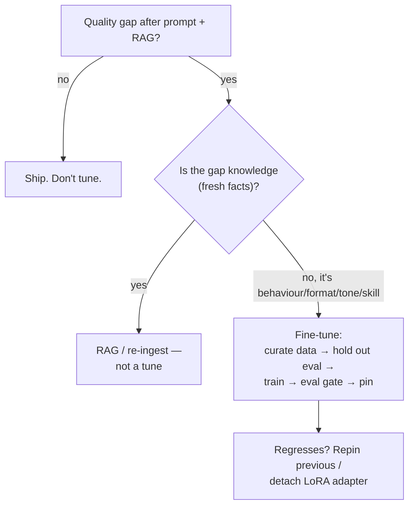
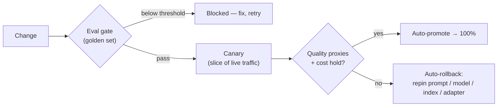
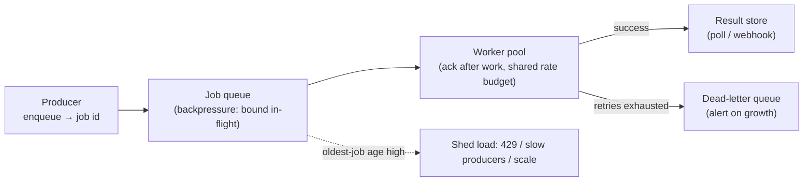

# Operating the system at organisational scale — fine-tuning, spend, and the work that can wait

[Part 1](./index.md) drew the operating loop: the deployable artefact is a prompt plus a model plus an index plus a config plus guardrails, eval-in-CI is the gate every change passes, monitoring watches for drift, and cost has its own set of levers. It named the release patterns — canary, shadow, A/B — and the machinery around them: model routing, the LLM gateway, prompt and semantic caching, the token diet, and the batch tier. This is the deep second pass. Part 1 is assumed throughout and none of it is re-taught here; what follows is the mastery layer over the same operation, seen from the level of an organisation running it rather than a single engineer changing one prompt.

Three of this page's topics overlap deep-dives that already own their theory, so this page cross-links them rather than re-deriving them. The SRE reliability mechanics — how you pick SLIs, set an SLO over a window, compute the error budget as the distance to 100%, alert on burn rate, insist that at least one SLI measures quality, and enforce per-request soft and hard caps at runtime — live in the [observability deep dive](../../part-1-rag/cross-cutting/observability/deep-dive.md). So does the other half of a regression: *detecting* a statistically real quality drop and *attributing* it across trace spans to the stage that caused it, then graduating the failing traces into the golden set. And the per-platform pricing mechanics — committed-use tiers, prompt-cache multipliers, the shape of the batch discount, cross-region egress — live in the [cloud-platforms deep dive](../cloud-platforms/deep-dive.md). What this page owns end to end is the rest: fine-tuning ops, org-level spend governance, the release-gate and rollback view of a caught regression, error budgets as a written organisational process, and the queue infrastructure that carries batch workloads.

## When to change the weights

:::tip[▶ Video]

<YouTube id="zYGDpG-pTho" title="RAG vs Fine-Tuning vs Prompt Engineering: Optimizing AI Models — IBM Technology" />

The three-way decision this section formalises, walked through in a single pass — worth watching before you reach for a tune.

:::

Fine-tuning changes the model's weights. Prompting and RAG change what you put in front of unchanged weights, and that difference sets the order in which you reach for them: prompt first, RAG next, fine-tune last. The first two are cheaper, they are reversible in a single commit, and neither leaves you owning a model artefact you now have to maintain. So a tune is the last resort, reached only when prompt and RAG have hit a ceiling *and* the gap is one that tuning actually closes — a behaviour, format, or style the model won't hold reliably; a domain's tone or idiom; a latency or cost target a small tuned model can meet where a large general one can't; or a skill no prompt seems to elicit. What tuning is *not* for is knowledge freshness. A tuned model's facts are frozen at training time and go stale exactly the way an un-refreshed corpus does; keeping knowledge current is the retriever's job, and no amount of tuning substitutes for re-ingestion.

The methods form a family, and it helps to hold them from lightest to heaviest:

- **SFT** — supervised fine-tuning, trained on labelled input→output pairs. The default, and the one most teams mean when they say "fine-tune."
- **DPO** — direct preference optimisation, which learns from pairs of a preferred and a rejected answer. It aligns tone and format without standing up a separate reward model.
- **RFT** — reinforcement fine-tuning, where the reward signal comes from a **grader** you define. For each prompt the platform samples several candidate answers, the grader scores them, and a policy-gradient update follows — sample, grade, update — repeated until the model optimises for your grader. It suits verifiable-answer tasks, the ones where a grader can actually score correctness. As of mid-2026 (July 2026), OpenAI offers RFT on its o4-mini reasoning model and SFT on small models such as GPT-4.1 nano; Amazon Bedrock extended RFT to open-weight models — OpenAI's GPT-OSS, Qwen — through OpenAI-compatible fine-tuning APIs (February 2026). Those product and model names are a dated snapshot; re-check the provider's docs before you rely on any of them.
- **LoRA / PEFT** — low-rank adaptation, one of the parameter-efficient fine-tuning methods. Instead of updating every parameter, it trains a small **LoRA adapter** over frozen base weights: cheap to train, cheap to store, and — the operational win — swappable and stackable without ever touching the base model.

The cloud-platforms deep-dive already names these methods from the platform side and works out what a custom model costs to serve; that arithmetic isn't repeated here.

Whichever method you pick, the result is another deployable artefact on the same loop as a prompt or an index, and it lives the same lifecycle. That lifecycle starts with the data, because the quality of a tune is the quality of its dataset: deduplicated, representative, correctly labelled. You hold out an eval set the training never sees, you train, and then the tuned model runs through the very same eval gate as any other deploy — Part 1's eval-in-CI — before it serves a single user. It can regress like anything else. A tune can overfit, scoring beautifully on its training distribution and worse everywhere else, or it can forget, losing a general ability it used to have. Only the golden set catches either.

Rollback follows from the tune being a pinned artefact — Part 1's model pinning applies to *your* tuned versions just as it does to a provider's. You keep the previous version serving-ready, and if the new tune regresses you re-pin to it; it is the same discipline as reverting a prompt, one indirection higher up. LoRA makes the fallback almost free: detach the adapter and you are back on the base model instantly, with no redeployment of weights. The mistake to avoid is shipping a tune with no pinned predecessor to fall back to.

Most RAG-and-agent teams never need any of this, and that is the honest headline. A tune is a permanent obligation: you retrain when the base model is retired under Part 1's provider lifecycle, you retrain when the domain drifts, you own the eval data forever, and you deepen provider lock-in, because a tuned model doesn't port across vendors. If prompt and RAG clear the bar, that is the answer. Tune when the behaviour gap is real and stable — never to inject knowledge a retriever could serve fresh.

## Governing the spend

The platform-pricing levers — committed-use discounts, prompt-cache multipliers, the roughly-half-price batch tier, cross-region egress — are the cloud-platforms deep-dive's subject, and pulling each one is an engineering choice. Governance is the layer above them. Its job is to make spend visible, owned, and bounded across teams, so the levers actually get pulled and no single team can quietly exhaust the budget. Part 1 put budgets at the gateway; this is the organisation built around them.

The first obstacle is attribution, and it is peculiar to LLM work. Cloud FinOps tags *resources* — a VM, a disk, a load balancer. An LLM API call has no such asset behind it: it is a transaction, not a taggable thing, so there is nothing at the infrastructure layer to attach a tag to. Attribution therefore has to be captured at the application layer. You stamp every call with the feature, team, tenant, route, and model behind it — the same trace attributes observability already records, so the [observability deep dive](../../part-1-rag/cross-cutting/observability/deep-dive.md) owns the cost-attribution and OpenTelemetry mechanics — and you propagate that metadata into the billing data. Skip it and the monthly bill collapses into one useless number: you know you spent it, and nothing about where it went.

With attribution in hand, two allocation models sit on top, and the FinOps Foundation draws a firm line between them. **Showback** reports each team, feature, or product its own consumption while the cost stays on a central budget — visibility without internal billing. **Chargeback** goes further and actually bills the cost back to the consuming team's or product's P&L, which buys stronger accountability at the price of heavier machinery. The order matters: showback is the non-negotiable foundation, always required, and chargeback is what you graduate to *once attribution is trusted* — because chargeback run on numbers people don't believe breeds disputes faster than it drives savings.

The pressure to do any of this at all has stopped being optional. The FinOps Foundation's State of FinOps 2026 reports that 98% of respondents now manage AI spend, up from 31% two years earlier, and names granular monitoring of AI spend — tokens, LLM requests, GPU utilisation — the single most-requested tooling capability of the year. (The same body's finding that an unoptimised deployment can cost 30× to 200× an optimised one is cited in the cloud-platforms deep-dive; it is the reason the levers exist.)

Three org-level controls do the bounding, and all three live where every request already passes — the LLM gateway from Part 1. The first is budgets with alerts: per-team and per-feature token budgets, with a soft cap that warns and a hard cap that rejects or downgrades. The runtime enforcement of those caps is the observability deep-dive's subject; the *policy* of who gets which budget is decided here. The second is model-tier routing promoted from a tactic to a rule — Part 1's model routing made into governance, so cheap traffic goes to a cheap model by default and the flagship is opt-in and justified. It is the lever that moves the bill most. The third is a spend review inside the deploy checklist: because a prompt change is a cost change, the release gate in the next section checks projected cost-per-request, not quality alone.

Each control fails in a predictable way when it is skipped. Chargeback billed before attribution is trustworthy turns into disputes and gaming. A budget with only soft caps produces alerts no one actions while the bill lands anyway. And with no default cheap-model route, every request pays flagship price out of pure inertia.

## The release gate and the rollback path

Detecting a regression — telling a statistically real quality drop from a bad afternoon — and attributing it across trace spans to a stage, then graduating the failing traces into new golden-set cases, is the observability deep-dive's subject. This section owns the other half: what the release process *does* with a regression once it has been caught. It either blocks it, or it rolls it back.

Blocking is the cheaper of the two, and it is Part 1's eval-in-CI seen from the release side. A change whose golden-set metrics fall below threshold is a regression caught before it ships, and the merge or deploy is stopped at the gate — the least expensive place in the whole system to stop one, long before any user meets it. This is the **release gate**: the quality check that stands between a change and production.

But the gate only catches what the golden set covers, and production traffic finds the rest — which is why the release doesn't flip from zero to a hundred percent. It goes out progressively. The canary from Part 1 takes a slice of live traffic while a release controller watches quality proxies and cost alongside error and latency. Two outcomes are automated from there: if the metrics hold, the change auto-promotes to full traffic; if a proxy is breached, it auto-rolls-back to the previous version. The whole reason to watch quality and not only a 200-OK is exactly that canary — fast, cheap, and slightly wrong: it must trip the rollback, and only a quality signal will make it.

Rollback is trivial for code and subtly different for each of the five artefacts, so each needs its own path worked out in advance. A prompt rolls back by reverting the commit or re-pinning the registry version through Part 1's prompt registry. A model rolls back by re-pinning the previous version; a tuned model, by re-pinning its predecessor or detaching the LoRA adapter, as the first section covered. A config or a guardrail policy rolls back by reverting the value. The index is the trap: it rolls back only by restoring the previous snapshot, and a re-ingest that overwrites in place has no snapshot to restore — no rollback path at all. The index has to be versioned, a named snapshot you can re-pin, exactly so that a bad re-ingest is as reversible as every other artefact. A corpus is a release too, and a release you can't reverse is a liability.

There is one release control stronger than anything applied per-change: the organisation deciding that *no* releases happen right now. That is the release freeze, and what governs it is the error-budget policy — the subject of the next section.

## Error budgets as an organisational contract

The mechanics — choosing SLIs, setting an SLO over a window, computing the error budget as the distance to 100%, alerting on burn rate, and the rule that at least one SLI must be a quality SLI computed by online eval — all belong to the observability deep-dive. This section owns what turns those numbers into a decision an organisation is bound by: the **error budget policy**.

An error budget policy is a written agreement, signed before any incident, that states what happens when the budget runs out and who does it. The canonical Google SRE version reads as a rule with two arms. At or above the SLO, releases proceed under the normal release policy. Once the budget is exhausted over the trailing window — SRE's worked example uses four weeks — all changes and releases freeze except P0 fixes and security patches, until the service is back inside its SLO. That is the **release freeze**, and the policy has to name the owner of each action; a disagreement escalates to a named decision-maker, the CTO in SRE's example. Without a signed policy the freeze is a suggestion, and a suggestion is not a control.

Two things change when the system under the policy is an LLM application. First, the thing being frozen is the five-artefact deploy — a prompt tweak, a model re-pin, a re-ingest, a config or guardrail-policy change — not just code, so a freeze halts prompt iteration along with everything else. Second, the budget can be a quality budget. A faithfulness-pass-rate SLO burning down can trigger the freeze exactly as a downtime SLO would: a service that is 100% available and measurably hallucinating is over budget, and the organisation has to agree in advance that a quality burn freezes releases the same way a downtime burn does.

That agreement is a contract between two parties, because the budget is co-owned. The product side spends it — every feature and change draws it down — and the reliability side guards it, holding the authority to call the freeze. The policy is what those two sides negotiate ahead of time, so the freeze isn't re-litigated in the middle of an incident when neither side is in a mood to concede. Skip the signature and the freeze simply never happens; the budget becomes theatre. Run it with only an uptime SLI and you get green dashboards over a hallucinating service — the observability deep-dive's uptime theatre, arrived at from the governance side.

## Queues for the work that can wait

Not all LLM work is interactive. Nightly corpus enrichment, backfills, synthetic-eval-data generation, bulk classification — this work is resource-bound and slow, and you don't want it contending with live traffic for the same capacity. A **job queue** separates the rate at which work arrives from the rate at which it is processed. A producer enqueues a job and gets back a job id immediately, with nothing blocked; a pool of workers drains the queue at whatever rate the hardware and the provider's rate limits permit; and results land in a store the client either polls or receives by webhook.

Part 1's batch tier is one way to run offline work, but it is the *managed* way. The provider's Batch API — OpenAI, Anthropic, Vertex, roughly half price for a roughly 24-hour SLA as of mid-2026, its pricing owned by the cloud-platforms deep-dive — takes a file of requests, runs it, and hands back results, with no workers for you to operate. This section owns the other case: the asynchronous infrastructure *you* run when the work isn't a single provider call. Multi-step pipelines, your own GPU inference, a mix of providers, work that has to interleave with a database — none of that fits a hand-off file. The decision is clean. If the job is N independent prompts with results acceptable within a day, use the provider Batch API. If it is a pipeline you orchestrate, you run a queue.

:::note[Prerequisites]

Queues are commodity infrastructure this handbook doesn't teach. If you haven't run one, [Celery](https://docs.celeryq.dev) with a Redis or RabbitMQ broker is the mature Python default, and [arq](https://arq-docs.helpmanual.io) and [RQ](https://python-rq.org) are lighter, async-native fits when the job is really just an async HTTP call to an LLM, pairing naturally with an async web service. Learn the tool from its own docs; what follows is only the AI-specific delta — what changes when the jobs on the queue are LLM calls.

:::

The first thing that changes is duration. An LLM job runs for seconds to minutes, not milliseconds, and that stretches the window in which a worker can die mid-job. If a worker acknowledges a job before finishing it and then crashes, the job is lost — marked done but never actually done — and with naive prefetch, several expensive jobs can sit reserved on a dead worker at once. The fix is to acknowledge after execution: Celery's `acks_late` with `worker_prefetch_multiplier = 1`, so a job is marked done only once its output exists, and a crash redelivers it to another worker instead of dropping it. For a millisecond task this is a nicety; here, where a lost job means tokens already burned and latency already spent, it is non-optional.

Redelivery, though, means a job can run twice, and that makes idempotency the next concern. A job that only reads — classify, embed, score — costs nothing to re-run. A job that writes — updates a record, sends a notification, appends to an index — double-writes on a retry, and that is the same hazard a side-effectful tool call raises in [Part II](../../part-2-agents/tool-use/index.md). The remedy is the same too: give each write-job a deterministic idempotency key, so a redelivery becomes a no-op rather than a duplicate.

Then there is the shared budget. Every worker pulling from the queue draws on the same provider token and rate allowance, so if they all pull at once you hit provider 429s and blow the spend budget together. The queue is where you enforce **backpressure** — bounding the in-flight work with `worker_prefetch_multiplier`, capping concurrency to stay under the provider rate limit that the LLM gateway already centralises from Part 1. And when the oldest job's age grows past a threshold, you **shed load**: return 429s to producers, slow the enqueue rate, or scale the worker pool out. A queue that keeps accepting unboundedly while its workers fall behind hasn't avoided the outage; it has only moved it from "rejected now" to "delivered hours late and forgotten."

The last change is that some jobs never succeed. A malformed document, a prompt that always trips a length limit or a guardrail — retried forever, a **poison job** wedges the queue and burns tokens on every attempt. Bound the retry count, and route the exhausted job to a **dead-letter queue (DLQ)**, a side queue for jobs that have used up their retries. Then alert on DLQ growth, because a rising DLQ is a genuine signal — a bad batch upstream, a changed input format — not noise to filter out.

When the provider Batch API fits — independent requests, results within a day — use it: it is cheaper on the half-price tier and there are no workers to operate. Run your own queue only when the work is a pipeline you control, needs your own compute, or has to interleave with your own systems.

## What to take away

- Fine-tune last, after prompt and RAG have hit a ceiling, and only for a behaviour, format, tone, or skill gap — never for fresh knowledge, which is the retriever's job. A tuned model is a pinned artefact on the same eval gate as any deploy, rolled back by re-pinning the predecessor or detaching the LoRA adapter.
- The methods run light to heavy: SFT on labelled pairs, DPO on preferred-vs-rejected pairs, RFT with the reward from a grader you define, and LoRA / PEFT training a swappable adapter over frozen weights. The provider offerings behind them are a dated snapshot to re-check.
- Spend governance makes cost visible, owned, and bounded: attribute at the application layer because an LLM call is a transaction with no asset to tag, run showback always, add chargeback only once attribution is trusted, and enforce budgets and a default cheap-model route at the gateway.
- On the release side of a regression, the eval gate blocks it before it ships and progressive delivery auto-rolls-back on a breached quality or cost proxy, where an error-and-latency dashboard alone would stay green. Every artefact needs a rollback path — and the index only has one if it is versioned.
- An error budget policy is signed before the incident, not during it: when the budget is exhausted, all five-artefact releases freeze except P0 and security fixes; a quality burn freezes releases just as a downtime burn does; and every action names its owner.
- A job queue decouples arrival from processing for offline work. The AI deltas are acknowledge-after-work for long jobs, idempotent write-jobs, backpressure over a shared rate budget, and a dead-letter queue for poison jobs. Prefer the provider Batch API when the work is independent requests within a day.

See also: the SLI/SLO/burn-rate mechanics and the detect→attribute→feed-eval loop live in the [observability deep dive](../../part-1-rag/cross-cutting/observability/deep-dive.md); per-platform pricing lives in the [cloud-platforms deep dive](../cloud-platforms/deep-dive.md).

**New terms** → [Glossary](../../glossary.md): SFT, DPO, RFT, grader, LoRA / PEFT, showback, chargeback, error budget policy, release freeze, release gate, job queue, dead-letter queue (DLQ), backpressure, load shedding.
