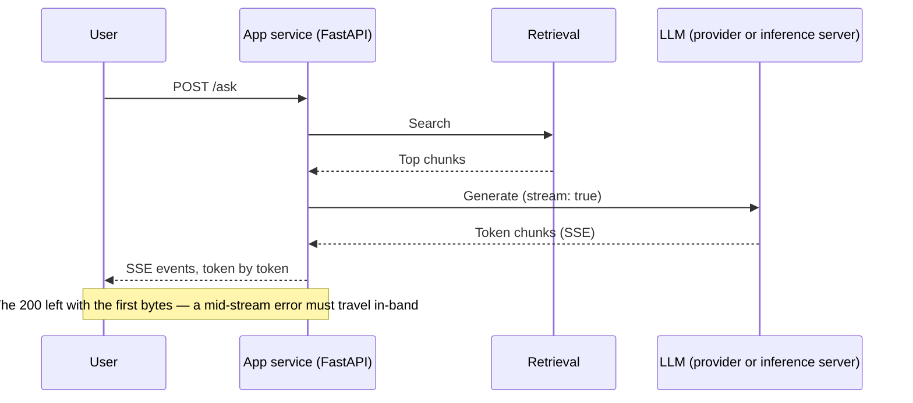
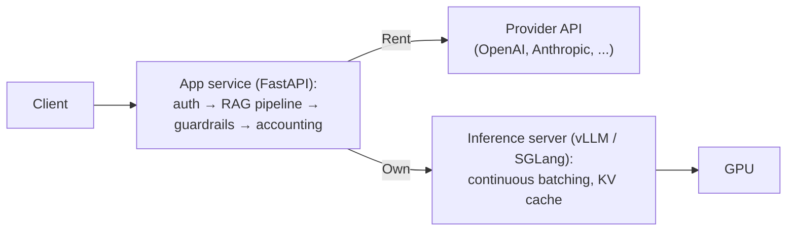

# From notebook to service

Part II closed with the system finally whole: a RAG pipeline grown into an agent, wired to its tools and
to other agents through standard protocols. But everything you've built so far shares one unstated
assumption — it runs on your machine, for you. You start it, you feed it a question, you read the answer,
and when it breaks you are sitting right there. Production removes every part of that: the system runs as
a service, for other people, many at once, under load, with nobody watching. Part III is about that jump,
and it unfolds in order — this lesson wraps what you built as a service; the lessons after it ask
[where the model itself should run](./cloud-platforms.md), [what tooling to put around the running
system](./tooling-ecosystem.md), and [how to operate it once it's live](./llmops.md).

## One word, two jobs

"Serving" hides two different jobs, and conflating them is the fastest way to get lost in this topic.
Serving the *application* means wrapping your pipeline — retrieval, the agent loop, guardrails — as an API
service that clients call. Serving the *model* means running LLM **inference** itself: the model computing
outputs from inputs, the forward pass as a production service. Most teams only ever do the first; the
model stays behind a provider's API, and running inference is somebody else's job, rented by the
token. This lesson covers both, in that order: the app layer everyone needs, then the inference layer for
the teams that self-host.

:::note[Prerequisites]

You know [FastAPI](https://fastapi.tiangolo.com) and [Docker](https://docs.docker.com) basics — this
lesson teaches neither. Both are commodity skills with excellent official docs; what follows is only the
AI delta: what changes when an LLM is in the loop.

:::

## The app layer — why FastAPI won

Look at what an LLM app request actually does. It parses input, fires a retrieval query, then calls the
model — and waits. For seconds, sometimes tens of seconds, your service does nothing but hold an open
connection while tokens are computed somewhere else. The workload is I/O-bound in the purest sense of the
word, and that decides the architecture: a thread-per-request server burns a thread on every one of those
waits, while an async server interleaves hundreds of waiting requests in a single process, because waiting
is all they do. That fit between async-first design and an I/O-bound workload is why FastAPI became the
community default for LLM services.

Three of its features earn their keep daily. Native `async`/`await` route handlers make the interleaving
above simply the way you write. [Pydantic](https://pydantic.dev) models validate request and response shapes at the boundary —
which pairs directly with structured output from [tool-use](../part-2-agents/tool-use/index.md): the schema the
model was asked to produce gets checked before anything leaves your service. And the auto-generated
OpenAPI docs keep the contract your service exposes current without anyone maintaining it.

One caveat carries more production weight than the rest of this section: async only helps if *everything*
in the handler is async. A single blocking call — a synchronous HTTP client, a slow database driver —
freezes the event loop, and with it every concurrent request in the process. Nothing errors; the service
just stops answering while one call blocks. This is the classic production bug of async LLM services, and
it deserves a code-review rule of its own: no synchronous I/O inside an async handler, ever.

## Streaming — the latency you can actually fix

A full generation takes seconds to tens of seconds, and no API-layer cleverness changes that: the model
computes as fast as it computes. What you can change is how the wait feels. Users don't experience total
generation time — they experience **time-to-first-token (TTFT)**, the silence before anything appears.
Stream tokens as the model produces them and a ten-second answer starts feeling alive the moment the
first tokens land. Streaming is the single biggest perceived-latency lever you have, which is why every
major LLM chat product streams.

The standard transport is **SSE (Server-Sent Events)**: a one-directional stream of events over ordinary
HTTP. The major provider APIs — OpenAI, Anthropic — stream exactly this way when you pass `stream: true`.
On the FastAPI side it's a `StreamingResponse` fed by an async generator, or the `sse-starlette` helper if
you'd rather not hand-roll the event framing. WebSocket is the alternative for the cases that genuinely
need two-way interaction mid-generation — voice, user interrupts; for plain "model talks, user reads," SSE
is simpler and passes proxies and load balancers as the ordinary HTTP it is.

Streaming quietly breaks the error model you've relied on your whole career. The HTTP status goes out with
the first bytes, so when generation fails halfway through, the 200 is already on the wire and no status
code can take it back. Errors have to travel in-band, as an error event inside the stream — which is
exactly what the provider APIs do — and every client has to be written for a stream that dies mid-answer.

Streaming also collides with the output-side [guardrails](../part-1-rag/cross-cutting/guardrails/index.md) from
Part I: you cannot validate a complete answer you don't have yet. Two options exist, and both are
compromises. Buffer the whole answer and validate before sending — which throws away the TTFT win you
streamed for. Or validate incrementally, chunk by chunk — which is weaker: a bad prefix can reach the user
before the check trips and you cancel the stream. Real systems choose per surface: strict, buffered checks
for high-risk outputs, streaming for low-risk chat.

## The production checklist for the API layer

Nothing on this list is exotic — timeouts, retries, rate limits, logging. What's AI-specific is how each
one bends when a single request can run for half a minute and cost real money.

Start with timeouts. Default HTTP client and proxy timeouts — often 30–60 seconds — were calibrated for
services that answer in milliseconds, and a long generation sails right past them into a spurious abort.
Set explicit, generous timeouts, and set them per stage: a retrieval call and a model call deserve
different budgets. Streaming helps here too — a connection delivering tokens is demonstrably alive, so
nothing along the path mistakes it for a hung request.

Retries are next. Provider errors are routine — 429 rate limits, transient 5xx — and retries with
exponential backoff handle them. The AI twist: never blindly retry a generation that has already streamed
half an answer to the user; you'd pay twice and could answer twice, differently. Retry whole units only —
the idempotency habit from ordinary distributed systems, applied to generations.

Then rate limiting, pointed the other way. Behind your service sits a provider quota — requests per
minute, tokens per minute — shared by everyone who uses it. Without your own per-user caps, one heavy user
exhausts the shared quota and everyone else gets errors that aren't their fault. Concurrency caps and rate
limits on your own users are how you protect them from each other.

Last, accounting hooks: log tokens in and tokens out, which model, latency per stage — on every request.
This is where the [observability](../part-1-rag/cross-cutting/observability/index.md) discipline from Part I
physically lives — the trace starts in your service — and the production tooling in
[tooling-ecosystem](./tooling-ecosystem.md) will assume those hooks exist.

## Docker — where the AI delta actually is

If your container wraps only the app — a pipeline that calls provider APIs — there is no AI delta to speak
of. It's a normal slim Python image, and the rules are the ones you already know: small layers, no secrets
baked in, config from the environment. Containerising an LLM application is just containerising a Python
service.

Everything changes when the model itself lives in the container.

Weights come first. Model weights run from gigabytes to tens of gigabytes, and baking them into the image
gives you an image the size of the model — slow to build, slow to push, slow to pull, painful to update.
The common pattern keeps weights outside the image: a volume mount, or a download-at-start into a cache
directory (point the Hugging Face cache, `HF_HOME`, at a persistent volume), so the image stays code-only.
The tradeoff is real, though: an image with weights baked in is immutable and perfectly reproducible —
what you tested is what runs — while external weights keep images light at the cost of a startup
dependency on wherever the weights live.

GPU access is the second delta. Containers don't see GPUs by default: you need the NVIDIA Container
Toolkit on the host and an explicit GPU request per container — `--gpus` on the command line, device
requests in Compose or Kubernetes. And the CUDA base images those containers build on are themselves
multi-gigabyte before your code adds a byte.

The third delta is **cold start**. Loading weights into GPU memory takes tens of seconds to minutes, so an
LLM container is not ready when its process starts. A health check that reports "the process is up" tells
you nothing useful; readiness has to mean "the model is loaded and warm," and the gap between the two is
exactly what Kubernetes separates into readiness and liveness probes. Cold start is also the price tag on
scale-to-zero: shutting idle replicas down saves GPU money, and the next request pays for it by waiting
out a cold start.

## Serving the model — inference servers

Serving an LLM well is a specialised systems problem, not a web problem. The throughput wins live at the
level of GPU scheduling: **continuous batching**, where new requests join the running batch at token
granularity instead of waiting for the whole batch to finish, and memory management like [vLLM](https://docs.vllm.ai)'s
**PagedAttention**, which pages the KV cache the way an operating system pages virtual memory, cutting the
fragmentation that otherwise wastes GPU memory. No web framework provides any of this. Put naive
per-request `transformers` inference behind FastAPI and the code will work — while leaving most of the
GPU's throughput on the table. The correct tool is a dedicated **inference server**.

:::tip[▶ Video]

<YouTube id="McLdlg5Gc9s" title="What is vLLM? Efficient AI Inference for Large Language Models — IBM Technology" />

What an inference engine adds on top of a web server — batching and memory management — explained through
vLLM itself.

:::

The names, as of this writing: **[vLLM](https://docs.vllm.ai)** is the open-source standard for GPU serving; **[SGLang](https://docs.sglang.io)** is the
other major open-source GPU server; **[Ollama](https://ollama.com)** is the convenience option for local and dev use — not a
production-class server. (Hugging
Face's [TGI](https://github.com/huggingface/text-generation-inference), once a peer of these, was put into maintenance mode in December 2025 and its repository
archived — made read-only — in March 2026; Hugging Face itself now points users to vLLM or SGLang.) Treat
the roster as a 2026 snapshot and the category as the durable thing: whichever names win, "inference
server" is the box your architecture needs.

They also agree on the wire. Inference servers expose an **OpenAI-compatible API**, and that compatibility
has become the de facto wire standard for LLM endpoints: your app layer speaks one client dialect whether
the backend is OpenAI itself, vLLM on your own GPUs, or a cloud endpoint. Switching backends is close to a
URL change, not a rewrite — with one honest caveat: compatibility covers the core chat-completions
surface, not every parameter of every backend.

Which leaves the lesson's architecture takeaway, a clean division of labour. The FastAPI layer owns the
product: auth, RAG orchestration, guardrails, streaming to the user, accounting. The inference server owns
the GPU: batching, KV cache, model loading. Chaining them — app service in front, inference server behind —
is the standard self-hosted architecture; and if you use a provider API instead, nothing structural
changes — you've simply rented the second box. Whether to rent it or own it is exactly the question of the
[cloud-platforms](./cloud-platforms.md) lesson.

## What to take away

- "Serving" is two jobs: serving the application (your pipeline behind an API) and serving the model
  (inference). Most teams do the first and rent the second from a provider.
- An LLM request is I/O-bound — the service mostly waits on the model — which is why async-first FastAPI
  became the default app layer. One blocking call in an async handler stalls every request in the process.
- Users feel TTFT rather than total generation time; streaming over SSE is the biggest perceived-latency
  lever. The status code leaves with the first bytes, so errors travel in-band — and output guardrails
  force a per-surface choice between buffered validation and streaming.
- The classic API checklist bends: generous per-stage timeouts, retries for whole units only, your own
  rate limits in front of the shared provider quota, and token/latency accounting on every request.
- Docker's AI delta appears when the model lives in the container: weights stay outside the image, GPUs
  need the NVIDIA toolkit and explicit requests, and readiness means "model loaded and warm" rather than
  "process up" — cold start is the price of scale-to-zero.
- The inference server owns the GPU (continuous batching, PagedAttention); FastAPI owns the product; the
  OpenAI-compatible API between them makes backends swappable.

**New terms** → [Glossary](../glossary.md): serving, inference, inference server, SSE (Server-Sent Events), time-to-first-token (TTFT), streaming, continuous batching, PagedAttention, cold start, OpenAI-compatible API.

---

:::note[Next — going deeper]

🚧 Second pass: production ASGI tuning (workers and uvicorn), request queueing and backpressure design,
vLLM internals (scheduling, quantization), multi-GPU and multi-node serving, Kubernetes GPU scheduling and
autoscaling on token throughput, serverless GPU.

:::
