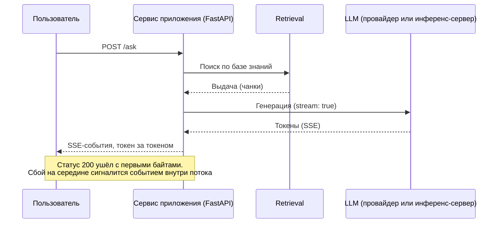
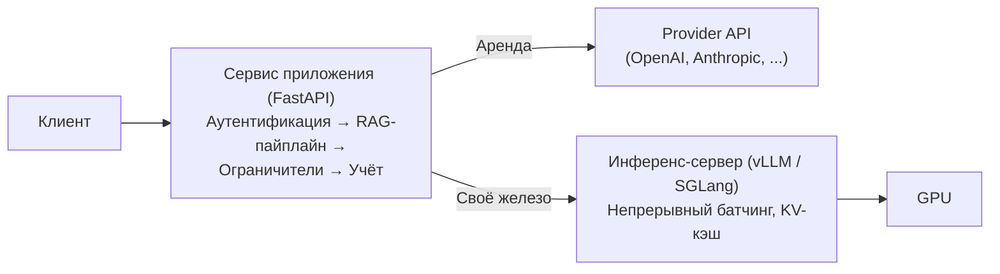

# Serving (сервинг) — из ноутбука в сервис

Часть II закончилась протоколами: MCP сшил агента с инструментами, и система наконец собралась в единое
целое. Но собралась она у тебя на машине — и работает для тебя одного. Ты запускаешь скрипт, ждёшь,
смотришь, что получилось, правишь и запускаешь снова. Прод начинается там, где ровно то же самое должно
работать как сервис: для чужих людей, круглые сутки, под нагрузкой, которой ты не управляешь.

Этим путём Часть III и идёт. В этом уроке мы заворачиваем собранный пайплайн в сервис. Дальше решим, где
работает сама модель — про это урок об [облачных AI-платформах](./cloud-platforms.md), — потом посмотрим,
[чем обвязать систему в проде](./tooling-ecosystem.md), и закончим тем, [как ею жить после
релиза](./llmops.md).

## Два смысла сервинга

Слово «сервинг» прячет две разные работы, и путать их нельзя. Первая — сервинг **приложения**: твой RAG-
или агентный пайплайн, завёрнутый в API-сервис, к которому ходят пользователи. Вторая — сервинг
**модели**: запуск самого LLM-инференса, и он нужен только тому, кто хостит модель у себя. Большинство
команд делают первое и только первое, а за моделью ходят в API провайдера.

Пара слов о втором термине, потому что дальше он повсюду. **Инференс (inference)** — это работа модели в
проде: она принимает вход и вычисляет по нему свой вывод — тот самый прямой проход (forward pass), только
уже не на обучении, а в бою. Сервинг модели — это инференс, оформленный как сетевой сервис. Первые разделы урока —
про сервинг приложения; к сервингу модели вернёмся в конце, когда дойдём до инференс-серверов.

:::note[Предпосылки]

Урок предполагает, что база FastAPI и Docker тебе знакома: что такое маршрут, Dockerfile и образ, мы не
объясняем — за этим в официальную документацию [FastAPI](https://fastapi.tiangolo.com) и
[Docker](https://docs.docker.com). Здесь — только AI-дельта.

:::

## Почему прикладную часть пишут на FastAPI

Запрос к LLM-приложению почти целиком состоит из ожидания. Вызов генерации длится секунды, а то и десятки
секунд, и всё это время твой код не делает ничего — сидит и ждёт ответа модели. Нагрузка упирается в
ожидание ввода-вывода (I/O-bound), и для неё естественна асинхронная обработка: один процесс переключается
между десятками ожидающих запросов, вместо того чтобы держать под каждый отдельный поток. Именно поэтому
изначально асинхронный FastAPI и стал у сообщества выбором по умолчанию для LLM-сервисов.

Практических выигрышей у него три:

- маршруты пишутся сразу асинхронными — `async`/`await` в FastAPI встроены с рождения;
- Pydantic-модели проверяют форму запроса и ответа на границе сервиса — это напрямую стыкуется со
  структурированным выводом из урока про [использование инструментов](../part-2-agents/tool-use.md):
  то, что породила модель, валидируется до того, как покинет твой сервис;
- OpenAPI-документация генерируется сама, из тех же Pydantic-моделей.

Одна оговорка, и она серьёзная: асинхронность помогает, только если асинхронно **всё**. Единственный
блокирующий вызов внутри обработчика — синхронный HTTP-клиент, неторопливый драйвер базы — замораживает
цикл событий, и вместе с ним встают все запросы, которые процесс держал параллельно. Это классический
прод-сбой асинхронных LLM-сервисов: сервис спокойно вёл сотню диалогов, кто-то добавил синхронный вызов —
и сотня пользователей ждёт одного.

## Стриминг

С полной длительностью генерации на уровне API почти ничего не сделать — секунды и десятки секунд диктует
модель. Но пользователь ощущает ожидание иначе: ему важна не полная длительность, а **время до первого
токена** — time-to-first-token (TTFT). Отсюда **стриминг (streaming)** — отправка токенов пользователю по
мере того, как модель их порождает. Это самый сильный рычаг управления воспринимаемой задержкой, и потому стримят все
крупные LLM-чаты без исключения.

Стандартный транспорт потока токенов — **SSE (Server-Sent Events)**: односторонний поток событий поверх
обычного HTTP. Так стримят API крупных провайдеров — и OpenAI, и Anthropic отдают токены SSE-событиями,
когда ты передаёшь `stream: true`. В FastAPI это `StreamingResponse` с асинхронным генератором — либо
готовая обвязка `sse-starlette`. У SSE есть альтернатива — WebSocket, и нужна она тогда, когда требуется
двусторонняя связь посреди генерации: голос, перебивание модели на полуслове. Для обычного «модель
говорит — пользователь читает» SSE проще, а главное, проходит через прокси и балансировщики как обычный
HTTP-трафик.

За выигрыш TTFT стриминг берёт плату, и в двух местах сразу. Первое — он ломает привычную модель ошибок.
HTTP-статус уходит вместе с первыми байтами: если генерация упала на середине, отправленный 200 уже не
отозвать. Ошибку приходится сигналить внутри самого потока, отдельным событием, а клиент обязан уметь
пережить поток, оборвавшийся на полуслове.

Второе — стриминг сталкивается лоб в лоб с выходными [ограничителями
(guardrails)](../part-1-rag/cross-cutting/guardrails.md) из Части I: нельзя проверить целиком ответ,
которого у тебя ещё нет. Вариантов два, и оба с ценой. Буферизовать ответ и отправить после проверки —
надёжно, но убивает весь выигрыш TTFT. Проверять инкрементально, кусок за куском, — слабее: плохое начало
успеет улететь пользователю раньше, чем проверка сработает и оборвёт поток. Реальные системы выбирают
режим для каждой части продукта отдельно: строгие проверки с буферизацией — там, где цена ошибки высока,
стриминг — в малорисковом чате.

## Прод-чек-лист прикладного уровня

Дальше — вещи, которые в обычном веб-сервисе давно решены дефолтами, а в LLM-сервисе дефолты как раз и
подводят.

**Таймауты.** Стандартные таймауты HTTP-клиентов и прокси — как правило, 30–60 секунд — откалиброваны под
миллисекундные сервисы и убивают долгую генерацию на взлёте. Ставь таймауты явно, с запасом и постадийно: у
вызова модели своя граница, у поиска — своя. Стриминг здесь помогает ещё и технически: пока идут токены,
видно, что соединение живо.

**Повторные попытки.** На ошибки провайдера — 429 (упёрся в квоту) и 5xx — отвечают повтором с
экспоненциально растущей паузой (retry with exponential backoff). Но никогда не повторяй вслепую
генерацию, половина которой уже утекла пользователю в поток: повторять можно только целую единицу работы,
от начала до конца. Обычная дисциплина идемпотентности, применённая к генерации.

**Свои лимиты навстречу пользователям.** За твоим сервисом стоит квота провайдера — столько-то запросов и
токенов в минуту, — и она общая на всех. Без собственного лимита частоты и потолка одновременных
запросов один тяжёлый пользователь выест общую квоту, и без ответа останутся все остальные.

**Учёт на каждый запрос.** Логируй токены на входе и выходе, имя модели, задержку по стадиям. Дисциплина
[наблюдаемости (observability)](../part-1-rag/cross-cutting/observability.md) из Части I физически живёт
именно здесь — трейс (trace) начинается в твоём сервисе. Чем это мерить и смотреть в проде — разговор
урока про [экосистему инструментов](./tooling-ecosystem.md).

## Docker: AI-дельта приезжает вместе с моделью

Пока модель живёт у провайдера, контейнер LLM-приложения — обычный тонкий Python-образ. Никакой
AI-специфики в нём нет; вся гигиена сводится к привычному обращению с конфигурацией и секретами.
AI-дельта начинается в тот момент, когда внутрь контейнера переезжает сама модель.

Первая её часть — веса. У современных LLM это гигабайты, у крупных — десятки гигабайт. Запечь их в образ
можно, но образ выходит огромным и мучительно медленным при скачивании. Распространённый паттерн — веса
**вне** образа: том, смонтированный при запуске, либо докачка при старте в кэш Hugging Face (переменная
`HF_HOME`); образ при этом остаётся только кодом. Компромисс честный, взвесь его сам: образ с весами
неизменяем и воспроизводим — что собрал, то и запустил; внешние веса легче, но добавляют старту сетевую
зависимость.

Вторая часть — GPU. В контейнер он сам не приходит: нужен NVIDIA Container Toolkit и явный запрос
устройства — `--gpus` в Docker, device requests в Compose, ресурсы в Kubernetes. И учти, что GPU-образы
на базе CUDA многогигабайтны ещё до всяких весов.

Третья — **холодный старт (cold start)**. Загрузка весов в видеопамять занимает от десятков секунд до
минут, поэтому контейнер с моделью не готов в момент, когда процесс поднялся. Проверка живости и проверка
готовности обязаны различать «процесс запущен» и «модель загружена и прогрета» — в Kubernetes это разница
между liveness probe и readiness probe. По той же причине масштабирование в ноль (scale-to-zero) экономит
деньги, но расплачивается за это холодным стартом на первом же запросе после простоя.

## Сервинг самой модели: инференс-серверы

Теперь вторая работа из начала урока — сервинг модели. Сервинг LLM — специализированная системная задача,
а не веб-задача. Выигрыш добывается на уровне планирования GPU. Это **непрерывный батчинг (continuous
batching)** — новые запросы подсаживаются в уже работающий батч на гранулярности отдельного токена, никто
не ждёт, пока батч догенерирует до конца. И это управление KV-кэшем — промежуточными состояниями
внимания, которые модель копит по ходу генерации, — вроде **PagedAttention** в vLLM: кэш разбит на
страницы по образцу виртуальной памяти операционной системы, и фрагментация практически исчезает. Ничего из
этого веб-фреймворк не даёт и давать не обязан. Наивный инференс через `transformers`, по одному запросу за
раз, спрятанный за FastAPI, выжимает из GPU малую долю возможной пропускной способности; правильный выбор здесь —
выделенный **инференс-сервер (inference server)**.

:::tip[▶ Видео]

<YouTube id="McLdlg5Gc9s" title="What is vLLM? Efficient AI Inference for Large Language Models — IBM Technology" />

Что инференс-сервер добавляет поверх обычного веб-сервера — батчинг, обращение с KV-кэшем — и почему это
даёт кратную пропускную способность на том же железе.

:::

Экосистема на сегодня выглядит так: **vLLM** — открытый стандарт GPU-сервинга де-факто. **SGLang** —
второй крупный открытый GPU-сервер. **Ollama** — удобная локальная вещь для разработки и экспериментов,
но не прод-класс. Hugging Face TGI, который ты ещё встретишь в статьях, — уже история: в декабре 2025-го
его перевели в режим сопровождения, в марте 2026-го репозиторий закрыли на запись, и сам Hugging Face
рекомендует мигрировать на vLLM или SGLang. Запоминай категорию — «инференс-сервер»; конкретные имена —
снимок 2026 года, и они сменятся.

У всех этих серверов есть общая черта, которая переживёт любой из них: каждый выставляет
**OpenAI-совместимый API (OpenAI-compatible API)**. Он стал стихийно сложившимся общим стандартом:
прикладной код говорит на одном клиентском диалекте, а смена того, кто на другом конце — OpenAI, vLLM на
твоих GPU или облачный эндпоинт, — почти сводится к замене URL, переписывать клиент не приходится. Честная
оговорка: совместимость распространяется на ядро chat/completions, но не на каждый параметр каждого сервера.

Отсюда архитектурный итог урока — разделение труда. Сервис приложения на FastAPI владеет **продуктом**:
аутентификация, оркестрация RAG-пайплайна, ограничители, стриминг и отправка ответа пользователю, учёт.
Инференс-сервер владеет **GPU**: батчинг, KV-кэш, загрузка и прогрев модели. Их сцепка — сервис
приложения перед инференс-сервером — и есть стандартная архитектура self-hosted систем (модель хостишь у
себя); а когда ты работаешь через API провайдера, второй блок у тебя просто арендован. Когда аренда лучше своего железа —
вопрос следующего урока, про [облачные AI-платформы](./cloud-platforms.md).

## Что забрать из урока

- **Сервинг — два разных смысла**: сервинг приложения (пайплайн как API-сервис — нужен всем) и сервинг
  модели (свой инференс — нужен только self-hosted). Не смешивай их в разговоре и в архитектуре.
- LLM-запрос — это секунды ожидания ввода-вывода, поэтому прикладная часть асинхронная; отсюда FastAPI:
  `async`/`await`, Pydantic на границе, автогенерация OpenAPI. Один блокирующий вызов в обработчике
  останавливает все параллельные запросы.
- **Стриминг** оптимизирует TTFT — то, что пользователь на самом деле чувствует. Транспорт — SSE;
  WebSocket — только для двусторонних сценариев. Плата: ошибки сигналятся внутри потока (200 уже ушёл),
  а выходные ограничители выбирают между буферизацией и проверкой по кускам.
- Прод-чек-лист API: постадийные таймауты с запасом; повторы с экспоненциальной паузой, но только целых
  единиц работы; свои лимиты поверх общей квоты провайдера; учёт токенов и задержек на каждый запрос —
  здесь начинается трейс.
- Docker-дельта появляется с моделью в контейнере: веса держат вне образа (том или кэш `HF_HOME`), GPU
  требует NVIDIA Container Toolkit и явного запроса, а из-за **холодного старта** «процесс запущен» ещё
  не готовность — готовность наступает, когда модель загружена и прогрета.
- Инференс-сервер владеет GPU (непрерывный батчинг, PagedAttention), сервис приложения владеет продуктом;
  **OpenAI-совместимый API** расцепляет их: смена бэкенда — почти смена URL.

**Новые термины** → [Глоссарий](../glossary.md): serving, inference, inference server, SSE (Server-Sent
Events), time-to-first-token (TTFT), streaming, continuous batching, PagedAttention, cold start,
OpenAI-compatible API.

---

:::note[Дальше — углубление слоя]

🚧 Второй проход: боевая настройка ASGI (несколько процессов uvicorn), очереди запросов и их переполнение
(backpressure),
внутренности vLLM (планировщик, квантизация), сервинг на нескольких GPU и узлах, планирование GPU в
Kubernetes и автомасштабирование по токенной пропускной способности, serverless-GPU.

:::
