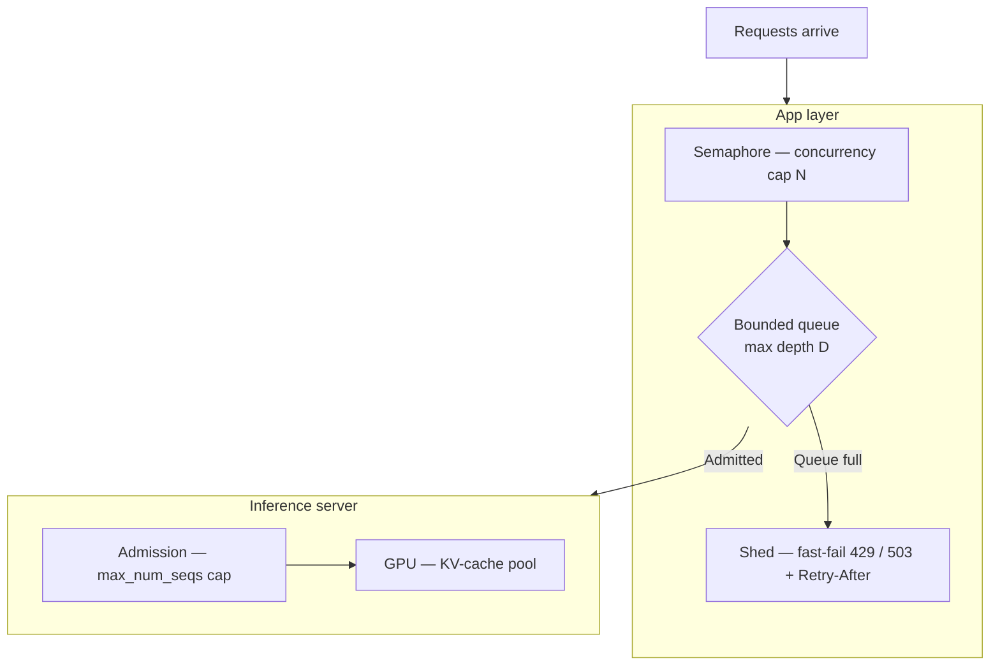
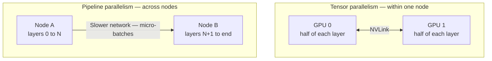

# Where the throughput comes from when the service meets real load

[Part 1](./index.md) built the service and named its parts: the app-versus-model split, FastAPI's async fit for an I/O-bound workload, streaming over SSE, the production checklist, Docker's weight, GPU and cold-start deltas, and inference servers with continuous batching and PagedAttention sketched at a high level. This is the deep second pass — the same service under real load, where those names turn into internals, failure modes, and a set of "when not to" calls. Part 1 is assumed throughout and none of it is re-taught here.

## Workers, the event loop, and where concurrency really comes from

By default, uvicorn runs a single process: one event loop pinned to one CPU core. To use more than one core you run several **ASGI worker** processes — separate copies of the ASGI server (uvicorn) running your app — and as of 2026 there are two current ways to spawn them: the classic pattern of gunicorn as a process manager driving `uvicorn.workers.UvicornWorker`, and uvicorn's own first-class `--workers` flag, which `fastapi run` wraps. FastAPI's deployment docs present both; treat the exact recommendation as a dated detail and hold onto what a worker *is*.

A worker gives you process-level parallelism: its own OS process, its own Python interpreter — so it sidesteps the GIL — its own event loop, its own memory. What it does not give you is concurrency, and conflating the two is the classic mis-sizing of an LLM proxy. The old synchronous-web rule of `(2 × cores) + 1` does not apply, because concurrency here comes from the event loop, not the process count: a single loop already interleaves hundreds of concurrent awaits, since an LLM request is almost entirely waiting. Workers exist for two other reasons — to use every core, and to cover the CPU-bound slivers of the work: request and response serialisation, tokenisation, JSON. So worker count tracks cores and CPU-bound load; the number of concurrent requests you mean to hold doesn't enter into it.

One free win sits underneath all of this. **Uvloop**, a fast libuv-based event-loop implementation, ships bundled in `uvicorn[standard]` and replaces the default asyncio loop for a speed gain with no code change.

Part 1's threadpool rule deserves its mechanism. A plain `def` path operation or dependency runs in an anyio threadpool — default capacity around forty threads — not on the event loop, so a synchronous endpoint will not block the loop outright. Under load it fails in a subtler way: the pool is exhausted, and further requests queue waiting for a thread to free up. The opposite mistake is the worse one. A blocking call inside an `async def` handler freezes the entire event loop, and with it every concurrent request in that process — Part 1's "one blocking call stalls everything", now with the reason it happens. For unavoidable synchronous work, **offload** it: `run_in_threadpool` from Starlette, or `asyncio.to_thread`, so the blocking call runs on a thread and the loop keeps serving.

Shutdown needs the same care once answers stream. On SIGTERM the server should stop accepting new connections and drain the in-flight ones within a graceful-timeout — and an LLM stream can run for tens of seconds, longer than the default drain window. Set the graceful timeout to your longest expected stream, or a rolling deploy will cut answers off mid-generation. (A separate streaming concern does not change under load and is not re-derived here: the buffered-versus-incremental validation that output [guardrails](../../part-1-rag/cross-cutting/guardrails/index.md) force on a streamed answer, which Part 1 covers.)

## Bounding the work before the service drowns

Async makes holding a connection cheap, and that cheapness is a trap: it lets a service accept far more work than it can finish. Unbounded concurrency then kills an LLM service three ways at once — it exhausts memory (every in-flight request holds KV-cache blocks and connection state), it triggers provider-429 storms (you blow past the shared provider quota and every caller is throttled together), and it ends in tail-latency collapse (past capacity, queueing delay explodes and p99 falls off a cliff). What counts as "past capacity" is set against your latency SLOs — the targets the [observability deep dive](../../part-1-rag/cross-cutting/observability/deep-dive.md) defines and this whole page answers to.

Why this bites so early is **Little's Law**: L = λW, concurrency equals arrival rate times time-in-system. Because an LLM generation's W runs to tens of seconds, even a modest arrival rate implies a large concurrency — ten requests a second against a twenty-second generation is two hundred in flight at once. An LLM service hits its concurrency ceiling at a request rate that looks surprisingly low.

The remedy is **backpressure**: deliberately bound concurrency with a semaphore that caps simultaneous generations, and put a bounded queue with a maximum depth behind it. When the queue fills, fast-fail with a `429` or `503` and a `Retry-After` header — **load shedding** — rather than accepting work you cannot serve. A request the client can retry is a far better outcome than a service that melts down for everyone.

**Admission control** sharpens the same idea: do not even enqueue work that will already have blown the client's timeout by the time you reach it, because rejecting it up front is cheaper than spending a GPU slot computing an answer no one is still waiting for. And fairness needs structure — per-tenant queues and per-tenant concurrency caps stop one heavy user from starving everyone else — it is Part 1's per-user rate limit, now built into the admission path rather than bolted on.

The principle underneath it all: bound at the scarce resource, not at the connection. The waiting connection is cheap, as Part 1 showed, but each in-flight request still consumes something scarce downstream — a GPU batch slot, or a slice of the provider's token budget. So the cap belongs there. In practice it lives at two levels: the app layer bounds with its own semaphore and queue, and the inference server enforces its own admission through `max_num_seqs` (below). Belt and braces.

## Inside the inference server

An inference server's throughput is not magic; it comes from a handful of specific mechanisms, and [vLLM](https://docs.vllm.ai) is the reference implementation of most of them. Start with the scheduler. Continuous batching is really **iteration-level scheduling**: the scheduler admits new requests and evicts finished ones at every decode step, instead of the static batching that makes a whole batch wait for its slowest member before the next can start. The idea comes from the Orca paper (Yu et al., OSDI 2022), which introduced iteration-level scheduling; vLLM, TGI and TensorRT-LLM all build on it.

A generation has two phases with opposite appetites. **Prefill** processes the entire prompt in a single pass and is compute-bound. **Decode** emits one token per step, re-reading the weights and the KV cache each time, and is memory-bandwidth-bound. They stress different parts of the GPU, which is exactly what the next two optimisations exploit.

**Chunked prefill** interleaves the two in one step: it splits a long prefill into chunks and mixes them with ongoing decodes, so one big prompt's prefill no longer stalls everyone else's token generation. The trade is small and usually worth it — slightly higher p50 TTFT for the interleaving, much better p95. **Prefix caching** attacks repeated work from the other side: when many requests share a prompt prefix — a common system prompt, say — it reuses that prefix's KV cache across them rather than recomputing it every time.

Both of those lean on how the KV cache is stored. PagedAttention, which Part 1 introduced at a high level, keeps the KV cache in fixed-size blocks the way an operating system pages memory: fragmentation drops to near zero, and blocks can be shared — the mechanism prefix caching rides on. This matters because the KV cache, not raw compute, is the real ceiling. Its size grows with sequence length times the number of concurrent sequences, and once the KV pool is full you can admit no more concurrent requests, however many FLOPS the GPU still has idle.

Three knobs govern that pool, and their names are a 2026 snapshot worth dating: `max_num_seqs` caps concurrent sequences, `max_num_batched_tokens` sets the token budget per step, and `gpu_memory_utilization` fixes the fraction of VRAM handed to the KV-cache pool. When the pool fills anyway, vLLM preempts requests — either recomputing their KV later or swapping it out to CPU memory and back.

The engine behind those internals was overhauled recently: vLLM re-architected its core — scheduler, KV-cache manager, worker, API server — into what it calls the V1 engine, which shipped as an alpha in January 2025 and is the default by 2026. V1 turns the throughput optimisations on by default, with a persistent batch and a clean split between the scheduler and worker processes. The version label is a moving target; the mechanisms under it are not.

**Quantisation** is the last lever, trading precision for memory and speed. The baseline is FP16 or BF16. FP8, native on Hopper and Blackwell tensor cores, is near-lossless and the default first stop in 2026; INT8 (W8A8) goes further; INT4 weight-only, via AWQ or GPTQ, cuts weight VRAM by roughly three-quarters — enough to fit a 70B model on a single GPU — at a moderate quality cost. A separate axis is **KV-cache quantisation**: storing the KV cache in FP8 roughly doubles the tokens a given pool holds, buying longer contexts or more concurrency. Every one of these trades throughput and memory against quality; there is no free precision.

## When a model no longer fits on one GPU

Some models simply do not fit on a single GPU, and then you split them — but how you split decides what hardware you need. **Tensor parallelism** shards each layer's weight matrices across several GPUs. Every layer then needs an all-reduce to recombine the partial results, which makes it communication-heavy and demands a fast interconnect — NVLink — so it belongs inside a single node. In vLLM it is the `tensor_parallel_size` knob. **Pipeline parallelism** cuts the other way: it splits the layers into stages, puts each stage on a different GPU or node, and streams micro-batches from stage to stage. That needs far less communication, so it tolerates a slower interconnect and works across nodes — at the cost of a pipeline "bubble," the idle time while the pipe fills and drains. Its knob is `pipeline_parallel_size`.

The rule of thumb falls straight out of the communication cost: tensor parallelism within a node, over NVLink; pipeline parallelism across nodes; and both together for a genuinely enormous model. **Data parallelism** is a different tool for a different problem — whole-model replicas behind a load balancer — and it is for pure throughput when the model already fits on one GPU. To coordinate any of this across machines, vLLM leans on [Ray](https://www.ray.io).

And the same discipline applies as everywhere else: don't shard a model that fits. One that sits comfortably on a single GPU serves more cheaply replicated than split, because sharding only adds communication overhead for nothing. Parallelism earns its keep for models that do not fit, or to cut latency — it is never free throughput.

## Scheduling and autoscaling GPUs on Kubernetes

On Kubernetes a GPU is a schedulable resource, and its shape has consequences. The NVIDIA device plugin advertises it as `nvidia.com/gpu`, an integer — so out of the box a pod requests whole GPUs, and there is no fractional-GPU request. You keep those expensive machines for the workloads that need them with node taints and tolerations, or node affinity onto dedicated GPU node pools, so ordinary pods never land on a GPU node.

When a whole GPU per pod is too coarse, two mechanisms share one. **MIG (Multi-Instance GPU)** partitions an A100 or H100 in hardware into isolated instances, each with its own memory and fault isolation. **GPU time-slicing** instead interleaves work on the same GPU with no memory or fault isolation at all — fine for a dev cluster, risky in production, where one tenant's fault or memory spike reaches the others.

The hard part of GPU autoscaling is choosing the signal. The default Horizontal Pod Autoscaler (HPA) scales on CPU and memory, which is useless here: a GPU can be pinned at 100% while the CPU idles, so a CPU-based HPA simply never fires. The signal that means something is queue depth, in-flight requests, tokens per second, or GPU utilisation read from DCGM (NVIDIA's GPU-telemetry exporter) — fed in as custom or external metrics through the Prometheus Adapter or [KEDA](https://keda.sh), an event-driven autoscaler that scales on exactly those external metrics.

Cold start, from Part 1, makes any reactive autoscaler lag. A new replica must pull a multi-gigabyte image and load the weights — tens of seconds to minutes — before it serves a single request, so scaling on a spike arrives late by construction. The answers are to keep warm headroom or to scale predictively rather than purely on demand; and the Cluster Autoscaler can add GPU nodes when the pool runs out, but that takes minutes more, node provisioning on top of the image pull. Above the raw scheduler sit model-serving layers that make this less manual: [KServe](https://kserve.github.io/website/) and Knative give request-driven autoscaling — including scale-to-zero and concurrency-based scaling — and Ray Serve is another. Those product names will rotate; request-driven autoscaling as a capability will not.

## Renting the GPU by the second

**Serverless GPU** is the rent-by-the-second end of the spectrum: GPU capacity billed per second, scaling to zero when idle, with no cluster to operate. As of 2026 the field includes [Modal](https://modal.com), [RunPod](https://www.runpod.io)'s serverless tier, [Replicate](https://replicate.com), [Baseten](https://www.baseten.co) and Beam — with Fal and Cerebrium alongside — plus Google's Cloud Run with a GPU attached; AWS's true-serverless-GPU story is comparatively weak. As in Part 1, the roster is a snapshot that will age; the category is what lasts.

What defines the category is also its central problem: the cold-start tax. Every cold request pays to load the weights and initialise before it can answer, and most of the engineering effort goes into shrinking that. **Memory snapshot** and restore is the sharpest tool — Modal snapshots an already-loaded model so a fresh instance is ready in seconds rather than minutes — alongside **warm pools** that keep a minimum number of instances alive (which erodes the scale-to-zero saving they were meant to deliver) and faster weight loading in general. The industry moved from 30-to-60-second cold starts towards sub-five-second ones in roughly eighteen months.

That decides when to reach for it. Spiky, bursty, dev or batch traffic suits serverless, because you do not pay for idle capacity between bursts. Steady high traffic, or any workload with no tolerance for a cold start, wants a dedicated always-warm GPU instead — cheaper per token at high utilisation, and free of the cold-start tax. The full rent-versus-own decision, and where the model should run at all, is the subject of the [cloud-platforms](../cloud-platforms/index.md) lesson; this is only its serving-side view.

## What to take away

- A worker is a process — it buys you cores, not concurrency; the event loop already interleaves hundreds of waiting requests, so worker count tracks cores and CPU-bound work. A blocking call in an async handler freezes every request in the process, so offload it to a thread, and on shutdown give long streams time to finish.
- Unbounded concurrency wrecks an LLM service, and Little's Law makes even a low request rate a high concurrency. Bound it with a semaphore and a bounded queue, shed excess with 429 and Retry-After, and put the cap at the scarce GPU or provider slot rather than the cheap connection.
- Inside an inference server the throughput comes from iteration-level scheduling, chunked prefill and prefix caching over a paged KV cache — and that KV cache becomes the ceiling long before the GPU runs out of compute. Quantisation trades quality for the memory the ceiling is made of.
- Shard a model across GPUs only when it does not fit: tensor parallelism within a node over NVLink, pipeline parallelism across nodes, data-parallel replicas when it already fits. Sharding buys capacity you didn't have; it never hands you throughput for free.
- On Kubernetes a GPU is a whole-integer resource that MIG or time-slicing can subdivide. Autoscale on queue depth and GPU utilisation, never on CPU, and count on cold start to make every reactive scale-up late.
- Serverless GPU rents capacity by the second and scales to zero, paying for it in a cold-start latency that snapshots and warm pools only soften. It fits bursty and batch traffic; steady load is cheaper on an always-warm GPU.
- One idea runs through all six sections: what an LLM service is short of is the GPU and its KV cache — under load you protect that resource, not the connection and not the core.

**New terms** → [Glossary](../../glossary.md): ASGI workers, uvloop, threadpool offloading, backpressure, load shedding, admission control, Little's Law, iteration-level scheduling, prefill / decode, chunked prefill, prefix caching, quantisation, KV-cache quantisation, tensor parallelism, pipeline parallelism, data parallelism, MIG (Multi-Instance GPU), GPU time-slicing, KEDA, KServe, serverless GPU.
