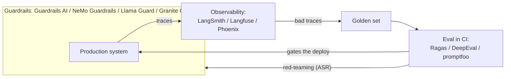

# Paying Part I's debt

Three lessons in Part I ended on the same promissory note.
[Evaluation](../part-1-rag/cross-cutting/evaluation/index.md),
[guardrails](../part-1-rag/cross-cutting/guardrails/index.md), and
[observability](../part-1-rag/cross-cutting/observability.md) each taught a principle and then deferred the
products: "the tools are a separate tooling layer, coming later; here we're on the principle." This is
later. Part I gave you the concepts — the golden set, the trace, attack success rate. This lesson maps
those concepts onto the 2026 tool landscape and answers the question the earlier lessons left open: what do
you actually install, and when?

One rule organizes everything below. Each of the three cross-cutting concerns has grown its own tool
category, but the concepts are durable and the tools are snapshots — so judge a tool by which concept it
implements and where it sits in your loop, not by the length of its feature list.

Expect the categories to blur, too. The observability platforms — [LangSmith](https://www.langchain.com/langsmith), [Langfuse](https://langfuse.com), [Phoenix](https://arize.com/phoenix) — all ship
eval features as well: datasets, judges, scoring runs. That is the **feedback loop** from the observability
lesson turned into product. A production trace becoming an eval case is one workflow, and the tools grew to
cover both ends of it.

## Eval tools

**[Ragas](https://ragas.io)** is an open-source library of RAG-specific metrics: faithfulness, response relevancy, context
precision, context recall — most of them computed LLM-as-a-judge-style. A mapping note: response
relevancy is the metric that used to be called answer relevancy — Ragas's name for the answer relevance you
know from the evaluation lesson. The names land straight on Part I's vocabulary, the retrieval-vs-generation
split included: context precision and context recall score the retrieval side, faithfulness and response
relevancy the generation side. Ragas can also generate a candidate test set over your corpus.

**[DeepEval](https://deepeval.com)** is open source too, and its angle is pytest: an eval case is a unit test — `assert_test`, a
metric, a threshold — so running your evals in CI works the way running any other test suite does. If your
team already lives in pytest, the adoption cost is close to zero.

The third tool, **[promptfoo](https://www.promptfoo.dev)**, is open source and config-driven: YAML files describe prompts, models, and assertions, and
the tool renders side-by-side prompt/model comparison matrices and runs in CI. It also ships red-teaming
features — hold that thought for the guardrails section.

Now the part no tool ships: the golden set. Every one of these computes metrics over examples *you*
provide, and dataset quality stays your job — Part I's "a small clean set beats a big noisy one" doesn't
stop being true because the metrics come from a library now. Ragas will synthesize candidate examples for
you, but human review remains the quality gate.

## Observability platforms

**[LangSmith](https://www.langchain.com/langsmith)** is the [LangChain](https://www.langchain.com) ecosystem's tracing-and-eval platform — SaaS first, with a self-hosted
option reserved for enterprise plans. If you're already on LangChain or [LangGraph](https://www.langchain.com/langgraph), this is the tightest
integration you'll get.

**[Langfuse](https://langfuse.com)** is open source (MIT core; some enterprise features are license-gated) and self-hostable with
Docker or Kubernetes — the default choice when data must not leave your perimeter. It covers tracing,
prompt management, datasets and evals, and cost dashboards.

**[Arize Phoenix](https://arize.com/phoenix)** is self-hostable tracing and eval, "built on top of [OpenTelemetry](https://opentelemetry.io) and powered by
[OpenInference](https://github.com/Arize-ai/openinference) instrumentation," as its own docs put it. One licensing note worth being precise about:
Phoenix ships under ELv2 — source-available, free to run yourself, but not open source in the OSI sense —
so don't file it next to MIT-licensed Langfuse without the asterisk.

Underneath all three, **OpenTelemetry** (OTel) is becoming the vendor-neutral substrate. Its GenAI semantic
conventions standardize the span and attribute names for LLM calls — which model, how many tokens, which
tool calls — so your **instrumentation**, the code hooks that emit traces and metrics from the pipeline,
can outlive any one vendor: instrument once, point the exporter wherever you like. One caveat, because it
matters: as of mid-2026 these conventions are still in Development status — experimental and moving. They
now live in a dedicated repository, `open-telemetry/semantic-conventions-genai`, which also covers
conventions for [MCP](https://modelcontextprotocol.io) — the protocol from [MCP and agent protocols](../part-2-agents/mcp/index.md) getting its
observability vocabulary.

Strip the branding and all three platforms implement exactly one thing: the primitive from the
observability lesson. The trace of spans — query → chunks with scores → prompt → model output → agent
steps — plus cost and latency accounting per span, plus user feedback captured onto traces, plus a button
that says, in effect, "promote this bad trace to an eval case." The feedback loop as a product feature.
That's also why these platforms grew eval features: once you hold the traces, you hold the raw material for
the golden set.

:::tip[▶ Video]

<YouTube id="446x7GqXdaA" title="AI Agents Best Practices: Monitoring, Governance, & Optimization — IBM Technology" />

How monitoring, governance, and optimization look for agentic systems in production — this lesson's tool
categories in motion.

:::

## Guardrails tools

Guardrails products come in two shapes. The first is frameworks that wrap your input and output with
programmable checks: **[Guardrails AI](https://www.guardrailsai.com)** — a Python validator library plus the Guardrails Hub, including
structured-output validation — and **NVIDIA [NeMo Guardrails](https://developer.nvidia.com/nemo-guardrails)**, where dialogue "rails" are defined in a
configuration language called Colang.

The second shape is the **safety classifier** — a model that scores text for risk categories: **Llama
Guard** from Meta and **[Granite Guardian](https://github.com/ibm-granite/granite-guardian)** from IBM, compact specialized models you place on the input, the
output, or both. Frameworks orchestrate; classifier models judge. And the two shapes compose: a framework
rail can call a classifier model as one of its checks.

The make-or-buy fork runs through here as well — the same fork as everywhere in Part III. The identical
concepts ship as managed platform services: Bedrock Guardrails, Azure AI Content Safety, Vertex's safety
filters and Model Armor, all familiar from [the cloud platforms lesson](./cloud-platforms.md).
Platform-managed means less control, zero maintenance, one vendor; open source means full control and your
own ops.

And guardrails quality is itself measured — Part I gave you the metric, attack success rate (ASR). The
**red-teaming** tooling lives in the eval products: promptfoo's red-teaming features, the platforms' own
red-team offerings. That closes the loop: guardrails get configured, attacked, measured, and tuned.

## When to adopt what

The order below is a judgment call — a sensible default for a typical product team, not an industry
standard — but the reasoning behind each step holds up.

1. **Tracing first.** It's the cheapest to add — no prerequisites beyond an SDK and an exporter — and you
   need it to debug anything at all. Without traces you cannot even see your failures, let alone fix them.
2. **Eval in CI** once you start iterating on the pipeline, to protect against regressions — Part I's
   eval-driven development. It comes second for an honest reason: eval needs a golden set, and a golden set
   takes effort.
3. **Guardrails** as you approach real users and a real attack surface — earlier if the domain is regulated
   or the input is adversarial from day one. Guardrails need a threat model, and a threat model usually
   emerges with usage.

Here is the whole production loop with the product names attached — the Part I linkage, productized:

How this loop lives after release is the subject of the [LLMOps lesson](./llmops.md).

One anti-pattern can make that whole diagram lie to you: adopting an eval tool is not the same as having
eval. A tool pointed at a shallow, noisy dataset produces confident-looking dashboards over garbage —
Part I put it as "without a reference the whole eval falls apart," and it stays true with a product logo on
top. Tools amplify discipline; they don't replace it.

## What to take away

- The concepts are durable, the tools are snapshots — judge a tool by which Part I concept it implements
  and where it sits in your loop.
- The big observability platforms (LangSmith, Langfuse, Phoenix) grew eval features because production
  trace → eval case is one workflow, and the tools cover both ends of it.
- Ragas metric names are Part I's vocabulary (response relevancy = the former answer relevancy); DeepEval
  makes eval cases pytest unit tests; promptfoo does YAML-driven comparison matrices plus red-teaming.
- No tool solves the golden set: dataset quality stays your job, and synthesized examples still pass
  through human review.
- OpenTelemetry's GenAI conventions are the emerging vendor-neutral substrate (still experimental as of
  mid-2026): instrument once, export anywhere. Phoenix is ELv2 source-available — not open source in the
  OSI sense.
- Guardrails tools: frameworks (Guardrails AI, NeMo Guardrails) orchestrate, safety classifiers (Llama
  Guard, Granite Guardian) judge, and the same concepts ship as managed platform services — the usual
  make-or-buy fork. Measure them with ASR via red-teaming.
- Default adoption order: tracing → eval in CI → guardrails.

**New terms** → [Glossary](../glossary.md): instrumentation, OpenTelemetry GenAI conventions, safety classifier, red-teaming.

---

:::note[Next — going deeper]

🚧 Second pass: Ragas metric internals (the deepening promised back in the evaluation lesson), the OTel
GenAI conventions in practice, self-hosting Langfuse, writing your own Guardrails AI validators,
red-teaming playbooks, and agent-specific evals (trajectory scoring).

:::
