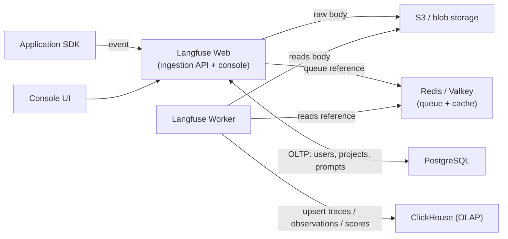
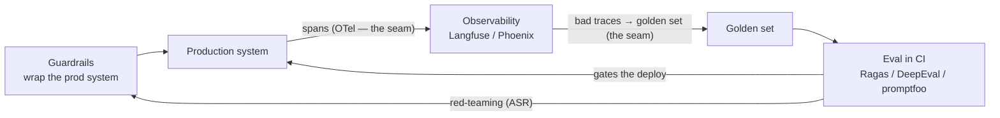

# Four data stores, a validator you write yourself, and the seams that hold a stack together

[Part 1](./index.md) mapped Part I's three cross-cutting concerns — evaluation, guardrails, observability — onto the 2026 product roster and answered the question the earlier lessons left open: what do you install, and when? It closed on a default order — tracing first, then eval in CI, then guardrails. This second pass is the operations layer over that same roster. Not which tool to pick, but how to run one yourself when the managed version won't do, how to write the piece of a guardrail that no library ships for you, and how the eval, observability and guardrails tools wire into a single stack instead of three disconnected products. Everything below is a snapshot as of mid-2026 (July 2026); as in Part 1, the product names are dated and the durable thing is the category — and, this time, the operational shape — underneath them.

## Where the theory lives

This page owns the wiring, not the theory, and it helps to say exactly what that excludes before starting. The concepts each tool implements are taught once, in the deep-dives that own them, and cross-linked here rather than repeated:

- **Metric internals** — how faithfulness, context precision and context recall are computed as LLM-as-a-judge pipelines — live in [evaluation](../../part-1-rag/cross-cutting/evaluation/deep-dive.md).
- **The OpenTelemetry GenAI semantic conventions** — the span and attribute names, sampling — live in [observability](../../part-1-rag/cross-cutting/observability/deep-dive.md). Here we only instrument a real stack and route the spans; the conventions themselves are not restated.
- **Red-teaming and prompt-injection theory** — spotlighting, the injection catalogue, attack success rate, the PII pipeline — live in [guardrails](../../part-1-rag/cross-cutting/guardrails/deep-dive.md). Here we run the ops playbook around them, not the theory.
- **Agent-specific evaluation** — trajectory scoring — lives in [planning & loops](../../part-2-agents/planning-loops/deep-dive.md) and [multi-agent](../../part-2-agents/multi-agent/deep-dive.md).

The split is deliberate. A metric's definition and an injection defence are durable — learn them once and they hold across whichever product you deploy. The wiring is the opposite: it changes with every stack, every backend swap, every scaling decision, and it is the part a tool's own docs bury or assume. That is what this page is for.

## Self-hosting Langfuse: not one container

Start with the decision, because it is a decision and not a default. Part 1's reason to reach for Langfuse over a SaaS-first tool was a single property: the core is MIT-licensed and you can run it inside your own perimeter, so the trace data — which carries prompts, retrieved context, sometimes user content — never leaves. When your data is *allowed* to leave, managed Langfuse Cloud or LangSmith is straightforwardly less work, and you should take it. Self-hosting is a cost you accept for control and residency. This is the same make-or-buy fork Part 1 drew; here it comes with an itemised bill.

The bill is that Langfuse is not one process. Since v3 went stable (9 December 2024) it is a distributed system with two application processes and four backing stores:

- **Langfuse Web** — the Next.js server. It serves the console UI and the ingestion and public API.
- **Langfuse Worker** — an asynchronous worker that drains the event queue and handles background jobs.
- **PostgreSQL** — the transactional store (OLTP, the row-at-a-time operational database): users, projects, configuration, prompts.
- **ClickHouse** — the analytical store (OLAP, the columnar database built for aggregate scans). This is v3's headline change. Traces, observations and scores — the three highest-volume tables — moved off Postgres onto ClickHouse, because Postgres bottlenecked at millions of rows on both write and query.
- **Redis / Valkey** — the ingestion queue and a cache (API keys, prompts).
- **S3 / blob storage** — every incoming raw event, multi-modal input and large export lands here first.

The reason for all these moving parts is the ingestion path, and it is worth tracing end to end because it explains why you cannot collapse this into a single box at any real volume. An SDK sends an event to `/api/public/ingestion`. Web writes the raw body to S3, pushes a reference onto the Redis queue, and acknowledges immediately — the client is unblocked before anything is stored for real. The Worker picks the reference off the queue later, reads the body back from S3, and upserts it into ClickHouse. The endpoint is asynchronous by design: the work happens off the request path. A traffic spike piles up in the queue and object store instead of blocking clients or drowning the database. The queue, the blob store and the OLAP store exist precisely to absorb bursts — which is exactly why "just run it as one container" stops working the moment you have production traffic.



Where you run it climbs with scale. **Docker Compose** brings the whole topology up on one machine — right for local development and evaluation, not the production target. Production is **Kubernetes** via the official Helm chart, with Terraform modules for AWS, Azure and GCP, and a Railway template for the fast path. The operability facts you inherit are concrete: run at least two Web instances for high availability, autoscale Web when CPU crosses 50%, and budget roughly 2 CPU and 4 GB of RAM per container as a floor. And one gotcha that will waste an afternoon if you miss it — every container must run in UTC. A non-UTC timezone makes ClickHouse queries return wrong or empty results, with no error to tell you why.

Step back and the real price is visible. You are now operating a Postgres *and* a ClickHouse *and* a Redis *and* an object store, each with its own backup, upgrade and failure story. That operational surface — not the licence fee, which is zero — is what "self-host it" actually costs, and it is why the phrase should trigger a make-or-buy conversation rather than a `docker compose up`.

Two honesty notes on the snapshot. The exact component list is mid-2026; Langfuse keeps moving — there is a 2026 "simplify for scale" direction in flight, and the company joined ClickHouse in 2026 — so treat this specific topology as current-but-moving. What is durable is the *shape*: a stateless app tier plus an async worker, an OLTP store for configuration, an OLAP store for the high-volume telemetry, a queue to decouple ingestion, and object storage for raw payloads. Any self-hosted trace platform at scale converges on that pattern, whatever the logos.

## The validator you write yourself

Part 1 drew the guardrails split — frameworks orchestrate, safety classifiers judge — and noted that the Guardrails Hub ships ready-made validators off the shelf. The **validator** is the unit that matters here: it is the smallest piece of a custom guardrail you actually author. Your domain rule — a banned policy phrase, a business constraint, a house output schema — usually isn't on the Hub, and that gap is exactly what you write. The order is: look on the Hub first, author your own only for the check that is specific to you.

For the ready-made case, the Hub is a package installer:

```bash
guardrails hub install hub://guardrails/competitor_check
```

then import the validator from `guardrails.hub` and use it. For everything else, you write one, and the API is small enough to hold in your head. Decorate a class with `@register_validator`, subclass `Validator`, and implement one method — `validate` — which returns `PassResult()` when the value is acceptable or `FailResult(...)` when it is not:

```python
from typing import Any, Dict
from guardrails import Guard, OnFailAction
from guardrails.validators import (
    Validator, register_validator, PassResult, FailResult,
)

@register_validator(name="my-org/no_secrets", data_type="string")
class NoSecrets(Validator):
    def validate(self, value: Any, metadata: Dict = {}):
        if "BEGIN PRIVATE KEY" in value or "sk-" in value:
            return FailResult(
                error_message="Output leaks a credential.",
                fix_value="[redacted]",
            )
        return PassResult()

guard = Guard().use(NoSecrets, on_fail=OnFailAction.NOOP)  # measure before enforcing
result = guard.validate(model_output)
```

The `fix_value` on `FailResult` is optional — it is the programmatic correction the `fix` policy applies. Which brings us to the part of this API that carries the real production weight: `on_fail`. You attach a validator to a `Guard` with `.use()`, and the **on_fail** action (`OnFailAction`) decides what happens when the check fails — and the *same* validator behaves completely differently depending on which you pick:

- `exception` — raise, and fail closed. A hard block.
- `reask` — re-prompt the model to try again. Costs another model call.
- `fix` — apply the validator's `fix_value` and move on.
- `filter` — drop the offending part, keep the rest.
- `refrain` — return a safe or empty response instead.
- `noop` — do nothing but record it. Observe-only.

The teaching point is that fail-closed versus fail-open is a policy dial, not a code change. Ship a new validator on `noop` and it enforces nothing — but it *measures*, and you get a false-positive rate against real production traffic before you ever block a user. Only once the rate is acceptable do you promote it to `exception` or `fix`. Reversing that order — `exception` from day one on a validator you haven't measured — is how a well-meant guardrail starts refusing legitimate requests in production.

Two composition facts tie this back to Part 1. A validator's check can *be* a safety classifier: call Llama Guard or Granite Guardian inside `validate` and you have the framework orchestrating while the classifier judges, exactly the split Part 1 described, now expressed as one method. And Guardrails AI validates structured output, not only free text — the same [structured output](../../part-2-agents/tool-use/index.md) from the tool-use lesson — so a validator can enforce a JSON schema field by field.

Now the restraint, because a validator is not free. Don't reimplement a Hub validator that already exists. Every validator is a latency and cost tax on the request path — most of all `reask`, which spends a whole extra model call, and any validator whose check is itself an LLM judge — so budget it like any other synchronous dependency. And test validators like the code they are: this is precisely where Part 1's eval-in-CI meets guardrails, because a validator with an untested false-positive rate set to `exception` is a production incident waiting for its first legitimate user.

## The stack, wired

Part 1's three categories map cleanly onto two lanes each: an open-source, self-host lane and a managed, SaaS lane. Laid out, the roster looks like this.

| Category | Open-source, self-host | Managed / SaaS |
| --- | --- | --- |
| **Eval** | Ragas, DeepEval, promptfoo — run in CI | Platform eval features: LangSmith / Langfuse / Phoenix datasets and judges; cloud eval services |
| **Observability** | Langfuse (MIT), Phoenix (ELv2, source-available) | LangSmith (SaaS-first), managed Langfuse Cloud |
| **Guardrails** | Guardrails AI, NeMo Guardrails, Llama Guard, Granite Guardian | Bedrock Guardrails, Azure AI Content Safety, Vertex Model Armor |

Keep Part 1's precision on the asterisk: Phoenix is *source-available* under ELv2, not OSI open source — free to run yourself, but don't file it next to MIT Langfuse without the qualifier.

The categories blur, and in a real stack that is a feature to exploit rather than a taxonomy to defend. Observability platforms ship eval features because a production trace *is* the raw material for a golden set — the trace-to-eval-case workflow from Part 1, turned into product. So one platform, Langfuse say, routinely covers tracing *and* datasets *and* eval, and you add a dedicated eval library like Ragas or DeepEval only for the specific metrics it lacks. The mistake is buying four tools where two overlapping ones already cover the ground.

What actually lets these products compose is **OpenTelemetry**, and this is the production-wiring angle the whole page has been building towards. You instrument your application once against OTel, and point the exporter wherever you want the spans to land. Concretely: an auto-instrumentation library — OpenInference for Phoenix, or an OpenLLMetry / OTel GenAI instrumentation — emits spans, which flow to an **OpenTelemetry Collector** (or straight over OTLP) and out through an exporter to your backend. Langfuse accepts OTLP; Phoenix is built directly on OTel and OpenInference. Swapping observability backend is then an exporter configuration change, not an application rewrite — the same instrument-once, export-anywhere property Part 1 named, now doing real work. (The span and attribute *conventions* themselves — still in Development status as of mid-2026 — are [observability](../../part-1-rag/cross-cutting/observability/deep-dive.md)'s subject, not restated here.)

The gotcha that bites in practice: don't double-instrument. Run SDK-native tracing and OTel instrumentation at the same time and you get every span twice — duplicated data, doubled ingestion cost, and dashboards that quietly double-count. Pick one emission path and disable the other.



That is Part 1's production loop, but the point here is not the boxes — it is the arrows. The loop becomes *one system* at two seams: OTel is the connective tissue between the production system and observability, and the trace-to-golden-set promotion is the handoff between observability and eval. Get those two integrations right and the loop closes; get them wrong and you have three products that never talk.

One arrow on that diagram is itself an operational practice worth pinning down. Red-teaming here is cadence and tooling, not theory — the injection catalogue and attack mechanics stay in [guardrails](../../part-1-rag/cross-cutting/guardrails/deep-dive.md). Operationally: schedule red-team runs as CI or pre-release gates (promptfoo's red-team features, a platform's own red-team tooling, or PyRIT from the guardrails deep-dive), and track attack success rate over time as a regression metric, the way you track any other number that must not drift the wrong way. Wiring and schedule; the theory lives at the link.

## What to take away

- This page is operations, not theory: the metric internals, the OTel conventions, the injection defences and the trajectory evals are cross-linked to the deep-dives that own them, and deliberately not repeated here.
- Self-hosting Langfuse (v3, since December 2024) is a distributed system, not a container — Web + Worker + Postgres (OLTP) + ClickHouse (OLAP, holding traces, observations and scores) + Redis/Valkey (queue and cache) + S3/blob (raw events). Async queued ingestion absorbs spikes, and you now operate four data stores; that surface, not the licence, is the price of keeping data inside the perimeter.
- The deploy path climbs by scale: Docker Compose for development, Kubernetes via Helm or Terraform for production — at least two Web instances, autoscale past 50% CPU, and every container in UTC or ClickHouse returns empty results.
- A custom Guardrails validator is the unit of a bespoke guardrail: `@register_validator` plus a `Validator` subclass whose `validate()` returns `PassResult` or `FailResult`, attached with `Guard().use(...)`. Check the Hub first.
- `on_fail` is a policy dial, not new code: start on `noop` to measure the false-positive rate against real traffic, then promote to `exception` / `fix` / `filter` / `refrain`. Every validator is a latency and cost tax — test it like the code it is.
- Each category has an OSS-self-host lane and a managed lane, and the categories blur (observability ships eval), so two overlapping tools beat four. OpenTelemetry is the connective tissue: instrument once, swap backends by exporter config, and never double-instrument.

**New terms** → [Glossary](../../glossary.md): instrumentation, OpenTelemetry GenAI conventions, safety classifier, red-teaming, observability, guardrails.
