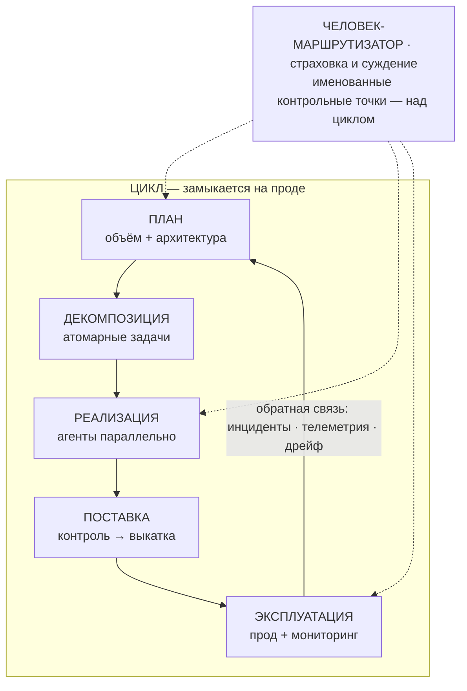

# Как читать этот курс

Строить софт силами целой флотилии кодовых агентов — это не задача про промпты. Это задача про проверку. Генерация стала дешёвой, а проверка — нет. В основе всего, чему учит этот курс, лежат механизмы, которые позволяют масштабировать проверку. И описанный здесь цикл обучения должен замыкаться на **проде**, а не на внутреннем QA. Если до начала уроков ты запомнишь только одну мысль, пусть это будет она. От твоей способности проверять результат — а не от способности модели его производить — зависит, имеет ли вся эта скорость хоть какую-то ценность.

:::tip[▶ Видео]

<YouTube id="4wMRXmLpdA8" title="AI in the SDLC: Rethinking AI Coding Tools & AI Agents — IBM Technology" />

IBM разбирает тот же сдвиг в жизненном цикле разработки: инструменты для написания кода уже не просто предлагают варианты в режиме автодополнения — они действуют как агенты. (Видео на английском.)

:::

## Карта всего курса

Вся аргументация умещается в одну схему. Читай её как цикл: главное здесь — стрелка, которая возвращает данные из эксплуатации в планирование.

Полоса наверху — зона ответственности человека. В принятой терминологии это **человек-в-цикле (human-in-the-loop, HITL)**. В этом курсе он называется **человеком-маршрутизатором**: он находится над циклом и в нескольких именованных контрольных точках отвечает за страховку и суждение, а не становится ещё одним этапом внутри цикла. Именно это показывают пунктирные линии: человек подключается к работе в выбранных местах стыковки, а не повсюду.

На схеме намеренно нет отдельных блоков для трёх вещей — иначе она подталкивала бы к неверному выводу:

:::note[Учитывай то, что схема намеренно не заключает в блоки]

- **Проверка** — не отдельный этап. Она встроена в каждый стык цикла: ревью между людьми, критический разбор сгенерированной работы, автоматический контроль, который либо допускает результат, либо блокирует его. Если поместить проверку в отдельный блок, возникнет соблазн «выполнить этап проверки» и двигаться дальше. Так не получится: проверка происходит между блоками, а не внутри них.
- **Фундамент** (Часть I, в которой ты сейчас находишься) лежит под всем циклом: память проекта, правила как код и артефакты как единственный интерфейс между этапами. Всё это должно быть готово ещё до того, как агент напишет первую строку.
- **Три уровня зрелости** (соло · команда · энтерпрайз) применимы к каждому элементу — рассматривай каждый из них на всех трёх уровнях зрелости. Сама практика не меняется; растёт механизм, который обеспечивает её соблюдение.

:::

*Эта карта и есть оглавление.* Верхний ряд — планирование, декомпозиция, реализация, поставка и эксплуатация — охватывает Части II–IV, то есть саму работу. Фундамент — это Часть I. Три уровня зрелости — Часть V. Та же схема появляется в начале каждой Части с выделенным фрагментом, который ей посвящён, поэтому ты всегда видишь, где находишься.

## Честный тезис и честный метод

Объём результата измеримо вырос. Выросла ли его *ценность* — пока не установлено. А положительным окажется итоговый эффект или отрицательным — решает способность команды проводить ревью и проверку. Это не уклончивое утверждение: к такому выводу приводят даже самые убедительные цифры в пользу AI. Исследователи Microsoft получили один из крупнейших измеренных приростов пропускной способности в этой области. И всё же они пишут, что влитый pull request — не то же самое, что принесённая им ценность, а общепринятых способов измерять эту разницу пока нет.

Поэтому курс предлагает не готовый вывод, а метод:

- Каждому утверждению присваивается категория: `MEASURED`, `REPORTED` или `ASSERTED` (измерено / сообщено / заявлено). Первая означает, что результат получен в контролируемом исследовании, вторая — что о нём сообщают практики, третья — что кто-то приводит его как аргумент. Категория всегда указана прямо в тексте: она не исчезает незаметно, позволяя заявлению сойти за факт. (Полностью эта система категорий описана в Уроке 2.)
- Каждое число ведёт к первичному источнику с датой. К цифрам поставщиков применяется простое правило: тот, кто продаёт инструмент, не должен сам оценивать его эффективность.
- Вторичный слой источников искажает картину в *обе* стороны: сторонники раздувают результаты, а скептики цепляются за устаревшую цифру и продолжают повторять её как неизменную. Решение в обоих случаях одно: обратиться к первоисточникам, присвоить найденному категорию и прямо её указать. Именно такой подход здесь и преподаётся.

Через весь курс проходит единая рамка — **три уровня зрелости**: практика остаётся неизменной, а механизм масштабируется. Для каждого механизма контроля уроки сначала формулируют инвариант, затем описывают реализацию на каждом уровне и, наконец, называют конкретный сбой, от которого защищает переход на следующий уровень. Объяснения в духе «у энтерпрайзов просто больше денег» здесь не будет. Более точная версия этой идеи повторяется на протяжении всего курса: чем дальше механизм контроля находится от радиуса поражения, тем важнее для него *доказательство*; чем ближе — тем важнее *способность действовать*.

## Почему цикл, а не конвейер

Многие схемы — включая практические материалы, на которые опирается этот курс, — изображают конвейер, заканчивающийся на «проде» и не возвращающий обратную связь. Курс старается исправить этот недостаток. Главный структурный пробел в нынешних текстах состоит в том, что цикл обучения замыкается на внутреннем QA, а не на эксплуатации живой системы. В хорошо организованном цикле неудачное изменение обнаруживает и откатывает *сама система* — ещё до того, как пользователю придётся пожаловаться.

Есть измеренный сигнал, что ценность скрывается именно в замыкающей цикл обратной связи. В отчёте DORA за 2025 год внедрение AI отрицательно связано со *стабильностью* поставки: ускорение может обнажать слабые места на последующих этапах. Но читай этот результат внимательно: категория `MEASURED` применима здесь лишь в слабом смысле — это опрос примерно 5000 респондентов, которые сами оценивали свой опыт. Это восприятие, а не телеметрия, и оно не позволяет утверждать ни «AI ускоряет команды», ни «AI замедляет команды». Из него следует ровно одно: замыкающая цикл обратная связь заслуживает того внимания, которое ей уделяют Части IV и V.

И последнее честное замечание о самой схеме. Это организационная рамка категории `ASSERTED` — собственный способ курса упорядочить материал, а не доказанно оптимальный жизненный цикл. Используй её для навигации, но не ссылайся на неё как на установленный результат.

## Куда двигаться дальше

Часть I — это фундамент из пяти уроков:

1. **[Узкое место проверки (verification bottleneck)](./part-1-foundation/verification-bottleneck.md)** — приведённый выше тезис с доказательной базой.
2. **[Как читать доказательства](./part-1-foundation/reading-the-evidence.md)** — шкала категорий и то, как вторичный слой источников искажает картину в обе стороны.
3. **[Подготовка важнее модели](./part-1-foundation/preparation-over-model.md)** — почему то, что ты передаёшь агенту, важнее того, какому агенту ты это передаёшь.
4. **[Память проекта и слои знаний](./part-1-foundation/project-memory-and-tiering.md)** — устойчивый контекст, с которым работает флот агентов.
5. **[Правила, которые соблюдаются](./part-1-foundation/rules-that-hold.md)** — как превратить договорённости в ограничения, исполнение которых обеспечивает машина.

Начни с Урока 1: он доказывает тезис, на котором построен весь остальной курс.
