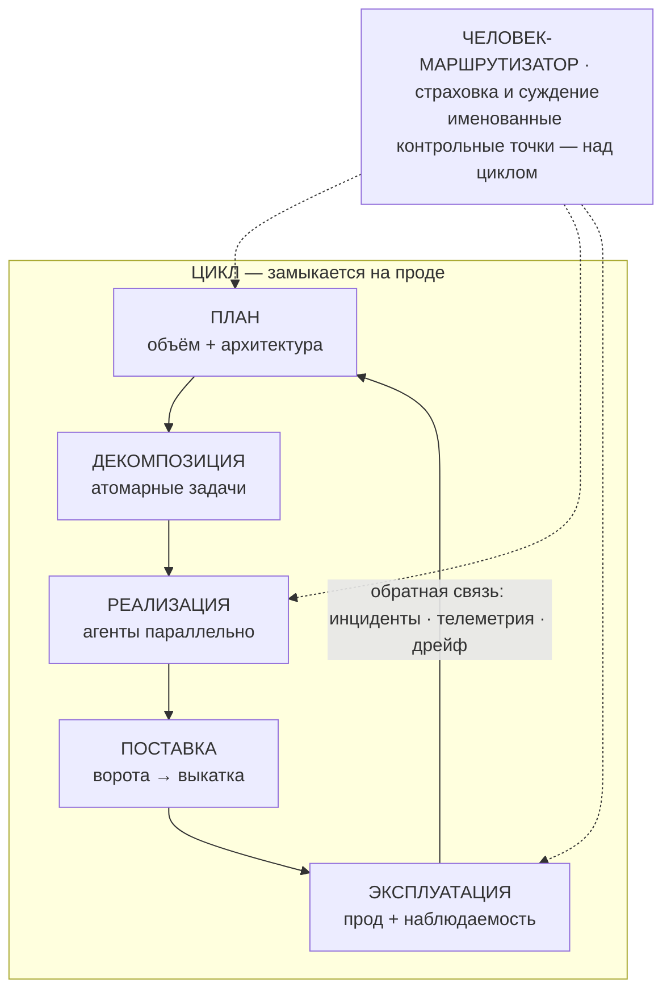

# Как читать этот курс

Этот курс — о том, как строить софт, когда заметную часть работы берут на себя флотилии кодовых агентов. Тезис
короткий: собрать такую систему — это не задача про промпты, это задача про проверку. Генерация
подешевела почти до нуля; проверка — нет. Всё, чему учит курс, — это механизмы, которые заставляют
проверку масштабироваться. Проверка и есть **узкое место (verification bottleneck)** — то, во что упирается пропускная способность. И учебный цикл здесь замыкается на **проде**, а не на внутреннем QA. Пока изменение не побывало в бою, ты не знаешь, чего оно стоит.

:::tip[▶ Видео]

<YouTube id="4wMRXmLpdA8" title="AI in the SDLC: Rethinking AI Coding Tools & AI Agents — IBM Technology" />

IBM задаёт ту же рамку: инструменты и агенты меняют не отдельный шаг, а весь жизненный цикл разработки.
(Видео на английском.)

:::

## Одна карта на весь курс

Над всем этим — человек. В комьюнити его роль называют **человек-в-цикле (human-in-the-loop, HITL)**. На
карте он подписан как **человек-маршрутизатор**: не стадия внутри цикла, а страховка и суждение над ним — в
именованных контрольных точках.

Карта нарочно не рисует три вещи отдельными блоками — и именно поэтому читается правильно:

:::note[Чего на карте нет квадратиками — и почему]

- **Проверка** вплетена в каждый шов цикла: ревью, критик, исполняемые ворота. Нарисовать её блоком
  значило бы соврать — проверка не стадия, она проходит сквозь все стадии.
- **Фундамент** (Часть I) лежит под всем циклом: память проекта, правила как код, артефакты как
  единственный интерфейс между стадиями.
- **Три уровня зрелости (three maturity tiers):** каждый элемент читается на трёх масштабах — соло, команда,
  энтерпрайз.

:::

И ещё одно, важное: *карта — это оглавление.* Верхний ряд (ПЛАН → ЭКСПЛУАТАЦИЯ) — это Части II–IV, сама
работа. Ряд фундамента — Часть I, вот эта: что должно быть верно, прежде чем агент напишет первую строку.
Три уровня зрелости — Часть V. Та же карта появится на входе в каждую Часть, с подсвеченным её куском, —
«ты здесь».

Почему цикл, а не конвейер? Поправка честная, без бахвальства. Тут уместен первый уровень:
`ASSERTED` — заявлено (в отличие от `MEASURED`, измерено, и `REPORTED`, сообщено; саму лестницу
доказательности вводит Урок 2). Так вот. Большинство опубликованных схем рисуют конвейер, который
заканчивается на «проде» и никогда не подаёт сигнал назад. Это касается и корпуса работ практиков, на
который опирается курс. Самый крупный структурный пробел в этих текстах в том, что учебный цикл у них
замыкается на внутреннем QA и никогда не доходит до прода.

А то, что цена именно в обратной связи, подтверждает и измерение. `MEASURED` DORA 2025 фиксирует отрицательную
связь между внедрением AI и стабильностью поставки: ускорение способно обнажать слабости ниже по потоку. Но
читай это число честно. DORA — самоотчётный опрос примерно 5000 человек, восприятие, а не телеметрия. Так к
нему и относись.

## Честный заголовок и честный метод

Заголовок, если совсем коротко: кода на выходе стало измеримо больше; стало ли больше ценности — не
установлено. И знак этой разницы решает ровно одно — сколько у тебя ёмкости на ревью и проверку. Это
тезис, который доказывает Урок 1.

Чем курс отличается — тем, что стоит на честности:

- Каждое утверждение градуировано — `MEASURED` / `REPORTED` / `ASSERTED`, — и уровень назван прямо в
  тексте, а не подменён по дороге. Полностью лестницу вводит Урок 2.
- За каждым числом — первоисточник с датой; числа вендоров читаются через простую поправку: тот, кто
  продаёт инструмент, не может сам же его беспристрастно измерить.
- Вторичный слой искажает картину в обе стороны — и у энтузиастов, и у скептиков. Метод один: идти в
  первоисточники, градуировать найденное, и говорить об этом вслух. Эта опора и есть содержание.

Три уровня зрелости проходят через весь курс: практика постоянна, масштабируется механизм. Для каждого
приёма — инвариант, затем механизм на каждом уровне и конкретный провал, который апгрейд предотвращает
(никогда не «на энтерпрайзе просто богаче»). И сквозной закон: чем дальше контроль от радиуса
поражения, тем больше он про доказательство; чем ближе — тем больше про способность поймать сам баг.

Курс держит в голове три аудитории разом: тех, кто смотрит портфолио, любого инженера, кто просто учит
тему, и самого автора, которому курс останется долгим справочником. Поэтому здесь объясняют, почему это так, и разбирают режимы отказа, а не
перечисляют фичи.

## Дальше — Часть I

Часть I — это фундамент, пять уроков:

1. **[Проверка — узкое место](./part-1-foundation/verification-bottleneck.md)** — тезис курса, выведенный из
   доказательств.
2. **Как читать доказательства отрасли** — та самая лестница `MEASURED` / `REPORTED` / `ASSERTED` в работе.
3. **Подготовка важнее модели** — почему то, что подаёшь агенту, весит больше, чем выбор самой модели.
4. **Память проекта и уровни знаний** — долгая контекстная опора, с которой работает флотилия.
5. **Правила, которые держат** — как превратить договорённости в ограничения, соблюдение которых обеспечивает машина.

Обратную связь — ту самую грань «цикл замыкается на проде» — разворачивают уже Части IV и V; здесь она
только обозначена, не разобрана.

А если Часть I ещё в работе — [курс про RAG и агентов](/rag-agents/) уже готов целиком, на английском,
русском и словацком.
