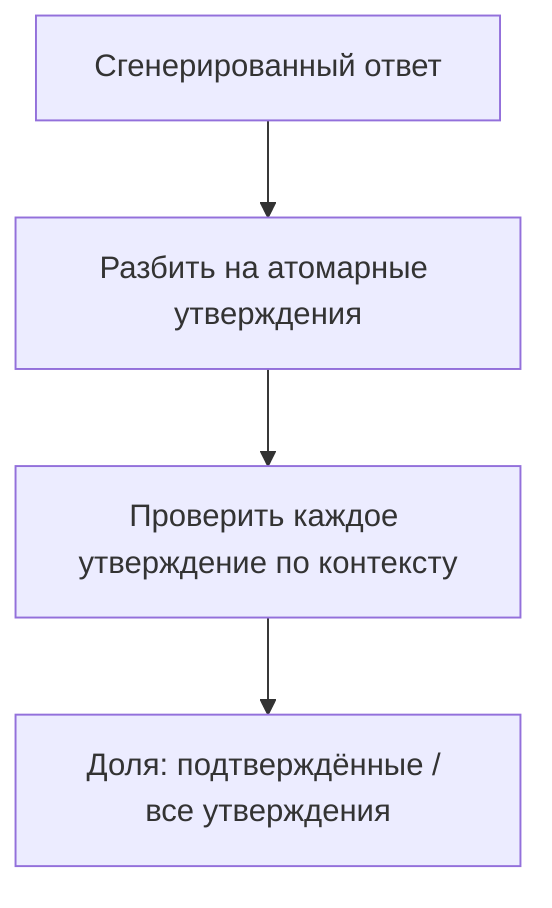

# Судья внутри метрики: как считается число, как калибруют самого судью и на какой разметке всё стоит

[Часть 1](./index.md) задала рамку: retrieval и generation оценивают порознь; без golden set ничего не
померить; свободный текст судит LLM-as-a-judge; у судьи есть предвзятость, и его вердикты надо сверять с
людьми; мерить нужно и офлайн (регрессии в CI), и онлайн. Всё это здесь предполагается известным. Второй
проход вскрывает внутреннее устройство: (а) что каждая названная метрика считает внутри, (б) как калибруют
того самого судью, которому Часть 1 велела не доверять, и (в) откуда берётся человеческая разметка, на которой
стоят и метрики, и судья.

Граница урока задана жёстко, как в углублениях [Retrieval](../../retrieval/index.md) и
[Generation](../../generation/index.md). Эта страница — про измерение. Как чинить поиск и генерацию, разбирают
сами слои; здесь под микроскопом сам измерительный прибор. И несущая мысль всей
страницы вот в чём: почти все современные RAG-метрики — это переодетые LLM-судьи, поэтому метрика наследует
всю ненадёжность судьи. Оттого калибровка и человеческая разметка — не необязательная добавка сверху, а
фундамент, на котором держится любое число.

## Что на самом деле считает каждая метрика

В Части 1 имена метрик работали как чёрные ящики: «faithfulness», «релевантность ответа». На уровне мастерства
этого мало — надо знать, что именно каждая из них вычисляет, потому что способ подсчёта и говорит, что число
ловит, а что пропускает. У каждой есть задокументированное слепое пятно, и находится оно ровно там, куда не
дотягивается её формула.

Опорный инструмент здесь — **[Ragas](https://ragas.io)**, эталонная реализация метрик для RAG из статьи
«Ragas: Automated Evaluation of Retrieval Augmented Generation» (Es и др., arXiv 2309.15217, 26 сентября
2023). Назвать его важно не ради бренда: эти четыре метрики — общепринятая в отрасли декомпозиция качества,
не фирменный рецепт одного вендора.

Четыре метрики раскладываются по двум осям. Первая — **стадия**: retrieval-метрики (context precision, context
recall) против generation-метрик (faithfulness, релевантность ответа); это продолжение правила Части 1 «мерить
две стадии порознь». Вторую ось Часть 1 не проводила, хотя на практике решает именно она — **нужен ли эталон**.
Одним метрикам хватает вопроса, найденного контекста и ответа; другим нужен эталонный ответ — то, что *должно*
было получиться. Без эталона (reference-free) считаются faithfulness и релевантность ответа (и context
precision, если релевантность чанка определяет LLM); с эталоном (reference-based) — context recall: чтобы понять,
всё ли нужное вернул поиск, надо заранее знать, что такое «всё нужное».

| | Без эталона (reference-free) | С эталоном (reference-based) |
|---|---|---|
| **Generation-метрики** | faithfulness, релевантность ответа | — |
| **Retrieval-метрики** | context precision | context recall |

### Faithfulness: разобрать ответ на утверждения и проверить каждое

**Faithfulness** (насколько ответ опирается на найденный контекст) отвечает на вопрос, который Часть 1 и слой
генерации только пообещали формализовать: держится ли ответ на контексте или сочиняет сверх него. Считается в
три шага:

1. **Декомпозиция на утверждения.** LLM разбивает сгенерированный ответ на отдельные атомарные утверждения.
2. **Проверка.** Каждое утверждение LLM сверяет с найденным контекстом: выводится оно из контекста или нет —
   да/нет.
3. **Доля.** `faithfulness = утверждений, подтверждённых контекстом / всего утверждений в ответе`. Диапазон
   от 0 до 1.

Пример из документации Ragas. Ответ на вопрос «Где и когда родился Эйнштейн?» распадается на два утверждения:
место рождения и дата — «14 марта 1879 года». Если контекст подтверждает только место, faithfulness = 1/2 =
0,5.

Слепое пятно тут принципиальное: faithfulness меряет опору на контекст, а не правоту ответа. Утверждение,
честно опертое на *неверный* контекст, получит балл 1,0 — метрика довольна, а ответ ложный. И раз сама
faithfulness — это LLM-конвейер (разобрать плюс проверить), её число наследует ошибки LLM: промах в
декомпозиции или неверное решение «выводится / не выводится» сдвигает балл. Итог: faithfulness ловит
generation-провал из слоя генерации — когда модель подменяет контекст памятью. Но один класс ей не по зубам:
ответ, верный по форме, но опертый на кривой контекст.

### Релевантность ответа: восстановить вопрос из ответа

**Релевантность ответа** (answer relevance) меряет, отвечает ли он на заданный вопрос по существу, — не
путать с фактической верностью. Считается обратной задачей:

1. По сгенерированному ответу LLM порождает N искусственных вопросов (по умолчанию около трёх) — таких,
   ответом на которые служил бы этот ответ.
2. Для каждого порождённого вопроса и для исходного считают эмбеддинг; затем — косинус между каждым
   порождённым и исходным.
3. `релевантность ответа = (1/N) · Σ cos(порождённый_i, исходный)` — среднее этих косинусов.

Интуиция простая: по релевантному ответу исходный вопрос восстанавливается легко, а уклончивый или
разбавленный ответ порождает вопросы, уползающие в сторону, — и среднее проседает. Так метрика штрафует и
неполноту, и воду.

Слепое пятно названо в самой метрике: фактическую верность она не проверяет вовсе — только совпадение по
намерению. Значит, faithfulness и релевантность ответа вдвоём (обе без эталона) говорят «оперт на контекст» и
«по делу», но ни та ни другая не говорит «верно». Для «верно» нужен эталон или человек. Это и есть подлинный
потолок оценки без эталона.

### Context precision: релевантное — наверху ли

**Context precision** (точность контекста) спрашивает: среди найденных чанков — стоят ли релевантные
*наверху*? Метрика учитывает ранг, в отличие от простой доли релевантных. Считается как взвешенное среднее по
позициям:

- Precision@k = (релевантных чанков в top-k) / k.
- `Context Precision@K = Σ_k (Precision@k · v_k) / (всего релевантных в top-K)`, где `v_k ∈ {0,1}` отмечает,
  релевантен ли чанк на позиции k.

Как это ведёт себя на практике (из документации): переставь единственный нерелевантный чанк с позиции 2 на
позицию 1 — и балл падает с ~1,0 до ~0,5. Позиция решает. Это та метрика, что вознаграждает работу реранкера
из слоя [Retrieval](../../retrieval/index.md) — правильный порядок выдачи.

### Context recall: вернулось ли всё, что нужно ответу

**Context recall** (полнота контекста) спрашивает: принёс ли поиск *всё*, что нужно верному ответу? Это
метрика, которая напрямую меряет retrieval-провал из Части 1 — нужный чанк так и не нашёлся. А чтобы знать,
что такое «всё нужное», ей нужен эталон, — поэтому она считается с эталоном (reference-based). Подсчёт тоже
опирается на LLM:

1. Разбить эталонный ответ на утверждения.
2. Для каждого эталонного утверждения проверить, подтверждается ли оно найденным контекстом.
3. `context recall = эталонных утверждений, подтверждённых контекстом / всего эталонных утверждений`.

Почему это важно: recall Часть 1 назвала «главной для RAG». Низкая полнота контекста означает, что генерация
физически не сможет ответить, как бы хороша она ни была. И раз метрике нужен эталон — golden set из раздела
ниже перестаёт быть опцией для retrieval-стороны.

И вот что связывает все четыре: три из них — сами по себе LLM-конвейеры (разобрать, проверить, породить
вопросы). Метрика *и есть* судья. Значит, число из Ragas надёжно ровно настолько, насколько надёжен считающий
его судья.

## Калибровка судьи, которому велели не доверять

Часть 1 сказала: у судьи есть предвзятость, сверяй его с людьми. Это — *что*. Здесь — *как*: как называются
искажения, какие есть два протокола оценивания и что конкретно значит «сверить с людьми». Опора — статья
«Judging LLM-as-a-Judge with MT-Bench and Chatbot Arena» (Zheng и др., arXiv 2306.05685, 9 июня 2023),
которая и ввела метод, и дала имена его сбоям.

### У предвзятостей судьи есть имена

**Position bias** (предпочитает первый ответ) — судья тянется к ответу, показанному *первым* (или в
фиксированном слоте), независимо от содержания. Лечение: прогонять каждое попарное сравнение в оба порядка и
засчитывать победу, только если вердикт держится при перестановке; развернулся при обмене местами — это шум.
Это стандартная поправка MT-Bench.

**Verbosity bias** (длиннее — значит лучше) — судья ставит выше более длинный, развёрнутый ответ, даже когда
лишняя длина не добавляет ничего верного. Лечение: критерии оценки, которые премируют содержание и игнорируют
объём, и внимание к характерному признаку — баллу, что ползёт вслед за длиной.

**Self-preference**, он же self-enhancement (свой стиль выше) — судья выше оценивает тексты в *собственном*
стиле, часто генерации своего же модельного семейства. Лечение: брать судью из другого семейства, чем система
под проверкой, либо откалибровать поправку по человеческим меткам.

И четвёртое, не преувеличивая: статья отмечает слабость в рассуждении и математике — на задачах, требующих
трудных рассуждений, LLM-судья ненадёжен как оценщик. То есть судья слабее всего ровно там, где задача труднее
всего. Это скорее потолок компетентности, чем направленный перекос, — держи его особняком от трёх
предвзятостей выше.

Общее у тех трёх одно: это систематические перекосы. Случайный шум усреднился бы на большем числе примеров, а
систематический перекос — нет: сколько оценок ни прогони, он никуда не денется. Правят его устройством
протокола и калибровкой.

### Pointwise и pairwise: два протокола

**Pointwise** (по одному ответу за раз) — судья выставляет одному ответу абсолютный балл по критериям (можно с
эталоном в промпте — оценка с эталоном). Дёшево, масштабируется, балл абсолютный — но абсолютные баллы плывут
от прогона к прогону и трудно сопоставимы между запусками.

**Pairwise** (попарное сравнение) — судье показывают два ответа, он выбирает лучший (или ничью). Для
*ранжирования* двух систем это надёжнее: на «A лучше B» люди сходятся охотнее, чем на абсолютных баллах. Зато
ранжировать много систем — это O(n²) сравнений, и именно pairwise уязвимее всех к position bias
(оттого и поправка перестановкой).

Как выбирать: pairwise — под вопрос «побила ли версия B версию A» (A/B, выбор модели); pointwise — под
абсолютные пороги «достаточно ли хорош этот ответ» в CI. Оценка с эталоном (reference-guided) в pointwise —
золотая середина, когда эталонные ответы у тебя есть.

### Что значит «сверить с людьми»

**Калибровка** — это измерить согласие судьи с человеческими метками на выборке, *прежде* чем доверять его
числам в масштабе. Ориентир для цитирования: сильные судьи (в статье — GPT-4) достигают свыше 80% согласия с
человеческими предпочтениями — примерно столько же, сколько согласие двух людей между собой (arXiv
2306.05685). Эти 80% и есть честная рамка: LLM-судья примерно так же стабилен, как человек, но не оракул.

Процедура. Отложи размеченный людьми срез; посчитай согласие «судья ↔ человек» (а для pairwise — ещё и
устойчивость к перестановке позиций); если согласие достаточно высокое — применяй судью к тысячам
примеров; если нет — правь критерии, меняй протокол или саму модель-судью и мерь заново. Калибруют по golden
set — им и завершается урок.

Когда НЕ надо. Не доверяй абсолютным баллам некалиброванного судьи. Не бери судью того же семейства, что и
система, для сравнений, чувствительных к self-preference. Не пускай pairwise на ранжирование многих систем, не
заложив на O(n²) и на position bias.

## Разметка, на которой всё держится

И метрики (context recall требует эталона), и судья (нужно согласие с людьми, чтобы калиброваться) упираются в
одно и то же — в размеченную людьми истину, golden set. Часть 1 сформулировала: собирай его руками или
синтетически, чистота важнее объёма. Здесь — как собрать его до качества, по которому можно калиброваться.

### Как собирают golden set

Пример из golden set — это вопрос плюс эталон: релевантные чанки и/или верный ответ. Два способа его добыть:

- **Ручной** — размечают эксперты предметной области. Высшее качество, самый медленный путь.
- **Синтетический** — LLM порождает пары «вопрос–ответ» по корпусу, а дальше человек вычитывает и правит
  каждую (человек-в-цикле, human-in-the-loop, HITL). Генерацию это масштабирует, но истиной пару делает именно
  человеческая проверка. Невычитанный синтетический набор эталоном не становится — это просто ещё немного
  вывода модели.

Чистота важнее объёма — теперь с причиной. Golden set — это линейка, которой меряют всё остальное. Ошибка в
самой линейке незаметно искажает каждую метрику и каждую калибровку судьи, посчитанную по ней. Маленький, чистый,
представительный для домена набор бьёт большой и шумный, потому что шум в линейке ничем не ограничен ниже по
конвейеру.

### Согласие между разметчиками

Если два эксперта расходятся в том, верен ли ответ, метка ещё не истина. Поэтому согласие между разметчиками
меряют напрямую — это **согласие между разметчиками** (inter-annotator agreement, IAA). Канонические статистики (по
одной строке; ссылки — в глоссарии):

- **Cohen's kappa** (каппа Коэна) — согласие *двух* разметчиков, поправленное на случайное совпадение: сырой
  процент согласия завышает, ведь часть совпадений выпадает по удаче. `κ = (p_o − p_e) / (1 − p_e)`.
- **Fleiss' kappa** (каппа Флейсса) — обобщение на *более чем двух* разметчиков.

Зачем поправка на случайность. На бинарной метке двое разметчиков совпадут примерно в половине случаев одним
лишь подбрасыванием монеты — так что «мы согласились в 80% случаев» может оказаться слабым результатом; каппа
вычитает ожидаемое-по-случайности согласие. Низкая каппа — сигнал править критерии оценки (инструкции
разметки двусмысленны); переубеждать разметчика — не выход. Это та же дисциплина критериев, что и у судьи
выше: круг замыкается — двусмысленные критерии бьют и по человеческой разметке, и по LLM-судье.

### Активный сэмплинг: тратить дефицитный ресурс с умом

Человеческая разметка — дорогой и дефицитный ресурс, поэтому размечают выборочно: **активный сэмплинг**
(active sampling), он же **активное обучение** (active learning), берёт те примеры, чьи метки *информативнее*
всего. Конкретно: размечать там, где судья меньше всего уверен; где ансамбль судей
*расходится*; где прод вскрыл сбой (петля «онлайн → офлайн» из Части 1). Отбор по неопределённости даёт больше
сигнала для калибровки на каждый человеко-час, чем равномерная случайная выборка.

Отдача — это петля: активно отобранные человеческие метки → лучше golden set → лучше калибровка судьи →
надёжные метрики в масштабе → и цикл eval-driven development из Части 1 наконец держится. Человеческий труд
здесь — семя, из которого судья выращивает тысячи примеров.

Честный предел. Человека из петли не убирают — его труд тиражируют. Судья масштабирует человеческое суждение,
но не заменяет те метки, по которым его калибровали. И калибровку надо повторять, когда дрейфует модель,
корпус или распределение вопросов: судья, выверенный в прошлом квартале, успевает устареть. Вся конструкция
стоит так: люди задают истину на маленьком чистом наборе → набор калибрует судью и даёт опору эталонным
метрикам → откалиброванный судья масштабирует измерение → а ты периодически подсыпаешь свежую человеческую
разметку.

## Что забрать из урока

- Метрики Ragas — не чёрные ящики: faithfulness = подтверждённые утверждения / все утверждения; релевантность
  ответа = среднее косинусов между вопросами, восстановленными из ответа, и исходным вопросом; context
  precision = точность, взвешенная по рангу; context recall = подтверждённые эталонные утверждения / все
  эталонные.
- Их раскладывают две оси: стадия (retrieval против generation) и нужен ли эталон. Faithfulness и
  релевантность ответа обходятся без эталонного ответа, context recall — нет.
- Три метрики из четырёх сами устроены как LLM-конвейеры — метрика и есть судья, поэтому её число наследует
  ненадёжность судьи; оттого калибровка не опция.
- Метрики без эталона говорят «оперт на контекст» (faithfulness) и «по делу» (релевантность ответа), но ни
  одна не говорит «верно» — верность требует эталона или человека.
- Предвзятости судьи систематические, а значит, с ростом числа примеров не усредняются: position bias
  (перестановка с требованием устойчивости), verbosity bias, self-preference.
- Pairwise надёжнее ранжирует две системы (но это O(n²) и он падок на position bias); pointwise даёт
  абсолютные пороги в CI; калибруй любой из них по людям — судьи уровня GPT-4 достигают свыше 80% согласия с
  людьми, примерно человеческого уровня, оракулом судья не становится.
- Golden set — линейка, на которой стоит всё: мерь согласие между разметчиками поправленной на случайность
  каппой, трать человеческий бюджет активным сэмплингом и перекалибровывай при дрейфе.

**[Новые термины](../../../glossary.md)**: context precision, context recall, faithfulness,
релевантность ответа, reference-free vs reference-based eval, LLM-judge calibration, position bias, verbosity bias, self-preference /
self-enhancement bias, pointwise vs pairwise, inter-annotator agreement (IAA), Cohen's kappa, Fleiss' kappa,
active sampling / active learning.
