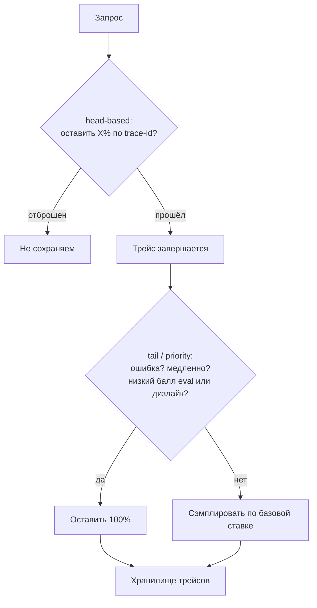
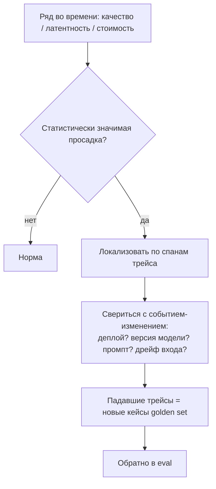

# Наблюдаемость под нагрузкой: что оставить в логах, за чем следить и когда будить дежурного

[Часть 1](./index.md) заложила примитив и рамку: трейс (trace) — полная запись одного запроса, спан (span) на
каждом шаге конвейера; три столпа наблюдаемости — traces, metrics, logs; для RAG логируют своё — найденные
чанки со score, финальный промпт, сырой вывод, латентность, токены и стоимость по шагам; стоимость и
латентность — величины первого класса, а не то, о чём вспоминают постфактум; а прод-трейсы возвращаются в
eval новыми, самыми трудными кейсами. Всё это здесь предполагается известным. Второй проход — про то, что происходит с
наблюдаемостью (observability), когда трафик перестаёт быть тестовым: под нагрузкой ты не можешь сохранить
каждый трейс, не можешь хранить всё, что собрал, должен решить, за чем следить и когда поднимать человека
среди ночи, обязан уметь докопаться до причины просадки качества и не дать счёту за токены расти бесконтрольно.

Граница урока жёсткая. Эта страница — про саму систему наблюдаемости как объект эксплуатации. Она не
переизобретает примитив трейса (он в Части 1), не каталогизирует инструменты наблюдаемости — это
[урок про экосистему инструментов](../../../part-3-production/tooling-ecosystem.md) Части III — и не учит
чинить сам конвейер: как лечить retrieval-провал и generation-провал, разбирают слои
[Retrieval](../../retrieval/index.md) и [Generation](../../generation/index.md). Здесь под микроскопом — то,
чем ты наблюдаешь, а не то, за чем.

В проде наблюдаемость перестаёт быть бесплатным зеркалом системы и
сама становится системой — со своей стоимостью, своими требованиями к приватности и своими способами подвести.
Мастерство здесь не в том, чтобы собрать больше данных, а в том, чтобы решить, что оставить, что спрятать и на
что будить человека.

## Хранить каждый трейс нельзя

На проде, при реальном объёме трафика, хранить 100% трейсов запретительно дорого — и не нужно: ценность несёт
представительная выборка плюс всё интересное. Отбор этого подмножества и называется **сэмплированием трейсов**
(trace sampling). Весь вопрос — как решать, что оставить.

**Head-based sampling (решение на старте трейса)** делает выбор оставить или отбросить в самом начале, на
корневом спане, — обычно детерминированной долей по идентификатору трейса (например, оставлять 10%). Дёшево,
без состояния, объём предсказуем. Но у него встроенный изъян: в начале трейса исход ещё неизвестен. Ты не
знаешь, упадёт ли запрос с ошибкой или окажется медленным, — а значит, не можешь предпочтительно оставить
именно сбои. Чистое head-сэмплирование выбрасывает как раз те трейсы, которые тебе нужнее всего.

**Tail-based sampling (решение по завершении трейса — по всему собранному трейсу)** переворачивает порядок:
коллектор буферизует все спаны трейса, дожидается его завершения и только тогда решает — уже зная латентность,
статус ошибки, атрибуты спанов. Так в выборке оседает интересное: ошибки, медленные запросы, ответы, помеченные как плохие. Плата — состояние: коллектор держит спаны в памяти и группирует их по идентификатору трейса, а
значит, все спаны одного трейса должны попасть в один экземпляр коллектора (балансировка по `trace-id`), и
расходует заметно больше памяти и процессора. В сборке OpenTelemetry Collector Contrib этим занимается процессор
`tail_sampling`.

**Приоритетное сэмплирование** (priority sampling) — то, к чему сходятся зрелые команды: оставлять 100% того,
что терять нельзя ни при каких условиях (ошибки, пробитый бюджет латентности, ответы, помеченные как плохие), а
скучные успешные запросы сэмплировать по низкой базовой ставке. Частый рабочий рецепт — двухступенчатый:
сперва head-сэмплер срезает сырой объём, а дальше tail-сэмплирование выносит вердикт «оставить или отбросить»
по тому, что осталось.

Вся LLM-специфика — в слове «интересное». Для обычного сервиса интересное — это ошибка или высокая
латентность, и оба видны из HTTP-статуса. Для LLM-системы ответ с кодом 200 может оказаться галлюцинацией или
просто бесполезным — качество невидимо для статуса. Поэтому в приоритет для LLM-приложения обязан входить
сигнал качества: балл онлайн-оценки на трейсе, дизлайк пользователя, блок ограничителя, отказ. Вот почему
сэмплирование здесь завязано на петлю eval, а не только на ошибки и латентность: без сигнала качества ты будешь
исправно сохранять быстрые ответы с кодом 200, которые лгут.

## Приватность: самый отлаживаемый трейс — самый опасный

Самое полезное для отладки LLM-приложения — полный промпт и полный вывод модели — оно же и самое
чувствительное: там регулярно оседают пользовательские данные и **PII (персональные данные)**. Выходит
парадокс: самый отлаживаемый трейс — самый чувствительный с точки зрения приватности. Хранить всё, что ты
способен собрать, нельзя.

Стандарт признаёт это прямо: захват содержимого сообщений он делает включаемым по выбору (opt-in). В
семантических конвенциях OpenTelemetry для GenAI атрибуты с содержимым — входные сообщения и текст ответа — по
умолчанию выключены, и ради приватности, и ради объёма полезной нагрузки. Всегда включены только метаданные —
модель, число токенов, длительность, — а не сырой текст. То есть по умолчанию телеметрия несёт дешёвый и
безопасный слой, а дорогой и опасный ты добавляешь сознательно.

Дальше — защита слоями:

- **Маскирование PII** до попадания в хранилище трейсов. Тот же механизм, что и у слоя
  [Guardrails](../guardrails/deep-dive.md): распознаватель PII находит кандидатов, анонимайзер их преобразует
  (например, [Presidio](https://microsoft.github.io/presidio): стадия Analyzer, затем Anonymizer — механику
  разбирает углубление Guardrails). Сырой PII нельзя дать дойти до хранилища.
- **Срок хранения** (retention). Короткий TTL на спанах с содержимым: дешёвые метаданные держишь долго, сырой
  текст удаляешь быстро. Чем меньше он живёт, тем у́же окно утечки.
- **Контроль доступа** к интерфейсу трейсов. Промпты — это прод-данные пользователей; доступ к их запросам должен быть не у каждого в команде.
- **Само сэмплирование** сокращает объём того, что вообще подвержено утечке: меньше сохранённых трейсов —
  меньше сырого текста на руках.

Противоречие здесь в другом — обратимость маскирования. Необратимое (хеширование, удаление) максимизирует
приватность, но убивает отладку: ты уже не увидишь, что пользователь на самом деле спросил. Обратимое
(шифрование, псевдонимизация) оставляет путь назад для санкционированной отладки — но это и бо́льшая
ответственность: ключ становится хранимым секретом и мишенью (тот самый довод из углубления Guardrails). Выбор
делается по каждому полю и по каждому ярусу хранения отдельно, а не одной галочкой на всю систему.

## Дашборды, алерты и SLO для LLM-системы

Что показывает **дашборд** (dashboard) LLM-системы сверх обычных **золотых сигналов (golden signals)** сервиса
— латентности, трафика, ошибок, насыщения? Во-первых, привычное, но с LLM-акцентами: латентность в
перцентилях (p50 / p95 / p99) плюс TTFT — время до первого токена — для стриминга; стоимость и расход токенов
на запрос; пропускную способность; долю ошибок. А во-вторых — то, чего у обычного сервиса нет вовсе: качество
как полноценный график. Баллы онлайн-оценки на сэмплированном трафике (доля прошедших по faithfulness,
релевантность ответа), доля дизлайков, доля отказов, доля срабатываний ограничителя. Качество здесь —
полноценный график на дашборде, наравне с латентностью и стоимостью.

Отсюда — **SLI / SLO и бюджет ошибок**, рамка Google SRE, приложенная к LLM-системе. Выбираешь
**SLI (индикатор уровня сервиса)** — доступность, p95-латентность, долю прошедших по качеству, потолок
стоимости на запрос; ставишь **SLO (цель уровня сервиса)** — конкретную планку («p95-латентность < 3 с на
горизонте 30 дней», «faithfulness-прохождение ≥ 0,95»); а зазор от неё до 100% — это **бюджет ошибок** (error
budget), который тебе позволено потратить. LLM-специфический ход один: хотя бы один SLI должен быть про
качество и считаться онлайн-оценкой, а не только про доступность. Сервис, доступный на 100% и галлюцинирующий в 30%
ответов, укладывается в SLO по доступности и при этом подводит пользователя — зелёный дашборд над этим ничего
не значит.

Пороги **алертов** (alert). Будить надо на то, что чувствует пользователь, а не на каждое дрожание метрики: на
**скорость сжигания** (burn rate) бюджета ошибок (быстро сжигаешь — поднимай дежурного сейчас), на превышение
p95, на всплеск стоимости, на просадку качества, на скачок доли блокировок. Перебор с алертами — сам по себе
сбой: если алерт стоит на каждой метрике, настоящая регрессия тонет в шуме. Поэтому алертинг по скорости
сжигания — по симптому, который чувствует пользователь, — превосходит подход «порог на каждую метрику».

## Разбор регрессий: обнаружить и найти причину

Разобрать регрессию — значит сделать два разных дела: сперва её заметить, потом понять, что именно сломалось.
Трейсы дают и то, и другое.

Обнаружить. Онлайн-оценка на сэмплированных трейсах плюс обратная связь пользователей дают временной ряд
метрики качества. Статистически значимая просадка в этом ряду — это регрессия качества. Ровно так же — по
временным рядам латентности и стоимости. Дашборд из прошлого раздела и есть место, где эту просадку видно.

Найти причину. Поскольку трейс структурирован на спаны по стадиям, регрессию можно локализовать до
конкретной стадии, а не гадать. Это то самое разделение провалов Части 1 — retrieval-провал и
generation-провал, — но приложенное к прод-ряду во времени. Что проверить по записи трейсов: не просели ли
score поиска (переингест корпуса или смена индекса — это retrieval-провал)? не подменил ли провайдер модель
незаметно для тебя (тихо раскатил новую версию — сдвинулся `gen_ai.response.model`)? не менялся ли шаблон
промпта (был деплой)? не поехало ли распределение входа (пошли запросы нового рода — **дрейф** (drift) входного трафика)?
Дальше ты сопоставляешь начало регрессии с событием-изменением — деплоем, сменой фиксации версии модели,
переингестом. Саму фиксацию версии модели (model pinning) как приём разбирает [LLMOps](../../../part-3-production/llmops.md)
Части III; здесь она нужна лишь как одна из версий «что изменилось».

Круг замыкается. Трейсы, которые пометила регрессия, — это ровно те трудные падавшие случаи, что должны стать
новыми кейсами golden set для eval (та самая петля observability → eval из Части 1, теперь операционная).
Разбор регрессий кормит eval; eval затем страхует починку — прогоном на CI, чтобы регрессия не вернулась. Как
устроены сами метрики и golden set, разбирает [углубление Evaluation](../evaluation/deep-dive.md); здесь важно
лишь, что цикл замкнут.

## Бюджеты стоимости и латентности

**Поштучный учёт токенов** (token accounting) начинается с простого равенства: стоимость запроса = входные
токены плюс выходные, каждый по цене своей модели. Конвенции OpenTelemetry GenAI дают под это готовые
инструменты: атрибуты `gen_ai.usage.input_tokens`, `gen_ai.usage.output_tokens`, `gen_ai.request.model` и
`gen_ai.response.model`, `gen_ai.operation.name`, `gen_ai.provider.name`; и метрики
`gen_ai.client.token.usage` (в единицах `{token}`) и `gen_ai.client.operation.duration` (в секундах). Оговорка
честности: на 2026 год в Semantic Conventions v1.41.x они в статусе Development (ещё не стабильны) и включаются
по выбору — `OTEL_SEMCONV_STABILITY_OPT_IN=gen_ai_latest_experimental`. Опираться на них можно, помня, что
имена ещё могут поехать.

**Атрибуция стоимости** (cost attribution) — размечай спаны признаками: фича, арендатор (tenant), маршрут,
модель. Тогда счёт отвечает на вопрос «какая фича (или какой клиент) сжигает бюджет», а не только «мы
потратили $X». Без атрибуции всплеск стоимости неотлаживаем: ты видишь, что счёт вырос, но не видишь, где. Те
же атрибуты OpenTelemetry выше и есть механизм разметки.

Бюджеты латентности. Ставь цели по p50 / p95 и раскладывай латентность по спанам — поиск, реранкинг,
генерация; TTFT и полное время, — чтобы превышение указывало на медленную стадию, а не на систему вообще.
Бюджет — это потолок; превышение поднимает алерт и включает рычаг оптимизации из Части 1: кэш, модель
подешевле, меньше чанков в промпте. Как ускорять сам инференс — отдельный разговор урока про
[сервинг](../../../part-3-production/serving/index.md).

Политику бюджета задаёт пара порогов. **Мягкий потолок** (soft cap) предупреждает и шлёт алерт; **жёсткий
потолок** (hard cap) действительно останавливает — отклоняет запрос, спускает на модель подешевле, урезает
контекст. Это предохранитель, срабатывающий во время выполнения, а не просто график: бюджет, который умеет
только отображаться на дашборде, ничего не гарантирует. Тот же приём, что бюджет шагов и токенов у агента в Части II, — только здесь
он про деньги и время.

## Когда наблюдаемость подводит

Наблюдать LLM-приложение может стоить как само LLM-приложение. Оставь 100% трейсов с содержимым — и счёт за
наблюдаемость сравняется со счётом за инференс: тот же объём токенов, только теперь ты ещё и хранишь их. Вот
почему сэмплирование на масштабе — не роскошь, а условие; и вот почему первым делом сэмплируют, а не собирают
всё «на всякий случай».

Само tail-сэмплирование на большом масштабе тоже недёшево и тяжело в эксплуатации: буферизация с состоянием,
балансировка по `trace-id`, память под недособранные трейсы — это заметное вложение в эксплуатацию, а не
бесплатная галочка. Инструмент, спасающий от расходов на хранение, сам стоит труда — закладывай это в проект заранее.

Логировать сырые промпты и ответы без маскирования — это комплаенс-инцидент, который просто ещё не случился:
PII утекает в хранилище трейсов и в интерфейс, где её видит вся команда. Маскируй до записи, а не «когда-нибудь
потом».

И две ловушки уже названы выше, но им место в этом же списке. Алерт на каждую метрику топит настоящую регрессию
в шуме — будить надо по симптому, а не по каждому датчику. А SLO качества, за которым не стоит живая
онлайн-оценка, — это доступность напоказ: зелёные дашборды над галлюцинирующим сервисом. Общее у всех пяти одно:
наблюдаемость сама — система, и относиться к ней надо как к системе, у которой есть стоимость, приватность и
способы подвести.

## Что забрать из урока

- Хранить каждый трейс дорого и не нужно — сэмплируй: head-based решает на старте (дёшево, но слеп к исходу),
  tail-based решает по готовому трейсу (ловит ошибки и медленные, но требует состояния и балансировки по
  `trace-id`), приоритетное оставляет 100% того, что терять нельзя, плюс низкую базу на остальное.
- Для LLM «интересное» включает качество: код 200 бывает галлюцинацией, поэтому в приоритет входит балл
  онлайн-оценки, дизлайк, блок ограничителя, отказ — сэмплирование завязано на петлю eval.
- Самый отлаживаемый трейс — самый опасный: полный промпт и вывод несут PII. Содержимое в OpenTelemetry GenAI
  выключено по умолчанию (включается по выбору); защищайся слоями — маскирование до записи, короткий срок
  хранения на содержимом, контроль доступа, само сэмплирование.
- Маскирование — выбор «обратимо или необратимо» по каждому полю: необратимое (хеш, удаление) бережёт
  приватность, но убивает отладку; обратимое (шифрование) оставляет путь назад, но делает ключ мишенью.
- Дашборд LLM-системы добавляет к золотым сигналам качество как график первого класса — баллы онлайн-оценки,
  доля дизлайков, отказов, блокировок — плюс латентность (p50 / p95, TTFT), стоимость и токены на запрос.
- SLI / SLO / бюджет ошибок по Google SRE, но хотя бы один SLI — про качество на онлайн-оценке: сервис со 100%
  доступности и 30% галлюцинаций укладывается в SLO по доступности и подводит людей. Алерти по скорости
  сжигания бюджета, а не на каждую метрику.
- Разбор регрессий: онлайн-оценка плюс обратная связь дают ряд качества → значимая просадка локализуется по
  спанам до стадии (retrieval-провал или generation-провал) → сопоставляешь с событием (деплой, смена версии
  модели, переингест) → падавшие трейсы становятся новыми кейсами golden set.
- Поштучный учёт токенов (атрибуты и метрики OpenTelemetry GenAI) плюс атрибуция стоимости по
  фиче/клиенту/маршруту/модели; бюджеты латентности раскладывают время по спанам; мягкий потолок предупреждает,
  жёсткий останавливает.
- Наблюдать LLM-приложение может стоить как само приложение — сэмплирование не опция; сырой лог без
  маскирования — отложенный комплаенс-инцидент; SLO качества без онлайн-оценки — доступность напоказ.

**Новые термины** → [Глоссарий](../../../glossary.md): head-based sampling, tail-based sampling, приоритетное
сэмплирование, message-content capture, срок хранения, golden signals, SLI / SLO, бюджет ошибок, скорость
сжигания, усталость от алертов, разбор регрессий, атрибуция стоимости, поштучный учёт токенов, бюджет
латентности, мягкий потолок / жёсткий потолок, OpenTelemetry GenAI conventions.
