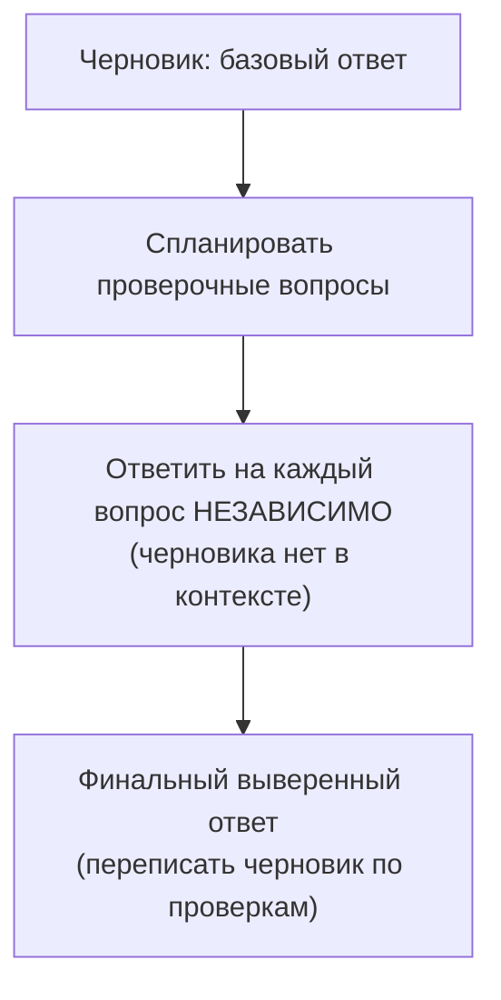
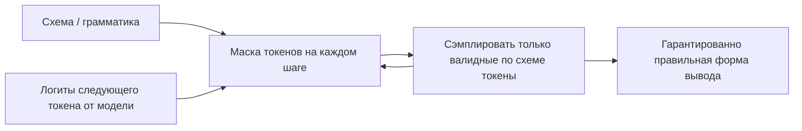

# Ответ, который проверяет сам себя: самопроверка, строгая схема и упаковка контекста

[Часть 1](./index.md) собрала слой генерации вокруг одной рамки — отвечать **из контекста, а не из
памяти** — и дала базовые рычаги: grounding-инструкции, цитаты по метаданным чанка, разрешённый отказ и
faithfulness как мостик к оценке. Здесь всё это предполагается известным; рамку generation-провала (нужный
чанк *был* в контексте, а ответ всё равно вышел кривой) заново не разбираем — на ней строим.

Граница урока задана жёстко, как в углублении Retrieval. Всё, что дальше, — генерация *в один проход*:
модель собирает один ответ из фиксированного контекста. Самопроверка на этой странице — это модель,
проверяющая *собственный черновик*, а не агент, заново идущий в поиск. В ту секунду, когда система
замыкает петлю и *повторно ищет*, потому что ответ сочли недостаточным, ты уже на территории итеративного,
агентного RAG — Self-RAG, CRAG, достаточность контекста, — а это [глубокий разбор Agentic
RAG](../../part-2-agents/agentic-rag/deep-dive.md). Здесь же — как выжать из единственного прохода максимум
качества, формы и проверяемости.

Карта страницы в одну строку: потратить вычисления, чтобы поймать собственные ошибки модели (самопроверка);
загнать ответ в разбираемую, цитируемую форму (структурированный вывод и цитаты); встретить конфликт
«контекст против памяти» в лоб; упаковать длинный контекст поверх правила lost-in-the-middle; и задать
форму ответа — формат, тон, длину — не позволив ей перебить опору на источники.

## Самопроверка: потратить вычисления, чтобы ловить собственные ошибки модели

Grounding-инструкция из Части 1 снижает *долю* галлюцинаций, но не проверяет ни один конкретный ответ — она
смещает модель, а не удостоверяет результат. Два опубликованных приёма тратят лишние вычисления во время
инференса, чтобы проверить сам ответ. Оба работают на стороне генерации, без повторного поиска, и оба
меняют токены и латентность на faithfulness (насколько ответ опирается на источники).

### Self-consistency: сэмплировать и голосовать

**Self-consistency (согласованность по выборке ответов)** (Wang и др., «Self-Consistency Improves Chain of
Thought Reasoning in Language Models», arXiv 2203.11171, март 2022; ICLR 2023) заменяет единственный жадный
проход chain-of-thought на другое: насэмплировать *разнообразный набор путей рассуждения* (температура выше
нуля), а потом *смаргинализировать по этим путям* — взять ответ большинством голосов. Интуиция простая: у
трудной задачи есть несколько верных дорог к рассуждению, и все они сходятся к одному правильному ответу, а
неверные ответы разбредаются кто куда.

Прибавки над жадным CoT, которые приводит статья: на GSM8K +17,9%, SVAMP +11,0%, AQuA +12,2%, StrategyQA
+6,4%, ARC-challenge +3,9%. Держи в уме, что это бенчмарки на рассуждение, а не на RAG.

В RAG приём ложится туда, где у ответа есть *дискретное, извлекаемое значение*, за которое можно
голосовать: число, имя, категория, «да / нет», опертые на контекст. Ты гоняешь N обоснованных генераций и
берёшь ответ большинства; одинокая расходящаяся генерация оказывается в меньшинстве и отбрасывается.

Когда НЕ надо. У открытого ответа в свободной форме нет единственного значения, за которое голосуют, —
маргинализировать не по чему, и self-consistency просто неприменим. И цена: приём умножает стоимость на N
(N полных генераций на запрос), так что это решение под латентность и бюджет, а не выбор по умолчанию.

### Chain-of-verification: сгенерировать и перепроверить

**Chain-of-verification / CoVe (цепочка проверок)** (Dhuliawala и др., «Chain-of-Verification Reduces
Hallucination in Large Language Models», arXiv 2309.11495, сентябрь 2023) — это явный цикл самодопроса в
четыре шага: (i) набросать *базовый черновик* ответа; (ii) *спланировать проверочные вопросы*, которые
фактчекают этот черновик; (iii) *ответить на каждый проверочный вопрос независимо*; (iv) собрать *финальный
выверенный ответ*, переписав черновик с учётом этих ответов.

Несущая деталь — независимость на шаге (iii), «факторизованная» проверка. На проверочные вопросы отвечают
*без черновика в контексте*, так что модель не может просто повторить ту самую ошибку, которую должна
поймать. Если бы она при «проверке» перечитывала свой же неверный черновик, она бы штамповала ошибку как
верную; изоляция каждого вопроса разрывает это эхо. Именно факторизованные варианты — где проверки отделены
от черновика — и дают снижение галлюцинаций; наивная слитная версия, где всё лежит в одном промпте,
затягивает ошибку обратно.

В RAG проверочные вопросы заново опираются на найденный контекст: каждый становится маленькой проверкой «а
это утверждение вообще подтверждается источниками?». CoVe превращает единственную grounding-инструкцию
Части 1 в явный поштучный аудит утверждений.

Контраст, чтобы закрепить. Self-consistency — *сэмплируй и голосуй*, без критики, нужен голосуемый ответ;
CoVe — *сгенерируй и перепроверь*, явный самодопрос, работает и на длинных ответах. Оба стоят лишних
проходов; ни один не ходит в поиск заново.



*Шаг с независимой проверкой — несущий: на вопросы отвечают без черновика в контексте, поэтому модель не
может перечитать и заново подтвердить собственную ошибку.*

## Структурированный вывод и принудительные цитаты: строгий декодинг

Часть 1 просила модель цитировать и отвечать чисто. На уровне мастерства ты перестаёшь *просить* и начинаешь
*обеспечивать*: форма вывода становится жёсткой гарантией, а не надеждой.

Проблема «просто попроси». Промптовое «верни JSON» или «сошлись на источники» работает без гарантий: под
нагрузкой модель выдаёт лишнюю запятую в конце, прозаическое вступление перед JSON, выдуманный
идентификатор источника — и парсер ниже по конвейеру ломается, а цитата указывает в пустоту.

**Строгий (constrained) декодинг** обеспечивает структуру *во время* генерации. На каждом шаге декодирования
схема, скомпилированная в грамматику, задаёт, какие следующие токены допустимы, а сэмплер *маскирует всякий
токен, который нарушил бы схему*, — так что породить можно только валидный по схеме токен. Кривой вывод
становится структурно невозможным, а не просто маловероятным.

Чем JSON-режим отличается от гарантии по схеме. Голый «JSON-режим» гарантирует лишь *валидный JSON*, но не соответствие
*твоей* схеме. **Structured Outputs** от OpenAI (строгий режим, `strict: true`, август 2024) компилирует
поданную JSON Schema в грамматику и ограничивает ею декодинг, гарантируя *соблюдение схемы*: все обязательные
поля на месте, типы верные, лишних ключей нет. Чем платишь: поддерживается лишь *подмножество* JSON Schema,
а *на первом запросе с новой схемой платишь разовой задержкой на компиляцию грамматики* (дальше она
кэшируется для запросов с той же схемой).

Принудительные, встроенные цитаты бывают двух форм.

- **Встроить цитату в схему.** Объект ответа несёт массив `claims`, где у каждого утверждения есть свой
  `source_id`, — и цитата становится обязательным типизированным полем, которому парсер может верить, а не
  надеждой в свободном тексте. Это едет на тех же метаданных, что заложены ещё на чанкинге (Часть 1 /
  [Ingestion](../ingestion/index.md)).
- **Цитаты от провайдера — Anthropic Citations API (23 января 2025).** Ты передаёшь исходные документы, а
  Claude возвращает *структурированные объекты цитат* со смещениями до символа в исходном тексте — точные
  предложения и фрагменты, на которых стоит каждое утверждение, — гарантированно на уровне API, а не по
  промпту. Anthropic сообщает о приросте точности до +15% по recall по сравнению с собственной промптовой
  реализацией цитат. Оговорку надо назвать: Anthropic Citations и Structured Outputs взаимоисключающи —
  включить обе разом нельзя, и это реальный компромисс проектирования, а не сноска.

Стоимость ограничения («налог на ограничение») — когда НЕ пере-ограничивать. Загнать распределение вывода в
жёсткую схему можно ценой *качества рассуждения*: модель тратит «бюджет» на удовлетворение грамматики
вместо того, чтобы думать. Правильный ход — держать рассуждение свободным и ограничивать только финальный
ответ: пусть модель рассуждает в неограниченной рабочей памяти (scratchpad), а в конце выдаёт ответ,
запертый схемой. Ограничивай результат, а не размышление.



*Схема на каждом шаге вычёркивает нарушающие её токены ещё до сэмплирования, поэтому кривой вывод не просто
маловероятен, а структурно невозможен.*

## Контекст против параметрических знаний: конфликт в лоб

Часть 1 задала правило: отвечать из контекста, глушить параметрическую память. Здесь — почему это правило не
абсолютно и что делать, когда две стороны расходятся.

Противоречие, если копнуть глубже. RAG намеренно пришпиливает ответ к поданному контексту, но модель всё
равно несёт сильные **параметрические знания** (parametric knowledge) — приоры, выученные на обучении.
Grounding-инструкции склоняют её к контексту; выключить приоры они не могут.

**Конфликт знаний** (конфликт «контекст против памяти», knowledge conflict). Когда найденный контекст
противоречит тому, во что модель «верит», исход не гарантированно в пользу контекста. Кто победит, зависит
от того, насколько *силён и укоренён* параметрический приор и насколько *правдоподобным и связным*
выглядит контекст: модель охотнее перебивает контекст, который читается как неправдоподобный или резко
конфликтует с сильно укоренённым приором, — даже когда именно этот контекст и есть верный, только что
найденный факт. Это ровно тот сбой, который волнует в корпоративной среде: твой свежий, разрешённый
документ проигрывает устаревшему убеждению из обучения.

Рычаги поверх базовой grounding-инструкции.

- **Проговори конфликт явно.** Скажи модели, что контекст авторитетен, и при расхождении с прежними знаниями
  пусть *держится контекста и выносит расхождение наружу*, а не примиряет молча. Молчаливое примирение —
  это и есть способ спрятать неверный ответ.
- **Сделай источники читаемыми.** Чёткое разграничение и поштучные цитаты (предыдущий раздел) повышают цену
  тихой подмены на приор: каждое утверждение обязано указывать на источник.
- **Дай себе число.** Действительно ли ответ оперся на источники — меряет метрика **faithfulness**, тот
  самый инструмент из [Evaluation](../cross-cutting/evaluation/index.md). Faithfulness как раз и ловит, когда
  приоры перебивают контекст, — то, что человек-читатель бы пропустил.

Честный предел. Ни один промпт не делает опору на контекст абсолютной; перевес приоров над контекстом ты
снижаешь и меряешь, но не устраняешь. Потому faithfulness — наблюдаемое число, а не решённая задача.

## Упаковка длинного контекста за пределами lost-in-the-middle

Часть 1 дала правило — несколько лучших чанков, самые релевантные по краям — и назвала эффект
**lost-in-the-middle** (Liu и др., arXiv 2307.03172, TACL 2023). Здесь — механика мастерства; сам термин
заново не изобретаем.

Точный смысл термина. Модель лучше всего использует информацию, стоящую в *начале* или в *конце* входа, и
хуже всего — закопанную в *середине*: позиционная кривая имеет U-образную форму, измеренную на
многодокументном QA и на поиске «ключ — значение». И держится это даже для явно длинноконтекстных
моделей: большое окно контекста — не значит равномерно используемое.

«Больше — не лучше»: компромисс упаковки. Добавлять найденные документы сверх какого-то числа *вредит*:
лишние чанки подмешивают шум, разбавляют релевантный чанк, сдвигают его в теряющую середину и жгут токены.
Полезный контекст ≠ размер окна. Значит, упаковка — задача отбора, а не «набей окно»; для того выше по
конвейеру и стоит реранкинг ([Retrieval](../retrieval/index.md)) — он зарабатывает право пропустить дальше
*немного* чанков.

Из-за U-кривой упорядочь упакованные чанки так, чтобы *старшие по рангу легли по краям*
(в начало и в конец), а не в середину: порядок по баллу реранкера напрямую ложится на позицию в упаковке.
Ретривер ранжирует; упаковщик *расставляет* по этому ранжированию.

```text
начало ───────────────── середина ───────────────── конец
 ранг 1        ранги 3, 5, 4 (проседают)             ранг 2
 ▲ хорошо видно        ▼ теряется              ▲ хорошо видно
```

Ещё до упаковки выброси избыточность: перекрывающиеся чанки (из перекрытия на чанкинге в Ingestion) и почти
дублирующие друг друга источники тратят бюджет и заново закапывают сигнал. Опционально: сжатие или
суммаризация найденных чанков, чтобы вместить больше сигнала на токен, — приём меняет лишний проход LLM на
плотность.

Сквозная мысль. Упаковка длинного контекста — это правило Части 1 «несколько лучших, по краям», доведённое
до строгости: отбери (реранкинг), убери дубли, разложи по U-кривой. Окно стало больше — дисциплина
опциональной не стала.

## Форма ответа: формат, тон, длина — под опорой на контекст

Сгенерированный ответ — это витрина продукта, то, с чем работает пользователь. **Форма ответа**
(answer-shaping) управляет тем, как он читается. Оговорка, которую легко забыть: форма никогда не должна
перебивать корректность и опору на источники.

- **Формат.** Выбирай форму под потребителя: проза — человеку-читателю, списки и таблицы — когда нужно
  сравнить с одного взгляда, структурированный вывод (предыдущий раздел) — когда ответ потребляет машина. Формат —
  реальный рычаг качества, а не украшение: стена прозы там, где просили таблицу, — это ответ хуже.
- **Управление длиной.** Задай целевую длину и поставь потолок (`max_tokens`): переросший ответ разбавляет
  суть, хоронит оговорку и жжёт токены, а переусечённый роняет нюанс или нужную оговорку. Длина —
  регулятор под задачу (от однострочной справки до развёрнутого разбора), а не фиксированное значение по умолчанию.
- **Тон и регистр.** Задай уместный аудитории регистр через системный промпт (простой язык службы поддержки
  в отличие от точности аналитика) и держи его постоянным между ответами: скачущий от ответа к ответу тон
  читается как ненадёжная система.

Правило подчинения — в нём и суть раздела. Форма ответа **подчинена** опоре на контекст и faithfulness:
«будь краток» не должно выкинуть цитату, оговорку или честное «в документах этого нет». Когда инструкция
формы и инструкция опоры сталкиваются, побеждает опора. Красиво оформленный, уверенно звучащий неверный
ответ — худший исход из всех: форма делает неверный ответ *убедительнее*, и ровно поэтому она идёт последней
и уступает корректности.

## Что забрать из урока

- Самопроверка тратит лишние вычисления инференса, чтобы проверить собственный ответ модели: self-consistency
  сэмплирует много путей рассуждения и голосованием выбирает дискретный ответ; chain-of-verification сначала
  пишет черновик, а потом отвечает на изолированные проверочные вопросы, чтобы не подтвердить собственную
  ошибку. Ни один из двух приёмов не ходит в поиск заново.
- Строгий (constrained) декодинг делает форму вывода гарантией, а не просьбой: схема маскирует недопустимые
  токены на каждом шаге, поэтому кривой JSON невозможен; Structured Outputs от OpenAI (`strict: true`)
  гарантируют соблюдение схемы, а не просто валидный JSON.
- Цитаты становятся надёжными, когда они — типизированное поле схемы или приходят от провайдера (Anthropic
  Citations API возвращает смещения до символа в источнике, гарантированные на уровне API), а не надежда в
  свободном тексте; а у пере-ограничения рассуждения есть налог, поэтому ограничивай финальный ответ, а не
  размышление.
- Конфликт «контекст против параметрических знаний» реален: grounding-инструкции склоняют модель к контексту,
  но не выключают её приоры; вели ей держаться контекста и выносить расхождение наружу, а результат меряй
  метрикой faithfulness.
- Упаковка длинного контекста за пределами lost-in-the-middle: отбери немного (реранкинг), убери дубли и
  поставь старшие по рангу чанки в начало и в конец — большое окно не значит равномерно используемое.
- Форма ответа (формат, тон, длина) — реальный рычаг качества, но подчинённый опоре на контекст: хорошо
  оформленный неверный ответ хуже, чем некрасивый верный.

**Новые термины** → [Глоссарий](../../glossary.md): self-consistency, chain-of-verification (CoVe), knowledge
conflict, форма ответа (answer-shaping). (Структурированный вывод,
строгий декодинг, строгий режим, lost-in-the-middle, faithfulness, параметрические знания — из прошлых
уроков.)
