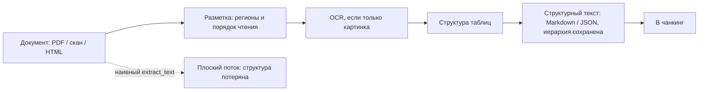
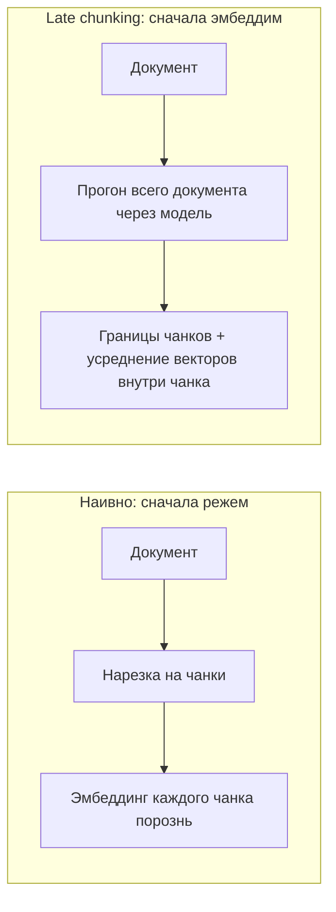

# Вытащить чистый текст и получить хорошие векторы

[Часть 1](./index.md) собрала слой индексации из двух столпов: чанкинг (chunking) — размерный
компромисс, стратегии, метаданные — и эмбеддинг-модели: как выбрать, bi- против cross-encoder, косинус,
две частые ошибки. Но три вещи она оставила недоразобранными, и за них берётся эта страница.

Первая: Часть 1 молча исходила из того, что чистый текст для нарезки у тебя уже есть. В корпоративной среде
ровно на этом допущении качество и умирает незаметно — на входе не проза, а PDF, сканы, таблицы и HTML, и
кто-то должен превратить всё это в текст, который ты режешь. Вторая: даже с чистым текстом чанк, вырванный из
документа, теряет окружающий контекст — а есть приёмы, которые этот контекст возвращают. Третья: модель ты
берёшь готовую, с полки, но её можно подогнать под свой домен, бюджет и языки. Дальше по порядку: (1) парсинг
документов; (2) продвинутый чанкинг — late chunking и контекстный поиск; (3) эмбеддинг вглубь — тонкая
настройка, усечение размерности по Matryoshka, мультиязычность. Размерный компромисс чанка и различие
bi-/cross-encoder заново не разбираем — только опираемся на них.

## Парсинг документов: этап до чанкинга, о котором Часть 1 умолчала

Правило простое и безжалостное: *мусор на входе — мусор на выходе.* Любой приём чанкинга и любая хитрость
с эмбеддингами ниже по конвейеру упираются в потолок качества того текста, что ты извлёк. Парсинг стоит
выше всего конвейера Части 1 — и именно здесь корпоративный RAG чаще всего ломается незаметно.

**Ядро проблемы:** визуальная разметка документа несёт смысл, а плоское извлечение текста этот смысл
разрушает. PDF — это набор глифов, расставленных по координатам страницы, а не логический документ.
Наивный `extract_text` отдаёт линейный поток, который:

- сливает многоколоночную вёрстку в перемешанную бессмыслицу (читает поперёк колонок);
- расплющивает таблицы в невыровненную кашу токенов — связь строки со столбцом теряется, а это самая
  болезненная потеря для корпоративных документов, набитых финансовыми и спецификационными таблицами;
- роняет или сдвигает колонтитулы, подписи, сноски;
- теряет иерархию заголовков, на которую опираются структурная нарезка и метаданные-путь по разделам из
  Части 1.

Документы выстраиваются по нарастающей сложности:

1. **Текстовый PDF / DOCX / HTML** — текст на месте, проблема только в *структуре и порядке чтения*.
2. **Таблицы** — нужна явно сохранённая структура ячейка/строка/столбец; линеаризация её убивает. Таблица,
   вытянутая в текст построчно, теряет тот столбец, что придаёт каждому числу смысл, — это структурный
   двойник потери отсылки «в третьем квартале он вырос на 20%» из Части 1.
3. **Сканы и PDF из одних картинок** — текстового слоя нет вовсе, и прежде всего нужен **OCR
   (оптическое распознавание символов)**, чтобы восстановить текст из пикселей.
4. **Сложная вёрстка** — много колонок, формы, перемешанные фигуры и текст.

**Layout-aware-парсинг (с учётом разметки):** сначала распознать структуру, потом извлекать. Современные
парсеры сперва прогоняют модель разметки — она находит регионы (заголовок, абзац, таблица, фигура, список,
колонтитул) и порядок чтения, — и только потом вытягивают текст, отдавая на выходе структурированный
Markdown или JSON с сохранённой иерархией и таблицами. Вот в этом и состоит их перевес над старыми плоскими
экстракторами.

Несколько инструментов очерчивают ландшафт — с датой появления и одной строкой по делу:

- **[Unstructured](https://unstructured.io)** — библиотека и платформа для загрузки документов; разбирает
  множество форматов (PDF, DOCX, PPTX, HTML) на типизированные элементы. Универсальная рабочая лошадка.
- **[Docling](https://github.com/docling-project/docling)** (IBM Research, открыт в 2024) — распознавание
  разметки плюс модель структуры таблиц TableFormer плюс порядок чтения; на выходе структурированный
  Markdown или JSON. Позже появилась компактная vision-language-модель Granite-Docling (IBM, 2025),
  читающая изображение страницы напрямую: сквозное преобразование «страница → структура».
- **LayoutLM** (Microsoft, первая версия 2019/2020) — исследовательский корень всего семейства: трансформер,
  который совместно моделирует текст, двумерную позицию на странице и изображение; на нём выросло целое
  семейство моделей понимания документов.
- **Vision-language-парсеры** (2024–2025) читают изображение страницы напрямую и отдают структурированный
  текст; сильны на самой грязной вёрстке, но платишь за это латентностью и вычислениями.

*Layout-aware-парсер распознаёт структуру до извлечения, поэтому таблицы и иерархия доходят до чанкинга
целыми; наивный `extract_text` идёт в обход и отдаёт плоский поток, из которого структуру уже не собрать.*

Стратегический выбор — это компромисс между качеством парсинга и ценой, латентностью и сложностью, и здесь же
живёт ответ на вопрос «когда НЕ надо»:

- **Дешёвые плоские экстракторы** (pypdf и подобные) вполне годятся для чистой одноколоночной текстовой
  прозы.
- **Layout-aware- и табличные парсеры** окупают свою цену ровно тогда, когда документы табличные,
  многоколоночные или сканированные, — то есть на большинстве настоящих корпоративных корпусов.
- **Зрительно-языковые парсеры** дают лучшее качество на самом грязном входе, но платишь латентностью и
  деньгами за каждую страницу.

Где это смыкается с Частью 1: парсинг питает структурную нарезку и метаданные — путь по заголовкам,
структуру таблиц. Если парсер расплющил таблицу, никакая стратегия чанкинга ниже уже не восстановит
столбцы — значит, решения по парсингу задают потолок качеству метаданных чанка. И ещё одно: парсинг, как и
вся индексация, офлайновый и разовый для каждого документа, поэтому здесь ты можешь позволить себе куда
более дорогой инструмент, чем на запросе.

## Продвинутый чанкинг: вернуть чанку контекст, который у него отрезали

Ключевое противоречие чанкинга из Части 1: чанк, заэмбедженный сам по себе, теряет окружающий контекст — то
самое «в третьем квартале он вырос на 20%», где «он» и «квартал» остались в соседнем абзаце. Два приёма
2024 года бьют по этой потере, но в разных точках конвейера. Поставим их рядом.

### Late chunking: сначала эмбеддим весь документ, потом режем

Стандартный, наивный порядок такой: сначала нарезка, потом эмбеддинг каждого чанка по отдельности. Эмбеддинг
каждого чанка видит только его собственные токены — контекст соседей исчез ещё до эмбеддинга.

**Late chunking (поздняя нарезка: эмбеддинг всего документа до разбиения на чанки; Jina AI, сентябрь 2024)
переворачивает порядок:** сперва весь длинный документ целиком прогоняется через трансформер, так что
эмбеддинг каждого токена уже подсвечен контекстом всего документа (self-attention идёт по всему тексту), —
и только потом накладываются границы чанков, а векторы токенов *внутри* каждого чанка усредняются
(mean-pooling) в эмбеддинг этого чанка.

*Разница — только в том, **когда** усредняешь: наивный конвейер эмбеддит уже нарезанные куски порознь; late
chunking эмбеддит целое, а нарезает после, поэтому вектор каждого чанка посчитан из токенов, «видевших» весь
документ.*

Итог: вектор по-прежнему соответствует одному чанку, но вычислен он из токенных представлений, которые
«видели» весь документ, — и отсылки вроде «он», «компания», «тот квартал» оказываются разрешены прямо в
векторах.

Что за это надо. Приёму нужна **эмбеддинг-модель с длинным контекстом** — весь документ обязан поместиться в
окно контекста модели; это и есть включающее условие, и главное ограничение. Зато обходится late chunking
почти даром и не требует ни обучения, ни LLM: меняется не модель, а лишь *момент* усреднения — в этой
дешевизне вся его привлекательность.

Когда НЕ надо. Документ длиннее окна контекста модели придётся сначала самому разбить на «макро-чанки» и
применять late chunking уже внутри каждого. И предел приёма: это механическая починка контекста, а
не источник новых фактов — чего в документе нет, того он в вектор не добавит.

### Контекстный поиск: у той же болезни — другая точка лечения

**Контекстный поиск (contextual retrieval; Anthropic, сентябрь 2024)** метит в ту же цель другим механизмом:
*перед* эмбеддингом к каждому чанку приписывают короткую (50–100 токенов) врезку, **сгенерированную LLM**,
которая помещает чанк в весь документ («этот фрагмент — из годового отчёта ACME за второй квартал 2023-го,
раздел о выручке»), а дальше эмбеддят *и* индексируют по **BM25 (поиск по точным словам)** уже
контекстуализированный чанк. Кэширование промпта делает генерацию контекста на каждый чанк дешёвой.

Полная механика приёма и цифры о том, насколько он снижает retrieval-провалы, разобраны в
[углублении слоя Retrieval](../retrieval/deep-dive.md), — иди туда, здесь эти числа не повторяем. Нам важно
одно: поставить контекстный поиск рядом с late chunking и увидеть контраст.

Оба дают чанку контекст всего документа, но по-разному:

- **late chunking** — механический: контекст берётся из собственного внимания эмбеддинг-модели, без всякой
  дополнительной модели, но нужен энкодер с длинным контекстом;
- **контекстный поиск** — генеративный: контекст-текст явно пишет LLM, работает с любой эмбеддинг-моделью,
  но стоит токенов LLM (сглаженных кэшированием промпта).

Они не исключают друг друга — оба работают на индексации. И маленькая оговорка про терминологию:
в заголовке статьи Jina про late chunking тоже стоят слова «contextual chunk embeddings» — те же слова,
но приём другой, не Contextual Retrieval от Anthropic. Называй оба чётко, чтобы читатель их не спутал.

Наконец, привяжем к parent-document / small-to-big из Части 1: тот лечит *ту же* потерю контекста, но на
запросе, в слое поиска, а не на индексации; детали — в [углублении Retrieval](../retrieval/deep-dive.md).

## Эмбеддинги вглубь: тонкая настройка, усечение размерности и языки

Часть 1 сформулировала: «качество поиска упирается в потолок качества эмбеддингов» и «модель выбирают по
осям». Здесь — три рычага мастерства над самим эмбеддингом.

### Тонкая настройка эмбеддинг-модели

Зачем. Общая модель с полки обучена на общем вебе, а в твоём домене — юридическом, медицинском, во внутреннем
жаргоне, в артикулах продукции — связи «запрос ↔ фрагмент» могут быть такими, что базовая модель их путает.
**Тонкая настройка (fine-tuning)** подгоняет векторное пространство под *твои* данные.

Как, на уровне принципа. **Контрастное обучение (contrastive learning)** на тройках (запрос, верный фрагмент,
неверный фрагмент) из твоего домена: истинные пары «запрос ↔ фрагмент» стягиваются в пространстве ближе,
несовпадающие — расталкиваются. Работать это заставляют **трудные негативы (hard negatives)** —
правдоподобные, но всё-таки неверные фрагменты.

Откуда брать разметку. Её добывают из логов кликов и обратной связи либо **порождают синтетически** — LLM
пишет убедительные запросы к каждому чанку; это частый способ стартовать, когда размеченных данных нет.

Следствие из Части 1 бьёт здесь особенно жёстко: тонкая настройка модели означает **переэмбеддинг
(переиндексацию) всего корпуса**, и запрос с документом обязаны использовать одну и ту же версию модели.
То есть это офлайновое решение, которое связывает руки, — назад его легко не отыграть.

Когда НЕ надо. Берись за тонкую настройку только после того, как *измерил* (слой
[Evaluation](../cross-cutting/evaluation/index.md)), что узкое место — действительно сильная общая или
retrieval-оптимизированная модель, а не что-то ещё: приём трудозатратный и требует достаточного объёма
доменных данных. Сначала попробуй модель получше с полки и гибридный поиск.

### Matryoshka (MRL) и усечение размерности

Источник — Kusupati и др., arXiv 2205.13147, май 2022 (NeurIPS 2022). Имя — от матрёшки, вложенной куклы.

Часть 1: выше размерность — выразительнее, но дороже по памяти, медленнее по поиску и затратнее; «больше»
не значит «всегда лучше». **Matryoshka Representation Learning (MRL)** превращает этот жёсткий компромисс в
регулятор, который крутишь уже потом, когда модель обучена.

Механизм. Модель *обучают* так, чтобы информация укладывалась от грубого к тонкому во вложенные префиксы:
первые N измерений сами по себе уже образуют пригодный самостоятельный эмбеддинг. Значит, вектор можно
**усечь** до первых 256 / 512 / 1024 измерений и сохранить почти весь смысловой сигнал — без переэмбеддинга
и без лишнего прямого прохода, просто отрезав хвост вектора и перенормировав его.

Выигрыш: один эмбеддинг — много рабочих точек. Хранишь и ищешь в малой размерности ради скорости и памяти,
а возможность добрать точность на большей размерности остаётся при тебе. Это открывает **адаптивный поиск:**
дешёвый первый проход в низкой размерности по всему корпусу, а потом переоценка короткого списка
полноразмерными векторами.

Модели OpenAI `text-embedding-3` (январь 2024) выставляют параметр `dimensions`, построенный
на MRL; по данным OpenAI, вектор `text-embedding-3-large`, укороченный до 256 измерений, всё ещё обходит
старую `text-embedding-ada-002` на полных 1536 измерениях на **MTEB (сводный бенчмарк эмбеддинг-моделей)**.

Где предел. Усечение *всё-таки* теряет часть точности по сравнению с полной размерностью — это управляемый
компромисс: его меряют по твоим метрикам, задаром он не даётся. И работает он только с моделью, *обученной*
под MRL: обычный эмбеддинг просто так не обрежешь.

### Мультиязычная специфика

Часть 1 отметила «язык и домен» как ось выбора и назвала мультиязычность критичной для корпоративной среды.
Вот деталь уровня мастерства.

Цель — **общее кросс-язычное векторное пространство:** хорошая мультиязычная модель отображает один и тот же
смысл на разных языках в близкие векторы, так что запрос на одном языке достаёт фрагменты на другом
(кросс-язычный поиск). Это незаменимо, когда корпоративный корпус смешивает языки.

Что проверять — режимы, в которых это ломается:

- **Неровное качество по языкам.** Модель, сильная на высокоресурсных языках (английский), может проседать
  на менее ресурсных; проверяй на *своих* языках, не верь усреднённому баллу.
- **Письменность и токенизация.** Языки с богатой морфологией или нелатинской письменностью (включая русский)
  могут токенизироваться неэффективно — это съедает длину контекста и бьёт по качеству.
- **Кросс-язычное выравнивание не возникает само.** Некоторые «мультиязычные» модели хорошо эмбеддят каждый
  язык *по отдельности*, но НЕ сближают смыслы между языками — одно и то же предложение на английском и
  русском ложится далеко, и кросс-язычный поиск отказывает. Выравнивание — отдельная цель обучения; ищи её в
  карточке модели или в её оценке.
- **Мостик назад к тонкой настройке.** Под конкретную пару «язык + домен» тонкая настройка или выбор модели,
  прямо обученной под кросс-язычный поиск, обходит любую общую мультиязычную модель.

Названные примеры: multilingual-E5 (Microsoft, 2024), BGE-M3 (BAAI, 2024 — мультиязычная и разной
гранулярности), Cohere Embed multilingual, IBM granite-embedding multilingual (278M). Это короткий список
примеров, не рейтинг.

Практический корпоративный вывод: меряй на *своих* языках и своём домене (слой
[Evaluation](../cross-cutting/evaluation/index.md)), потому что опубликованные мультиязычные рейтинги усредняют по
языкам, до которых тебе может не быть дела.

## Что забрать из урока

- Парсинг задаёт потолок всему слою: любой приём чанкинга и эмбеддинга упирается в качество извлечённого
  текста, а корпоративный RAG чаще всего ломается незаметно именно здесь. Мусор на входе — мусор на выходе.
- Layout-aware-парсинг сначала распознаёт структуру, потом извлекает, сохраняя таблицы и иерархию, на которые
  опираются нарезка и метаданные. Дешёвый плоский экстрактор годен для чистой прозы; табличные,
  многоколоночные и сканированные корпуса требуют layout-aware или vision-language-парсеров — а парсинг
  офлайновый, поэтому дорогой инструмент здесь можно себе позволить.
- Одну болезнь — чанку не хватает контекста — лечат в двух точках индексации: late chunking эмбеддит весь
  документ и лишь потом режет и усредняет (нужен длинный контекст, стоит почти даром, без LLM); контекстный
  поиск дописывает чанку LLM-врезку (любая модель, ценой токенов) — цифры и механику держит углубление
  Retrieval.
- Тонкая настройка адаптирует пространство под домен контрастным обучением на тройках с трудными негативами,
  но это обязательство переиндексировать весь корпус; берись за неё, только измерив, что узкое место — сама
  модель.
- MRL обучает вложенные размерности «от грубого к тонкому», превращая размерность в регулятор: вектор режут
  до 256 / 512 / 1024 без переэмбеддинга (параметр `dimensions` у OpenAI). Компромисс управляемый — точность
  немного теряется, и только для MRL-обученных моделей.
- Мультиязычность держится на общем кросс-язычном пространстве, но проверяй на своих языках: качество по
  языкам неровное, нелатинская письменность токенизируется расточительно, а кросс-язычное выравнивание не
  возникает само — это отдельная цель обучения.

**[Новые термины](../../glossary.md)**: document parsing / layout-aware extraction, OCR, late chunking, embedding fine-tuning, Matryoshka Representation Learning (MRL), contextual retrieval, multilingual embeddings, dimensionality.
