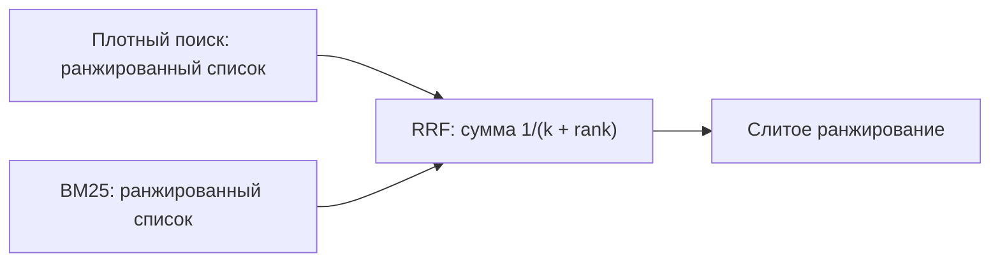
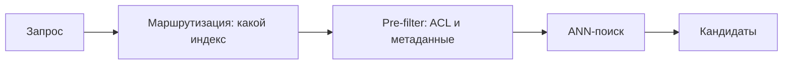

# Внутренности слоя поиска: слияние, реранкинг, ColBERT и метрики

[Часть 1](./index.md) собрала слой поиска из четырёх надстроек над наивным векторным top-K: починить запрос, гибридный поиск, реранкинг, фильтры и права. Она же дала двухстадийную схему «полнота → точность» и рамку retrieval-провала (retrieval failure): нужного чанка нет в том, что вернул поиск. Всё это здесь предполагается известным — второй проход вскрывает внутренности каждой надстройки: где HyDE помогает, а где утаскивает поиск в сторону; как на самом деле слить два несовместимых списка; чем платит реранкер; и что именно меряют nDCG с MRR.

Граница урока задана жёстко: здесь поиск *статический* — один заход, без цикла. Итеративную версию — повторный поиск, самокоррекцию (Self-RAG, CRAG), достаточность контекста — держит [глубокий разбор Agentic RAG](../../part-2-agents/agentic-rag/deep-dive.md); сюда её не тащим.

## HyDE: как устроен и когда бьёт мимо

Часть 1 описала приём в одну строку: попроси модель набросать гипотетический ответ, заэмбедди его, ищи по нему. Внутри всё тоньше. **HyDE (поиск по гипотетическому ответу)** ставит перед поиском отдельный шаг: модель, следующая инструкциям, в режиме zero-shot (без обучающих примеров) порождает гипотетический документ-ответ на запрос. Эмбеддит этот выдуманный документ не она, а отдельный обучавшийся без учителя энкодер (в исходной статье — Contriever), и уже его вектором ты идёшь в корпус. Фокус в том, что фальшивый документ *улавливает структуру релевантности* — форму и лексику настоящего ответа, — даже если конкретика в нём выдумана; узкое место плотного энкодера отсеивает придуманные детали и притягивает вектор к реальным соседям.

Зачем вообще подменять запрос ответом. Между коротким вопросом и чанком-ответом в пространстве эмбеддингов лежит асимметрия: вопрос из пяти слов и абзац ответа непохожи по форме, косинус между ними мал даже тогда, когда ответ верный. Гипотетический ответ имеет форму документа — он ложится ближе к настоящим чанкам-ответам, чем исходный вопрос. Оттого и выигрыш крупнее всего там, где обучающих данных в домене нет вовсе (zero-shot) и на кросс-язычных запросах; авторская рамка ровно эта — без единой разметки HyDE догоняет дообученные ретриверы (Gao и др., 2022; ACL 2023).

Когда НЕ надо. У приёма несколько слабых мест.

- **Латентность и цена.** HyDE вставляет целую генерацию LLM в критический путь *каждого* запроса, до поиска. Под нагрузкой это дорого и медленно.
- **Риск галлюцинации.** На узких, свежих или просто неизвестных модели темах она сочиняет документ, указывающий *в сторону* от корпуса, и утягивает поиск за собой — выходит хуже голого запроса.
- **Убывающая отдача.** Прибавка была велика по сравнению с ретриверами без учителя; хорошо дообученный в домене плотный ретривер съедает почти всю выгоду.
- **Точные запросы.** Код ошибки, артикул, имя, идентификатор — многословный гипотетический ответ *разбавляет* ключевой сигнал; такие запросы и без того закрывает BM25 в гибриде.

Вердикт: берись за HyDE, когда в домене нет обучающих данных, а запросы короткие и недоопределённые; пропусти его, когда упираешься в латентность, когда ретривер уже дообучен или когда ищешь точное совпадение.

## Гибридное слияние изнутри: нормализовать score или слить по рангам

Часть 1 сказала: гибрид запускает плотный поиск (dense retrieval) и BM25 и объединяет их score. Вся сложность спрятана в слове «объединяет». **BM25 (поиск по точным словам, разреженный)** выдаёт score неограниченный — он зависит от корпуса и запроса и в принципе может быть любым; косинус плотного поиска живёт в узком диапазоне (примерно `[-1, 1]` или `[0, 1]`). Два score на несовместимых шкалах просто сложить нельзя — сумму заберёт себе тот, у кого числа крупнее.

**Слияние по score (score fusion).** Первое семейство приводит оба score к общей шкале, а потом берёт взвешенную сумму. Нормализуют обычно двумя способами: min-max — `(s − min) / (max − min)`, загоняя в `[0, 1]`; или стандартизацией, она же z-score, — `(s − mean) / std`. Дальше `combined = α·norm(dense) + (1 − α)·norm(sparse)`, где α — вес плотной части относительно разреженной. Хрупкость тут в самой нормализации. min-max по кандидатам одного запроса пляшет, стоит верхнему score оказаться выбросом: одно аномальное число сжимает всех остальных. Распределения score от запроса к запросу разные, поэтому фиксированная нормализация раз за разом промахивается с калибровкой.

**Слияние по рангам: RRF.** Второе семейство выбрасывает сырые score вообще и смотрит только на *позицию* в списке. **RRF (Reciprocal Rank Fusion — слияние по обратным рангам; Cormack, Clarke, Büttcher, SIGIR 2009)** считает `score(d) = Σ 1/(k + rank_i(d))`: по каждому списку, где документ встретился, берётся обратная величина его ранга, и всё складывается. Константа `k = 60` — каноническая, из той же статьи, подобрана эмпирически; она сглаживает, насколько круто падает вклад с рангом, и гасит перетягивание от единственного первого места. Взвешенная форма `Σ w_i/(k + rank_i(d))` даёт приподнять один ретривер над другим. RRF устойчив потому, что не требует *никакой* калибровки score, — он обходит проблему нормализации стороной, оттого и стоит по умолчанию во многих векторных базах.

*RRF смотрит только на позицию в каждом списке, а не на сырые score, — поэтому две несовместимые шкалы сливаются без всякой калибровки.*

Плата за устойчивость — RRF выбрасывает *величину* score. Документ, который по score оторвался от всех как безусловно лучший, для RRF всего лишь «ранг 1», неотличимый от чуть обогнавшего второго. Слияние по score величину сохраняет, но требует аккуратной, подобранной под каждый запрос нормализации. Правило простое: RRF — устойчивая настройка по умолчанию; слияние по score включай только когда *измерил*, что величина несёт сигнал, и умеешь надёжно нормализовать под каждый запрос.

## Реранкер: cross-encoder или LLM

Из Части 1: вторая стадия пересортировывает top-K, и делает это **cross-encoder (кодирует запрос и фрагмент совместно)**. Здесь — чем один реранкер отличается от другого.

**cross-encoder-реранкер** — специально обученная под задачу модель (классически — на MS MARCO). Она кодирует пару (запрос, фрагмент) *совместно* и выдаёт по ней один балл; на top-K кандидатов это `O(K)` прямых проходов. Модель небольшая (порядка ~100M параметров), на пару дешёвая, латентность низкая, а балл детерминированный — его можно сравнить с порогом. Это рабочая настройка по умолчанию в проде.

**LLM-реранкер (LLM reranker)** — вместо обученной модели ты просишь общую LLM судить релевантность. Форм три:

- **pointwise** — оценить каждый фрагмент по отдельности;
- **pairwise** — сравнивать фрагменты попарно и агрегировать;
- **listwise** — ранжировать весь список в одном промпте (стиль RankGPT).

Плюсы: zero-shot, обучать нечего; модель следует инструкции («предпочитай свежее / авторитетное»); качество и способность рассуждать выше. Минусы серьёзные: дорого; латентность высокая; расход токенов растёт как число фрагментов × их длина; listwise чувствителен к *порядку* входа и упирается в окно контекста; вывод модели недетерминированный, а его разбор — хрупкий.

Компромисс латентность ↔ качество и определяет выбор. cross-encoder — под латентность и высокий поток запросов, дефолт прода. LLM-реранкер — когда качество важнее задержки, объём мал или нужна релевантность, заданная инструкцией. Частый гибрид: cross-encoder дёшево пересортировывает весь top-K, а LLM переранжирует лишь несколько верхних.

## Позднее взаимодействие: ColBERT и мульти-вектор

Три способа сравнить запрос с документом ложатся на одну ось — сколько работы отложено на потом.

- **bi-encoder (кодирует запрос и документ порознь)** — один вектор на документ, посчитан заранее, офлайн; сравнение — одно скалярное произведение. Дёшево, но грубо.
- **cross-encoder** — кодирует запрос и документ вместе; заранее не посчитать ничего; самый точный и самый дорогой, оттого годен только на реранк.
- **late interaction (позднее взаимодействие)** — посередине.

**ColBERT (Khattab и Zaharia, SIGIR 2020)** кодирует и запрос, и документ каждый во *множество потокенных векторов — по одному на токен* — это **мульти-вектор (multi-vector, много векторов на один фрагмент)** вместо одного вектора на чанк. Векторы токенов документа считаются заранее, офлайн, как у bi-encoder. На запросе включается **MaxSim (максимум сходства по токенам)**: для каждого токена запроса берётся максимум косинуса по всем токенам документа, и эти максимумы суммируются по токенам запроса — это и есть балл релевантности. «Позднее» здесь значит, что взаимодействие токенов происходит *после* независимого кодирования, уже на подсчёте балла, — в отличие от «раннего» взаимодействия внутри трансформера cross-encoder.

Зачем это нужно. Позднее взаимодействие удерживает почти всё точечное, потокенное сопоставление cross-encoder, но кодирование документа остаётся предподсчитываемым — значит, приём масштабируется на *весь* корпус, а не только на реранк K кандидатов. Он силён на точных совпадениях и именах и хорошо переносится на чужой домен.

Чем платишь. Хранилище раздувается: вектор на *каждый токен*, сотни векторов на фрагмент вместо одного. ColBERTv2 (2021) добавляет остаточное сжатие, чтобы сократить занимаемое место, но и с ним нужен специализированный индекс — обычный ANN над одним вектором тут не годится. Оттого мощная золотая середина и не стала дефолтом: цена — это хранилище и инфраструктура.

## Проблема чанка: parent-document и контекстный поиск

Из загрузки (ingestion) тянется противоречие. Мелкий чанк даёт точный поиск — эмбеддинг у него узкий и сфокусированный, — но генератору в нём не хватает контекста; крупный чанк несёт контекст, но эмбеддинг у него размытый и нецелевой. Обе крайности плохи, и лечат их в двух разных точках.

**parent-document-поиск (он же small-to-big, «от мелкого к крупному»).** Индексируешь и ищешь по мелким *дочерним* чанкам ради точного совпадения, а модели возвращаешь *родителя* — объемлющее окно побольше. Так единица поиска отделяется от единицы контекста. Варианты: sentence-window — найти предложение и расширить его до окна вокруг; parent-child — найти дочерний чанк, вернуть родительскую секцию или документ.

**Контекстный поиск (contextual retrieval; Anthropic, сентябрь 2024)** бьёт по той же болезни — чанку не хватает контекста, — но в другой точке: на *индексации*. Перед эмбеддингом к каждому чанку приписывают короткую (50–100 токенов) сгенерированную моделью врезку, помещающую его в *весь* документ: например, «этот фрагмент из годового отчёта ACME за второй квартал 2023-го, раздел о выручке». Дальше эмбеддят *и* индексируют по BM25 уже контекстуализированный чанк. Кэширование промпта делает генерацию контекста на каждый чанк дешёвой — порядка $1.02 на миллион токенов документа.

Числа, которые приводит Anthropic (доля retrieval-провалов на top-20, база 5.7%):

- контекстные эмбеддинги сами по себе — на 35% меньше провалов (5.7% → 3.7%);
- плюс контекстный BM25 — на 49% меньше (→ 2.9%);
- плюс реранкинг — на 67% меньше (→ 1.9%).

Смысл: контекст встроен *до* индексации, поэтому сам эмбеддинг несёт то знание о документе, которое голый чанк теряет. И приём складывается с гибридом и реранкингом — они друг друга дополняют.

parent-document и контекстный поиск лечат одну болезнь в двух точках. Первый обогащает то, что ты *возвращаешь*, — на запросе; второй обогащает то, что ты *индексируешь*, — на загрузке.

## Маршрутизация и фильтры: попасть в нужный набор кандидатов

**Маршрутизация запросов по индексам (query routing)** решает *где* и *как* искать под конкретный запрос: в каком индексе или коллекции, идти ли в поиск вообще, плотный поиск или гибрид, в каком срезе метаданных. Маршрутизатором служит правило, классификатор или LLM. Ключевая мысль вот в чём: маршрутизация стоит в *самом верху* воронки — ошибись маршрутом, и нужный чанк никогда не попадёт в набор кандидатов, а чего нет в кандидатах, того никакой реранкинг снизу уже не вытащит. Выученную, под каждый запрос версию — adaptive RAG (адаптивный RAG) — держит [глубокий разбор Agentic RAG](../../part-2-agents/agentic-rag/deep-dive.md); здесь маршрутизация статическая, решённая заранее.

**pre-filter и post-filter** описывают, *когда* фильтр по метаданным или правам встречается с ANN-поиском (approximate nearest neighbor — приближённый поиск ближайших соседей).

**pre-filter (фильтр до поиска)** применяет предикат по метаданным или ACL *до* или *во время* векторного поиска — в кандидаты попадают только векторы, прошедшие фильтр. По корректности это надёжно: ты гарантированно получаешь K результатов, удовлетворяющих фильтру, — и для ACL это *обязательно* (безопасность). По производительности есть подвох: очень *избирательный* фильтр конфликтует с ANN-индексом — обход графа HNSW раз за разом утыкается в отсеянные узлы, и в худшем случае деградирует к перебору. Спасает движок с *нативным* фильтрованным поиском.

**post-filter (фильтр после поиска)** сначала гоняет обычный ANN, а *потом* выбрасывает результаты, не прошедшие фильтр. По производительности дёшево — это простой ANN. Но по корректности здесь ловушка: при избирательном фильтре ты достаёшь K векторов, отбрасываешь почти все и остаёшься с *меньше чем* K результатами, а то и с пустой выдачей. Это единичный промах на конкретном запросе, а не провал стадии.

Компромисс: pre-filter — корректно, но иногда медленно; post-filter — быстро, но иногда с недобором. И отдельно, жёстко: ACL никогда не идёт post-filter. Проверка прав *после* того, как поиск уже отранжировал — и, возможно, показал в промежуточном списке — запретное, способна молча недодать результатов; права обязаны отсекать *до* поиска (это и есть требование безопасности из Части 1). Современные векторные базы предлагают фильтрованный ANN — единую стадию, где корректность и скорость идут вместе.

*Права и метаданные отсекают ещё до ANN-поиска, поэтому запретное не попадает в кандидаты в принципе, а не выбрасывается постфактум.*

## Метрики ранжирования: nDCG и MRR

Recall@K и Precision@K уже знакомы: Recall@K — попал ли нужный чанк в top-K (это и есть метрика retrieval-провала первой стадии), Precision@K — какая доля top-K релевантна. Порядок *внутри* top-K меряют иначе.

**MRR (mean reciprocal rank — средний обратный ранг)** берёт `1/ранг` *первого* релевантного результата и усредняет по запросам. Метрика награждает за то, что один правильный ответ поднят высоко, и *слепа* ко всему, что идёт после первого попадания. Её место там, где правильный ответ по сути один, — навигационный поиск, поиск известного объекта.

**nDCG (normalized discounted cumulative gain — нормированный дисконтированный накопленный выигрыш)** работает с *градуированной* релевантностью и со *всем* списком. `DCG = Σ rel_i / log2(i+1)` суммирует релевантность, дисконтированную позицией: чем глубже, тем меньше вклад. Дальше нормируешь на идеальный порядок (IDCG), получая `[0, 1]`. В отличие от бинарного, слепого-после-первого-попадания MRR, nDCG видит и градации релевантности, и весь хвост выдачи.

Сквозная мысль про метрики: *меряй ту стадию, которую крутишь.* Recall@K — для первой стадии-ретривера (содержал ли набор кандидатов ответ вообще); nDCG и MRR — для реранкера (верен ли порядок). Метрика не с той стадии прячет баг: отличный реранкер не спасёт, если ответа не было в кандидатах, а Recall@K этого и не покажет. Полную формализацию держит слой [Evaluation](../cross-cutting/evaluation/index.md).

## Что забрать из урока

- HyDE ищет по гипотетическому ответу и закрывает асимметрию «короткий вопрос ↔ длинный ответ»; выигрыш крупнее всего без обучающих данных в домене. Но генерация в критическом пути стоит латентности, на неизвестных темах модель уводит поиск в сторону, а дообученный ретривер съедает прибавку.
- Плотный score и score BM25 живут на несовместимых шкалах. Слияние по score нормализует и складывает, но хрупко к выбросам и распределениям; RRF смотрит только на ранг (`1/(k + rank)`, `k = 60`), калибровки не требует — устойчивый дефолт, но теряет величину.
- cross-encoder-реранкер дёшев, детерминирован и низколатентен — дефолт прода; LLM-реранкер (pointwise / pairwise / listwise) даёт zero-shot и релевантность по инструкции ценой денег, латентности и недетерминизма.
- Позднее взаимодействие (ColBERT) держит потокенное сопоставление cross-encoder при предподсчитанном документе и масштабируется на весь корпус; платишь хранилищем — вектор на каждый токен и специализированный индекс.
- Одну и ту же болезнь «чанку мало контекста» лечат в двух точках: parent-document обогащает возвращаемое на запросе, контекстный поиск встраивает контекст в эмбеддинг на индексации (у Anthropic — до 67% меньше провалов в связке с гибридом и реранкингом).
- Маршрутизация — верх воронки: неверный индекс исключает ответ из кандидатов навсегда. pre-filter корректен, но конфликтует с ANN на избирательном предикате; post-filter быстр, но недобирает; ACL — только до поиска, никогда постфактум.
- Меряй стадию, которую крутишь: Recall@K — для ретривера, nDCG и MRR — для порядка. MRR бинарен и слеп после первого попадания; nDCG видит градации и весь список.

**Новые термины** → [Глоссарий](../../glossary.md): score fusion / score normalization, LLM reranker, late interaction / ColBERT, multi-vector retrieval, contextual retrieval, query routing, pre-filter / post-filter.
