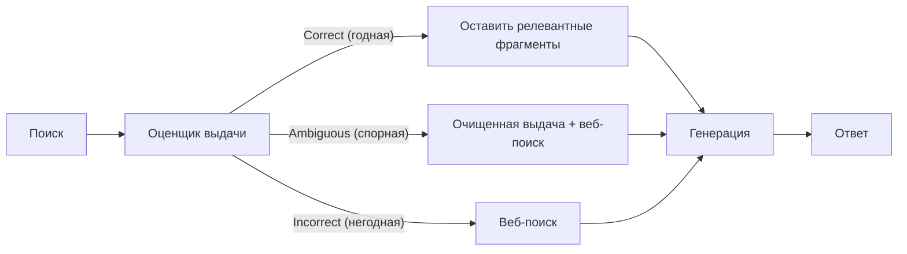

# Когда искать снова, когда остановиться и как оценить весь путь

[Часть 1](./index.md) собрала картину: retrieval перестаёт быть жёстким шагом конвейера и становится
действием, которое модель выбирает в цикле «рассуждение → решение → действие → наблюдение». Она же дала
спектр свободы — маршрутизатор → планирование запроса → полный цикл — и назвала цену: латентность,
непредсказуемость, сложность отладки. Здесь мы берём тот же цикл и разбираем его глубже ровно там, где он
касается поиска: как выглядят опубликованные архитектуры, решающие, когда искать и когда переспрашивать;
как не дать циклу крутиться вхолостую; как передавать найденное между шагами и как оценить не только
ответ, но и весь путь к нему. Часть 1 мы не пересказываем — держи её в голове.

## Самокоррекция обрела имена: Self-RAG, CRAG, adaptive RAG

«Самокоррекция» и «итеративный поиск» из Части 1 звучали как приёмы вообще. У них есть конкретные,
опубликованные формы — три именованные архитектуры agentic RAG, и каждая по-своему отвечает на один
вопрос: когда и как цикл решает искать, искать снова или остановиться.

**Self-RAG** (само-рефлексивный RAG) заходит с той стороны, что учит саму модель принимать это решение. Её
дообучают порождать особые **токены рефлексии (reflection tokens)** прямо в потоке генерации. Один тип
решает, нужно ли вообще идти в поиск ради этого куска ответа. Остальные оценивают уже найденное: релевантен
ли каждый фрагмент, подтверждает ли он то, что модель сейчас пишет, и насколько ответ в итоге полезен.
Судит модель не откуда-то сбоку — она выносит эти суждения теми же токенами, которыми генерирует:
решение искать, суждение о релевантности и о подтверждённости встроены в саму генерацию, а не навешаны
внешним каркасом.

**Corrective RAG (CRAG)** (корректирующий RAG) заходит иначе — модель не трогает, а ставит перед генерацией
лёгкий **оценщик выдачи (retrieval evaluator)**. Тот смотрит на найденные документы и выдаёт балл
уверенности, который попадает в одну из трёх корзин — Correct, Ambiguous, Incorrect. Дальше судьба выдачи
зависит от корзины. Correct — оценщик режет найденное на мелкие фрагменты и оставляет только релевантные,
отсекая шум внутри в целом годных документов. Incorrect — выдачу выбрасывают целиком и уходят в
веб-поиск за свежим источником. Ambiguous — соединяют оба пути, и очищенную выдачу, и веб-поиск. Приём
надстраивается поверх любого готового RAG, ничего в нём не меняя, — оттого plug-and-play.

**Adaptive RAG** (адаптивный RAG) выносит решение ещё на шаг раньше — до всякого поиска. Обученный
классификатор предсказывает сложность запроса и направляет его на самую дешёвую из достаточных стратегий:
простой вопрос — ответить из параметрической памяти, без поиска вовсе; средний — один заход в поиск;
сложный, многошаговый — итеративный поиск в несколько заходов. Смысл — не гонять тяжёлую многошаговую
машинерию там, где хватило бы одного обращения или вовсе нуля.

Свести это стоит вот к чему. Все три — это спектр из Части 1 (не искать / маршрутизировать / итерировать),
только превращённый в решения, *выученные* и принимаемые внутри цикла, плюс явный судья релевантности и
подтверждённости. Adaptive RAG — тот самый маршрутизатор, но сделанный под каждый запрос и обученный.
Self-RAG — самокоррекция, зашитая в обучающие токены на уровне «искать / релевантно / подтверждено». CRAG —
та же самокоррекция, но с вынесенным наружу оценщиком и запасным веб-поиском.

Только не смешивай это с рефлексией из урока про [планирование и циклы](../planning-loops/index.md). Там рефлексия
судит всю траекторию целиком — движусь ли я к цели, не пора ли сменить план. Здесь суждение живёт на уровне
поиска: релевантна ли выдача, подтверждён ли ею ответ. Это семья самокоррекции из Части 1, а не рефлексия
над планом; уровни разные, и путать их не надо.

Отдельный разрез — как именно строить многошаговый (multi-hop) поиск. ReAct-стиль чередует рассуждение,
поиск и наблюдение, переформулируя запрос из каждого результата, — это итеративный поиск (iterative
retrieval) из Части 1. Plan-and-execute раскладывает многошаговый вопрос на план подвопросов заранее, ищет
под каждый и собирает ответ обратно. Гибкость или структура — общий разбор этого компромисса ведёт всё
тот же урок про [планирование и циклы](../planning-loops/index.md), сюда его не тащим; для поиска важна одна
грань — декомпозиция запроса на подвопросы под multi-hop.

Когда НЕ надо. Self-RAG требует специально дообученной модели — это не надстройка над готовым API. CRAG и
adaptive RAG добавляют оценщик или классификатор, а с ними — не только лишнюю стоимость, но и новый
источник сбоев: оценщик промахивается — прячет хороший фрагмент или зря гонит систему в веб-поиск. На
многих корпусах хороший статический поиск плюс простой фильтр релевантности обыгрывают обученного
оценщика. Дисциплина та же, что везде в Части II: бери самый простой уровень, который решает задачу.

*CRAG: оценщик выдачи раскладывает найденное по трём корзинам — оставить и почистить, добрать веб-поиском
или заменить им целиком, — и только потом идёт генерация.*

## Как не дать циклу поиска крутиться вхолостую

Урок про [планирование и циклы](../planning-loops/index.md) уже назвал фирменный сбой агентного цикла — цикл,
который не завершается корректно. У поиска этот сбой выглядит по-своему.

**Цикл повторного поиска (re-retrieval loop).** Агент шлёт тот же или чуть переформулированный запрос, получает ту же выдачу,
снова переформулирует, снова шлёт — и так по кругу. Новой информации не прибавляется, движения нет; это
детерминированное кручение на месте, а не прогресс. Такое незавершение — это сбой в прогоне, а не «отказ»:
модель ничего осознанно не отклоняла, она просто не смогла остановиться.

**Избыточный поиск (over-retrieval).** Обратная беда. Агент продолжает искать и после того, как собранного
уже хватает, — набивает контекст новыми фрагментами, которые ничего не добавляют, кроме длины и стоимости.

Критерий остановки для поиска — это **достаточность контекста (sufficient context)**: решение «хватает ли
мне собранного, чтобы отвечать?». Токены подтверждённости и полезности из Self-RAG — одна его реализация,
отдельный оценщик релевантности — другая. Ошибиться тут можно в обе стороны. Остановишься слишком рано —
контекста не хватило, ответ повисает без опоры, и модель дофантазирует. Не остановишься никогда —
избыточный поиск, лишние деньги и lost-in-the-middle: важное тонет в разросшемся контексте.

Последний рубеж — **бюджет поиска (retrieval budget)**: жёсткие потолки на число заходов, число поисков,
число вытянутых токенов. Он перекликается с бюджетом шагов и бюджетом токенов из урока про [планирование и
циклы](../planning-loops/index.md) — общий смысл бюджета там и разобран, повторять не будем; здесь важно, что
именно этот потолок гарантирует остановку цикла поиска, даже когда все умные критерии не сработали.

Умнее грубого потолка — **обнаружение зацикливания** для поиска: заметить повторяющуюся пару «запрос →
выдача» и вырваться, вместо того чтобы дать циклу вертеться. Общий механизм обнаружения зацикливания живёт
всё там же, в уроке про планирование и циклы; RAG-специфика — в том, по чему считать повтор: по сигнатуре
нормализованного запроса и его выдачи.

Когда НЕ надо. Система из одного решения — чистый маршрутизатор — зациклиться физически не может: там нет
цикла, чтобы в нём застрять. Вся эта машинерия против зацикливания — плата, которую берёшь на себя только
тогда, когда запускаешь полный цикл поиска.

## Как передавать найденное между шагами

Каждый заход поиска сваливает найденные фрагменты в контекст. На длинной многошаговой траектории это
накапливается: контекст пухнет, стоимость растёт, и включается **lost-in-the-middle** — модель хуже всего
внимает середине длинного контекста (это разбирал урок про генерацию). Просто дописывать сырую выдачу
каждого шага — верный путь к тому, чтобы к последнему заходу утопить в шуме то, ради чего всё затевалось.

**Дистилляция находки.** Переносить вперёд стоит не сырые чанки каждого шага, а *извлечённую суть* — ответ
на подвопрос, добытый факт — вместе со ссылкой на источник, откуда он взят. Так рабочий контекст
остаётся маленьким и по теме. Это
тот же приём, что и рабочая память (scratchpad) из урока про [планирование и
циклы](../planning-loops/index.md), но с поисковой спецификой: фрагменты сжимаешь в находки, а ссылки на
источники сохраняешь — без них ответ потом не на что опереть.

**Дедупликация.** Один и тот же фрагмент, попавший в выдачу и на первом заходе, и на третьем, не должен
занимать контекст дважды — повтор только приближает раздувание, ничего не добавляя.

**Уплотнение траектории.** Когда контекст всё же разрастается, старые шаги сворачивают: доказательства
ранних заходов суммируют в короткую сводку, освобождая место. Урок про планирование и циклы откладывал
«суммируй историю» во второй проход — здесь это ровно про собранные поиском доказательства.

**Порядок.** Клади самое релевантное и самое свежее туда, куда модель смотрит, — ближе к началу и к концу,
а не в середину, где внимание проседает. Это прямое приложение того же lost-in-the-middle: важное не
хоронят в глубине контекста.

Сбой, если всем этим пренебречь, выглядит так: тащишь сырые чанки со всех заходов подряд — контекст
раздувается — модель теряет нить и отвечает, опираясь на доказательства не того шага. Верный ответ на
первый подвопрос тонет под выдачей третьего, и на выходе получаешь уверенную чушь, слепленную из кусков
разных шагов траектории.

*Между шагами переносится извлечённая суть со ссылкой на источник, а не сырые фрагменты каждого захода, —
рабочий контекст остаётся маленьким.*

## Как оценить всю траекторию поиска, а не только ответ

Часть 1 сказала, что оценка теперь меряет качество траектории. Разберём, что это значит для agentic RAG
конкретно.

**Итог и процесс.** Итог — качество финального ответа: faithfulness (опора ответа на контекст) и
релевантность ответа, знакомые по уроку про оценку. Процесс, он же траектория, — про путь: пошёл ли агент
в поиск, когда было нужно, и воздержался ли, когда не нужно; те ли документы доставал на каждом заходе;
вовремя ли остановился; за сколько шагов и какой ценой. Хороший ответ можно получить и дурным путём —
случайно, — а по хорошему пути всё равно споткнуться на генерации. Одно только качество ответа этого не
разведёт.

**Качество выдачи на каждом заходе.** Метрики поиска — context precision, context recall, релевантность —
применяй на *каждом* заходе, а не один раз в конце. Меряя выдачу пошагово, ты локализуешь, где именно
сломалось: это то самое разделение провалов из Части I — retrieval-провал (retrieval failure) или
generation-провал, какой этап виноват.

**Метрики уровня траектории.** Число шагов и поисков (эффективность), завершился ли цикл вообще, верно ли
выбраны маршрут и источник, и достаточность контекста — действительно ли собранное содержало ответ. Это
метрики про путь, а не про один финальный ответ.

Судит траекторию, как правило, **LLM-as-a-judge** поверх записанного прогона, а из готового инструментария
сюда ложится [Ragas](https://www.ragas.io): у него есть метрики качества выдачи и ответа — context
precision, context recall, faithfulness, релевантность ответа (response relevancy), — и отдельно агентные
метрики: точность достижения цели, следование теме, корректность вызовов инструментов. Называем их и не
углубляемся: общая дисциплина оценки разобрана в уроке про оценку, а как её ставить на поток — в уроке про
наблюдаемость.

Всё это работает при одном условии: *траекторию нельзя оценить, если её не видно.* Значит, наблюдаемость
(observability) — не роскошь, а предпосылка: без записи всей цепочки шагов, запросов и выдач оценивать
нечего. Часть 1 уже проводила этот мост — здесь он только заостряется.

Когда НЕ надо перегружать инструментированием. У системы из одного решения — чистого маршрутизатора —
траектории попросту нет: оценивать нечего, кроме итога, и оценки ответа достаточно. Инструментирование
уровня траектории окупается только там, где есть сам многошаговый путь.

## Что забрать из урока

- Три именованных паттерна — это спектр Части 1, ставший выученными решениями внутри цикла: adaptive RAG
  выбирает стратегию под сложность запроса ещё до поиска, Self-RAG зашивает решения об «искать / релевантно
  / подтверждено» в токены модели, CRAG выносит оценщик выдачи наружу и добирает недостающее веб-поиском.
- Самокоррекция здесь судит качество поиска и живёт на уровне выдачи — не путать с рефлексией из урока про
  планирование, которая судит всю траекторию.
- Цикл поиска ломается двумя способами: повторный поиск без нового знания и избыточный поиск сверх
  достаточного. Критерий остановки — достаточность контекста; последний рубеж — бюджет поиска, а
  обнаружение зацикливания ловит повтор пары «запрос → выдача».
- Между шагами переноси извлечённую суть со ссылкой на источник, а не сырые чанки каждого захода;
  дедуплицируй, уплотняй старые шаги и клади важное туда, куда модель смотрит, — иначе lost-in-the-middle
  съест нить.
- Оценивай не только ответ, но и путь: качество выдачи пошагово (это отделяет retrieval-провал от
  generation-провала), число шагов, завершаемость, достаточность контекста. Инструмент — LLM-as-a-judge
  поверх записанной траектории; предпосылка — наблюдаемость.
- Всего этого арсенала — паттернов, бюджетов, пошаговой оценки — стоит касаться, только когда ты правда
  запускаешь полный цикл. Маршрутизатору она не нужна: бери самый простой уровень, который решает задачу.

**Новые термины** → [Глоссарий](../../glossary.md): Self-RAG, corrective RAG (CRAG), adaptive RAG, retrieval budget, sufficient context.
