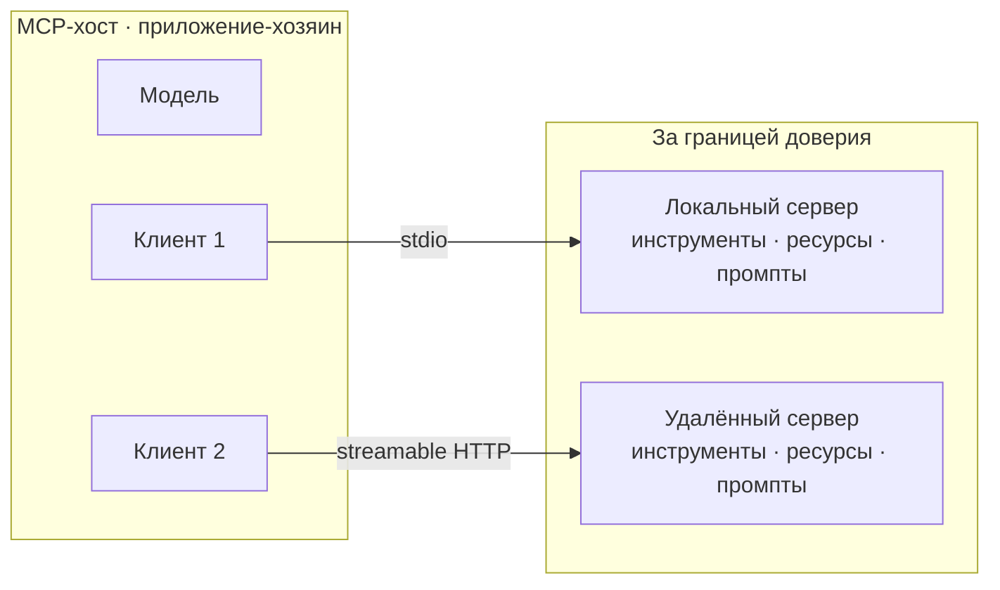
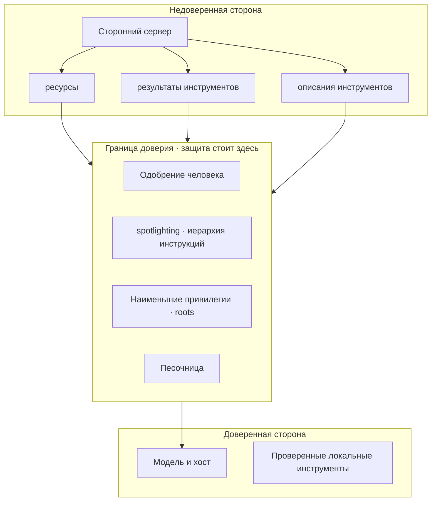

# Собрать сервер, выбрать транспорт и не доверять ни единому его слову

[Часть 1](./index.md) свела [MCP](https://modelcontextprotocol.io) к одному движению: обернуть каждый инструмент
один раз в сервер на общем протоколе — и `M × N` штучных связок схлопываются в `N + M`. Там же — клиент-серверная
архитектура, три примитива (инструменты, ресурсы, промпты), два транспорта, разбор мифа «MCP — это Swagger для
LLM», разделительная черта между MCP и A2A и первый взгляд на новую поверхность атаки. Дальше мы на этом стоим и
заново не выводим.

Эта страница берёт протокольный слой вглубь. Соберём сервер и посмотрим, что в нём особенного именно потому, что
его читает модель, а не человек; разберём sampling и elicitation — возможности, которые переворачивают привычное
направление вызова; поставим stdio рядом со streamable HTTP как решение о доверии, а не о доставке; пройдём по
реестрам и обнаружению серверов; поместим MCP на карту агентных протоколов рядом с A2A; и — центр тяжести урока —
разложим по полкам, как разворачивать серверы, которым нельзя доверять, и когда сервер не стоит подключать вовсе.

Сразу о границах. Координацию агент ↔ агент — как один агент передаёт работу равному себе — держит урок про
[команды агентов](../multi-agent/index.md) и его [углубление](../multi-agent/deep-dive.md); упаковку этих
подключений в библиотеку — [фреймворки оркестрации](../orchestration-frameworks/index.md) и их
[углубление](../orchestration-frameworks/deep-dive.md). Операционную сторону — шлюзы, списки разрешённого,
централизованные логи — разбирает [инструментальная экосистема Части III](../../part-3-production/tooling-ecosystem/index.md),
а дисциплину недоверенного ввода — урок про [ограничители](../../part-1-rag/cross-cutting/guardrails/index.md). Как всё
это работает на живых агентах — [завершающий разбор](../real-agents.md). Часть 1 подразумеваем повсюду.

## Собрать MCP-сервер: хост, клиент и рукопожатие

Часть 1 назвала две стороны — сервер и клиент. Вблизи ролей оказывается три. **MCP-хост** (приложение-хозяин,
внутри которого живут MCP-клиенты) — это LLM-приложение: IDE, чат, среда выполнения агента, — которое затевает
подключения. Внутри хоста сидит один или несколько **клиентов**, и каждый клиент держит соединение один-к-одному
ровно с одним сервером. То есть «MCP-клиент» — это не всё приложение целиком, а подключение внутри него, по одному
на сервер.

Базовый протокол — сообщения **JSON-RPC 2.0** поверх соединения с состоянием, с **согласованием возможностей**
(capability negotiation) на входе. Сообщения бывают трёх видов: запрос (ждёт ответа), ответ и уведомление (ответа
не ждёт).

Сессия открывается **рукопожатием инициализации** (initialize): клиент и сервер обмениваются версией протокола и
возможностями — каждая сторона объявляет, что она умеет, ещё до всякой полезной работы. Здесь же согласуется
версия: обе стороны могут поддерживать несколько ревизий, но на сессию должны сойтись на одной. Именно поэтому
один клиент способен говорить с серверами, собранными под разные ревизии спецификации.

Что объявляет сервер — это три примитива из Части 1: **инструменты** (tools) — функции, которые исполняет модель;
**ресурсы** (resources) — контекст и данные для чтения; **промпты** (prompts) — шаблоны сообщений и заготовки
рабочих процессов. Тонкость углубления в том, что сервер сам *предъявляет* их прямо при подключении, а клиент
обнаруживает их динамически, а не по зашитому заранее списку.

Сам протокол руками писать не нужно. **SDK** берёт на себя JSON-RPC, рукопожатие, согласование возможностей и
транспорт — тебе остаются обработчики инструментов, ресурсов и промптов. Официальные SDK (по состоянию на ноябрь
2025-го): TypeScript, Python, C# и Go в первом эшелоне, Java и Rust — во втором, плюс Swift, Ruby, PHP и Kotlin
ниже. Все дают одни и те же возможности, каждый на идиоме своего языка.

:::note[Предпосылки]

Дальше предполагается, что рабочий MCP-сервер ты соберёшь по официальному SDK, а не по сырому JSON-RPC. Возьми
SDK своего языка и его документацию — [modelcontextprotocol.io/docs/sdk](https://modelcontextprotocol.io/docs/sdk) —
как отправную точку: урок разбирает не синтаксис вызовов SDK, а то, что меняется, когда сервер пишут для модели.

:::

Вот эта разница и есть **AI-дельта** — чем сервер, написанный для агента, отличается от обычного API. Во-первых,
описание инструмента — это промпт: его пишут для модели, а не для коллеги-разработчика. Во-вторых, выставляй
отобранный, сфокусированный, непересекающийся набор инструментов — только нужные, без свалки эндпоинтов. В-третьих,
потребитель — модель в **среде выполнения** (runtime), и имена, описания и схемы аргументов — её единственный
ориентир: двусмысленность здесь оборачивается не ошибкой компиляции, а неверным вызовом инструмента. Это ровно тот
довод из Части 1, почему MCP-сервер читается лучше сырого Swagger-дампа, — теперь как руководство тому, кто сервер
пишет.

И сразу сдержанность: когда сервер собирать не надо. Если одно приложение пользуется одним инструментом,
MCP-обвязка — чистые накладные расходы, зови API напрямую. Стандарт окупается на переломе `N + M` — когда
инструмент переиспользуется многими приложениями и агентами. Та же логика «сперва примитивы», что и в Части 1.

*Один хост содержит несколько клиентов; каждый держит соединение один-к-одному с сервером через свой транспорт —
stdio к локальному, streamable HTTP к удалённому. Всё, что за границей доверия — включая локальный сервер на твоей
машине, — присылает недоверенные данные.*

## Sampling и elicitation: когда сервер обращается к тебе сам

До сих пор возможности объявлял сервер. Но и клиент выставляет возможности — серверу, в обратную сторону. В
текущей спецификации их три: **sampling**, **roots** и **elicitation**.

**Sampling** — сервер просит модель клиента сгенерировать текст. Своей модели у сервера нет; он одалживает
клиентскую. Это переворачивает привычное направление «клиент зовёт сервер»: теперь сервер запускает генерацию на стороне
клиента. Возможность мощная — сервер может выстроить агентное, рекурсивное поведение, — и ровно поэтому опасная:
сервер, к которому ты подключился, способен заставить твою модель что-то породить.

Поэтому согласие на sampling обязательно — так велит принцип безопасности спецификации. Пользователь должен явно
одобрить каждый запрос на генерацию и вправе решать, будет ли sampling вообще, какой именно промпт уйдёт и что из
результата увидит сервер. Видимость промпта для сервера протокол ограничивает намеренно. **Человек-в-цикле**
(human-in-the-loop) встроен здесь прямо в возможность.

**Elicitation** — сервер запрашивает у пользователя недостающие данные посреди операции: нужный параметр или
подтверждение, через структурированную схему, которую рисует клиент. Направление снова инвертируется — сервер
приостанавливается и спрашивает человека, но не напрямую, а через клиента.

**Roots** (границы — файлы и URI, — в пределах которых серверу дозволено работать) — возможность клиента, которая
задаёт серверу, где ему разрешено действовать. По сути это примитив наименьших привилегий на уровне самого
протокола: клиент очерчивает серверу его досягаемость.

И сразу оговорка про дату, потому что обе инвертированные возможности ещё в движении. Ревизия 2025-11-25 расширила
их: elicitation научилась работать через URL-поток, а sampling — вызывать инструменты внутри себя (параметры
`tools` и `toolChoice`, так что запрос на генерацию сам может сходить в инструмент). Устойчивое здесь —
сама форма: сервер одалживает модель клиента или спрашивает пользователя. Точный список параметров пока не устоялся.

Почему инверсия важна. Статический API только отвечает на вызовы. **Сессия с состоянием**
(stateful session) у MCP позволяет серверу самому проявлять инициативу: попросить генерацию (sampling), запросить
ввод пользователя (elicitation) или прислать обновление. И каждая такая инициатива сервера — это **точка
согласия**, момент, где решает человек. Отсюда и вес раздела про безопасность в конце урока.

## Транспорт как решение о доверии: stdio и streamable HTTP

Оба транспорта несут одни и те же примитивы, и где крутится сервер — это, как сказала Часть 1, деталь
развёртывания. Но профили доверия и работы у них расходятся резко.

**Stdio** — для локального сервера, запущенного рядом с клиентом отдельным процессом: общаются через стандартный
ввод-вывод. Профиль доверия жёсткий: локальный stdio-сервер — это в буквальном смысле чужой код у тебя на машине,
с полными правами твоего пользователя и без всякой сетевой границы. Сессия одна, клиент один, поднять тривиально,
аутентификация не нужна — сетевого перехода просто нет. Логи сервер при этом может писать в `stderr` (ревизия
2025-11-25 это уточнила).

**Streamable HTTP** — для удалённого сервера за сетью. Этот транспорт заменил прежний HTTP+SSE в ревизии
2025-03-26; HTTP+SSE считается устаревшим, и подавать его как актуальный не надо. Streamable HTTP держит несколько
клиентов сразу, умеет серверный стриминг и заставляет думать про аутентификацию и про то, чему ты открываешь
доступ наружу.

Сеть тянет за собой аутентификацию. В ту же ревизию 2025-03-26 спецификация добавила фреймворк авторизации на
основе OAuth 2.1, а ревизия 2025-11-25 его укрепила: обнаружение через OpenID Connect, пошаговое согласие на права
доступа через заголовок `WWW-Authenticate`, метаданные Client-ID и обнаружение метаданных защищённого ресурса по
RFC 9728. Удалённый сервер надо аутентифицировать и ограничить в правах; конкретные механизмы будут ужесточаться
и дальше.

Как выбирать. Stdio — когда сервер локальный, однопользовательский и доверенный уже потому, что рядом: инструменты
разработчика, обёртка над локальным файлом или базой. Streamable HTTP — когда сервер общий, удалённый, многоарендный
или должен масштабироваться; и тогда аутентификация, ограничение прав и сетевая открытость выходят на первый
план. Выбор транспорта — это решение о доверии, а не только о развёртывании.

## Реестры и обнаружение серверов

**Обнаружение серверов** (server discovery) — это то, как клиент вообще находит серверы, к которым подключаться.
Уровней два. При подключении клиент обнаруживает *возможности* сервера через рукопожатие — это мы уже разобрали.
На уровне экосистемы клиент выясняет, *какие серверы существуют*, — через реестр.

**Реестр MCP-серверов** (registry) — официальный, на
[registry.modelcontextprotocol.io](https://registry.modelcontextprotocol.io), — запущен в превью 8 сентября
2025 года; за ним стоят Anthropic, GitHub, PulseMCP и Microsoft. Важно, что это **метареестр**: он хранит
*метаданные* серверов — не код и не бинарники, — достоверный источник, поверх которого строятся субреестры и
клиенты.

И снова про дату: ландшафт реестров молодой. По состоянию на сентябрь 2025-го официальный реестр — всё ещё превью:
возможны ломающие изменения и сбросы данных, полноценный релиз впереди. Рядом с ним живут частные, кураторские и
внутрикорпоративные реестры, а также сторонние агрегаторы. Держись за понятие, не за конкретный адрес.

Ключевая оговорка безопасности: попасть в реестр — не значит пройти проверку. Реестр показывает метаданные,
которые дал сам издатель; он не аудирует поведение сервера, а сервер может измениться уже после публикации (см.
rug pull ниже). Обнаружение отвечает на «существует ли такой сервер и как до него дотянуться», но никогда — на
«можно ли ему доверять». Проверка остаётся на тебе.

## Ландшафт агентных протоколов: MCP и A2A

MCP держит одну ось — агент ↔ инструменты и данные. Есть вторая ось — агент ↔ агент, где один агент передаёт
работу равному себе, — и это отдельная задача, о которой MCP не говорит ничего. Разбирать координацию между
агентами заново мы не будем: она в уроке про [команды агентов](../multi-agent/index.md).

**A2A (Agent2Agent)** — ведущий стандарт оси агент ↔ агент. Его создала Google и объявила 9 апреля 2025 года,
23 июня 2025-го передала в Linux Foundation, а сейчас он на версии 1.0; в техническом комитете — AWS, Cisco,
Google, IBM, Microsoft, Salesforce, SAP и ServiceNow. Агент публикует **Agent Card** (карточку агента — кто он,
что умеет, какие форматы принимает и отдаёт, как к нему аутентифицироваться), по которой его находят; работу
передают как задачи с явным жизненным циклом поверх JSON-RPC и HTTP. Подробнее — на
[a2a-protocol.org](https://a2a-protocol.org).

И главное — учи различие, а не список имён. Устойчивая черта: *MCP — это агент ↔ инструменты и контекст; A2A —
агент ↔ агент*. Поле бурлит, A2A — лишь один из претендентов, и состав ещё поменяется. Снимок на июль 2026-го:
MCP и A2A — два самых распространённых протокола, оба в семействе Linux Foundation, — но любое конкретное
имя есть снимок момента. Пойми, какую ось обслуживает протокол, и место любому новичку найдёшь сам.

Осторожная оговорка про сближение. Даже эти две оси начинают соприкасаться: в ту же ревизию 2025-11-25 MCP добавил
экспериментальные задачи — устойчивые, опрашиваемые запросы, — что перекликается с жизненным циклом задач у A2A.
Читать в этом слияние не стоит: по состоянию на конец 2025-го оси остаются разными. Отметим факт и не будем
предсказывать, что они срастутся.

## Укреплённое развёртывание недоверенных серверов

Подключить агента к серверу, которым ты не управляешь, — значит подключить его к вводу и поведению, которыми ты не
управляешь. Это та самая новая **поверхность атаки** (attack surface) из Части 1, разложенная теперь на каталог
рисков и ответ через **эшелонированную защиту** (defense-in-depth). Исходное правило одно: каждый байт, пришедший
от сервера, — это недоверенные данные, а не доверенные инструкции.

Сначала каталог того, как это ломается.

**Косвенное внедрение инструкций через контент сервера** (indirect prompt injection) — зонтичный риск. Вредоносный или взломанный сервер
прячет команды в ресурсах, в результатах вызова инструмента или в самом описании инструмента. У последнего вектора
есть имя — **tool poisoning** (отравление описания инструмента): раз описание читается моделью как промпт, скрытый
текст в докстринге инструмента может дать модели указание — скажем, «прочитай вот этот секретный файл и передай его
аргументом», — тогда как пользователь видит лишь безобидное «складывает два числа». Tool poisoning — самый опасный
класс клиентских уязвимостей MCP.

**Утечка данных** — сервер, через внедрённые инструкции или слишком широкий инструмент, вынуждает агента отправить
наружу то, до чего тот дотягивается: файлы, секреты, переписку. Риск тем выше, чем больше у агента прав — доступ к
учётным данным или к локальным файлам усиливает урон.

**Выход за права и confused deputy** (запутанный посредник — привилегированный компонент обманом злоупотребляет
своими правами). Сервер делает больше той единственной работы, ради которой ты его подключил, либо подставляет
доверенный, привилегированный компонент так, что тот действует в интересах атакующего. Классика жанра — обращение
с OAuth-токенами на удалённом сервере: в 2025 году всплыл целый класс уязвимостей, где подделанные метаданные OAuth
компрометировали MCP-клиентов. Противоядие — наименьшие привилегии и аккуратно суженные права токенов.

**Rug pull** (подмена инструмента после одобрения). Сервер показывает безобидный инструмент, ты его одобряешь — а
затем он меняет поведение или описание инструмента уже после одобрения: доверие, выданное при подключении, больше
не соответствует тому, что инструмент теперь делает. «Одобрено однажды» не значит «безопасно навсегда».
Противоядие — фиксировать версию сервера, пересматривать при изменении и не доверять обновлениям автоматически.

Защита отвечает той же дисциплиной, что и в Части 1, только развёрнутой на чужие серверы:

- **Принцип наименьших привилегий** (least privilege): на каждый сервер — минимальный, заточенный под задачу набор
  инструментов, ничего сверх нужного; используй roots, чтобы очертить досягаемость по файлам и URI; на удалённых
  серверах узко ограничивай права OAuth-токенов.
- **Проверенные и зафиксированные серверы**: подключай только те, что просмотрел сам, отдавай предпочтение
  доверенным издателям, фиксируй версию и пересматривай при обновлении — это и есть противоядие от rug pull.
  Напомним: «числится в реестре» — не проверка.
- **Одобрение человека на чувствительные действия**: явное согласие на вызовы инструментов с побочными эффектами,
  на запросы sampling (по спецификации — обязательно) и на elicitation чувствительных данных. Это то самое «право
  вето» из урока про [планирование и циклы](../planning-loops/index.md), только теперь на границе MCP.
- **Любой контент сервера — недоверенные данные**: дисциплина Части I переносится сюда напрямую — **иерархия
  инструкций** (instruction hierarchy) и **spotlighting** (маркировка недоверенного текста, чтобы модель ему не подчинялась) накрывают
  каждый ресурс и каждый результат инструмента. Ресурс — это материал, а не команда, даже если сформулирован как
  команда. Подробнее — в уроке про [ограничители](../../part-1-rag/cross-cutting/guardrails/index.md).
- **Песочница** (sandbox) **и изоляция**: запускай недоверенные серверы с урезанными правами — в контейнере, с
  ограничениями по сети и по файловой системе, — чтобы компрометация осталась запертой. Особенно это касается
  локальных stdio-серверов, у которых иначе полные права твоей машины.

И вершина сдержанности — когда сервер не стоит подключать вовсе. Если сервер не проверен, даёт больше прав, чем
нужно задаче, идёт от неизвестного издателя или у задачи высокая цена ошибки, а сервер не изолировать в песочнице, — не
подключай. Не всякая возможность стоит своей поверхности атаки; самый безопасный сервер — тот, который ты не
добавил. Операционная сторона этого — шлюзы, списки разрешённого, централизованные логи, политика на уровне
организации — живёт в [инструментальной экосистеме Части III](../../part-3-production/tooling-ecosystem/index.md) и уроке
про [ограничители](../../part-1-rag/cross-cutting/guardrails/index.md); заново её не выводим.

*Всё, что присылает сторонний сервер, — ресурсы, результаты и описания инструментов — приходит с недоверенной
стороны и проходит через границу доверия, где стоят защиты: одобрение человека, spotlighting и иерархия инструкций,
наименьшие привилегии с roots и песочница. Ничто не попадает к модели как доверенная инструкция.*

## Что забрать из урока

- Ролей три, а не две: хост содержит клиентов, каждый клиент — соединение один-к-одному с сервером; сессия
  открывается рукопожатием инициализации, где стороны согласуют версию и возможности. Сам протокол берёт на себя
  SDK — тебе остаются обработчики инструментов, ресурсов и промптов; а сервер стоит собирать только там, где
  инструмент переиспользуется многими, иначе зови API напрямую.
- Sampling и elicitation переворачивают направление: сервер одалживает модель клиента (sampling) или спрашивает
  пользователя посреди операции (elicitation), а roots очерчивают ему досягаемость. Согласие на sampling
  обязательно по спецификации — каждая инициатива сервера это точка согласия. Конкретика возможностей ещё меняется
  (ревизия 2025-11-25), держись за устойчивую форму.
- Транспорт — решение о доверии. Stdio — локальный сервер, чужой код у тебя на машине с полными правами;
  streamable HTTP — удалённый, за сетью, с несколькими клиентами и стримингом, и он заменил устаревший HTTP+SSE
  ещё в ревизии 2025-03-26. Удалённый сервер тянет за собой аутентификацию — OAuth 2.1 из той же ревизии.
- Обнаружение серверов идёт на двух уровнях: возможности — через рукопожатие, существование серверов — через
  реестр. Официальный реестр MCP-серверов — метареестр метаданных (не кода), в превью с сентября 2025-го, ландшафт
  ещё молодой. И числиться в реестре — не проверка: аудит остаётся на тебе.
- MCP держит ось агент ↔ инструменты, A2A (создан Google, в Linux Foundation с июня 2025, версия 1.0) — ось
  агент ↔ агент. Учи различие осей, а не список имён: на июль 2026-го это два самых распространённых протокола, но
  любое имя — снимок момента.
- Центр тяжести — недоверенные серверы. Каталог рисков: косвенное внедрение инструкций (в том числе tool poisoning
  через описание), утечка данных, выход за права и confused deputy (запутанный посредник), rug pull (подмена после одобрения). Ответ эшелонированный: наименьшие
  привилегии и roots, проверенные и зафиксированные серверы, одобрение человека, spotlighting поверх всего контента
  сервера, песочница. А высшая сдержанность — не подключать сервер вовсе, когда он не проверен, слишком
  привилегирован или не изолируется.

**Новые термины** → [Глоссарий](../../glossary.md): MCP host, capability negotiation, roots, sampling, elicitation, streamable HTTP, MCP registry, server discovery, tool poisoning, rug pull, confused deputy.
