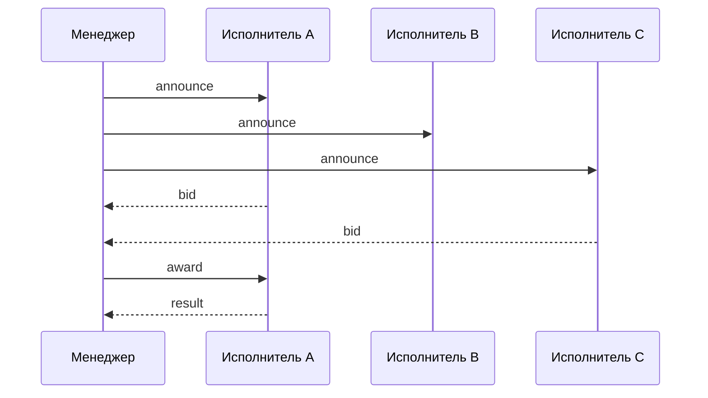
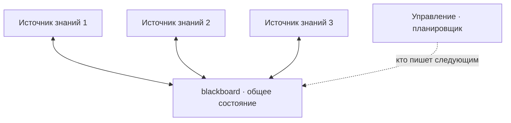
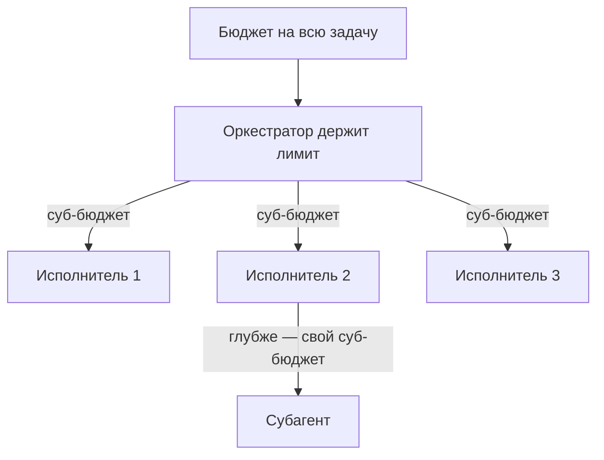

# Договориться о работе, помнить сообща и оценить всю команду

[Часть 1](./index.md) поставила главный вопрос **мультиагентной системы** (multi-agent system) — стоит ли
вообще дробить одного агента на нескольких и когда этого делать не надо: четыре повода (специализация,
изоляция контекста, модульность, параллелизм), четыре топологии (оркестратор–исполнители, цепочка, иерархия,
дебаты / критик), передача управления (handoff) как управление плюс контекст, оркестратор как декомпозиция +
маршрутизация + синтез и честный тормоз — цена × N, распространение ошибки, накладные расходы на координацию и
оценка, которую всё это усложняет. Дальше мы на этом стоим и заново не выводим.

Здесь тот же слой координации разобран вглубь: конкретные протоколы, на которых агенты говорят, и схемы
их сообщений; архитектуры общей памяти (blackboard); как роли назначают и как о них договариваются; как
оценить команду, сшив одну траекторию по всем агентам; и как не дать счёту за токены взорваться.

Общий слой управления циклом и бюджетом — бюджет шагов, обнаружение зацикливания, рефлексия, бюджет как
политика, основы оценки траектории — живёт в уроке про [планирование и циклы](../planning-loops/index.md) и
его [углублении](../planning-loops/deep-dive.md); сюда его не тащим. Эта страница держит слой над одним
агентом — ось агент ↔ агент. Транспорт этого общения смыкается с [MCP](../mcp.md) (Model Context Protocol),
только там ось агент ↔ инструменты, а здесь агент ↔ агент; упаковка же топологий в готовую библиотеку — это [фреймворки
оркестрации](../orchestration-frameworks/index.md). Часть 1 подразумеваем повсюду.

## На чём агенты говорят: протоколы и схемы сообщений

В Части 1 агенты «общались сообщениями» — но что это за сообщение и какой оно формы, там осталось за скобками.
Здесь сообщение обретает конкретную форму. И стоит сразу развеять одно заблуждение: у общения агентов есть
предыстория — за ней тридцать с лишним лет работы, которую нынешние фреймворки во многом переоткрывают.

Начать стоит с **FIPA ACL** (язык общения агентов, стандарт FIPA). Организация FIPA (Foundation for
Intelligent Physical Agents) основана в 1996 году; её набор стандартов общения агентов вышел в 2002-м, а в
2005-м FIPA стала комитетом по стандартам IEEE Computer Society. Она стандартизовала язык общения агентов
(Agent Communication Language, ACL). Сообщение FIPA-ACL — это конверт: **перформатив** (коммуникативный акт —
`inform`, `request`, `propose`, `cfp`, `agree`, `refuse`, `query-if` и прочие из фиксированной библиотеки
коммуникативных актов) оборачивает поля `sender`, `receiver`, `content`, `language`, `ontology`, `protocol`,
`conversation-id`, `reply-with` / `in-reply-to`, `reply-by`. В основе — теория речевых актов (Остин, Сёрль:
сообщение — это действие, а не просто данные), а семантика акта задана поверх модели ментальных состояний
belief–desire–intention (BDI, «убеждения — желания — намерения»). Предшественник — KQML (Knowledge Query and
Manipulation Language) начала 1990-х, из программы DARPA Knowledge Sharing Effort: первый практичный ACL на
речевых актах, к которому FIPA-ACL добавила формальную семантику.

Преемственность тут прямая. Модель из Части 1 — «сообщение передачи управления — это промпт» — более тонкая
формулировка ровно той же идеи: отделить *акт* (что ты хочешь, чтобы другой агент сделал) от *содержания*
(данных, с которыми это делать). Поля конверта ложатся на сегодняшние нужды один в один: кто и кому, полезная
нагрузка и частью какого многошагового протокола это сообщение оказывается.

Второй классический кирпич — **протокол контрактных сетей** (contract net protocol): распределение задач через
переговоры, а не приказом. Придумал его Рид Смит (Reid G. Smith, IEEE Transactions on Computers, том C-29,
№ 12, декабрь 1980). Цикл простой: менеджер объявляет задачу → свободные исполнители присылают заявки →
менеджер присуждает работу лучшей из них → исполнитель возвращает результат. Позже FIPA оформила это как
Contract Net Interaction Protocol (`cfp` → `propose` / `refuse` → `accept-proposal` / `reject-proposal` →
`inform` / `failure`). По сути это динамическое назначение роли, оформленное как протокол, — альтернатива
супервизору (supervisor), который жёстко раздаёт работу сам (к переговорам мы вернёмся в разделе про роли).

*Протокол контрактных сетей: менеджер рассылает объявление, свободные исполнители шлют заявки, менеджер
присуждает работу лучшей и получает результат. B промолчал — тоже допустимый ход.*

Сегодняшние фреймворки переизобретают тот же конверт — обычно куда более тощий. Типичное сообщение в
LLM-фреймворке агентов — это `{role, content, name}` плюс метаданные вызова инструмента: ни явного
перформатива, ни онтологии, ни поля протокола, в отличие от FIPA. А там, где двум самостоятельным агентам надо
договариваться всерьёз, появляется отдельный стандарт — **A2A** (Agent2Agent, протокол связи агент ↔ агент).

[A2A](https://a2a-protocol.org/latest/specification/) — открытый протокол взаимодействия агент ↔ агент. Агент
публикует **Agent Card** (карточку агента — кто он, что умеет, какие принимает и отдаёт форматы, как к нему
аутентифицироваться), по которой его находят другие. Работу передают как задачу-`Task` с явным жизненным
циклом (`submitted` → `working` → `input-required` → `completed` / `failed` / `canceled`), переносящую
сообщения (`Message`), собранные из частей (`Part`) — текст, файл, данные, — а результаты возвращаются
артефактами (`Artifact`). Транспорт — JSON-RPC 2.0 (спецификация 1.0.0 добавляет привязки gRPC и HTTP/REST)
поверх HTTP, со стримингом через SSE. Объявила A2A компания Google 9 апреля 2025 года на Google Cloud Next
(50+ партнёров, лицензия Apache 2.0); к середине 2025-го протокол передан в Linux Foundation, а спецификация
дошла до версии 1.0.0.

Ось здесь и есть вся суть. MCP стандартизует ось агент ↔ инструменты — как модель зовёт инструменты и ресурсы;
A2A стандартизует ось агент ↔ агент — как два непрозрачных агента координируются, не вскрывая друг другу
внутреннее устройство и свои инструменты. Google описывает их как взаимодополняющие: это и есть тот самый A2A,
к которому подводил [урок про MCP](../mcp.md).

Какой бы ни была схема, главный вопрос всегда один: какой контекст несёт каждое сообщение. Дашь слишком мало —
принимающий агент не сможет действовать; дашь слишком много — вернётся то самое раздувание контекста, ради
борьбы с которым Часть 1 и вводила изоляцию. Схема — это только оболочка сообщения; настоящее умение в
дисциплине полезной нагрузки: класть внутрь ровно то, что нужно, и ничего сверх. И одна деталь конверта
окупится позже: явные идентификаторы разговора и задачи (`conversation-id` у FIPA, `Task` у A2A) — это то, чем
потом сошьётся траектория команды в разделе про оценку.

## Где команда помнит сообща: архитектура общей доски (blackboard)

Передача управления из Части 1 — связь точка-точка: один агент вручает работу другому, и каждый видит только
то, что ему передали. Есть и второй примитив координации, устроенный наоборот, — общее рабочее пространство,
которое все агенты и читают, и пишут. У него давнее имя: **blackboard** (общая доска — общая память, через
которую агенты обмениваются, не окликая друг друга напрямую).

Модель такая. Независимые специалисты — их называют **источниками знаний** (knowledge source) — работают над
общей структурой данных (той самой доской), а кто из них ходит следующим, решает отдельный управляющий
компонент. Специалисты не зовут друг друга напрямую: они общаются только через доску и вступают в дело
по мере возможности — пишет тот, кому есть что добавить к текущему состоянию. Родина приёма — система понимания
речи Hearsay-II, созданная в университете Карнеги — Меллона (CMU) примерно в 1971–1976 годах; каноническое
изложение — двухчастный обзор Пенни Нии (H. Penny Nii, Стэнфорд), «Blackboard Systems», AI Magazine, том 7,
1986 год. Всю конструкцию держат три части: доска (общее состояние), источники знаний (специалисты) и
управление (планировщик, решающий, кто пишет следующим).

*Специалисты не общаются напрямую — только через доску; управляющий компонент решает, чья очередь писать.*

Сегодня это переоткрыто как общее состояние / общий блокнот / общая память команды. Самая наглядная форма —
объект общего состояния в графе, который читают и пишут все узлы
([LangGraph](https://www.langchain.com/langgraph)-стиль). Имя приёма разное, суть одна — общее, меняющееся на
ходу состояние вместо попарной пересылки сообщений.

Дальше — компромисс, ради которого раздел и затевался: общая доска и пересылка сообщений, что когда.

У общей доски три сильные стороны. Не нужно связывать каждого агента с каждым — все пишут в одно место. У
любого агента всё общее состояние на виду. И новый специалист добавляется легко: подключил к доске — он
уже видит всё, что нужно. Расплата зеркальна. Та самая полная видимость превращает доску в магнит для
раздувания контекста: шум каждого виден всем, и выигрыш изоляции из Части 1 испаряется. А параллельно
пишущие агенты дерутся за доску — двум агентам, пишущим в одну и ту же ячейку, нужен контроль **конкуренции за
запись** (write contention); без него они просто затирают друг друга. Это тот же сбой, о котором предупреждал
[завершающий урок части](../real-agents.md): посади параллельных исполнителей на общее изменяемое
пространство — и они столкнутся.

У пересылки сообщений расклад обратный. Изоляция контекста сохраняется: каждый агент видит только то, что ему
вручили. Но за это платишь маршрутизацией между агентами — связи нужно проложить и держать, — и всегда есть
риск, что нужная информация не доедет до того, кому была необходима.

Когда что. Общая доска оправдана, когда агентам и правда нужен общий развивающийся артефакт — общий план,
живой документ, решение, которое собирают сообща. Пересылка — когда изоляция и есть смысл, а работа делится на
передаваемые по стадиям куски. В проде чаще всего гибрид: оркестратор (orchestrator) держит общее состояние, а
исполнители получают изолированные передачи управления.

## Кто что делает: назначение ролей и переговоры

Роль агента можно закрепить намертво, а можно раздавать на ходу — и это две разные философии.

**Статические роли** заданы на этапе проектирования: у каждого агента своя роль, своя цель, свой характер и
свой набор инструментов. Так устроены, например, «команды» (crews) у [CrewAI](https://www.crewai.com) с их
тройкой роль / цель / предыстория (role / goal / backstory). Предсказуемо, поведение легко предвидеть,
никаких накладных расходов на переговоры.

**Динамическое назначение** раздаёт работу в момент выполнения. Либо оркестратор сам разбивает задачу и
направляет подзадачи агентам-исполнителям (worker) — та самая связка «декомпозиция + маршрутизация» из Части
1, — либо агенты договариваются о задачах сами: тот же протокол контрактных сетей из первого раздела, где
объявление, заявки и присуждение и есть назначение роли, разыгранное как обмен сообщениями. Это рынок: работу
берёт самый подходящий или наименее загруженный, а победителя выбирает цена или полезность заявки — не мнение,
а число.

Но переговоры бывают не только о том, кто возьмёт задачу, — агенты спорят и о самих ответах. **Мультиагентные
дебаты** (multi-agent debate): несколько экземпляров модели независимо предлагают ответ, а затем несколько
раундов критикуют и правят чужие варианты, сходясь к ответу точнее и связнее, чем даёт любой одиночный проход.
Работа, которая это ввела (Du, Li, Torralba, Tenenbaum, Mordatch, arXiv:2305.14325, май 2023), показала
выигрыш на математике, стратегических рассуждениях и фактической точности и заодно снижение галлюцинаций;
авторы прямо ссылаются на «общество разума» (Society of Mind) Минского. По сути это топология дебатов /
критика из Части 1, доведённая до протокола: раунды «предложить → раскритиковать → переписать».

Цена у этого честная и высокая: дебаты умножают стоимость на число агентов, помноженное на число раундов.
Окупаются они на трудных задачах рассуждения и фактологии, где нет дешёвого способа проверить ответ, — и это
пустая трата на том, что одиночный агент с простой проверкой и так решает. Та же сдержанность, что и в Части 1.

И общий тормоз на весь раздел: переговоры, торги и дебаты — это лишние раунды вызовов модели, то есть деньги и
латентность. Супервизор, который жёстко раздаёт работу, дешевле и обычно достаточен; за переговоры берись
только там, где статическая раздача честно не справляется, — когда исполнители разнородны, загружены
неравномерно или когда качество приходится добывать состязанием.

## Как оценить команду: одна траектория, сшитая по агентам

Часть 1 предупредила: мультиагентную систему труднее оценить — траектория размазана по агентам. Этот раздел
про то, как именно. Основы оценки траектории — итог и процесс, модель-судья (LLM-as-a-judge) поверх трейса,
наблюдаемость (observability) как предпосылка — разобраны в углублениях про
[Agentic RAG](../agentic-rag/deep-dive.md) и [планирование и циклы](../planning-loops/deep-dive.md); здесь
только мультиагентная надстройка над ними.

У команды траектория распределённая: у каждого агента свой локальный трейс (trace) — его рассуждение, вызовы
инструментов, подшаги. Чтобы оценить команду целиком, эти куски надо сшить в один сквозной трейс: общий
идентификатор разговора или задачи протягивает спаны (span — записи отдельных операций в трейсе) от всех
агентов в одно дерево — родительский спан оркестратора, под ним спаны исполнителей, под ними спаны их
инструментов. Это конкретная форма того, что Часть
1 называла «наблюдаемость обязана сшивать куски». Опора — распределённый трейсинг вообще и семантические
соглашения [OpenTelemetry](https://opentelemetry.io) для GenAI, которые задают виды спанов для вызова модели,
выполнения инструмента и оркестрации агентов и складывают мультиагентные передачи управления и циклы
инструментов в одно дерево «родитель — потомок». Это и есть **сшивка траектории** (trajectory stitching) по
агентам.

Оценивают команду на трёх уровнях.

- **Итог** (outcome): выдала ли команда верный финальный ответ — обычные метрики качества ответа.
- **Процесс** команды: была ли осмысленной сама координация — верна ли декомпозиция, верна ли маршрутизация
  между агентами, нет ли продублированной работы и взаимных блокировок, уложилась ли команда в разумное число
  шагов и в разумные деньги.
- **Атрибуция по агентам**: какой именно агент породил сбой. Вот это — специфически мультиагентная и самая
  трудная задача: неверный финальный ответ надо локализовать до того агента или той передачи управления, что
  внесли ошибку, — иначе чинить нечего. Это аналог пошаговой оценки из Agentic RAG, где сбой локализуют до
  конкретного захода поиска; здесь единица локализации — агент.

Ломаются команды агентов характерным образом, которого у одиночного агента просто нет, и эти способы уже
каталогизированы. **Таксономия провалов мультиагентных систем** (MAST, Multi-Agent System failure Taxonomy)
собрана эмпирически: Cemri и коллеги (arXiv:2503.13657, март 2025) разобрали работу семи мультиагентных
фреймворков на 200+ задачах (согласие разметчиков κ = 0.88) и выделили 14 типичных сбоев в трёх категориях:
(1) спецификация и устройство системы, (2) рассогласование между агентами — недопонимание, проигнорированный
вход, уход от темы — и (3) проверка результата и остановка. Пользуйся ею как каталогом. Исполнитель не так
понял передачу управления, а оркестратор принял его результат за факт — это распространение ошибки, случай
рассогласования между агентами. Два агента параллельно сделали одну и ту же работу — тоже рассогласование.
Команда никак не сойдётся к ответу и не останавливается — категория проверки и остановки. Исполнитель посреди
работы отклоняется от назначенной подзадачи — уход от цели, снова рассогласование.

И сразу оговорка про масштаб. Цепочке из двух агентов вся эта машинерия почти не нужна, а у связки
«маршрутизатор плюс один исполнитель» траектории по сути и нет. Стоимость сшивки и атрибуции растёт вместе с
размером команды — подключай инструментирование тогда, когда команда достаточно велика, чтобы у неё была
траектория, которую стоит оценивать.

## Как удержать цену: контроль стоимости команды

Часть 1 сказала: цена умножается примерно на N. Вот слой политики, который держит это умножение в узде, — и
вот, наконец, число.

Команда агентов тратит на порядок больше токенов, чем одиночный чат, и это измерено. Инженерная заметка
Anthropic [«How we built our multi-agent research system»](https://www.anthropic.com/engineering/multi-agent-research-system)
(13 июня 2025) приводит цифры прямо: агенты «расходуют примерно в 4 раза больше токенов, чем обычная переписка
с моделью», а мультиагентные системы — «примерно в 15 раз больше, чем чаты». Там же: один только расход токенов
объяснил около 80% разброса качества на их наборе для оценки (остальное — число вызовов инструментов и выбор
модели). Вывод у заметки трезвый: экономика мультиагентности сходится, «только когда ценность задачи достаточно
высока, чтобы оплатить прибавку в качестве», — тяжёлое распараллеливание, контекст, не влезающий в одно окно,
множество сложных инструментов; а плохой это выбор, когда всем агентам нужен один и тот же контекст или когда
между ними много зависимостей.

Дальше — как этим расходом управлять. Возьми **политику бюджета** (budget policy) из урока про планирование и
разнеси её на команду.

- **Общий бюджет на задачу поверх суб-бюджетов** на агентов. Оркестратор держит весь лимит и раздаёт его
  исполнителям, чтобы один зарвавшийся не сжёг всё раньше, чем до дела дойдут остальные;
  неистраченное он может забрать назад. Это ровно тот случай «супервизор держит кошелёк», что уже разобран в
  углублении про [планирование и циклы](../planning-loops/deep-dive.md).
- **Потолок ветвления** (fan-out): сколько исполнителей оркестратор порождает за шаг — то есть ширина дерева.
- **Потолок глубины**: насколько глубоко вкладываются оркестраторы над оркестраторами, чтобы рекурсия не пошла
  вразнос.
- **Разные модели по ролям**: дешёвая модель — исполнителям, сильная — оркестратору и агенту-синтезатору
  (или наоборот). Платить по цене передовой модели за каждый вызов субагента незачем.
- **Мягкий и жёсткий потолок** (soft / hard cap): мягкий предупреждает и заставляет проседать плавно, жёсткий
  просто останавливает. Термин перенесён из урока про планирование как есть.

*Оркестратор держит общий бюджет и нарезает его на суб-бюджеты исполнителям; потолок ветвления ограничивает
число исполнителей на шаг, потолок глубины — вложенность оркестраторов.*

И финальная сдержанность, ради которой всё это писалось. За командой агентов тянись только ради настоящей
специализации, ради контекста, который не влезет в одно окно, или ради подзадач, которые и правда идут
параллельно, — та же дисциплина «бери самый простой уровень, который решает задачу», что и в Agentic RAG. Один
хорошо спроектированный агент — или супервизор со статической раздачей ролей — обыгрывает переговаривающуюся
команду с общей доской на большинстве задач и за долю её цены. Протоколы, общая память, переговоры, оценка
команды и политика бюджета — это то, что ты добавляешь, когда команда уже оправдана, а не то, с чего начинаешь.

## Что забрать из урока

- Сообщение агента — это конверт: акт (что сделать) плюс содержание (с чем), плюс кто кому и в рамках какого
  протокола. FIPA ACL описала такой конверт формально ещё в нулевые, contract net — распределение задач через
  объявление, заявки и присуждение, а сегодняшний A2A даёт агент ↔ агент тот же конверт заново. Идентификаторы
  разговора и задачи в конверте — то, чем потом сошьётся траектория.
- Два примитива координации, и они зеркальны. Общая доска (blackboard) даёт всем полный обзор состояния и
  лёгкое добавление специалистов, но копит шум и рождает конкуренцию за запись; пересылка с передачей управления
  хранит изоляцию контекста, но требует маршрутизации и рискует не доставить нужное. В проде — гибрид.
- Роли либо закреплены на этапе проектирования, либо раздаются на ходу — оркестратором или переговорами
  агентов. Переговоры и дебаты покупают качество лишними раундами вызовов; на простой задаче это чистая
  переплата.
- Оценить команду — значит сшить один сквозной трейс из локальных трейсов всех агентов и мерить на трёх
  уровнях: итог, процесс координации и атрибуцию сбоя до конкретного агента. Характерные способы сломаться
  собраны в таксономии MAST — рассогласование между агентами, дубли работы, несходимость и остановка.
- Токены — главная статья расхода: команда тратит их примерно в 15 раз больше, чем чат (Anthropic, 2025), и
  этот расход почти в одиночку объясняет разброс качества. Держат его политикой бюджета: суб-бюджеты на
  агентов, потолки ветвления и глубины, разные модели по ролям.
- Вся эта надстройка — протоколы, общая память, переговоры, оценка, бюджет — включается только тогда, когда
  команда оправдана. По умолчанию выигрывает один хороший агент или супервизор со статической раздачей.

**Новые термины** → [Глоссарий](../../glossary.md): FIPA ACL, contract net protocol, blackboard, A2A (Agent2Agent), multi-agent debate, trajectory stitching.
