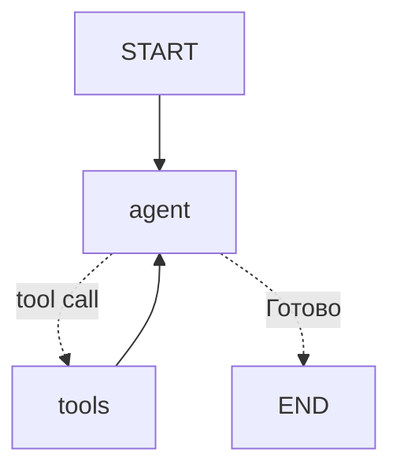

# Пройти по одному графу, пережить падение и описать агента двумя способами

[Часть 1](./index.md) свела всё к одному тезису: фреймворк оркестрации снимает обвязку вокруг голого цикла —
внешний `while`, склейку вызова инструментов, состояние и память, поток управления, передачи управления между
агентами и хвост из трейсинга, стриминга и чекпоинтов, — а большинство фреймворков сходятся к агенту как графу /
конечному автомату, где узлы это шаги, рёбра это поток управления вместе с петлями, заворачивающими цикл, и весь
AI-дельта в том, что граф превращает непрозрачный `while` в управляемую, инспектируемую и возобновляемую машину,
за что платишь навязанной абстракцией, а страхуешься правилом «сперва примитивы». Игроков та часть разложила по
слоям, честно оговорив, что это снимок картины, которая всё ещё меняется.

Эта страница прорабатывает слой фреймворка целиком. Пройдём по одному конкретному графу; разберём, что на деле
такое устойчивое исполнение и бэкенды чекпоинтов; поставим память фреймворка рядом с мультиагентными
конструкциями; сравним императивное и декларативное описание агента; покажем, как трейсинг и оценка подключаются
на уровне фреймворка.

Сразу о границах. Этот урок держит слой фреймворка — соседние слои мы не выводим заново, а даём ссылкой. Общие
типы памяти, бюджет шагов и токенов, управление циклом — в уроке про
[планирование и циклы](../planning-loops/index.md) и его [углублении](../planning-loops/deep-dive.md).
Мультиагентные топологии, протоколы и оценка команды — в уроке про [команды агентов](../multi-agent/index.md) и
его [углублении](../multi-agent/deep-dive.md). Транспорт этого общения: ось агент ↔ инструменты — это
[MCP](../mcp/index.md), ось агент ↔ агент — это A2A. Сервинг, наблюдаемость и операционная сторона оценки — за
[Частью III](../../part-3-production/overview.md). Часть 1 подразумеваем повсюду.

## Один граф вблизи: узлы, рёбра и петля

[LangGraph](https://www.langchain.com/langgraph) доводит «агента как граф» из Части 1 до конкретной формы —
**графа состояния** (StateGraph). Это типизированный объект общего состояния, который каждый узел читает и в
который пишет, плюс сами **узлы** (node) — шаги — и **рёбра** (edge) — переходы между ними.

:::tip[▶ Видео]

<YouTube id="qAF1NjEVHhY" title="LangChain vs LangGraph: A Tale of Two Frameworks — IBM Technology" />

IBM объясняет, почему LangGraph понадобился поверх LangChain как отдельный слой оркестрации с состоянием, — ровно
та рамка, в которой мы и разбираем граф.

:::

У графа два якоря: START — вход и END — выход. Узел — это функция: принимает состояние и возвращает его обновление;
внутри она зовёт модель, зовёт инструмент или принимает решение.

Обычное ребро — безусловный переход: из A всегда в B. А **условное ребро** (conditional edge) — это функция: она
смотрит на состояние и возвращает, какой узел будет следующим. Именно условное ребро кодирует ветку цикла —
«модель попросила инструмент? → узел `tools`; нет? → END».

Соберём канонический ReAct-агента как граф. Всего два узла: `agent` (модель) и `tools` (инструменты). START ведёт
в `agent`; из `agent` выходит условное ребро — в `tools`, если модель выдала вызов инструмента, иначе в END; а из
`tools` безусловное ребро возвращает в `agent`. Вот это возвратное ребро и есть агентный цикл из урока про
[Agentic RAG](../agentic-rag/deep-dive.md), теперь нарисованный явно. Та самая базовая форма «узлы-инструменты
плюс условные рёбра», которую Часть 1 назвала, но не развернула.

*Канонический ReAct как граф: из узла `agent` условные рёбра ведут в `tools` (если есть вызов инструмента) или в
END; узел `tools` безусловным ребром возвращает в `agent` — это и есть петля цикла.*

Чаще всего этот граф ты руками не собираешь. LangGraph поставляет **готового ReAct-агента** — функцию
`create_react_agent`, которая возвращает ровно такой граф в собранном виде: подставь модель и инструменты. Тот
самый «агент в комплекте» из Части 1. Руками граф строят только тогда, когда нужна форма, которой готовый агент
не даёт: своё ветвление, лишний узел, прерывание.

Выигрыш простой: как только цикл стал графом, всё остальное на этой странице — чекпоинты, устойчивость,
человек-в-цикле, трейсинг — это то, что ты навешиваешь на готовый граф; писать заново ничего не нужно.

## Устойчивое исполнение и бэкенды чекпоинтов

**Чекпойнтер** (checkpointer) сохраняет снимок состояния графа на каждом супершаге (super-step) — то есть при
каждом переходе между узлами — и привязывает снимок к **потоку** (thread). Возобновиться — значит загрузить
последний чекпоинт и продолжить с него. По сути это короткая память фреймворка, живущая в пределах одного потока.

Поток держит один разговор или прогон отдельно от другого: у каждого потока своя история чекпоинтов, поэтому две
сессии не перетекают друг в друга; идентификатор потока — `thread_id`. Это конкретная форма Части 1 — «разные
диалоги разведены по потокам».

Раз сохраняется каждый шаг, ты можешь не только возобновиться, но и отмотать назад — к более раннему чекпоинту —
и уйти в новую ветку. Это путешествие во времени: встал на нужном шаге, посмотрел состояние, поправил, пошёл
дальше. Ровно это Часть 1 и обещала одной строкой — встать на любом шаге, посмотреть состояние и поправить.

**Бэкенд чекпоинтов** (checkpoint backend) — это сменное хранилище под чекпойнтером: сам он лишь единый интерфейс
над ним. Конкретные бэкенды (по состоянию на июль 2026):

- `InMemorySaver` — в оперативной памяти, только для разработки: перезапуск — и всё потеряно;
- `SqliteSaver` (пакет `langgraph-checkpoint-sqlite`, v3.1.0, май 2026) — локально, на одной машине;
- `PostgresSaver` (пакет `langgraph-checkpoint-postgres`, v3.1.0) — для прода, общее и долговечное хранилище;
- `RedisSaver` (пакет `langgraph-checkpoint-redis`).

Выбор здесь — между разработкой и продом (production): в блокноте хватит памяти, а для всего, что должно пережить
перезапуск, нужна настоящая база данных.

**Устойчивое исполнение** (durable execution) — это когда прогон после падения, перезапуска, деплоя или долгой
паузы возобновляется с последнего успешного шага, вместо того чтобы стартовать заново. Строится оно поверх
чекпойнтера — без него не работает. LangGraph выставляет настройку `durability` с тремя режимами (по состоянию на
июль 2026):

- `"exit"` — состояние сохраняется только на выходе из исполнения: самый быстрый режим, но восстановления после
  падения посреди прогона нет;
- `"async"` — сохранение идёт асинхронно, пока считается следующий шаг: хороший компромисс между скоростью и
  надёжностью, с небольшим риском потерять последнюю запись при падении;
- `"sync"` — сохранение синхронно, до начала следующего шага: максимальная надёжность ценой наибольших накладных
  расходов.

Режимы управляют тем, *когда* чекпойнтер пишет; существование самого чекпойнтера они не отменяют.

Зачем это агенту — вот AI-дельта. Прогоны агента длинные, недетерминированные и дорогие: исследовательский агент
на тридцать шагов, упавший на двадцать восьмом, не должен заново оплачивать двадцать семь вызовов модели. На
устойчивости же стоит и режим **человек-в-цикле** (human-in-the-loop, HITL): узел-прерывание сохраняет состояние,
и прогон часами или днями ждёт одобрения, а потом продолжает ровно с той точки, где замер. Это тот самый HITL-узел
из Части 1, теперь опертый на реальное сохранение состояния. Общий слой человека-в-цикле и бюджета разбирает урок
про [планирование и циклы](../planning-loops/index.md).

Когда НЕ надо. Агенту без состояния, отвечающему за один проход, не нужно ничего из этого — ни чекпойнтера, ни
бэкенда, ни режима устойчивости. Устойчивость — для длинных, возобновляемых или требующих человеческого одобрения
прогонов; поднимать Postgres ради классификатора на один ход незачем.

## Память фреймворка и мультиагентные конструкции — разные оси

У памяти фреймворка два масштаба. Короткая, привязанная к потоку, — это состояние чекпойнтера: оно живёт внутри
одного потока, того самого идущего разговора, и заканчивается там же, где поток. Долгая, сквозная по потокам, —
это отдельное **хранилище** (store): оно переживает границы потоков и разложено по пространствам имён (namespace),
например по одному на пользователя, — так что агент помнит пользователя между разными сессиями. Долгую сторону
LangGraph так и называет — Store.

Фреймворк даёт саму механику: сохранение состояния плюс API хранилища. А вот таксономия типов памяти —
эпизодическая, семантическая, процедурная — это [углубление про планирование и циклы](../planning-loops/deep-dive.md);
что именно помнить и когда суммировать или вытеснять — тот же слой бюджета, и это уже не забота фреймворка.
Границу держим явно и заново её не выводим.

Фреймворки расходятся в том, насколько жёстко навязывают API памяти. LangGraph даёт низкоуровневое разделение —
чекпойнтер и хранилище порознь — и оставляет решение за тобой. [CrewAI](https://www.crewai.com) (по состоянию на
июль 2026) идёт выше уровнем: единый API `Memory` сам категоризирует, что сохранить, и ранжирует припоминание по
релевантности, свежести и важности. Это то же деление на короткую и долгую память, только фреймворк принимает
больше решений за тебя. Суть не в том, чей API лучше, а в том, что память — это возможность, которую даёт
фреймворк, с хранилищем-бэкендом за спиной.

Мультиагентные конструкции — это уже другая ось. Фреймворк даёт и готовые командные конструкции: **супервизор**
(оркестратор, раздающий работу исполнителям), ролевые агенты в стиле «экипажа» (CrewAI) — то есть топологии из
урока про [команды агентов](../multi-agent/index.md), собранные заранее, чтобы ты их настраивал, не программируя с
нуля.

И вот несущая мысль раздела. Память — это персистентность состояния: что переживает шаги и сессии. Мультиагентные
конструкции — это распределение работы: как связаны субагенты. Оси ортогональны: бывает одиночный агент с богатой
долгой памятью, бывает команда без состояния, бывает и то и другое разом. Спутать их — «добавлю супервизора, чтобы
появилась память» — это реальная ошибка проектирования. Фреймворк упаковывает и то и другое; сами же концепции
живут в уроках про [планирование и циклы](../planning-loops/index.md) (память) и
[команды агентов](../multi-agent/index.md) (топологии), а этот урок лишь показывает, в каком виде их даёт
фреймворк.

Когда НЕ надо. Не тянись к мультиагентной конструкции ради памяти и к сквозному хранилищу — там, где хватает
чекпоинта в пределах потока. Подбирай конструкцию под настоящую нужду.

## Императивное и декларативное описание агента

**Императивное** описание — это когда ты собираешь агента в коде, шаг за шагом: создаёшь граф, `add_node`,
`add_edge`, добавляешь условное ребро, компилируешь — поток управления пишешь сам. Graph API у LangGraph именно
императивный. Есть и полегче — императивный **Functional API**: декораторы `@entrypoint` и `@task`,
агент-как-функция с состоянием в области видимости этой функции; это императивный вариант для случая, когда явный
граф тебе не нужен.

**Декларативное** описание — это когда ты описываешь агентов и их связи в конфигурации, а собрать
**среду выполнения** (runtime) предоставляешь фреймворку. Примеры (по состоянию на июль 2026): конфиги CrewAI
(`agents` и `tasks` — в YAML в классических проектах и в JSONC по умолчанию в новых) задают роль, цель и
инструменты каждого агента вообще без кода потока управления; [Microsoft Agent Framework](https://learn.microsoft.com/en-us/agent-framework/)
поставляет **декларативные рабочие процессы** (workflow), и его собственная документация формулирует это точнее
всего: «ты описываешь, *что* должен делать твой рабочий процесс, а не *как* его реализовать».

Компромисс такой. Императивный подход покупает контроль и выразительность — произвольные ветвления, свои узлы,
всё, что вообще можно закодить, — ценой большего объёма кода и более тяжёлого чтения. Декларативный покупает
скорость, единообразие и доступность — конфиг-экипаж прочтёт и поправит не-инженер, формы получаются одинаковые, а
саму конфигурацию удобно сравнивать (diff) и генерировать инструментами, — ценой потолка: как только нужен
поток управления, которого словарь конфига не выражает, ты откатываешься обратно в код. Рекомендация самой
Microsoft делит так же: декларативно — под стандартные паттерны, часто меняющиеся рабочие процессы и правки
не-разработчиками; программно — под
сложную заказную логику и максимальную гибкость.

Читается это честно: перед нами тот же водораздел между декларативным и императивным, что и повсюду в софте, —
SQL и процедурный код, инфраструктура-как-конфиг и скрипты. Декларативно — под частые типовые формы; императивно —
когда упёрся в стену. Большинство реальных фреймворков дают оба стиля и позволяют смешивать: декларативный экипаж
с императивным аварийным люком.

Замкнём на граф из первого раздела. Собранный руками, он — императивная форма; экипаж, заданный конфигом, —
декларативная форма той же мультиагентной топологии из урока про [команды агентов](../multi-agent/index.md). Одна
концепция, два способа её описать.

## Трейсинг и оценка на уровне фреймворка

Раз агент — это граф из именованных узлов, фреймворк умеет сам собирать трейс (trace) автоматически: каждое
исполнение узла, каждый вызов модели и инструмента становится **спаном** (span) в дереве «родитель — потомок»,
почти или совсем без ручного инструментирования. Так окупается обвязка «хуки трейсинга» из Части 1.

[LangSmith](https://www.langchain.com/langsmith) — родной пример для [LangChain](https://www.langchain.com) и
LangGraph: вызовы модулей LangChain внутри графа трейсятся сами, стоит только включить трейсинг (флаг окружения
плюс ключ API). Сверху он добавляет обвязку оценки: датасеты («юнит-тесты для твоего LLM-приложения»), оценщиков —
LLM-as-a-judge, эвристики, попарное сравнение, человек, — и сравнение прогонов, и всё это подключено к тому же
графу. Это лишь один из вариантов.

Вендор-нейтральный стандарт — **семантические соглашения OpenTelemetry для GenAI**
([OpenTelemetry](https://opentelemetry.io)): они задают стандартные виды спанов под LLM- и агентные нагрузки —
`invoke_agent`, `execute_tool`, спаны инференса модели и памяти, — так что фреймворк может отдавать трейсы, которые
прочтёт любой OTel-бэкенд, и ты не заперт в трейсере одного поставщика (сам LangSmith говорит на OTLP в обе
стороны). Скажем честно про дату: по состоянию на июль 2026 эти соглашения для GenAI всё ещё в статусе
«Development» — стандарт нарождающийся, ещё не устоявшийся. Те же соглашения OpenTelemetry для GenAI использует и
[углубление про команды агентов](../multi-agent/deep-dive.md), чтобы сшить траекторию команды.

Оценка на уровне фреймворка. Захваченный трейс — это вход для оценки. Мерь **итог** (финальный ответ, по метрике
задачи) и **процесс** (взял ли граф вменяемый путь — те ли узлы, нет ли цикла, который не останавливается) прямо
по трейсу. Это то самое деление на итог и процесс из [углубления про Agentic RAG](../agentic-rag/deep-dive.md),
только теперь его питает собственный трейс фреймворка. Фреймворк захватывает; сама же дисциплина оценки — метрики,
судьи, эталонные наборы (golden sets) — это [Часть III](../../part-3-production/overview.md).

Вот стык, к которому вела вся страница. Граф, определённый в первом разделе, — это тот же самый объект, который ты
сохраняешь чекпоинтами (устойчивость), которым помнишь (память), который описываешь декларативно или императивно,
и который теперь трейсишь и оцениваешь. Один артефакт — и на нём висит каждая продовая забота. Это и есть самая
глубокая форма AI-дельты из Части 1: граф не просто инспектируем — это единственная точка крепления, к которой
разом цепляются сохранение состояния, память и наблюдаемость.

И завершающая сдержанность — эхо «сперва примитивы» из Части 1. Всё это — мастерство по выбору, а не по умолчанию.
Простому агенту не нужно ничего: ни чекпойнтера, ни хранилища, ни декларативного конфига, ни бэкенда трейсинга.
Берись за каждый кусок только тогда, когда прогон достаточно длинный, чтобы понадобилась устойчивость, достаточно
насыщен состоянием, чтобы понадобилась память, или достаточно сложный, чтобы понадобился трейсинг. Фреймворк
делает каждый из них дешёвым в подключении — но не бесплатным; а лишний, ненужный тебе слой — это ровно та цена
абстракции, о которой предупреждала Часть 1, только уплаченная дважды.

## Что забрать из урока

- Один граф: LangGraph описывает агента как граф состояния — объект общего состояния, узлы (вызвать модель /
  вызвать инструмент / решить), обычные рёбра и условные рёбра, выбирающие следующий узел по состоянию; ReAct-агент
  — это узел `agent` плюс узел `tools`, условное ребро из `agent` и возвратное ребро из `tools` в `agent`.
  `create_react_agent` отдаёт такой граф уже собранным.
- Устойчивое исполнение: чекпойнтер сохраняет состояние на каждом шаге с привязкой к `thread_id`, так что прогон
  возобновляется с последнего успешного шага; на этой же персистентности держится прерывание для человека-в-цикле —
  оно может ждать часами и продолжить с той же точки. Режимы (`exit` / `async` / `sync`) меняют скорость на
  надёжность, бэкенды сменные (память — для разработки, Postgres или Redis — для прода), а агенту без состояния на
  один проход не нужно ничего из этого.
- Два масштаба памяти, и это не командные конструкции: короткое состояние в пределах потока (чекпойнтер) и долгая
  сквозная память (хранилище, разложенное по пространствам имён). Мультиагентные супервизор и экипаж — другая ось:
  распределение работы, тогда как память — это хранение состояния; спутать их — ошибка проектирования.
- Императивное и декларативное: императивно граф строится в коде (контроль, выразительность); декларативно агенты
  описываются в конфиге — файлы CrewAI, декларативные рабочие процессы у Microsoft Agent Framework — ради скорости,
  единообразия и правок не-инженером, пока не упрёшься в поток управления, который конфиг не выражает. Большинство фреймворков
  дают оба стиля и позволяют смешивать.
- Трейсинг и оценка почти даром: граф из именованных узлов сам порождает дерево спанов (LangSmith — нативно;
  семантические соглашения OpenTelemetry для GenAI — вендор-нейтрально, и по состоянию на июль 2026 это ещё
  нарождающийся стандарт); фреймворк захватывает трейс, а дисциплина оценки над ним — за Частью III.
- Один артефакт, всё по выбору: граф — это единственная точка, к которой крепится каждая продовая забота: сохрани
  его чекпоинтом, помни им, опиши двумя способами, трейсь его. Простой агент пропускает все слои; лишний, ненужный
  слой — это цена абстракции, уплаченная дважды.

**Новые термины** → [Глоссарий](../../glossary.md): state graph, checkpointer, checkpoint backend, thread (thread_id), durable execution, conditional edge, framework long-term memory (store), declarative vs imperative agent definition.
