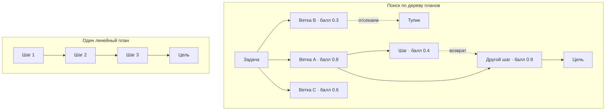
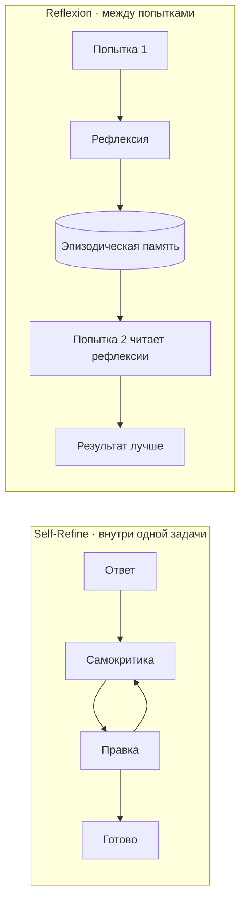
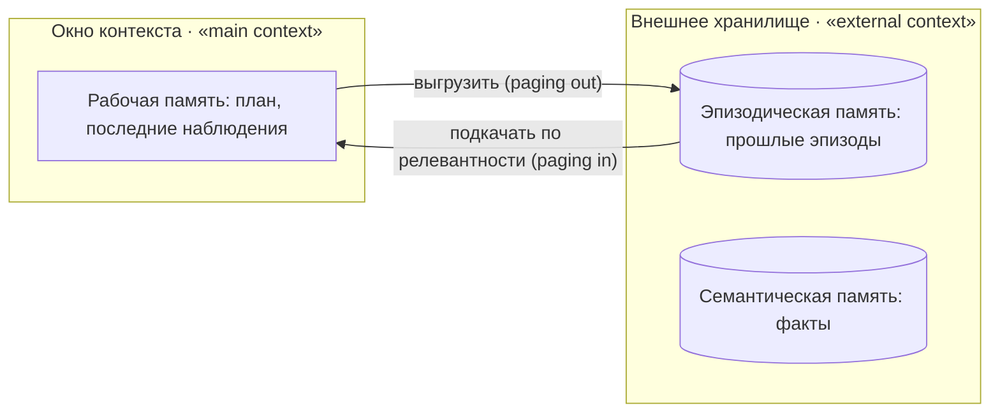

# Искать среди планов, помнить между прогонами и оценивать весь путь

[Часть 1](./index.md) собрала слой управления над циклом: декомпозиция задачи, ReAct против plan-and-execute,
три формы незавершения, послойные защиты и рефлексия как понятие. Дальше мы на этом стоим — заново не
объясняем.

Здесь тот же контроль над циклом доведён до мастерства, но в общем виде: планирование превращается в поиск по
планам, у рефлексии появляются имена и границы, бюджет становится политикой, память дорастает до архитектуры, а
оценка меряет весь пройденный путь. Ровно эти же идеи, повёрнутые к retrieval (поиску), разобраны в [углублении
Agentic RAG](../agentic-rag/deep-dive.md); поисковую специфику мы туда и оставляем — тут речь про общий
контроль над агентным циклом, и механику retrieval заново не выводим.

## Планирование как поиск по пространству планов

В Части 1 план был один: ты строил последовательность шагов и перестраивал её, когда шаг срывался.
Мастерский ход — перестать держаться за единственный план и посмотреть на планирование как на **поиск по
дереву/графу планов** (tree/graph search over plans): держать в работе сразу несколько кандидатов и выбирать
между ними. (Голый «поиск» в книге всегда означает retrieval — извлечение из корпуса; здесь же речь о переборе
планов, поэтому форма полная.)

Механика такая. Вместо одного следующего шага модель порождает несколько кандидатных продолжений — их
называют «мыслями» (thoughts), частичными планами, — каждому выставляет балл функцией ценности (value
function; чаще всего модель судит собственные состояния сама), и дальше идёт по этому пространству:
разворачивает перспективные ветки, заглядывает на шаг вперёд и пятится из тупиков, чтобы попробовать другую.

**Tree of Thoughts (ToT)** — Shunyu Yao и коллеги, arXiv:2305.10601, 17 мая 2023 — оформляет это как
обдуманное решение задачи через поиск по дереву промежуточных шагов рассуждения. Модель предлагает
кандидатные мысли, сама оценивает каждое состояние баллом и обходит дерево в ширину или в глубину (BFS/DFS)
с заглядыванием вперёд и возвратами. В отличие от chain-of-thought (цепочки рассуждений), который намертво
идёт по одной линейной цепочке. Цифра, которую стоит запомнить: на задаче Game of 24 ToT дошёл до 74%
успеха там, где стандартный chain-of-thought с обычным промптингом даёт лишь 4%.

**Graph of Thoughts (GoT)** — Maciej Besta и коллеги, arXiv:2308.09687, 18 августа 2023 — снимает с дерева
ограничение древовидности и обобщает его до произвольного графа: мысли становятся вершинами, зависимости
между ними — рёбрами. Ветки теперь можно не только ветвить, но и сливать, агрегировать, дошлифовывать.
Смысл в том, что некоторым задачам нужно именно соединить частичные решения, а строгое дерево такого не
выражает.

**LATS (Language Agent Tree Search)** — Andy Zhou и коллеги, arXiv:2310.04406, 6 октября 2023 — выносит
поиск по дереву из чистого рассуждения прямо в цикл действий. Это поиск по дереву методом Монте-Карло (Monte
Carlo Tree Search, MCTS), но уже по действиям агента: роль функции ценности берёт на себя языковая модель,
добавлены саморефлексия и настоящая обратная связь среды — результаты вызванных инструментов. Рассуждение, действие и
планирование сходятся в одном механизме. По сути это мост от «поиска по мыслям» к «поиску по траекториям»:
агент пробует ветку действий, смотрит на результат и может отыграть назад, чтобы взять другую.

За всё это платят вызовами. Перебор умножает обращения к модели: ты оцениваешь много состояний и разворачиваешь
много веток, поэтому прогон ToT или LATS обходится в разы, а то и в десятки раз дороже одного прямого
прохода. И держится он на доверии к оценщику состояний: если модель не умеет надёжно судить частичный план,
перебор не спасает — он лишь усиливает её же заблуждение.

Когда за это не стоит браться. Большинство прод-агентов планы не перебирают — они гоняют один план и
перепланируют при срыве, как в Части 1: это кратно дешевле и обычно достаточно. Поиск по планам держи для
дорогих задач с проверяемыми промежуточными шагами и надёжным оценщиком — математика, код, головоломки,
оптимизация с ограничениями, — где неверную ветку дёшево распознать, а возврат из тупика окупается. На
открытых задачах, где у шага нет чистого сигнала успеха, оценщик становится слабым звеном, и цена перебора
почти никогда не отбивается.

*Поиск по дереву планов: модель порождает ветки, оценивает каждую баллом, разворачивает лучшие и пятится из
тупиков, — рядом для контраста один линейный план без выбора.*

## У рефлексии появляются имена: Self-Refine и Reflexion

Часть 1 ввела рефлексию как понятие — шаг, на котором агент судит собственную траекторию. Теперь у этого
приёма есть опубликованные, названные формы, и есть один принцип, который решает, помогает рефлексия или
вредит.

**Self-Refine** — Aman Madaan и коллеги, arXiv:2303.17651, 30 марта 2023 — обходится одной моделью и без
всякого обучения: модель порождает ответ, сама даёт себе обратную связь и переписывает — и так по
кругу, пока не станет достаточно хорошо. Авторы намерили около 20% абсолютного среднего прироста на семи
задачах (GPT-3.5/ChatGPT/GPT-4). Важна область действия: это доводка внутри одной задачи, одного эпизода.

**Reflexion** — Noah Shinn и коллеги, arXiv:2303.11366, 20 марта 2023 — заходит иначе, «вербальным обучением
с подкреплением» (verbal reinforcement learning). После неудачной попытки агент словами, на естественном
языке, пишет рефлексию о том, что пошло не так, и кладёт её в буфер эпизодической памяти (episodic memory).
На следующей попытке он вычитывает эти заметки обратно и справляется лучше — учится между попытками без
единого обновления весов. Область действия здесь другая: не внутри попытки, а поперёк попыток. Тут рефлексия
и смыкается с памятью (→ раздел про память ниже).

Замечание про имена, которое избавит тебя от путаницы: Reflexion с большой «R» и латиницей — это название
фреймворка Шинна, а рефлексия строчными и кириллицей — общий приём из Части 1. Рядом их легко перепутать,
поэтому чётко их разделяй: фреймворк Reflexion — одно, рефлексия как приём — другое.

Различие двух форм стоит проговорить прямо. Self-Refine улучшает текущий ответ внутри одного прогона;
Reflexion переносит урок из одного прогона в следующий. И то и другое — «агент критикует сам себя», просто
на разных временных масштабах.

А вот принцип, которому подчиняется всякая рефлексия: она ровно настолько хороша, насколько хорош сигнал,
на который она опирается. У чистой самокритики — когда ошибку судит та же модель, что её совершила, — есть
потолок: модель, уверенно ошибающаяся в генерации, столь же уверенно ошибается и в разборе. Рефлексия,
опёртая на внешний сигнал — упавший юнит-тест, ошибку инструмента, отклонение валидатором, эталонную
обратную связь, — бьёт рефлексию над собственным мнением с большим отрывом. Опирайся на свидетельства, а не
на ощущения.

Когда рефлексию лучше не включать. Она стоит лишних вызовов и задержки, а на лёгких входах умеет навредить:
попроси модель «ещё раз подумать» над верным ответом — и она порой сама себя уговаривает на неверный.
Поэтому включай рефлексию по реальному сигналу сбоя — упавшая проверка, застопорившийся цикл, — вместо того
чтобы гонять её на каждом шаге.

*Слева Self-Refine крутит цикл правок внутри одной задачи; справа Reflexion выносит урок неудачной попытки в
эпизодическую память, откуда его читает следующая попытка.*

## Бюджет как политика: потолки, вложенность и что делать на пределе

Часть 1 назвала бюджеты последним, незыблемым рубежом. Мастерская правка к этому: бюджет — это **политика
бюджета** (budget policy). Одним числом он не описывается, и то, что ты делаешь на достигнутом потолке, важно
не меньше самого потолка.

Бюджет многомерен. Потолок ставят на число шагов и итераций, на токены, на время по часам, на деньги и на
число вызовов инструментов — и прогон может пробить один, оставаясь в норме по остальным: дешёвый, но
бесконечный цикл упрётся в потолок шагов, а прогон с тяжёлым рассуждением первым пробьёт потолок токенов или
денег. В проде несколько измерений ограничивают разом.

Бюджеты бывают вложенными. Поверх общего бюджета на всю задачу — суб-бюджеты на каждую подзадачу, чтобы одна
зарвавшаяся подзадача не съела весь лимит раньше, чем до дела дойдут остальные. В схеме plan-and-execute или
в мультиагентной системе бюджет по шагам раздаёт планировщик или супервизор — и может забрать его обратно.

Потолки бывают двух ярусов. **Мягкий потолок** (soft cap) срабатывает раньше и запускает починку:
свернуть и уплотнить историю, принудительно вызвать рефлексию, перепланировать или спросить
человека — всё, что даёт прогону шанс завершиться по-хорошему. **Жёсткий потолок** (hard cap) останавливает
его безусловно. Мягкий потолок — это заранее выбранная точка, где рефлексию из раздела выше и уплотнение
памяти из следующего вызывают намеренно и вовремя.

Что делать на достигнутом потолке — вопрос отдельный, и худший ответ на него: молча оборвать прогон посреди
траектории. Тогда деньги потрачены, а на руках пусто. Разумные варианты: вернуть лучшее из достигнутого с
честной пометкой «упёрлись в бюджет»; эскалировать человеку — человек-в-цикле (human-in-the-loop) как бюджет
последней инстанции из Части 1; либо вернуть типизированную ошибку «бюджет исчерпан», чтобы решал вызывающий.
Смысл в плавной просадке: вернуть, что успел, эскалировать или отдать типизированную ошибку — только бы не
оставить вызывающего с пустыми руками.

И общая дисциплина стоимости: трать бюджет там, где он окупается. Дорогие приёмы выше умножают вызовы —
поиск по планам из первого раздела, рефлексия из второго, — поэтому применять их ко всему подряд нельзя:
лёгкие задачи гони одним проходом, а поиск и рефлексию береги для трудных. Это общий случай той же
маршрутизации по сложности запроса, что в [углублении Agentic RAG](../agentic-rag/deep-dive.md) названа
adaptive RAG. Разница в охвате: здесь она правит всем агентным циклом, а retrieval — лишь частный случай.
И не смешивай с этим **бюджет размышления** (thinking budget) — расход на расширенное мышление и уровень
рассуждения: это отдельная настройка, её подбирают под трудность задачи, и с бюджетами шагов и токенов она
не совпадает.

## Память для длинных траекторий: рабочая, эпизодическая и дальше

Часть 1 назвала рабочую память — scratchpad — как средство против раздувания контекста. Мастерский уровень —
это память как архитектура, с типами, которые различаются и по сроку жизни, и по тому, где они лежат.

**Рабочая память (scratchpad)** — та самая из Части 1: заметки в контексте под текущую задачу — план,
закрытые подзадачи, последние наблюдения. Она эфемерна: живёт в окне и умирает вместе с прогоном.

**Эпизодическая память** — хранилище прошлого опыта: что произошло, когда и чем кончилось. Она переживает
текущий контекст и достаётся, когда оказывается уместной в новой ситуации. Буфер рефлексий из Reflexion —
это эпизодическая память в действии. От рабочей памяти она отличается двумя вещами: сроком жизни
(сохраняется между прогонами и сессиями) и местом (внешнее хранилище, отдельное от живого окна).

Ещё два типа, коротко: **семантическая память** (semantic memory) — устойчивые факты, которые агент знает
или выучил, обычно в базе знаний или векторном хранилище; **процедурная память** (procedural memory) —
выученные навыки, «как делать». Вся эта систематика — краткосрочная (рабочая) и долгосрочная (эпизодическая,
семантическая, процедурная) — ровно то, что раскладывает по полкам видео IBM ниже.

:::tip[▶ Видео]

<YouTube id="BacJ6sEhqMo" title="The Four Types of Memory Every AI Agent Needs — IBM Technology" />

Видео перечисляет ровно ту систематику памяти — рабочая/краткосрочная, долгосрочная, эпизодическая,
семантическая и процедурная, — которую формализует этот раздел.

:::

Доставать из эпизодической памяти — само по себе RAG-задача: все прошлые эпизоды в окно не впихнёшь, поэтому
ищешь релевантные. Известная схема ранжирования из работы Generative Agents (Joon Sung Park и коллеги,
arXiv:2304.03442, 7 апреля 2023) сортирует воспоминания по трём осям — свежесть, важность, релевантность — и
время от времени сплавляет мелкие воспоминания в более высокоуровневые рефлексии, которые кладёт обратно в
поток. Рефлексия и память тут — одна система.

И проблема окна контекста в лоб — **MemGPT** (Charles Packer и коллеги, arXiv:2310.08560, 12 октября 2023).
Идея занята у операционных систем и их иерархии памяти: окно контекста — это «main context», быстрый и
маленький, как оперативная память; внешнее хранилище — «external context», большое и медленное, как диск; а
модель сама страницами подкачивает и выгружает данные вызовами инструментов — ровно так операционная система
гоняет страницы между оперативной памятью и диском в виртуальной памяти. При этом она оперирует объёмом
данных, далеко превосходящим её окно. Это и есть **виртуальное управление контекстом** (virtual context management) —
по образу виртуальной памяти ОС: архитектура, при которой рабочая память фактически перерастает лимит контекста.

Практическая механика длинной траектории, по именам и коротко: сворачивай и уплотняй старую историю, вместо
того чтобы тащить её сырьём (общий случай приёма с дистилляцией находок из [углубления
Agentic RAG](../agentic-rag/deep-dive.md), где та же идея разобрана под retrieval); доставай из памяти
релевантные эпизоды, вместо того чтобы набивать контекст всей историей подряд; держи структурированное
состояние задачи — тот самый явный план, который снова окупается. Всё это заодно страхует от потери внимания
к середине длинного контекста — lost-in-the-middle из Части 1.

Когда память заводить не стоит. Эпизодическая память тащит за собой целую поисковую подсистему и новые
способы сломаться: устаревшее или не туда попавшее воспоминание отравляет контекст и выходит
хуже, чем без памяти вовсе. Большинству одноразовых задач хватает рабочей памяти. Долгую память добавляй
тогда, когда агенту и правда надо учиться между сессиями — личный ассистент, долгоиграющий проект. По
умолчанию она не нужна.

*Рабочая память живёт в окне контекста; долгая — во внешнем хранилище, откуда релевантное подкачивается по
запросу. MemGPT страницами гоняет данные между «main context» и «external context».*

## Оценка всего пути: итог, процесс и надёжность

Часть 1 сказала: оценка теперь меряет траекторию. Вот конкретные метрики — и ловушка с надёжностью
(reliability, стабильность от прогона к прогону).

**Итог и процесс** (outcome / process) — общий случай того разделения, что [углубление
Agentic RAG](../agentic-rag/deep-dive.md) провело для retrieval. Итог — дошёл ли агент до цели, то есть
доля успешно решённых задач. Процесс — был ли разумен сам путь: те ли шаги, те ли инструменты, в том ли
порядке, вовремя ли остановка. Верный ответ, полученный дурным путём, — это везение, и следующего входа оно
не переживёт.

Конкретные метрики уровня траектории стоит назвать по именам:

- **доля решённых задач / достижение цели** — выполнил ли агент то, чего хотел пользователь;
- **эффективность по шагам** — сколько шагов ушло по сравнению с необходимым (агент, решающий за 40 шагов
  то, что делается за 6, — так себе агент, это ещё из Части 1);
- **корректность вызовов инструментов** — тот ли инструмент, те ли аргументы, в том ли порядке;
- **завершаемость** — остановился ли он вообще;
- **стоимость и токены на задачу**.

Процессные метрики локализуют сбой до конкретного шага; оценке одного результата это не под силу.

А теперь ловушка надёжности — **pass^k**. Агенты недетерминированы, поэтому один удачный прогон (pass@1)
завышает надёжность. pass^k меряет долю задач, решённых во всех k независимых попытках, — то есть стабильность
от прогона к прогону. Цифры бери из **τ-bench** (Shunyu Yao и коллеги, arXiv:2406.12045, 17 июня 2024,
бенчмарк «инструмент — агент — пользователь»): передовые модели набирают меньше 50% успеха, а pass^8 в
розничном домене (retail) падает ниже 25%. Агент, который однажды выглядел прилично, от прогона к прогону
сплошь и рядом ненадёжен. Отсюда продовый вывод: меряй стабильность, не обольщаясь лучшим единичным прогоном.

Как именно судить путь — через LLM-as-a-judge поверх траектории: способная модель читает записанный след
прогона по критериям оценки. Это выводит на свет предпосылку, которую не обойти: траекторию, которую не
видишь, не оценишь. **Оценка на уровне траектории** (trajectory evaluation) требует полного следа — значит,
наблюдаемость здесь предпосылка, без которой оценивать попросту нечего. Инструменты есть:
[Ragas](https://www.ragas.io) описывает агентные метрики — точность достижения цели, корректность вызовов
инструментов, следование теме — поверх прогона. Прибегай к нему по мере надобности: общая дисциплина оценки и
наблюдаемости — это отдельные уроки.

Когда не стоит переусердствовать с инструментированием. Простому короткому агенту полное судейство траектории
ни к чему — оценки результата плюс счётчика шагов хватит. Вся машинерия вокруг траектории — это цена, которую
берёшь на себя тогда, когда у тебя правда есть многошаговый путь, способный сломаться отдельно от своего
ответа.

## Что забрать из урока

- Планирование дорастает до поиска по дереву или графу планов — ToT ведёт поиск по дереву мыслей, GoT
  обобщает его до графа, LATS переносит перебор на действия агента. Приём мощный на задачах с проверяемыми
  шагами, но он умножает вызовы и требует оценщика, которому можно верить; большинство агентов обходятся
  перепланированием.
- У рефлексии две формы: Self-Refine доводит ответ внутри прогона, Reflexion переносит урок в следующий
  прогон через эпизодическую память. Работает она ровно настолько, насколько надёжен сигнал под ней, — потому
  и опирайся на внешний, а рефлексию вешай за реальный сбой, иначе она уговорит верный ответ стать неверным.
- Бюджет — это политика: многомерен (шаги, токены, время, деньги, вызовы), вложен по подзадачам, двухъярусен
  (мягкий потолок зовёт починку, жёсткий останавливает). На пределе агент проседает плавно — молчаливый
  обрыв здесь худший исход; а дорогие приёмы держи для задач, где они окупаются.
- Память — это архитектура: рабочая (в контексте, под эту задачу) и эпизодическая (внешняя, достаётся по
  релевантности, живёт между прогонами), плюс семантическая и процедурная. MemGPT страницами гоняет данные
  между окном и хранилищем, так что рабочая память перерастает окно; доставай релевантное, а всю историю в
  контекст не сваливай, и заводи долгую память лишь тогда, когда агенту вправду надо учиться между сессиями.
- Оценивай весь путь целиком, а финальный ответ — лишь его часть: итог и процесс, эффективность по
  шагам, корректность вызовов, завершаемость — и меряй надёжность через pass^k, потому что один удачный
  прогон прячет разброс от раза к разу. И всё это живёт только при полном следе, так что наблюдаемость —
  предпосылка.

**[Новые термины](../../glossary.md)**: Tree of Thoughts (ToT), Graph of Thoughts (GoT), LATS, Self-Refine, Reflexion, plan search, episodic memory, semantic memory, virtual context management (MemGPT), trajectory evaluation, pass^k.
