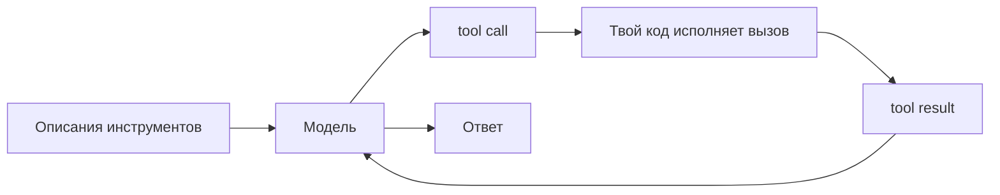

# Три вывески, одни и те же приёмы

Часть II разобрала агента по деталям: цикл, инструменты, план, восстановление после сбоя,
ограничители, команды и, наконец, разъём, которым всё это подключается к внешнему миру. Каждый приём мы
брали абстрактно — как устроен, где ломается, когда лучше не применять. Пора перейти от абстрактного
разбора к практике и посмотреть, во что эти приёмы превращаются у трёх агентов, с которыми инженер имеет дело
первым делом: Claude, OpenAI, Gemini.

Это финальный урок: новой теории он нарочно не вводит. Он прогоняет каждую тему Части II по всем трём поставщикам
и показывает главное: за дюжиной несовместимых API прячется один и тот же приём. Меняются имена полей и то,
в каком виде всё это передаётся; идея — та же. Отсюда правило, которым связан весь урок. В каждом разделе мы сначала называем
**долговечный приём** — то, что переживёт любую смену версий, — потом смотрим, как его реализует каждый из
троих *сегодня*, с точной датой; разбираем инженерную разницу; и находим, где всё это ломается, — с
отсылкой к тому уроку, где приём разбирался подробно.

Даты здесь не для красоты. Всё, что сказано про конкретную фичу, верно на середину 2026 года и завтра может
сдвинуться — API поставщиков меняются стремительно. Поэтому запоминай приём, а деталь поставщика держи как то, что
всегда можно перепроверить в документации.

:::tip[▶ Видео]

<YouTube id="fCHe_fOqlYA" title="Building AI Agent Systems and Scaling Challenges in Agentic AI — IBM Technology" />

IBM точно улавливает то самое противоречие, вокруг которого построен весь урок: у настоящих агентов
агентность оплачивается латентностью и сложностью, поэтому инженерия — это выбрать *наименьшую* свободу,
которая решает задачу, а не наибольшую.

:::

## 1. Руки: использование инструментов

Долговечный приём тут один, и он не меняется от поставщика к поставщику. **Использование инструментов (tool use)**,
оно же **вызов функций (function calling)**, устроено везде одинаково: ты объявляешь инструмент как имя,
словесное описание и JSON-схему аргументов; модель выдаёт **структурированное намерение (structured intent)** — какой инструмент
и с какими аргументами вызвать, — но сама ничего не исполняет; твоя среда выполнения делает вызов и
возвращает результат в контекст; цикл продолжается. Это ровно тот круговой обмен из урока про
[использование инструментов](./tool-use/index.md), и снаружи он тождествен у всех троих. Различается только форма
обмена.

- **Claude** объявляет инструменты массивом `tools` (`name`, `description`, `input_schema` = JSON Schema).
  Обмен идёт блоками контента: модель возвращает `stop_reason: "tool_use"` с блоками `tool_use`, а ты
  отвечаешь пользовательским сообщением с блоками `tool_result`. `tool_choice` бывает `auto`/`any`/`tool`
  (принудительный выбор)/`none`; строгий режим — `tool_choice:{type:"any"}` вместе с `strict:true`.
  Параллельные вызовы включены по умолчанию.
- **OpenAI** объявляет инструмент как `{type:"function", name, description, parameters, strict}`. В
  Responses API обмен идёт типизированными элементами: модель выдаёт элементы `function_call`
  (`call_id`, `name`, аргументы JSON-строкой), ты возвращаешь `function_call_output` с тем же `call_id`.
  Флаг `strict:true` держит схему через Structured Outputs; `tool_choice` — `auto`/`required`/`none`/
  принудительный; `parallel_tool_calls` по умолчанию включён.
- **Gemini** описывает функции подмножеством схемы OpenAPI; модель возвращает `functionCall` (имя плюс
  аргументы) и, дословно, «не исполняет функцию сама» — исполняешь ты и возвращаешь `functionResponse`.
  Режимы `auto`/`any`/`none` (в старом API — `function_calling_config` с `AUTO/ANY/NONE` в верхнем
  регистре, семантика та же, смешивать не стоит). SDK Google Gen AI умеет сам вызвать переданную ему
  Python-функцию — это отключается через `AutomaticFunctionCallingConfig(disable=True)`.

Различается, как видно, не идея, а форма кругового обмена. Claude протягивает его блоками контента внутри
сообщения; OpenAI — дискретными типизированными элементами; Gemini — парой `functionCall`/`functionResponse`
на OpenAPI-подмножестве. Строгий режим схемы есть у Claude и OpenAI, а Gemini держит аргументы в рамках
своего OpenAPI-подмножества — та самая мысль из урока про инструменты, «строгая схема режет невалидные
вызовы», воплощённая на деле. И главное правило
оттуда — *описание инструмента — это промпт* — держится у всех: модель выбирает инструмент по словам, а не
по реализации.

Ломается всё это одинаково и независимо от поставщика: не тот инструмент или ни одного вызова, невалидные
аргументы, выдумка поверх результата. Средство везде одно — строгие схемы и узкий, непересекающийся набор
инструментов. Выбор поставщика не освобождает тебя от [проектирования инструментов](./tool-use/index.md): плохое
описание останется плохим на любом API.

## 2. Данные: веб и файлы

Долговечный приём — **поиск (retrieval)** как один из инструментов. Агент тянется за свежими данными в вебе
или за содержимым файла ровно так же, как за любой другой функцией, и ответ возвращается со ссылками на
источники, чтобы человек мог проверить **опору на контекст (grounding)**. Это тезис урока про
[Agentic RAG](./agentic-rag/index.md) — «поиск становится действием» — только теперь встроенный в платформу.

- **Claude** даёт серверный инструмент веб-поиска (ссылки на источники всегда включены; цена около $10 за
  1000 поисков плюс токены; версии вплоть до `web_search_20260318`) и отдельный инструмент веб-выборки
  (достаёт URL, уже мелькнувший в диалоге, без рендеринга JS, ссылки по умолчанию выключены), плюс песочницу
  исполнения кода и Files API — тоже как серверные инструменты первого класса.
- **OpenAI** даёт хостируемый веб-поиск `{type:"web_search"}` с инлайновыми аннотациями `url_citation` и
  файловый поиск поверх векторных хранилищ (`{type:"file_search", vector_store_ids:[…]}`) — то есть
  семантический RAG как управляемую встроенную возможность, возвращающую аннотации `file_citation`.
- **Gemini** делает ставку на собственный козырь — Grounding with Google Search (`google_search`), инструмент,
  подключённый к живому индексу Google и сам возвращающий метаданные опоры и инлайновые `url_citation`; плюс
  инструмент URL-контекста (до 20 URL на запрос), File API (хранение 48 часов) и управляемый Vertex AI RAG
  Engine, чтобы опереть ответ на собственные данные.

Общее — то и есть долговечное: все трое несут родной веб-поиск со ссылками. А расходятся в акценте. Claude
добавляет выборку по URL и песочницу кода; OpenAI делает ставку на файловый поиск по векторным хранилищам
(управляемый RAG); конёк Gemini — собственный поисковый индекс как источник опоры плюс управляемый RAG
Engine. Урок про провалы из Части I тут остаётся в силе: встроенный инструмент не чинит **retrieval-провал (retrieval
failure)**, он лишь переносит вопрос, кто крутит поиск.

И слабое место у опоры на контекст общее: она хороша ровно настолько, насколько хорошо то, что нашлось.
Устаревшая или нерелевантная выдача, ссылка, которую модель показала, но по сути не использовала, — всё это
остаётся. Ссылки дают человеку возможность проверить; верности ответа они не гарантируют. Это тот же
retrieval-провал в отличие от generation-провала, что разбирался в Части I.

## 3. Голова: планирование и циклы

Долговечный приём — сам агентный цикл: рассуждение → решение → действие → наблюдение, и так до критерия
остановки. «Мышление» — явное рассуждение перед действием — делает шаг решения лучше, а лимит ходов или
шагов страхует от зацикливания. И то, и другое от поставщика не зависит — как и учил урок про
[планирование и циклы](./planning-loops/index.md).

- **Claude** крутит цикл, пока не придёт `stop_reason:"end_turn"`; в Claude Agent SDK функция `query()`
  гоняет тот же цикл («ходы продолжаются, пока Claude не выдаст ответ без вызовов инструментов»), с потолком
  `max_turns` и `max_budget_usd`. Рассуждение видимо — оно приходит блоками `thinking`; **чередующееся
  мышление (interleaved thinking)** позволяет думать *между* вызовами инструментов (на моделях с адаптивным
  мышлением включается автоматически на середину 2026 года). Видимые блоки рассуждения — это **расширенное
  мышление (extended thinking)**.
- **OpenAI** отмеряет рассуждение параметром **уровень рассуждения (reasoning effort)** — `reasoning.effort`
  со значениями `none`/`minimal`/`low`/`medium`/`high`/`xhigh` на семействе GPT-5.x. Сами токены рассуждения
  внутренние и непрозрачные, ты за них платишь как за вывод, но не видишь. Цикл инструментов гоняет
  `Runner.run()` из Agents SDK: он останавливается на финальном ответе без вызовов, переключает агента при
  передаче управления, иначе исполняет инструменты и запускается снова; потолок — `max_turns`
  (`MaxTurnsExceeded`).
- **Gemini** даёт **бюджет размышления (thinking budget)** — числовой регулятор на запрос (`thinkingBudget`;
  `-1` — динамически, `0` отключает на моделях, где это разрешено; у каждой модели свой жёсткий диапазон),
  который в Gemini 3 сменяется дискретными уровнями `thinking_level` (`minimal`/`low`/`medium`/`high`). В
  ADK (Agent Development Kit) цикл оформлен как Event Loop: агент работает, пока не соберёт, что доложить, —
  выпускает `Event` и на этом останавливается, пока Runner не зафиксирует состояние.

Расходятся тут *видимость и способ управления* рассуждением. Claude показывает мышление и позволяет
чередовать его с вызовами; OpenAI прячет рассуждение за непрозрачный регулятор `effort`; Gemini даёт числовой
бюджет (а потом дискретные уровни). Идея одна на всех — потратить больше вычислений, чтобы решать лучше, — а
способов управлять ею три. И все трое запирают цикл лимитом ходов или шагов: тот самый страховочный
критерий остановки, на котором настаивал урок про планирование.

Ломается это предсказуемо — незавершением цикла: цикл, который не останавливается, или **уход от цели**, когда агент
отклоняется от задачи. Бюджет шагов и лимит ходов — единственная страховка; лишнее мышление её не
отменяет.

## 4. Живучесть: восстановление после сбоя

Долговечный приём — хороший агент не умирает, а восстанавливается. Ошибку инструмента возвращают модели
как видимый ей текст, чтобы она поправилась и повторила; долгую работу делают возобновляемой,
сохраняя состояние, чтобы прогон продолжился с чекпоинта, а не начинался заново. Это та же мысль из урока
про инструменты — «внятная ошибка → цикл сам себя чинит», — только уже на масштабе целого прогона.

- **Claude** возвращает ошибку инструмента через `tool_result` с `is_error:true` и вразумительным
  сообщением; документация отмечает, что Claude «сделает 2–3 попытки с исправлениями, прежде чем извиниться».
  Agent SDK сохраняет сессии локальным JSONL и предлагает `continue` (последняя сессия), `resume`
  (явный id сессии) и `fork` (ответвить копию); прогон, упавший на `error_max_turns`/`error_max_budget_usd`,
  можно возобновить с поднятым лимитом.
- **OpenAI** держит непрерывность на своей стороне: `previous_response_id` цепляет новый запрос к
  прошлому ответу, а Conversations API даёт долговременное состояние без 30-дневного TTL хранилища. В
  Agents SDK функция `failure_error_function` инструмента возвращает модели видимую строку ошибки, чтобы та
  восстановилась (или пробрасывает исключение дальше).
- **Gemini/ADK** ставят между сбоем и моделью `ReflectAndRetryToolPlugin`: он перехватывает падение
  инструмента, скармливает модели структурированную подсказку об ошибке и повторяет (по умолчанию
  `max_retries = 3`). **Сессия** ADK хранит события и состояние через `SessionService`; с постоянным
  бэкендом (`DatabaseSessionService`/`VertexAiSessionService`) сессия перезагружается и продолжается, а
  не собирается заново.

Разница вся в том, *где живёт состояние*. Claude держит локальные файлы сессий (continue/resume/fork);
OpenAI — состояние на сервере (`previous_response_id`/Conversations); ADK меняет бэкенд под
`SessionService` (в памяти, в базе, управляемый). Приём один — сохрани состояние, чтобы возобновиться, — а
моделей хранения три, и у каждой свой компромисс между живучестью и переносимостью.

Слабых мест тут два. Состояние, которого ты не сохранил, — состояние, которое не возобновишь. И
«возобновить» безопасно только тогда, когда ты можешь сказать, *что именно успело завершиться*. Отсюда
прямая дорога к истории из практики про то, как судить о прогрессе по настоящему состоянию, а не по отметке
времени.

## 5. Тормоза: хуки и ограничители

Долговечный приём — циклу не доверяют вслепую: вокруг вызовов инструментов и ввода-вывода расставляют
проверки. Пред-проверка может заблокировать опасное действие или потребовать одобрения человека до него;
пост-проверка осматривает вывод; слой политики решает, что вообще разрешено. Это принцип наименьших
привилегий из урока про [использование инструментов](./tool-use/index.md), превращённый в механику.

- **Claude** даёт **хуки (hooks)** Claude Code — события жизненного цикла, из которых можно вызвать внешний
  скрипт: `PreToolUse` (умеет блокировать), `PostToolUse`, `PermissionRequest`, `Stop`, `SubagentStop` и
  другие. В Agent SDK есть **режимы разрешений** (`default`/`acceptEdits`/`plan`/`bypassPermissions`/…),
  проходимые в жёстком порядке (Hooks → Deny → Ask → режим → Allow → колбэк `canUseTool`); правило `deny`
  блокирует действие даже под `bypassPermissions`.
- **OpenAI** даёт в Agents SDK входные и выходные ограничители (`@input_guardrail`/`@output_guardrail`),
  которые при срабатывании выбрасывают исключение-растяжку (tripwire): входные бегут параллельно агенту,
  выходные — после его завершения. Плюс хуки жизненного цикла (`RunHooks`/`AgentHooks`) и одобрение человека
  на уровне инструмента (`needs_approval` → прогон останавливается, продолжаешь approve/reject). Отдельно —
  бесплатный Moderation API (`omni-moderation-latest`, 13 категорий).
- **Gemini/ADK** дают **колбэки (callbacks)** — фиксированный набор из шести точек: `before/after_agent`,
  `before/after_model`, `before/after_tool`, — где возвращённый объект обрывает вызов (например,
  `before_tool`, вернувший словарь, минует реальный вызов). Плюс внутримодельные настройки безопасности
  (четыре категории вреда с порогами; по умолчанию Off на Gemini 2.5/3 — по докам от 1 июня 2026) и Model Armor — отдельно
  разворачиваемый сервис, проверяющий промпты и ответы на инъекции, PII и вредоносные URL (обновление от
  10 июля 2026).

Разница тут — *слой, в котором живёт контроль*. Claude ставит хуки уровня среды выполнения плюс многоступенчатый
конвейер разрешений — событийную систему с вызовом внешних скриптов. OpenAI ставит ограничители-растяжки
внутри SDK плюс отдельный Moderation API. Gemini/ADK ставят фиксированную матрицу колбэков плюс
внутримодельную безопасность плюс подключаемый сервис Model Armor. Идея та же — расставь проверки,
дай наименьшие привилегии, — а мест, куда их приткнуть, три.

А ломается всё на простом: ограничитель, который можно обойти, — не ограничитель. Опасна именно пишущая,
действующая функция, до которой дотянулись через prompt injection (внедрение инструкций в текст) — риск из
урока про [использование инструментов](./tool-use/index.md).
Одобрение человека на чувствительные действия — та самая страховка; хук, который только пишет в лог, не
останавливает ничего.

## 6. Команды: мультиагентные системы

Долговечный приём — когда один цикл перегружен, его разбивают на **оркестратор плюс изолированных
исполнителей**: каждый исполнитель получает свой контекст, делает одну работу и возвращает результат, а
оркестратор собирает целое. Изоляция и есть суть: промежуточный мусор одного исполнителя не пачкает других
([мультиагентные системы](./multi-agent/index.md)).

:::tip[▶ Видео]

<YouTube id="ZVPlLaehjLk" title="Agentic AI Frameworks Explained: Workflows, Multi-Agent, & Production — IBM Technology" />

IBM показывает ровно тот скачок, который этот раздел делает предметным: от одиночного цикла к мультиагентным
рабочим процессам в проде.

:::

- **Claude** запускает **субагентов (sub-agent)** в изолированном свежем контексте — «родителю возвращается только
  финальное сообщение субагента»; задаются они параметром `agents` или файлами `.claude/agents/*.md`;
  несколько субагентов работают параллельно. Принцип здесь — сильная изоляция контекста.
- **OpenAI** называет два паттерна. **Передача управления (handoff)** (`handoff()`, выставленная модели
  инструментом `transfer_to_<agent>`) *передаёт* контроль соседу. «Агент-как-инструмент» (`Agent.as_tool()`)
  оставляет контроль у менеджера и возвращает ему результат. Параллельные независимые прогоны — это уже явный
  твой код (`asyncio.gather`).
- **Gemini/ADK** дают координатора, делегирующего субагентам (ADK сам подставляет инструменты делегирования),
  плюс **workflow-агентов** как детерминированные примитивы оркестрации — `SequentialAgent`,
  `ParallelAgent`, `LoopAgent`, — задающие порядок исполнения «не советуясь с моделью», и `AgentTool`
  (агент как инструмент).

Разница тут в том, *кто задаёт топологию*. Claude — изолированные субагенты, фоново-параллельные по
умолчанию. OpenAI — явное различие между передачей управления (отдать контроль) и агентом-как-инструментом
(удержать контроль). ADK добавляет детерминированных workflow-агентов, где поток управления гоняет сам
фреймворк, а не модель. Это ровно мысль урока про [фреймворки оркестрации](./orchestration-frameworks/index.md):
фреймворк пакует цикл, а топология — это твой инженерный выбор.

Ломается это, когда делят там, где хватило бы одного агента (в уроке про мультиагентные системы это «когда
НЕ надо делить»). Каждый исполнитель добавляет латентности, стоимости и ошибок координации; а параллельные
исполнители, делящие общую изменяемую рабочую область, сталкиваются. Отсюда — история из практики про изоляцию
через рабочие деревья (git worktree).

## 7. Разъём: MCP

Долговечный приём — стандарт, который избавляет от повторного прикручивания каждого инструмента к каждому агенту.
Обёрнутый один раз MCP-сервером инструмент и один раз написанный клиент дают любому агенту доступ к любому
инструменту: `M × N` попарных коннекторов схлопываются в `N + M` ([MCP](./mcp/index.md)).

По части управления история такая. Anthropic представила [MCP](https://modelcontextprotocol.io) 25 ноября 2024 года, а 9 декабря 2025
года передала его Agentic AI Foundation — фонду под крылом Linux Foundation, соучреждённому вместе
с Block и OpenAI. Официальная метафора — **USB-C для AI-приложений**.

Клиентами MCP сегодня стали все трое.

- **Claude:** API-коннектор MCP (только удалённый HTTP, только вызовы инструментов) и сам Claude Code как
  MCP-клиент (умеет и локальный stdio).
- **OpenAI:** MCP-серверы в Agents SDK (`MCPServerStdio`/`…StreamableHttp`/хостируемый) и хостируемый
  инструмент `{type:"mcp"}` в Responses API с каталогом коннекторов, поддерживаемых OpenAI.
- **Gemini/ADK:** `McpToolset` подключается к MCP-серверам и переводит их схемы в инструменты ADK, а Gemini
  API несёт родной удалённый тип `mcp_server`. Честная оговорка на середину 2026 года: документация
  сообщает, что «Gemini 3 не поддерживает удалённый MCP, это скоро появится».

Транспорты те же, что задал стандарт: stdio локально и **streamable HTTP** удалённо, который в ревизии
спецификации 2025-03-26 заменил ранний HTTP+SSE (SSE теперь признан устаревшим в инструментарии всех троих);
свежая ревизия спецификации — `2025-11-25`. Anthropic MCP написала и со-управляет им, но её
API-коннектор — только удалённый, тогда как локальный stdio берёт на себя Claude Code. OpenAI — со-учредитель и
потребитель с самым широким набором транспортов плюс каталог хостируемых коннекторов. Gemini/ADK тянут MCP
через `McpToolset`, с честным пробелом «удалённый MCP скоро». Долговечная черта переживает всё это без
изменений: *MCP — это агент ↔ инструменты; A2A — агент ↔ агент* ([A2A](https://a2a-protocol.org) — родом из Google, теперь под Linux
Foundation, версия 1.0).

Ломается это там же, где и в уроке про MCP: каждый сервер — новая **поверхность атаки (attack surface)**.
Вредоносный сервер способен подсунуть инструкции (tool poisoning), утащить данные или выйти за выданные
права. Защита прежняя — наименьшие привилегии, только проверенные серверы и одобрение человека на опасные
действия.

## Три агента рядом: сводная таблица

| Приём | Claude | OpenAI | Gemini |
|---|---|---|---|
| Круговой обмен инструмента | блоки контента `tool_use`/`tool_result` | элементы `function_call`/`function_call_output` (Responses API) | `functionCall`/`functionResponse`, схема-подмножество OpenAPI |
| Веб и файлы | веб-поиск + веб-выборка + песочница кода | веб-поиск + файловый поиск по векторным хранилищам | Grounding with Google Search + RAG Engine |
| Управление рассуждением | видимое мышление + чередующееся | непрозрачный `reasoning.effort` | числовой `thinkingBudget` → `thinking_level` |
| Живучесть и состояние | локальный JSONL сессии (continue/resume/fork) | состояние на сервере (`previous_response_id`/Conversations) | SessionService в ADK (память/база/управляемый) |
| Хуки и ограничители | хуки Claude Code + режимы разрешений | ограничители-растяжки (tripwire) в SDK + Moderation API | колбэки ADK + настройки безопасности + Model Armor |
| Мультиагентность | изолированные субагенты (возвращается финальное сообщение) | передача управления в отличие от агента-как-инструмента | координатор + детерминированные workflow-агенты |
| MCP | автор стандарта; API-коннектор только удалённый | со-учредитель; самые широкие транспорты и коннекторы | `McpToolset`; удалённый MCP «скоро появится» |

## Не абстракция: четыре истории из практики

Эти приёмы — не теория ради теории. Вот на что они похожи, когда гоняешь агентов, чтобы строить реальные
продукты. Истории намеренно обобщены: только публичные инструменты, без секретов.

- **Чекпоинт и возобновление после лимита сессии (→ §4).** Агент строил фичу и на середине прогона упёрся в
  лимит сессии модели. Но он успел закоммитить промежуточный чекпоинт в свою ветку, а среда выполнения
  умела возобновить сессию из сохранённого состояния — и ничего не пропало: следующий прогон продолжился с
  чекпоинта, а не начался заново. Долговечный урок: сохраняй столько состояния, чтобы жёсткая остановка
  была паузой, а не потерей.
- **Судить о прогрессе по настоящему состоянию, а не по отметке времени (→ §4/§5).** На вопрос «оно
  завершилось?» отвечают, сверяясь с достоверным источником, — по состоянию PR «смёржен», по статусу деплоя, но никогда по
  времени модификации файла и не по тому, что ты *запустил* команду слияния (она может тихо не сработать).
  Проверяй `state == MERGED`, а не «mtime свежая». Восстановление безопасно ровно тогда, когда ты можешь
  сказать, что действительно завершилось.
- **Изоляция рабочими деревьями для параллельных исполнителей (→ §6).** Несколько агентов, строящих ветки в
  одном репозитории, сталкиваются: у общего рабочего дерева одна ветка на всех. Дай каждому исполнителю
  своё git-worktree — и параллельная работа перестаёт топтать общую область. Это конкретная форма тезиса
  «изолируй исполнителей» из урока про мультиагентные системы.
- **Пред-коммитный хук со сканом на утечки (→ §5).** Детерминированный grep-гейт стоит **пред-коммитным
  хуком** (и повторяется в CI), блокируя секреты, учётные данные и локальные пути раньше, чем их вообще
  можно опубликовать. Пред-коммитный хук, который *блокирует*, стоит больше, чем поздний скан, который лишь
  сообщает. Это тот же приём ограничителей, приложенный к собственному процессу разработки.

---

Часть II дала тебе цикл, инструменты, план, восстановление, ограничители, команды и разъём. На реальных
агентах это одни и те же ходы под разными именами и в разной форме обмена: блоки контента у Claude,
типизированные элементы у OpenAI, `functionCall` у Gemini. Выучи приём — и документация любого поставщика
становится справочником, а не поводом переучиваться с нуля. А когда API сдвинутся (они сдвинутся), приём — это то,
что у тебя останется. В этом и защита от **привязки к поставщику (vendor lock-in)**.

## Что забрать из урока

- Инструменты любой агент получает одинаково: объявляешь инструмент (имя + описание + JSON Schema), модель порождает
  структурированное намерение, твой код исполняет его, результат возвращается обратно. Различается только форма
  обмена — блоки контента у Claude, типизированные элементы у OpenAI, `functionCall`/`functionResponse` у
  Gemini.
- Поиск — это инструмент со ссылками на источники: родной веб-поиск есть у всех троих; Claude добавляет
  веб-выборку и песочницу кода, OpenAI делает ставку на файловый поиск по векторным хранилищам, Gemini
  опирается на Google Search и управляемый RAG Engine.
- Цикл — рассуждение → решение → действие → наблюдение, запертый лимитом ходов или шагов; управление
  рассуждением разное — видимое мышление у Claude, непрозрачный `reasoning.effort` у OpenAI, числовой бюджет
  размышления у Gemini.
- Восстанавливайся, а не умирай: ошибки инструмента возвращаются текстом для самокоррекции; сохраняй
  состояние, чтобы возобновиться, — локальные файлы сессий у Claude, `previous_response_id` на сервере у
  OpenAI, бэкенд SessionService у ADK.
- Расставляй проверки: хуки Claude Code и режимы разрешений, ограничители в SDK и Moderation API у OpenAI,
  колбэки ADK с настройками безопасности и Model Armor. Наименьшие привилегии и одобрение человека на опасные
  действия — постоянная величина.
- Дели на оркестратор и изолированных исполнителей только тогда, когда один цикл не справляется: субагенты у
  Claude, передача управления в отличие от агента-как-инструмента у OpenAI, координатор с детерминированными
  workflow-агентами у ADK.
- MCP связывает всё воедино — написан Anthropic (2024), передан Agentic AI Foundation под Linux Foundation
  (декабрь 2025); все трое сегодня MCP-клиенты. Учи долговечный приём, а поставщик — это частность с датой.

**Новые термины** → [Глоссарий](../glossary.md): extended thinking, interleaved thinking, reasoning effort, thinking budget, Claude Code hooks, ADK callbacks, permission modes.

---

:::note[Дальше — углубление слоя]

🚧 Второй проход: практикум по каждому SDK отдельно (руками), ритм сверки этой страницы на устаревание
фактов, computer-use и браузерные инструменты, сквозная оценка всех троих через evals, замер их стоимости и
латентности.

:::
