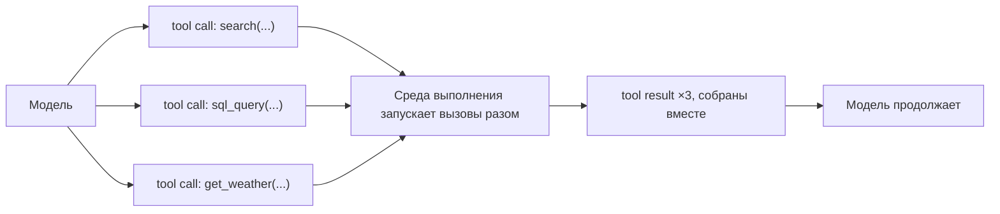
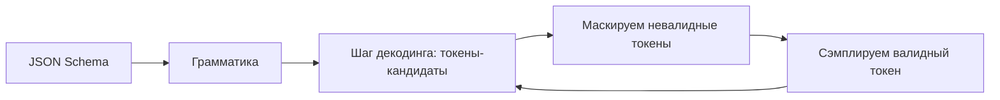

# Параллельные вызовы, строгий декодинг, повторы и цена большого набора

[Часть 1](./index.md) собрала механизм: описание инструмента → вызов инструмента → результат
инструмента → продолжение. Здесь мы берём тот же круг и на мастерском уровне разбираем: что
происходит, когда модель за один ход выпускает сразу несколько вызовов, как схема аргументов удерживается
токен за токеном, как цикл выправляется после плохого вызова, а не обрывается на нём, и что
ломается, когда инструментов становятся десятки.

## Параллельные вызовы инструментов

За один ход модель может выпустить не один вызов, а сразу **несколько независимых вызовов инструментов
(parallel tool calls)**. Твоя среда выполнения (runtime) раскидывает их и собирает обратно: сначала запускает все
разом (fan-out), потом ждёт и складывает все результаты вместе (fan-in) — и только тогда возвращает их
модели, чтобы та продолжила. Это и есть форма **fan-out / fan-in (разветвление вызовов и сборка
результатов)**: одно ветвление наружу, одна сборка обратно.

Распараллеливать вызовы можно только тогда, когда они независимы: ни один не ждёт результата другого и ни один
своим побочным эффектом не меняет того, что видит соседний. Собирая вызовы в одну группу, модель
предполагает эту независимость сама, а среда выполнения её не проверяет.

*Fan-out: модель выпускает три вызова разом. Fan-in: среда выполнения запускает их, собирает три
результата и возвращает их модели вместе.*

Управление у провайдеров (имена флагов — как есть):

- **Anthropic Claude.** Параллельные вызовы включены по умолчанию — модели Claude 4 группируют вызовы,
  когда запрос от этого выигрывает. Выключается это флагом `disable_parallel_tool_use: true`, причём
  внутри объекта `tool_choice`, а не как параметр верхнего уровня запроса. При `tool_choice` типа `auto`
  модель зовёт максимум один инструмент за ответ; при типе `any` или `tool` — ровно один.
- **OpenAI.** Флаг `parallel_tool_calls` по умолчанию разрешает несколько вызовов за ход; поставь `false`,
  чтобы получить ноль или один.
- **Gemini.** Поддерживает **параллельный вызов функций** (несколько независимых функций в одном ходе) и,
  отдельно от него, **композиционный вызов функций** — вызовы, сцепленные последовательно, где результат
  одного идёт на вход следующему: сначала `get_current_location()`, затем `get_weather(location)`.

Контракт на возврат результатов (Anthropic, конкретно): на каждый блок `tool_use` верни один блок
`tool_result`, все вместе в следующем сообщении пользователя, и каждый сопоставь с его вызовом по
`tool_use_id`; любой `tool_result` ставь перед текстом этого сообщения. Если какой-то вызов ты решил не
исполнять — скажем, гонял группу последовательно и ранний вызов упал, — всё равно верни для него
`tool_result` с `is_error: true` и короткой причиной. Gemini сопоставляет каждый ответ с его вызовом по
полю `id` и требует вернуть все ответы.

Когда НЕ надо. Не распараллеливай зависимые, последовательные вызовы — те, где один ждёт результата
предыдущего. Это композиционный, последовательный вызов: его гоняют по порядку, а не раскидывают в
fan-out. Не распараллеливай вслепую и пишущие вызовы с побочным эффектом: одновременные записи в общее
состояние гонятся друг с другом, порядок внутри группы не определён. Для пишущих инструментов либо выключи
параллельные вызовы (`disable_parallel_tool_use` / `parallel_tool_calls: false`), либо сериализуй
исполнение в своей среде выполнения — сюда мы вернёмся в разделе про идемпотентность. А чтобы модель вообще
не собирала зависимые вызовы в одну группу, скажи ей об этом в системном промпте: Anthropic прямо советует
формулировку вроде «Only batch tool calls that are independent of each other».

## Схемы и строгий (constrained) декодинг

Аргументы инструмента описывает **схема (schema)** — обычно **JSON Schema** (язык описания структуры
JSON); Gemini берёт схему — подмножество OpenAPI. Схема — это не просто документация: в **строгом режиме
(strict mode)** она *действует принудительно*: модель физически не может выдать аргументы, которые её нарушают.

Как это принуждение устроено — **строгий (constrained) декодинг**. Провайдер компилирует схему в
**грамматику** (формальную грамматику, CFG). На каждом шаге декодирования сэмплер вычёркивает все токены,
которые нарушили бы грамматику при уже выданном префиксе, — сэмплировать можно только тот токен, при
котором сгенерированное остаётся валидным по схеме. Результат совпадает со схемой по построению, а не по
удаче и не по проверке постфактум.

*Схему компилируют в грамматику один раз; дальше на каждом шаге декодинга невалидные токены маскируются, и
сэмплируется только валидный.*

Поверхности строгого режима у провайдеров (имена — как есть):

- **OpenAI**: `strict: true` внутри определения функции — вызовы надёжно соответствуют схеме (в отличие от
  режима «на лучших усилиях»); под капотом это **Structured Outputs** / строгий декодинг. Требования:
  `additionalProperties: false` на каждом объекте и **все** свойства из `properties`, перечисленные в
  `required`.
- **Anthropic Claude**: строгий вызов инструментов — через `tool_choice` с `strict: true`.
- **Gemini**: аргументы пришпилены к схеме — подмножеству OpenAPI из объявления функции.

Компромиссы и подводные камни — чем платишь и когда не надо:

- **Цена первой компиляции.** За первый запрос с *новой* схемой платишь задержкой, пока грамматика
  вычисляется и готовится к сэмплированию; последующие запросы с той же схемой берутся из кэша и идут
  быстро. OpenAI прямо документирует этот штраф первого запроса (схема → грамматика) с кэшированием после.
  Значит, гоняя свежую схему на каждый вызов, ты кэш просто убиваешь.
- **Неподдержанные возможности схемы.** Строгий режим поддерживает лишь подмножество JSON Schema и
  накладывает уже знакомые ограничения — `additionalProperties: false` плюс всё в `required`; часть
  выразительных средств схемы недоступна или её приходится перекраивать.
- **Стык с параллелизмом (исторический факт).** Изначально параллельный вызов функций у OpenAI не работал
  вместе со строгим режимом — чтобы сохранить строгость, разработчики ставили
  `parallel_tool_calls: false`. Позже это починили, и параллельные вызовы со строгим режимом уживаются.
  Это исторический факт, а не вечное правило.

Что строгий декодинг даёт — и чего нет. Он гарантирует правильно сформированные, валидные по схеме
аргументы. Он не гарантирует, что аргументы верны по сути и что выбран нужный инструмент. Структура — не
семантика; к этому разрыву мы вернёмся в разделе про валидацию.

## Ошибки и повторы

Вызов инструмента падает по-разному, и лечится каждый тип по-своему. Вот таксономия:

- **кривые аргументы** — не парсятся или нарушают схему; строгий декодинг из прошлого раздела это в
  основном снимает, но не для нестрогих инструментов;
- **провал валидации** — аргументы правильно сформированы, но не проходят твои проверки (вне диапазона,
  несуществующий id); про это раздел ниже;
- **исключение в инструменте** — инструмент отработал и упал (500 у зависимости, кривой запрос);
- **таймаут** — инструмент не ответил в отведённое время;
- **пустой или невнятный результат** — инструмент не вернул ничего полезного или вернул нечто, что модель
  легко прочтёт неверно. Это тот самый риск «дофантазировать поверх невнятного или пустого результата» из
  Части 1.

Главный приём здесь — вернуть ошибку модели как сообщение, которое она видит и может отработать:
**восстановимую ошибку (recoverable error)**, сформулированную как подсказку («дата должна быть в формате
ГГГГ-ММ-ДД», «неизвестный user_id, сперва вызови list_users»). Непрозрачный стек вызовов или голый
ненулевой код тут бесполезны — по ним модель не выправится. А по внятной подсказке цикл сам себя чинит:
плохой вызов → внятная ошибка → модель переформулирует → повтор. Это фигура **«ошибка — это промпт»**, родня
той, что из Части 1: «описание инструмента — это промпт». Раз модель читает и описание, и ошибку как один и
тот же текст, то текст ошибки — такой же управляющий вход, как всё остальное в промпте. У Anthropic это
конкретно: ошибка инструмента возвращается как `tool_result` с `is_error: true` и вразумительным
сообщением, и на следующем ходу модель выдаёт исправленный вызов.

Для *преходящих* сбоев — таймаут, лимит частоты, 5xx у зависимости — повтор уместен, но с **отсрочкой
(backoff)**: разноси попытки во времени, обычная форма — экспоненциальная отсрочка. Повторы без пауз
только добьют и без того больную зависимость.

Повторы держи под **бюджетом повторов (retry budget)** — жёстким потолком на число попыток на вызов и на
весь прогон; он перекликается с бюджетом шагов и бюджетом токенов из урока про планирование. Без потолка
детерминированно падающий вызов превращается в **бесконечный цикл повторов**: агент не завершается никогда.

Повтор осмыслен только тогда, когда вход повтора *другой*: исправленный аргумент, устаканившийся преходящий
сбой. Повторять тот же самый вызов после детерминированного провала — значит жечь бюджет и деньги: он
упадёт точно так же. Распознавай случай, когда движения нет, и останавливайся — вынеси провал наружу, отдай
человеку или попробуй другой инструмент, — вместо того чтобы крутить цикл. Незавершение здесь — это провал,
сбой в прогоне: цикл, который не останавливается. Это не «отказ» — модель не отклонила задачу осознанно,
она просто не смогла остановиться.

Когда НЕ надо. Не повторяй детерминированный провал неизменным. И не повторяй пишущий вызов с побочным
эффектом, который мог частично пройти, без гарантии идемпотентности (мостик в следующий раздел). Повтор
нужен для преходящих сбоев и для самостоятельно исправленных аргументов; чинить сам вызов он не заменяет.

## Цена контекста при десятках инструментов

Каждое описание инструмента стоит токенов в каждом запросе. Имя, словесное описание и схему параметров
*каждого* инструмента сериализуют в промпт при *каждом* вызове — десятки инструментов превращаются в
постоянный токенный налог (а с ним латентность и деньги), который ты платишь независимо от того, пригодился
хоть один из них в этот раз или нет.

Хуже того, точность **выбора инструмента** падает по мере роста набора. Когда близких по смыслу
инструментов много, модель чаще берёт не тот инструмент или не вызывает ни одного — тот самый провал из
Части 1. Больше — не лучше: широкий плоский набор только мешает.

Лечит это **динамический набор инструментов (dynamic tool loadout)**, он же **tool-RAG (поиск инструментов
под запрос)**. Вместо того чтобы возить с собой все инструменты каждый раз, ты ищешь только те, что
относятся к текущему запросу, и грузишь в запрос лишь их — шаг поиска по каталогу инструментов, оттого и
«tool-RAG». Идея та же, что у RAG по документам, только приложенная к меню инструментов: держать активный
набор маленьким и по теме на каждом ходу.

Помогают и **пространства имён (namespacing)** с группировкой: дай инструментам структурированные имена и
собери их в группы — по домену, по серверу, — чтобы и модель, и твой шаг поиска могли о них рассуждать; в
большом каталоге это режет коллизии имён и пересечения.

А за некоторым порогом починка — уже не длинный список инструментов, а разбиение на специализированных
агентов, у каждого свой маленький ортогональный набор. Это довод про специализацию из урока про
[мультиагентные системы](../multi-agent.md), и это граница «когда не стоит и дальше растить одного агента».

Когда НЕ надо. Не заводи tool-RAG и динамический набор раньше времени. На горстке инструментов это лишняя
машинерия со своей собственной поверхностью сбоя — сбоя поиска; самое простое, что работает, — полный
статический набор. Прибегай к динамическому набору, только когда каталог и правда большой. Та же дисциплина
«бери самый простой уровень, который решает задачу».

## Идемпотентность и побочные эффекты

**Читающий** и **пишущий** инструменты ведут себя на повторе по-разному. Перезапустить чтение ничем не
грозит; перезапустить запись — создать заказ, отправить письмо, списать деньги — значит рискнуть
продублировать **побочный эффект (side effect)**. Значит, безопасность повтора — свойство самого
*инструмента*, а не политики повторов.

Отсюда **идемпотентность (idempotency)**: сделай пишущий инструмент таким, чтобы два вызова с одним и тем
же входом давали тот же эффект, что и один. Стандартный механизм — **ключ идемпотентности (idempotency
key)**: вызывающая сторона прикрепляет уникальный ключ к каждой операции, которую собирается выполнить, а
сервер отбрасывает повторы того же ключа — и повтор после невнятного таймаута становится безопасным.

Для опасных или необратимых записей разнеси операцию на **пробный прогон (dry-run)** и подтверждение:
пробный прогон считает и показывает, что *произошло бы*, ничего не меняя, а шаг подтверждения — часто
именно здесь действие одобряет человек. Это опирается на принцип наименьших привилегий из Части 1 и на «требуй
подтверждения опасных действий» оттуда же.

Само разделение читающих и пишущих инструментов — тоже из Части 1, здесь применённое: держи их порознь,
чтобы дать агенту широкий доступ на чтение, но перекрыть запись. Принцип наименьших привилегий в конкретном
воплощении.

И вот где сходятся первый раздел и этот. У fan-out-группы порядок не определён, поэтому две записи в одном
ходе могут погоняться или лечь не в том порядке. Никогда не клади порядко-зависимые или конфликтующие
записи в одну параллельную группу — сериализуй их или выключи параллельные вызовы для пишущих инструментов.

Когда НЕ надо. Не полагайся на повторы для пишущего инструмента, который не идемпотентен и не имеет ключа:
повтор после таймаута, который на деле прошёл, применит эффект дважды. Сперва почини идемпотентность —
потом разрешай повторы.

## Валидация аргументов

Между «модель выдала аргументы» и «ты запускаешь инструмент» вставь **валидацию аргументов (argument
validation)** — ворота проверки. Строгий декодинг из второго раздела даёт правильно сформированные
аргументы; валидация проверяет, что они *приемлемы*, до того как сработает хоть один побочный эффект.

Уровней у неё два, и они разные:

- **Валидация на уровне схемы** — типы, обязательные поля, перечисления (enum), форматы. Строгий декодинг
  в основном закрывает это ещё на генерации; всё равно проверяй — ради нестрогих инструментов и ради
  эшелонированной защиты.
- **Семантическая валидация** — аргументы правильно типизированы, но неверны в контексте: id, которого
  нет; дата в прошлом; сумма сверх лимита; путь за пределами разрешённого корня. Схема почти ничего из
  этого выразить не может — это должен делать твой код. Ровно тот разрыв, о котором предупреждал второй
  раздел: структура — не семантика.

Провал валидации — тоже промпт. Пусть он возвращается как восстановимая, читаемая моделью ошибка — уже
знакомый приём «ошибка — это промпт» из раздела про повторы, — чтобы модель исправила аргумент и повторила.
Тот же самозалечивающийся цикл, только теперь он стережёт границу *перед* исполнением, а не после провала.

Когда НЕ надо. Не запихивай семантические проверки в схему — она их не выражает; и не пропускай валидацию
на том основании, что декодинг строгий, — строгий не значит верный. Два уровня дополняют друг друга, они не
взаимозаменяемы.

## Что забрать из урока

- Параллельные вызовы: за один ход модель выпускает несколько независимых вызовов, среда выполнения
  раскидывает их (fan-out) и собирает результаты (fan-in). Параллелить можно только независимые вызовы;
  зависимые и пишущие — по порядку или с выключенным параллелизмом (`disable_parallel_tool_use` /
  `parallel_tool_calls: false`).
- Строгий декодинг принуждает схему через грамматику и маскировку токенов: аргументы валидны по построению.
  Но валидные по схеме — ещё не верные по сути, и первая компиляция новой схемы платит задержкой: свежая
  схема на каждый вызов убивает кэш.
- Ошибка — это промпт: верни модели восстановимую ошибку-подсказку, и цикл сам себя чинит. Повторяй с
  отсрочкой и только преходящие сбои; держи бюджет повторов и останавливай бесконечный цикл повторов, когда
  движения нет.
- Каждый инструмент стоит токенов в каждом запросе, а на большом наборе ещё и падает точность выбора
  инструмента. Лечит tool-RAG и динамический набор (искать инструменты под запрос) плюс группировка имён;
  за порогом — разбиение на субагентов. Раньше времени эту машинерию не заводи.
- Повтор безопасен для чтения, но не для записи: делай пишущий инструмент идемпотентным через ключ
  идемпотентности, а опасные записи разноси на пробный прогон и подтверждение. Без ключа повтор после
  таймаута применит эффект дважды.
- Порядок в fan-out-группе не определён: порядко-зависимые записи в одну параллельную группу не клади —
  сериализуй их или выключи параллелизм.
- Валидация аргументов идёт перед исполнением и держит два уровня: схемный (типы, enum, форматы) и
  семантический (несуществующий id, дата в прошлом, путь за корнем). Строгий декодинг закрывает только
  первый; второй пишешь ты.

**Новые термины** → [Глоссарий](../../glossary.md): parallel tool calls, constrained decoding, strict mode / Structured Outputs, idempotency / idempotency key, tool-RAG / dynamic tool loadout, argument validation, retry budget.
