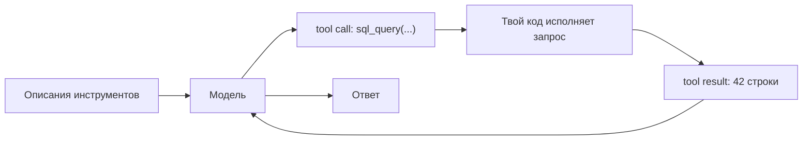

# Как модель действует во внешнем мире

В уроке про Agentic RAG ты усвоил главное: retrieval (поиск) из шага превратился в **действие**,
которое модель выбирает в цикле. Но retrieval — лишь одно из действий. **Использование инструментов**,
оно же **вызов функций (function calling)**, — это общий механизм: модель может вызвать любую внешнюю
функцию. Поиск по базе знаний, SQL-запрос к таблице, обращение к HTTP-API, калькулятор, запуск кода,
отправка письма. Retrieval оказывается частным случаем — одним из инструментов.

Именно доступ к инструментам превращает модель из «генератора текста» в нечто, способное **действовать**:
читать актуальные данные, считать точно, менять состояние внешних систем.

:::tip[▶ Видео]

<YouTube id="h8gMhXYAv1k" title="What is Tool Calling? Connecting LLMs to Your Data — IBM Technology" />

Тот же механизм от IBM: как вызов инструмента подключает модель к твоим данным и системам.

:::

## Почему модели нужен посредник — она умеет только текст

Модель не выполняет ничего сама — она умеет только выдавать текст. Не ходит в базу, не дёргает API,
физически не исполняет код. Использование инструментов — это протокол-мост:

1. Модель выдаёт **структурированное намерение**: «вызови функцию X с аргументами Y».
2. **Твой код** исполняет вызов и получает результат.
3. Результат возвращается модели в контекст.
4. Модель продолжает, уже видя результат.

Разделение жёсткое: модель решает, что вызвать; твоя среда выполнения (runtime) делает вызов. Модель
не касается настоящих систем — и именно это разделение окажется границей безопасности (об этом ниже).

## Механизм: вызов инструмента

Разложим на части. Это тот же цикл, что и в Agentic RAG, только действие теперь любое.

- **Описание инструмента (tool definition)** — имя, описание словами и схема параметров (обычно JSON
  Schema). Это «меню»: какие инструменты есть, что делают, какие аргументы принимают. Ты передаёшь его
  модели вместе с запросом.
- **Вызов инструмента (tool call)** — вместо обычного текста (или вместе с ним) модель выдаёт
  **структурированный вывод (structured output)**: JSON с именем инструмента и аргументами.
- **Результат инструмента (tool result)** — твоя среда выполнения вызывает инструмент и добавляет результат в
  диалог отдельным сообщением.
- Модель **продолжает**: видя результат, она либо вызывает следующий инструмент, либо отвечает.

## Описание инструмента — это промпт, а не только сигнатура

Вот главная AI-дельта по сравнению с обычным проектированием API. Модель выбирает инструмент и заполняет
аргументы **по словесному описанию** — в реализацию она заглянуть не может. Имя, текст описания и описания
параметров — это то, по чему вероятностная модель решает, *когда* и *как* дёрнуть функцию. Размытое
описание — и модель вызовет не вовремя, возьмёт не тот инструмент или подставит мусорные аргументы. Поэтому описания инструментов — часть
проектирования промптов (prompt engineering), а «вызывающая сторона» здесь не детерминированный код, а
модель, читающая естественный язык.

## Что делает инструмент хорошим

- **Чёткое, однозначное описание** — по нему модель отличает один инструмент от другого.
- **Строго типизированные, узкие параметры** (JSON Schema, `enum`, форматы) сужают то, что модель вправе
  выдать, и режут долю невалидных вызовов.
- **Инструментов мало, и они не пересекаются.** Десяток близких по смыслу функций путает модель — растёт
  доля ошибок выбора инструмента (tool selection). Набор отбирают и сознательно ограничивают, а не
  наращивают.
- **Понятные ошибки.** Когда инструмент падает, верни сообщение, по которому модель сможет исправиться
  («дата должна быть в формате ГГГГ-ММ-ДД»). Тогда цикл сам себя чинит: плохой вызов → внятная ошибка →
  переформулировка → повтор.
- **Правильная гранулярность** — не слишком мелко (десять вызовов ради одной задачи) и не слишком крупно
  (один инструмент на всё).

## Где это ломается

- **Не тот инструмент — или ни одного.** Модель взяла неверную функцию либо ответила из памяти вместо
  вызова. Лечится описаниями и сокращением набора.
- **Невалидные аргументы** — выдуманные или неправильные параметры. Помогают строгая схема, валидация и
  понятные ошибки для самокоррекции.
- **Выдумка поверх результата.** Модель может «дофантазировать» поверх результата — особенно невнятного или
  пустого. Возвращай его отдельным сообщением, явно помеченным как результат инструмента; это снижает
  риск, но не снимает его.
- **Безопасность — новый и серьёзный риск.** Инструмент, который **действует** (пишет, отправляет,
  исполняет код), теперь управляется выводом модели, а вывод можно увести в сторону через prompt injection (внедрение
  инструкций в текст) — в том числе косвенный, спрятанный в найденном контенте. Отсюда защита: **принцип
  наименьших привилегий (least privilege)** — ограничь набор инструментов, разделяй читающие и пишущие,
  требуй подтверждения опасных действий. Тогда даже успешная инъекция мало что сможет сделать.

## Связь с RAG

Круг замыкается: **retrieval — это инструмент.** Agentic RAG из прошлого урока — частный случай
использования инструментов, где главный инструмент — поиск. Как только у агента несколько инструментов, он
решает ту самую задачу «разные источники под разные вопросы»: retrieval — в базу знаний, SQL — в таблицы,
веб-поиск — за свежим, калькулятор — за точным счётом. Маршрутизатор (router) из того же урока как раз и
выбирает, какой инструмент пустить в ход.

## Что забрать из урока

- Использование инструментов (tool use) — общий механизм: модель вызывает любую внешнюю функцию;
  retrieval — его частный случай.
- Модель только порождает намерение, а исполняет его твой код: она решает «что», твой код делает «как».
  Это же и граница безопасности.
- Механизм — «описание инструмента → вызов инструмента → результат инструмента → продолжение»; тот же
  цикл, что в Agentic RAG, с любым действием.
- Описание инструмента — это промпт: модель выбирает по словам, а не по коду. Хороший инструмент: чёткое
  описание, строгая схема, мало и без пересечений, понятные ошибки.
- Новые провалы: не тот инструмент, невалидные аргументы, выдумка поверх результата и безопасность —
  пишущий инструмент плюс prompt injection, отсюда принцип наименьших привилегий.

**Новые термины** → [Глоссарий](../../glossary.md): tool use / function calling, tool definition, tool call,
tool result, tool selection, JSON Schema, structured output.

---

:::note[Дальше — вторая часть урока]

**[Надёжность и масштаб](./deep-dive.md)** — как довести вызовы инструментов до прода: параллельные вызовы,
форматы схем и строгий (constrained) декодинг, обработка ошибок и повторов, цена контекста при десятках
инструментов.

См. также: как подключать инструменты по общему стандарту — [MCP и протоколы агентов](../mcp/index.md); как это
устроено у Claude, OpenAI и Gemini — [завершающий урок части](../real-agents.md).

:::
