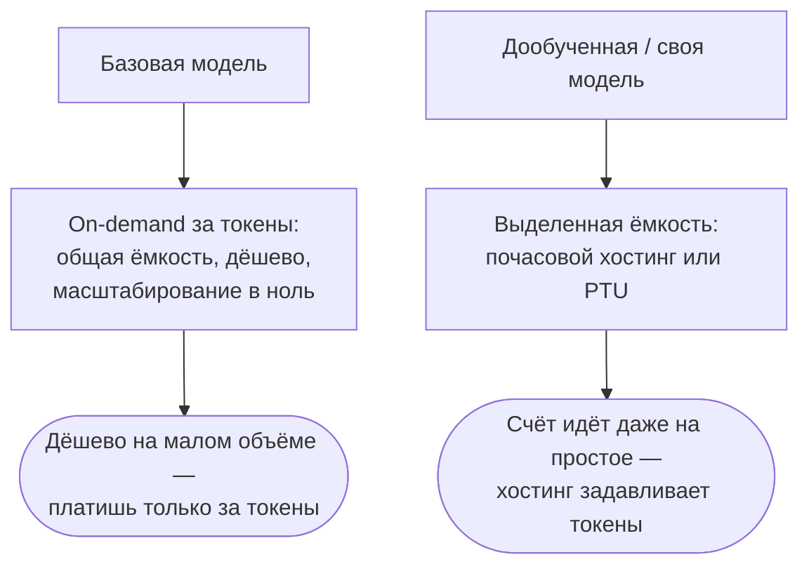
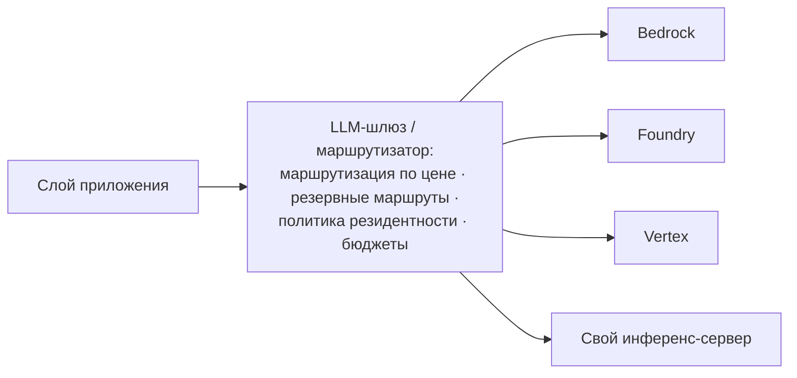

# Во что встаёт своя модель, на чём крутится агент и кому позволено её трогать

Это второй, углублённый проход урока про облачные платформы. [Часть 1](./index.md) выбирала платформу:
три способа потреблять модель, периметр как продукт, три больших облака и урок о переименованиях (любое
имя — снимок на дату), каталоги моделей, триада соответствия (резидентность плюс обязательство не обучать
плюс частное подключение), управляемый RAG и платформенные ограничители, три модели оплаты (on-demand,
выделенная ёмкость, пакетный режим) и трезвая правда о том, как платформу выбирают на самом деле. Всё это
предполагается известным и здесь не переобъясняется.

Часть 2 — продвинутый слой поверх уже выбранной платформы. Пять вопросов, на которые Часть 1 не отвечала:
что на платформе адаптируют под себя (дообучение), на чём крутится твой агент (управляемые агентные среды), во что
всё это встаёт и как посчитать заранее (FinOps — сердцевина урока), как остаться переносимым между облаками
(мультиоблачный шлюз) и кто по закону вправе прикоснуться к твоим данным и модели (суверенное облако).

## Что дообучают на платформах — и почему своя модель недёшева в обслуживании

Между «взять модель как есть» и «обучить с нуля» лежит целая лестница адаптации, и каждое облако
предлагает её целиком: промпт и RAG → parameter-efficient-**дообучение (fine-tuning)** (LoRA/PEFT — правишь
малый адаптер поверх замороженных весов) → полное дообучение с учителем (SFT, supervised fine-tuning) →
методы на предпочтениях и RL (DPO, RFT) → **дистилляция модели** (distillation — учишь маленькую модель-ученика
повторять большую модель-учителя) → продолженное предобучение. Имена методов и списки подходящих базовых
моделей тасуются поквартально, так что конкретику ниже считай снимком на середину 2026-го; долговечна сама
лестница.

По платформам, на середину 2026-го:

- **[AWS Bedrock](https://aws.amazon.com/bedrock/)** — SFT, reinforcement fine-tuning (RFT: награду считает
  твоя Lambda-функция), Model Distillation (превью с re:Invent 2024, теперь в общем доступе) и продолженное
  предобучение на неразмеченных данных. Обучение тарифицируется по числу токенов, умноженному на число эпох,
  плюс ежемесячная плата за хранение модели.
- **[Azure OpenAI](https://azure.microsoft.com/en-us/products/ai-services/openai-service)** в Microsoft
  Foundry — SFT, DPO (Direct Preference Optimization) и RFT с оценщиками-моделями; SFT и DPO можно ставить
  друг за другом. У RFT-задачи биллинг ограничен потолком $5 000 на задачу: на потолке она встаёт и отдаёт
  готовый к развёртыванию чекпоинт.
- **[Vertex AI](https://cloud.google.com/vertex-ai)** / Gemini Enterprise Agent Platform — дообучение с
  учителем для Gemini, PEFT на базе LoRA (ранг LoRA задаёт `adapter_size`) и дистилляция.

Дальше — та самая ловушка, ради которой раздел написан. Обучить модель — полдела; куда важнее, во что встанет
её обслуживать. И вот тут выясняется, что дообученная модель почти всегда требует **выделенного пути
обслуживания**. Дешёвых on-demand-токенов, которыми оплачивают общий эндпоинт, ей обычно мало:

- **Azure** (проверено) — дообученное развёртывание тарифицируется двумя частями: плата за токены плюс
  почасовая плата за хостинг (порядка $1,70/час на Standard и Global Standard). Альтернативы — часы PTU
  (Regional Provisioned Throughput) либо Developer Tier без почасовой платы, но эндпоинт там сносится через
  24 часа, без SLA и без гарантий резидентности — годится только для оценки и PoC. Рабочий пример прямо из
  документации: 20 млн входных и 40 млн выходных токенов в месяц обходятся в $1 422, из которых $1 224
  (= 1,70 × 24 × 30) — чистый хостинг. На небольшом объёме плата за хостинг задавливает стоимость самих
  токенов: ты платишь за то, что модель просто поднята, даже если она простаивает. Это ловушка
  «зомби-модели» — дообучил, развернул, забыл, а счёт капает.
- **Bedrock** (проверено — но картина меняется) — исторически, чтобы обслуживать дообученную модель,
  требовалась **выделенная пропускная способность (Provisioned Throughput)**. На 2026 год появился и
  on-demand-путь для дообученных моделей, но узкий: только избранные базовые модели (Amazon Nova Lite / Nova 2
  Lite / Nova Micro / Nova Pro и Meta Llama 3.3 70B), дообученные не раньше 16 июля 2025-го, и только в
  регионах us-east-1 и us-west-2. Всё остальное по-прежнему живёт на выделенной пропускной способности.
  Правило в силе — с сужающимся исключением.
- **Vertex/GEAP** (в общих чертах — детали проверяй по свежей документации) — дообученные модели
  обслуживаются теми же управляемыми эндпоинтами (managed endpoint); LoRA-адаптеры хостятся для инференса, а
  прод-обслуживание своей модели опирается на выделенную ёмкость. Держи в голове не конкретную строку
  тарифа, а сам принцип: своя модель — это плата за выделенную ёмкость.

Отсюда — отраслевое правило, выкристаллизовавшееся из практики: сначала промпт, потом RAG, и только если ни то
ни другое не дотянуло — дообучение. И дообучают ради формы, а не ради фактов: под стиль и тон, под строгую схему
вывода, под поведение в отказах и форматировании, ради латентности и стоимости на масштабе через модель
поменьше и поспециализированнее. Заложить в модель знание, которое меняется, дообучением плохо: это работа
RAG. Развилку ты уже проходил дважды — между self-hosted и API в [уроке про загрузку](../../part-1-rag/ingestion/index.md)
и между управляемым RAG и своим конвейером в Части 1; здесь она повторяется на уровне весов.

## На чём крутится твой агент

В [углублении про сервинг](../serving/deep-dive.md) агент, которого ты пишешь сам, живёт в контейнере: ты
держишь цикл, состояние, память, изоляцию и масштабирование. **Управляемая агентная среда (managed agent
runtime)** снимает ровно это: она хостит сам агентный цикл и добавляет поверх персистентность сессий и памяти,
слой инструментов, идентичности и шлюза, наблюдаемость и масштабирование в ноль. Имена продуктов, как и в
Части 1, — снимок на дату; выучи, что именно даёт категория.

- **Amazon Bedrock AgentCore** (в общем доступе с 13 октября 2025-го) — управляемая бессерверная среда.
  Runtime исполняет агента в окне до восьми часов, изолируя каждую сессию в отдельной microVM и поддерживая
  протокол A2A (Agent2Agent). Memory берёт на себя извлечение и консолидацию памяти; Gateway превращает API,
  Lambda-функции и MCP-серверы в инструменты агента (с IAM и OAuth); Identity даёт авторизацию на основе
  идентичности (кто именно действует) и хранилище токенов; Observability выводит трейсы в CloudWatch и
  OpenTelemetry. Плюс браузер и исполнение кода в песочнице (изолированной среде).
- **Microsoft Foundry Agent Service** (в общем доступе с 2025-го) — полностью управляемая среда с изоляцией
  сессий, встроенной идентичностью и наблюдаемостью, продовыми SDK, более чем 1 400 подключениями к источникам
  данных; приносишь свой фреймворк и разворачиваешь одной командой.
- **Google Vertex AI Agent Engine** (в общем доступе с 2024-го, под шапкой Gemini Enterprise Agent Platform) —
  управляемая среда, чтобы развернуть и масштабировать агента, собранного на ADK или другом фреймворке:
  автомасштабирование, управляемые Sessions и Memory Bank (долговременная память), а `adk deploy` отправляет
  агента в прод одной командой.

Что ты получаешь готовым — по сравнению с агентом, собранным в контейнере вручную:

- **Хостинг цикла** и долгие окна исполнения — агент живёт часами, не укладываясь в один HTTP-запрос.
- **Персистентность сессий и памяти** — короткой в пределах сессии и долгой между сессиями (типы памяти — из
  [углубления про планирование и циклы](../../part-2-agents/planning-loops/deep-dive.md)).
- **Шлюз инструментов и слой идентичности** — MCP и API превращаются в инструменты, а агент действует от имени
  пользователя через хранилище токенов.
- **Встроенная наблюдаемость** через OpenTelemetry (OTel).
- **Изоляция сессий** — многоарендная безопасность из коробки.
- **Масштабирование в ноль** — за простаивающего агента не платишь.

Плата за это — привязка к платформе и меньше контроля над самим циклом: та же развилка «строить или брать»,
что стояла перед управляемым RAG и ограничителями в Части 1 и ещё вернётся в
[уроке про экосистему инструментов](../tooling-ecosystem.md).

## Во что это встаёт и как посчитать заранее — FinOps

Расходы на LLM устроены на всех облаках одинаково, и рычагов ровно четыре: on-demand за токены (где вход стоит
несопоставимо дешевле выхода), зарезервированная ёмкость под обязательство, пакетный режим (batch) — и поверх
всего кэширование. **FinOps** (финансовая дисциплина для облака: связать инженерные решения с деньгами) для AI
сводит эти рычаги к одному числу — **юнит-экономике (unit economics)**: сколько стоит один запрос, один
активный пользователь, одна фича. Конкретные проценты и доллары ниже — снимок на середину 2026-го; любую
твёрдую цифру перепроверяй на живой странице тарифов.

Вход и выход стоят по-разному. Выход обычно дороже входа в 3–5 раз (по разным моделям разброс от 2 до 10),
и это не произвол прайс-листа. Выход генерируется последовательно, по одному токену за шаг — это decode
(декодирование), — а вход прогоняется разом, параллельно: prefill (префилл). То самое разделение фаз из
[урока про сервинг](../serving/index.md), теперь проступившее в счёте. Практический вывод: длинный ответ дороже
длинного вопроса, и **моделирование стоимости (cost modelling)** начинается с честной оценки, сколько токенов
ты порождаешь, а не только потребляешь.

Зарезервированная ёмкость — одна идея под тремя именами. Azure PTU: почасовая ставка за модель независимо
от того, гоняешь ты через неё запросы или нет; месячные и годовые резервирования срезают её ещё сильнее — это
**скидка за обязательство (committed-use)**: чем длиннее горизонт, тем ниже ставка. Vertex Provisioned
Throughput делится на тарифные уровни Standard, Priority (примерно ×1,8) и Flex-Batch (примерно ×0,5). У
Bedrock — Provisioned Throughput и Reserved с горизонтами без обязательства, на месяц и на полгода. Экономика у
всех одна: есть порог загрузки. Ниже порога выигрывает on-demand; выше, на ровной высокой нагрузке, выгоднее
зарезервированная ёмкость. По грубым сторонним оценкам порог у Azure лежит где-то на $10–12 тыс. в месяц
устойчивого расхода, а дальше экономия 30–45%; но порог этот надо считать на своей реальной нагрузке — чужую
оценку как готовую цифру не переноси.

Пакетный режим — примерно вдвое дешевле (проверено на всех трёх). Bedrock batch inference, Azure Batch API
(−50% к Global Standard, обработка в пределах 24 часов), Gemini Batch API (−50%). Только не путай его с
непрерывным батчингом из урока про сервинг: тот живёт в GPU-планировщике, а это тариф на уровне API —
разведение смыслов, о котором предупреждала ещё Часть 1.

Кэширование — центральный рычаг FinOps. Если стабильное начало промпта (общий системный промпт,
RAG-преамбула) повторяется от запроса к запросу, за него можно платить кратно меньше. У Bedrock **кэширование
промпта (prompt caching)** делает чтение из кэша примерно на 90% дешевле обычного входа (запись в кэш несёт
наценку около 25%, а для часового TTL — примерно вдвое). У Azure и OpenAI кэшированный вход дешевле на 50–90%,
и — важная деталь — кэшированные токены не съедают ёмкость PTU, освобождая место под зарезервированную
нагрузку. У Gemini **кэширование контекста (context caching)** тарифицирует кэшированный вход примерно в 10%
от обычного (те же ≈90% скидки) плюс отдельная плата за хранение — за токен в час. Вывод простой: когда у тебя
большой общий системный промпт или тяжёлая RAG-преамбула, кэширование — чаще всего самый крупный
рычаг экономии, и его же чаще всего забывают включить.

Межрегиональный трафик и резидентность тоже стоят денег. Передача данных между регионами и облаками —
**исходящий трафик (egress)** — тарифицируется отдельно. Маршрутизация инференса между регионами меняет
гарантию резидентности на ёмкость и цену; и наоборот — прибив данные к региону ради резидентности (та самая
триада из Части 1), ты можешь потерять доступ к более дешёвой межрегиональной или глобальной ёмкости. У
ползунка «резидентность или ёмкость» из Части 1, оказывается, есть и ценовая ось.

Дисциплина FinOps — свести всё к юнит-экономике и разметить расходы: привязать сожжённые токены к модели,
промпту, команде, продукту, чтобы видеть, откуда растёт счёт. Масштаб выигрыша стоит назвать: FinOps Foundation
оценивает разброс между неоптимизированным и оптимизированным AI-развёртыванием в 30–200 раз. Здесь мы смотрим
на стоимость со стороны платформы; управление расходами на уровне организации — бюджеты, лимиты, маршрутизация
запросов между моделями ради цены — живёт в [уроке про LLMOps](../llmops.md).

Как на этом разоряются — три типичных способа. Разогнавшийся агентный цикл, который каждый ход заново отправляет
разбухающий контекст: расходы на токены множатся с каждой итерацией (это оборотная сторона незавершения цикла
и бюджета шагов из Части II). Расползание контекста в RAG, раздувающее входные токены. И — самое частое —
просто выключенные бесплатные рычаги: пакетный режим и кэширование, которые никто не удосужился включить.

## Как остаться переносимым между облаками

Один **LLM-шлюз (LLM gateway)** — маршрутизатор перед многими провайдерами и облаками, с OpenAI-совместимым API
как общим стандартом обмена (тем же, что называл урок про сервинг). Один интерфейс на входе, много
эндпоинтов на выходе — и это даёт сразу несколько вещей: уход от **привязки к поставщику (vendor lock-in)**,
отказоустойчивость между облаками, маршрутизацию по цене и централизованные лимиты частоты запросов, квоты,
наблюдаемость и бюджеты. Какой именно шлюз сейчас в лидерах — снимок на дату; долговечен сам паттерн
**мультиоблачного шлюза (multi-cloud gateway)**.

Эталонный инструмент — **[LiteLLM](https://www.litellm.ai)** (открытый): один интерфейс в формате OpenAI к
сотне с лишним провайдеров (Bedrock, Azure, Vertex, Anthropic и другие). Ставится как прокси у себя или как
SDK; умеет упорядоченные цепочки резервных маршрутов (fallback), повторы, маршрутизацию с оглядкой на бюджет,
поштучный учёт стоимости по ключу и арендатору, виртуальные ключи. Рядом — Portkey и OpenRouter. Подробно
LiteLLM и шлюзы разбирает [урок про LLMOps](../llmops.md); здесь мы их не переписываем.

Заметно и другое: облака теперь обзаводятся собственными шлюзами. Azure API Management обзавёлся AI-шлюзом с Unified
Model API (публичное превью, 2026): клиент говорит в одном формате (OpenAI Chat Completions), а APIM на лету
перекладывает вызов в Anthropic, Google Vertex AI, Amazon Bedrock и другие — плюс метрики токенов, балансировка
между PTU-эндпоинтами и проверки безопасности на трафике MCP и A2A. У Google ту же роль LLM-шлюза играет
Apigee. AWS же позиционирует AgentCore Gateway для инструментов, тогда как кросс-провайдерной маршрутизации
моделей он не делает. Оговорка честная: кросс-провайдерный шлюз проверен напрямую только у Azure; у AWS и Google паритет по
такому же маршрутизатору моделей AWS и Google пока не дотягивают — считай Azure конкретным примером, а остальных — движущимися в ту же сторону.

Когда шлюз не нужен. За универсальность платят наименьшим общим знаменателем: через единый API теряются
фирменные возможности провайдера — его родное кэширование, его формат вызова инструментов. Добавляется лишний
сетевой хоп, а с ним задержка. Сам шлюз становится единой точкой отказа и требует собственной отказоустойчивости.
А ещё за одинаковым API прячется разное поведение: один и тот же промпт у разных провайдеров отвечает по-разному.
Если тебе хватает одного облака и тонкого независимого от поставщика клиента, полноценный шлюз — избыточная
инженерия.

И мостик к следующему разделу: тот же маршрутизатор умеет проводить в жизнь резидентность — по политике держать
трафик в регионе или заворачивать его на суверенный эндпоинт.

## Кто вправе к этому прикоснуться — суверенное облако

Резидентность из Части 1 отвечала на вопрос «где физически лежат данные». Суверенитет отвечает на другой — «кто
ими управляет и кто по закону может их затребовать». Это не одно и то же, и разница юридическая. **Цифровой
суверенитет (digital sovereignty)** раскладывается на три: операционный (кто эксплуатирует систему и имеет к
ней доступ), суверенитет данных (где они и под чьей юрисдикцией) и программный (на чьём софте всё работает).
Модель угроз — экстерриториальное принуждение: например, американский CLOUD Act дотягивается до данных
провайдера с американской пропиской даже в европейском регионе. Резидентность тут не спасает: данные лежат в
ЕС, а распоряжается ими юрисдикция за океаном. Поэтому **суверенное облако (sovereign cloud)** строят иначе —
через регионы под европейским или национальным управлением, партнёрские «доверенные облака» и развёртывания,
изолированные от сети (air-gapped).

По игрокам, на середину 2026-го — и здесь имена, сущности и даты особенно текучи:

- **AWS European Sovereign Cloud** (в общем доступе с 15 января 2026-го) — отдельное, независимое европейское
  облако: первый регион в Бранденбурге (Германия), управление через европейские юрлица по немецкому праву,
  управляющие директора — резиденты ЕС, наблюдательный совет целиком из граждан ЕС, заявленная цель —
  эксплуатация исключительно гражданами ЕС на территории ЕС, инвестиции свыше €7,8 млрд, расширение в Бельгию,
  Нидерланды и Португалию. Публично целились в «конец 2025-го», сдвинулись на середину января 2026-го — мелкая,
  но показательная деталь с датой.
- **Microsoft Sovereign Cloud** (анонс 16 июня 2025-го) — суверенное публичное облако, суверенное частное (на
  Azure Local) и национальные партнёрские облака: Bleu во Франции (СП Capgemini и Orange, метит в квалификацию
  SecNumCloud) и Delos Cloud в Германии (дочерняя структура SAP, под критерии BSI / C5 для госсектора).
- **Google** — связанный и изолированный от сети режимы через Google Distributed Cloud (GDC); air-gapped-вариант
  работает полностью офлайн, для регулируемых отраслей и обороны. Партнёрские облака: S3NS / PREMI3NS во Франции
  (СП с мажоритарным Thales, квалификация SecNumCloud, на отдельной инфраструктуре под управлением партнёра) и
  более новая полностью подконтрольная Thales немецкая структура в партнёрстве с Google (анонс 20 мая 2026-го,
  общий доступ намечен на конец 2026-го). Не путай её со старым немецким «суверенным облаком» T-Systems и Google
  от 2021-го — это два разных предложения. Gemini доступна на GDC air-gapped (с 2025-го).

А самое важное для нашей темы идёт вразрез с привычным допущением, будто суверенитет — уже решённая сетевая
задача. Фронтирные модели в суверенных и изолированных от сети средах отстают или отсутствуют вовсе: инференс
и дообучение приходится гонять на моделях, живущих внутри юрисдикции, — часто более
старых или с открытыми весами. И резидентность AI — не то же, что резидентность данных: даже когда GPU стоят в
нужном регионе, промпты, телеметрия и ответы могут утекать наружу, поэтому суверенитет обязан покрывать то, где
исполняется сама модель, а не только то, где лежат данные. Частый выбор для регулируемых и государственных
развёртываний в ЕС — **[Mistral AI](https://mistral.ai)**: модель европейской прописки, которую можно развернуть
у себя. По сути это ползунок «резидентность или ёмкость» из Части 1, доведённый до самого строгого края.

И оговорка, без которой раздел был бы нечестным. Точный список фронтирных моделей на air-gapped GDC, любые
заявления вида «одобрено для US Secret/Top Secret» и то, какие именно версии моделей развёрнуты в конкретном
суверенном регионе, — всё это меняется слишком быстро, чтобы утверждать наверняка. Держи в голове
закономерность — фронтирная способность отстаёт от суверенитета, — а любую матрицу «модель × регион» проверяй
по свежей документации.

:::tip[▶ Видео]

<YouTube id="Chq1LI-3d0A" title="What is Sovereign Cloud? — IBM Technology" />

Чистый концептуальный разбор, что вообще значит «суверенное облако», — та самая граница доступа и юрисдикции,
вокруг которой построен раздел.

:::

## Что забрать из урока

- Дообучение — это лестница: промпт и RAG → PEFT/LoRA → полный SFT → предпочтения и RL (DPO, RFT) → дистилляция
  → продолженное предобучение. Дообучай под форму — стиль, схему, поведение; меняющееся знание оставь RAG.
- Своя модель почти всегда требует выделенного пути обслуживания — дешёвых on-demand-токенов ей мало: у Azure
  это почасовой хостинг (в примере из документации — $1 224 чистого хостинга из $1 422), у Bedrock — выделенная
  пропускная способность с узким on-demand-исключением. На малом объёме плата за поднятую модель задавит
  стоимость токенов.
- Управляемая агентная среда хостит сам агентный цикл и даёт готовыми персистентность сессий и памяти, шлюз
  инструментов, идентичность, наблюдаемость, изоляцию и масштабирование в ноль (AgentCore, Foundry Agent
  Service, Vertex Agent Engine). Плата — привязка к платформе и меньше контроля над циклом.
- FinOps сводит расходы к юнит-экономике. Рычаги одни на всех: выход дороже входа; зарезервированная ёмкость
  выигрывает выше порога загрузки; пакетный режим — примерно вдвое дешевле; кэширование промпта и контекста —
  до ≈90% скидки на повторяемом начале, и это чаще всего самый крупный рычаг.
- Межрегиональный трафик и резидентность имеют ценовую ось: прибив данные к региону, теряешь более
  дешёвую глобальную ёмкость. Самый частый перерасход — выключенные бесплатные рычаги и разогнавшийся агентный
  цикл, множащий токены каждым ходом.
- Мультиоблачный шлюз (LiteLLM и аналоги, собственные шлюзы облаков) даёт переносимость, отказоустойчивость и
  маршрутизацию по цене через OpenAI-совместимый API. Цена — наименьший общий знаменатель, лишний хоп и новая
  единая точка отказа; одному облаку хватит тонкого клиента.
- Суверенитет спрашивает, кто управляет данными и кто вправе их затребовать; резидентность отвечала лишь на
  «где они лежат». Строится регионами под местным управлением, доверенными облаками и изоляцией от сети;
  фронтирные модели там отстают, а резидентность AI должна покрывать и то, где исполняется модель.
- Через все пять тем проходит одно: Часть 1 выбрала платформу, Часть 2 — продвинутый слой над ней. Что ты
  дообучаешь, на чём крутятся твои агенты, во что это встаёт и как посчитать, как остаться переносимым и кто
  вправе всё это трогать.

**Новые термины** → [Глоссарий](../../glossary.md): fine-tuning, LoRA / PEFT, DPO, reinforcement fine-tuning
(RFT), model distillation, continued pre-training, managed agent runtime, FinOps, cost modelling, unit
economics, committed-use discount, prompt/context caching, cross-region egress, multi-cloud gateway, digital
sovereignty, sovereign cloud, air-gapped.
