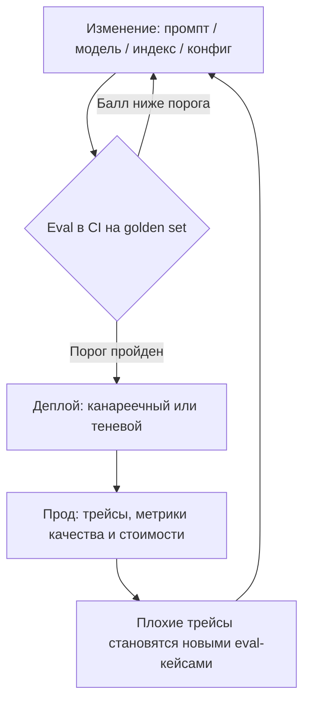
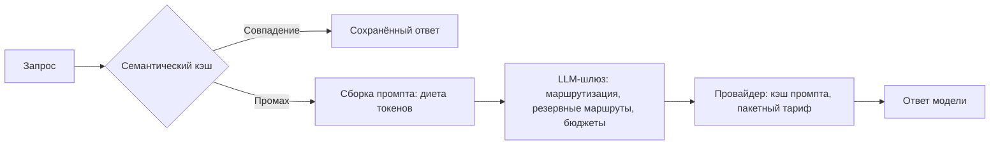

# Жизнь LLM-системы после релиза

Система написана, обёрнута в сервис и выкачена в прод. По меркам классической разработки — финиш; по меркам
LLM-приложения — начало самого интересного. Всё, что ты до сих пор настраивал руками — качество ответов,
поведение агента, счёт за токены, — теперь живёт своей жизнью на реальном трафике. Дисциплина, которая
этим занимается, называется **LLMOps**: эксплуатация LLM-приложений — деплой (deployment), мониторинг и
контроль стоимости.

Индустрия — взять хотя бы формулировку IBM — определяет LLMOps как MLOps, операционную практику машинного
обучения, в применении к большим языковым моделям; в таком широком смысле туда входит и
дообучение моделей. У этой книги прицел поуже: ты строишь приложения поверх готовых моделей, а не обучаешь
свои. Поэтому наша рамка такая — обучать
тебе почти никогда не придётся; ты собираешь систему из промптов, версий моделей, поисковых индексов и
конфигурации и эксплуатируешь эту сборку. Эта оптика и определяет весь урок.

:::tip[▶ Видео]

<YouTube id="cvPEiPt7HXo" title="Large Language Model Operations (LLMOps) Explained — IBM Technology" />

Вся дисциплина одним проходом: что в эксплуатации LLM-приложений меняется по сравнению с классическим
MLOps.

:::

## AI-дельта — артефакт и тест

В классическом DevOps деплоят код: артефакт один, и его версия однозначно определяет поведение сервиса.
У LLM-приложения поведение определяется целым набором артефактов:

- промпты — системный и все шаблоны на пути запроса;
- модель — какая именно и какой версии;
- снимок индекса — что заингестили в корпус, каким чанкингом, какой моделью эмбеддингов;
- конфигурация пайплайна — top-K, реранкер, пороги;
- политики ограничителей (guardrails).

Изменение любого из них — это деплой. Подкрутил порог реранкера, переехал на свежую версию модели, залил
в корпус новую пачку документов — качество ответов могло уехать, хотя дифф кода пуст. Держи эту мысль в
голове: всё остальное в уроке — её следствия.

Вторая дельта — тест. Вывод модели недетерминирован, а качество ответа — величина непрерывная: ответ
бывает лучше или хуже, «прошёл/не прошёл» тут не работает. Юнит-тесты по-прежнему нужны — они страхуют код
обвязки, — но регрессии качества ловят не они. Инструмент против регрессий здесь — eval из урока про
[оценку](../part-1-rag/cross-cutting/evaluation/index.md): golden set и метрики с порогами.

## Деплой — CI/CD для LLM-приложения

Раз уронить качество может любое изменение, у каждого изменения должны быть регрессионные ворота
(quality gate). Ими
становится eval в CI: правка промпта, модели, индекса или конфига запускает прогон golden set, и если метрики
просели ниже порога — слияние блокируется. Это регрессионный eval из Части I, превращённый в обязательную
стадию CI; собирают его инструментами из урока про [экосистему](./tooling-ecosystem/index.md) — [promptfoo](https://www.promptfoo.dev),
[DeepEval](https://deepeval.com) или [Ragas](https://ragas.io) прямо в CI.

Вместе с мониторингом, до которого мы дойдём ниже, всё это замыкается в цикл — смысловой стержень урока
и, пожалуй, всей Части III:

### Промпт — код и конфигурация одновременно

Как код, промпт обязан жить под контролем версий: диффы на ревью, история, откат (rollback) одной
командой. Как конфигурация, он меняется чаще кода — и когда промпты крутит продуктовая команда, не
желающая ждать релизного цикла, их выносят в **реестр промптов** (prompt registry): версионированное
хранилище вроде модуля управления промптами в [LangSmith](https://www.langchain.com/langsmith) или [Langfuse](https://langfuse.com). Какой бы вариант ты ни выбрал, инвариант
один: каждый ответ в проде должен быть привязан к точной версии промпта. Связывает их трейсинг — трейс
записывает, какой версией промпта порождён ответ.

### Фиксация версии модели

Провайдеры версионируют и выводят модели из эксплуатации. У OpenAI это различие deprecation и shutdown:
модель сначала объявляют устаревшей и лишь потом отключают, публикуя таблицу замен; идентификаторы часто
датированы — снапшоты вида `gpt-4o-2024-05-13`. У Anthropic — жизненный цикл Active → Legacy →
Deprecated → Retired с уведомлением об отключении не меньше чем за 60 дней. Форма идентификаторов у
провайдеров различается, но суть одна: у модели есть точная версия, и прод обязан её фиксировать —
это **фиксация версии модели** (model pinning). Незафиксированный алиас может изменить поведение у тебя
за спиной — без единого твоего действия. А когда ты сам переезжаешь на новую версию, это полноценный
деплой: сначала прогнать eval, потом раскатывать постепенно.

### Постепенная раскатка

Приёмы постепенной раскатки переезжают из DevOps почти как есть. **Канареечный релиз** (canary release) —
новый промпт или новая модель получают небольшую долю живого трафика, остальной трафик продолжает ходить
в старую версию. **Теневой запуск** (shadow deployment) — новый вариант работает на копии трафика, но его
ответы пользователям не показываются: безопасное сравнение качества на реальных запросах. A/B-тест —
знакомый по Части I онлайн-eval, сравнение вариантов на живых пользователях. LLM меняет здесь одно —
предмет наблюдения: классическая раскатка смотрит на ошибки и латентность, LLM-раскатка — ещё и на косвенные
показатели качества и на стоимость. Новый промпт может не уронить ни одного запроса и при этом удвоить
счёт или испортить ответы.

### Корпус тоже релизится

Про последний артефакт из списка забывают чаще всего. Переингест корпуса — новый чанкинг, новая модель
эмбеддингов — меняет поведение поиска по всей системе разом; смена модели эмбеддингов вообще означает
полную переиндексацию, как мы видели в уроке про [ingestion](../part-1-rag/ingestion/index.md). Значит,
обновление корпуса — версионированный релиз со своим прогоном eval, а не фоновая задача, которую крутит
ночной крон.

## Мониторинг — наблюдаемость плюс оповещения

Мониторинг LLM-приложения — это [наблюдаемость](../part-1-rag/cross-cutting/observability/index.md) из
Части I, работающая непрерывно, плюс оповещения об изменении метрик. Часть приборной панели стандартна для
любого сервиса: перцентили латентности (p50/p95), доли ошибок и таймаутов, стоимость в токенах на запрос.
Часть — специфика LLM, косвенные показатели качества: доля отказов (не стала ли система говорить «не
знаю» чаще обычного), частота срабатывания ограничителей, доля ответов с обратной связью от
пользователей. Снимают и прямой показатель: часто на небольшой выборке прод-трафика гоняют
LLM-as-a-judge — судья выставляет баллы ответам из выборки, а её размер держит стоимость самой проверки
в рамках.

### Дрейф

Оповещения нужны ещё и потому, что система деградирует без твоих изменений. Общее имя этому — **дрейф**
(drift), и к LLM-приложению он подкрадывается с трёх сторон.

- **Дрейф входного трафика** — пользователи начинают спрашивать о другом, и golden set перестаёт
  отражать реальный трафик. Понятие устоявшееся (input drift из MLOps), для LLM-приложений работает
  без поправок.
- **Дрейф корпуса** — наше собственное расширение, не термин индустрии, но явление совершенно реальное:
  документы стареют, и система честно отвечает на основе фактов, которые уже неверны.
- **Дрейф модели у провайдера** — провайдер обновил незафиксированную модель, и поведение сменилось.
  Уточнение «у провайдера» обязательно: в классическом MLOps «дрейф модели» означает деградацию качества
  модели на уехавших данных — это другой смысл.

Средств против дрейфа два: мониторинг распределения тем и намерений во входящих запросах — и регулярные
прогоны eval-метрик на свежих выборках из прода.

### Цикл инцидента

Сквозная нить книги — «наблюдаемость питает оценку» — превращается здесь в отработанный порядок действий.
Плохой прод-трейс → разбор: retrieval-провал или generation-провал, то самое разделение провалов из
Части I → случай уходит новым кейсом в golden set → фикс → eval подтверждает, что кейс закрыт и ничего
рядом не сломано → деплой. Инструменты из урока про [экосистему](./tooling-ecosystem/index.md) поддерживают
этот путь буквально кнопкой «превратить трейс в eval-кейс». Так каждый инцидент сужает регрессионные
ворота: однажды пойманная беда второй раз в прод не пройдёт.

## Стоимость и латентность

:::tip[▶ Видео]

<YouTube id="7gMg98Hf3uM" title="What Makes Large Language Models Expensive? — IBM Technology" />

Куда на самом деле уходят деньги — токены, вычисления, размер модели: анатомия стоимости, с которой
работают рычаги этого раздела.

:::

В классическом сервисе стоимость — строчка в месячном счёте за железо. Здесь она — полноправная
эксплуатационная метрика, потому что каждый запрос сжигает тарифицируемые токены. Стоимость растёт вместе
с трафиком — это ожидаемо. Коварнее то, что она растёт и вместе с длиной промпта: незамеченное изменение —
потяжелевший системный промпт, лишние чанки в контексте, разговорчивый агентный цикл — тихо умножает
счёт, ничего заметно не меняя в поведении. Поэтому к стоимости запроса относятся так же серьёзно, как к
качеству; настоящая метрика зрелой системы — качество на доллар.

### Маршрутизация запросов между моделями

Не всякому запросу нужна самая сильная модель. Классификацию, простые вопросы и рутинное извлечение
тянет дешёвая быстрая модель; дорогую приберегают для сложной генерации. **Маршрутизация запросов между
моделями** (model routing) отдаёт каждый запрос самой дешёвой модели, которая с ним справится; сам
маршрутизатор может быть правилом, обученным классификатором или ещё одной моделью. Только не спутай
уровни: маршрутизатор из Части I решал, куда направить запрос — в какой индекс или инструмент; выбор
инструмента в агентном цикле — отдельная, третья история; а здесь решается, какой модели отдать работу.

### Резервные маршруты и LLM-шлюз

Сбои у провайдера и ответы 429 (превышен лимит запросов) — не катастрофа, а рутина эксплуатации. Прод
держит цепочку резервов (fallback): та же модель в другом регионе, другой провайдер, в крайнем случае —
модель попроще в режиме деградации. Централизует всё это **LLM-шлюз** (LLM gateway) — прослойка
между приложением и провайдерами: один OpenAI-совместимый интерфейс ко всем моделям, маршрутизация,
резервные маршруты, управление ключами, бюджеты и лимиты частоты по командам разработки. Открытый пример — [LiteLLM](https://www.litellm.ai),
размещённый сервис — [OpenRouter](https://openrouter.ai).

### Кэширование — два вида

Первый вид живёт у провайдера. **Кэширование промпта** (prompt caching) опирается на то, что промпты
LLM-приложения сильно повторяются в начале: системный промпт, few-shot-примеры (образцы в промпте), статический контекст
идут одним и тем же префиксом в каждом запросе. Провайдер кэширует префикс, и повторно прочитанные
входные токены стоят порядка одной десятой базовой цены — сейчас так у обоих крупных провайдеров, точные
множители смотри на их страницах цен. Есть и обратная сторона: запись в кэш стоит дороже базовой цены
входных токенов — у Anthropic в 1,25 или 2 раза в зависимости от времени жизни кэша, у новейших
моделей OpenAI в 1,25 раза. Закэшировать префикс, который ни разу не перечитают, — чистый убыток. Отсюда
правило проектирования: проектируй промпт под кэш — статичное в начало, переменное в конец.

Второй вид — кэш ответов на твоей стороне. Простейшая форма — кэш точного совпадения, но дословно
повторяющийся вопрос — редкость, поэтому чаще применяют
**семантический кэш** (semantic caching): близость эмбеддингов решает, что вопрос «почти тот же», и
пользователю возвращается сохранённый ответ без похода в модель. Расплата — риск ложного попадания:
вопрос с тонким, но существенным отличием получит чужой ответ. Семантический кэш всегда жертвует
толикой корректности ради экономии — выбирай порог близости, помня об этом.

### Диета токенов

Самый надёжный рычаг — просто тратить меньше токенов. Меньше чанков в контексте: отбор лучших вместо
всех, как в уроке про [generation](../part-1-rag/generation/index.md). Короче системный промпт — каждое лишнее
предложение в нём умножается на весь трафик. Жёсткий потолок длины ответа. Суммаризация рабочей памяти
(scratchpad) агента вместо её бесконечного роста — приём из урока про [планирование и
циклы](../part-2-agents/planning-loops/index.md). У латентности рычаги родственные: стриминг ответа снижает
воспринимаемую задержку (урок про [сервинг](./serving/index.md)), модель поменьше отвечает быстрее
большой, а независимые стадии пайплайна можно исполнять параллельно.

### Пакетный тариф для офлайн-работы

Не всё, что ходит в модель, обслуживает живого пользователя. Ночное обогащение документов, бэкфилы
(дозаполнение данных задним числом), генерация синтетических данных для eval — всё это работа без человека
у экрана, и ей не нужен ответ за секунды. Для неё у провайдеров есть пакетный тариф (batch), знакомый по
уроку про [облачные платформы](./cloud-platforms/index.md): скидка порядка 50% в обмен на SLA в часах.

### Бюджеты

Последний рычаг — организационный. Зрелые команды обычно заводят на LLM-шлюзе бюджеты токенов по
командам и фичам — с оповещением при приближении к пределу и жёстким лимитом на самом шлюзе. Знакомая
идея: в Части II мы уже давали агенту бюджет шагов, здесь бюджет получает вся система. И в чек-лист
деплоя добавляется ревью стоимости — как мы видели, изменение промпта есть изменение стоимости, даже
когда качество не пострадало.

Соберём рычаги этого раздела на одной схеме пути запроса:

---

На этом закрываются и урок, и Часть III, и вся базовая часть курса. Оглянёмся на путь этой части: мы
обернули систему в сервис в уроке про [сервинг](./serving/index.md), выбрали, где будет жить модель, в уроке про
[облачные платформы](./cloud-platforms/index.md), обвязали пайплайн готовыми продуктами в уроке про
[экосистему инструментов](./tooling-ecosystem/index.md) — а сегодня научились со всем этим хозяйством жить после
релиза: деплоить без страха, замечать деградацию раньше пользователей, держать счёт в рамках. Теперь
отойдём на шаг и окинем взглядом всю книгу. Часть I собрала конвейер — слои Ingestion, Retrieval, Generation и сквозные аспекты:
оценку, ограничители, наблюдаемость. Часть II дала конвейеру агентность: цикл «рассуждение → решение →
действие → наблюдение», инструменты, планирование, команды агентов и протоколы. Часть III довела всё это
до прода. От первого чанка до системы, которая работает под нагрузкой, за регрессионными воротами и в
рамках бюджета, — вот и весь путь. База пройдена; дальше — углублённые проходы по слоям.

## Что забрать из урока

- **Артефакт LLM-приложения** — не только код: промпты, версия модели, снимок индекса, конфигурация
  пайплайна, политики ограничителей. Изменение любого из них — деплой и возможная регрессия качества при
  пустом диффе кода.
- **Eval в CI** — регрессионные ворота: на каждое изменение гоняется golden set, метрики ниже порога
  блокируют слияние.
- **Фиксация версии модели.** Провайдеры выводят модели из эксплуатации, незафиксированный алиас меняет
  поведение сам по себе; обновление модели — это деплой: eval, затем постепенная раскатка.
- Раскатка — **канареечный релиз**, **теневой запуск**, A/B; следить надо не только за ошибками и
  латентностью, но и за косвенными показателями качества и стоимостью.
- **Мониторинг** — наблюдаемость непрерывно плюс оповещения: латентность, ошибки, стоимость на запрос,
  доля отказов, срабатывания ограничителей, обратная связь, судейские баллы на выборке прод-трафика.
- **Дрейф** приходит с трёх сторон: входной трафик, корпус, модель у провайдера. Ловится мониторингом
  распределения тем и прогонами eval-метрик на свежих выборках.
- **Цикл инцидента**: плохой трейс → разбор провала → новый кейс в golden set → фикс → eval → деплой.
- **Рычаги стоимости**: маршрутизация запросов между моделями, резервные маршруты и LLM-шлюз,
  кэширование промпта и семантический кэш, диета токенов, пакетный тариф для офлайна.
- **Бюджеты токенов** на шлюзе по командам и фичам; ревью стоимости — часть чек-листа деплоя.

**Новые термины** → [Глоссарий](../glossary.md): LLMOps, canary release, shadow deployment, prompt
registry, model pinning, model routing, fallback, LLM gateway, prompt caching, semantic caching, drift.

---

:::note[Дальше — углубление слоя]

🚧 Второй проход: операционная сторона дообучения (когда дообучать вместо промптов), FinOps-модели для
LLM, автоматический разбор регрессий, SLO и бюджеты ошибок (error budgets) для качества, инфраструктура
очередей для пакетных работ.

:::
