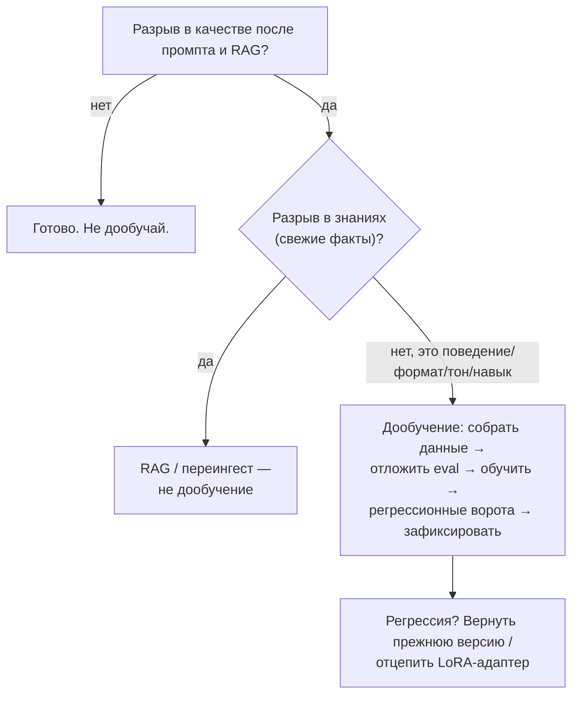
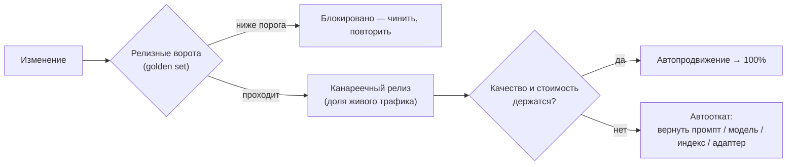
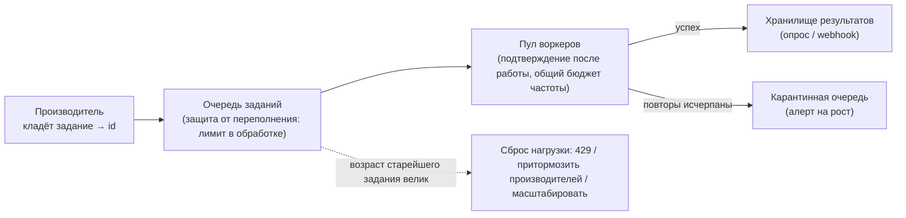

# Эксплуатация системы на уровне организации: дообучение, расходы и работа, которая может подождать

Это второй, углублённый проход урока про LLMOps. [Часть 1](./index.md) очертила цикл эксплуатации:
разворачиваемый артефакт — это не код, а связка «промпт + версия модели + снимок индекса + конфигурация +
политики ограничителей»; eval в CI служит воротами, за которыми изменение либо проходит, либо блокируется;
мониторинг ловит дрейф раньше пользователей; у стоимости есть свои рычаги. Там же названы канареечный релиз,
теневой запуск и A/B, маршрутизация запросов между моделями, LLM-шлюз, кэш промпта и семантический кэш,
диета токенов и пакетный тариф для офлайн-работы. Всё это предполагается известным и здесь не
переобъясняется.

Прежде чем идти вглубь, стоит честно очертить границы: три из пяти сегодняшних тем пересекаются с уроками,
которые уже владеют своей теорией, и мы на них ссылаемся, а не переписываем их. Механику надёжности в духе
SRE — определения SLI (индикатор уровня сервиса) / SLO (цель уровня сервиса), бюджет ошибок, алерты по скорости сжигания, правило «хотя бы один индикатор
качества», проверку мягкого и жёсткого потолка на каждом запросе — держит [углублённый урок про
наблюдаемость](../../part-1-rag/cross-cutting/observability/deep-dive.md); здесь наш только
организационный процесс вокруг бюджета. Обнаружение регрессии и её локализацию по спанам трейса (статистически
реальная просадка → какой этап виноват → трейсы плохих ответов уходят в golden set) держит тот же урок про
наблюдаемость; нам остаётся сторона релиза и отката. Ценовую механику по платформам — уровни за
обязательство, множители кэша промпта, форму пакетной скидки, межрегиональный трафик — держит [углубление про
облачные платформы](../cloud-platforms/deep-dive.md); нам — управление расходами на уровне организации.

Что же этот урок ведёт от начала и до конца: операционную сторону дообучения, управление расходами на уровне
организации, взгляд «релизные ворота и откат» на регрессии, бюджет ошибок как подписанную политику и
инфраструктуру очередей для пакетных работ.

## Дообучение — последний рычаг, а не первый

:::tip[▶ Видео]

<YouTube id="zYGDpG-pTho" title="RAG vs Fine-Tuning vs Prompt Engineering: Optimizing AI Models — IBM Technology" />

Та самая развилка из трёх путей, которую формализует этот раздел, — в одном проходе.

:::

**Дообучение (fine-tuning)** меняет веса модели; промпт и RAG меняют только то, что ты кладёшь перед
неизменными весами. Отсюда и порядок, в котором тянешься к рычагам: сначала промпт, потом RAG, и лишь в
последнюю очередь — дообучение. Первые два дешевле, откатываются одним коммитом и не порождают новый артефакт,
которым ты теперь владеешь и который придётся содержать. За дообучение берись только тогда, когда промпт с
RAG упёрлись в потолок и при этом разрыв — из тех, что дообучение как раз и закрывает: поведение, формат или
стиль, которые модель не держит стабильно; тон или манера предметной области; латентность и стоимость
(дообученная маленькая модель
догоняет большую на узкой задаче); навык, который не вытягивается никаким промптом. Чего дообучение не даёт —
это свежести знаний: факты дообученной модели заморожены на момент обучения и устаревают ровно так же, как
устаревает корпус. Свежие знания — работа RAG, и переносить её на веса не надо.

### Семейство методов, от лёгкого к тяжёлому

Имена продуктов и списки подходящих базовых моделей тасуются поквартально, так что конкретику ниже считай
снимком на середину 2026-го — долговечно само семейство:

- **SFT** (supervised fine-tuning, дообучение с учителем) — размеченные пары «вход → выход»; выбор по
  умолчанию.
- **DPO** (direct preference optimization) — учится на парах ответов «предпочтительный / отвергнутый»;
  подгоняет тон и формат без отдельной модели вознаграждения.
- **RFT** (reinforcement fine-tuning) — награду считает **оценщик (grader)**, которого определяешь ты сам:
  на каждый промпт платформа сэмплирует несколько кандидатов, оценщик выставляет им баллы, дальше идёт шаг
  policy-gradient (градиент по политике) — сэмплировать → оценить → обновить, — и так, пока модель не
  оптимизируется под твоего оценщика. Годится для задач с проверяемым ответом, где оценщик способен
  померить правильность. На середину 2026-го OpenAI даёт RFT на своей рассуждающей модели o4-mini и SFT на
  небольших моделях (например, GPT-4.1 nano), а Amazon Bedrock в феврале 2026-го распространил RFT на модели
  с открытыми весами (OpenAI GPT-OSS, Qwen) через OpenAI-совместимые API дообучения.
- **LoRA / PEFT** (low-rank adaptation / parameter-efficient fine-tuning) — вместо всех параметров обучается
  небольшой **LoRA-адаптер** поверх замороженных базовых весов: дёшево обучать, дёшево хранить, а
  операционный выигрыш в том, что адаптеры можно менять и складывать стопкой, не трогая базовую модель.

Во что дообученную модель обходится обслуживать — плата за выделенную ёмкость и ловушка «зомби-модели» —
разбирает [углубление про облачные платформы](../cloud-platforms/deep-dive.md); здесь мы стоимость сервинга
не переписываем.

### Дообученная модель — тоже разворачиваемый артефакт

Дообучение — не разовая акция: на выходе новый артефакт, живущий на том же цикле, что промпт или индекс. Его
жизненный путь такой. Собери датасет — качество дообучения равно качеству данных: дедуплицированных,
представительных, верно размеченных. Отложи eval-набор, которого обучение в глаза не видело. Обучи. И
прогони дообученную модель через те же регрессионные ворота, что любой деплой (тот самый eval в CI из
Части 1), — прежде чем она обслужит хоть одного пользователя. Регрессирует она, как и всё остальное: дообучение
может переобучиться (блестит на обучающем распределении, хуже везде за его пределами) или забыть (теряет
общую способность, которая у модели была). Ловит это только golden set.

Откат тоже наследуется от базового урока. Дообученная модель — зафиксированный артефакт (**фиксация версии
модели (model pinning)** из Части 1 распространяется и на твои собственные версии), поэтому откат — это
перефиксация: держи предыдущую версию готовой к обслуживанию, и если новое дообучение регрессировало, верни
прежнюю версию — та же дисциплина, что откат промпта, только на уровень выше. LoRA делает это почти
бесплатным: отцепи адаптер — и мгновенно откатываешься к базовой модели, без переразвёртывания весов.
Способ сломаться, которого надо избегать, — выкатить дообучение, к которому нечем откатиться: без
зафиксированного предшественника.

Большинству команд, строящих RAG и агентов, дообучение так и не понадобится, и это нормальный исход.
Дообученная модель — это постоянное обязательство по сопровождению: переобучать, когда провайдер выведет
базовую модель из эксплуатации (жизненный цикл провайдера из Части 1), переобучать, когда уедет предметная
область, вечно владеть eval-данными, — плюс она углубляет привязку к поставщику (дообученная модель не
переносится между вендорами). Если промпт с RAG берут планку, это и есть ответ. Дообучай, когда разрыв в
поведении реален и устойчив; никогда — чтобы вложить в веса знание, которое поиск отдаст свежим.

## Расходы на уровне организации — сделать их видимыми, адресными и ограниченными

Платформенные рычаги цены — скидка за обязательство, множители кэша промпта, пакетные −50%, межрегиональный
трафик — предмет [углубления про облачные платформы](../cloud-platforms/deep-dive.md); дёрнуть каждый рычаг —
инженерное решение. Управление расходами — слой над ними: сделать расходы видимыми, адресными и
ограниченными по всем командам, чтобы рычаги вообще дёргали и чтобы ни одна команда не могла молча
превысить бюджет. Часть 1 повесила бюджеты на шлюз; здесь — организация вокруг них.

Первая трудность — привязать расход к источнику. Облачный FinOps размечает ресурсы: виртуальную машину,
диск. Вызов LLM-API — это транзакция, а не ресурс: на уровне инфраструктуры помечать нечего. Значит,
атрибуцию приходится снимать на уровне приложения — проставлять на каждом вызове фичу, команду, арендатора
(tenant), маршрут и модель (те же атрибуты трейса, что уже записывает наблюдаемость, — механику атрибуции
стоимости и OTel держит [углублённый урок про
наблюдаемость](../../part-1-rag/cross-cutting/observability/deep-dive.md)) — и протаскивать эти метаданные в
данные о расходах. Без этого месячный счёт остаётся одним бесполезным итогом: «потратили $X» — а на что,
неизвестно.

Дальше расходы можно распределять по одной из двух моделей. **Showback** (показ расходов команде без счёта) —
каждой команде, фиче или продукту показывают их потребление, но расход остаётся на центральном бюджете:
это видимость без внутренней тарификации. FinOps Foundation называет showback обязательным фундаментом — он
нужен всегда. **Chargeback** (отнесение расходов на бюджет команды или продукта) — расход реально относят
на бюджет (P&L, прибыли и убытки) потребляющей команды или продукта: подотчётность сильнее, машинерия тяжелее, и работает он только
поверх точной атрибуции — chargeback на кривых числах плодит недоверие и споры. Путь зрелости здесь
односторонний: сперва showback, а когда атрибуции начнут доверять — chargeback.

Что управление расходами перестало быть необязательным, видно по цифрам. Отчёт **State of FinOps 2026**
сообщает, что расходами на AI теперь управляют 98% респондентов — двумя годами ранее их была лишь треть
(31%), — и называет гранулярный мониторинг AI-расходов (токенов, LLM-запросов, загрузки GPU) самой
востребованной возможностью инструментов. (Насколько велик разброс между неоптимизированным и оптимизированным
развёртыванием — оценку FinOps Foundation в 30–200 раз приводит углубление про облачные платформы; здесь не
повторяем.)

Рычагов управления, в отличие от ценовых, немного, и все они стоят там, где и так проходит весь трафик, — на
**LLM-шлюзе** из Части 1.

- **Бюджеты с оповещениями** — токен-бюджеты по командам и фичам: **мягкий потолок** предупреждает,
  **жёсткий потолок** отклоняет запрос или переводит его на модель попроще. Как именно потолки срабатывают во
  время выполнения — вопрос углубления про наблюдаемость; кто какой бюджет получает — здесь.
- **Маршрутизация по цене** — маршрутизация запросов между моделями (model routing) из Части 1, поднятая до
  политики: дешёвый трафик по умолчанию идёт в дешёвую модель, флагман — только по обоснованной заявке. Это
  рычаг, который, как показала Часть 1, двигает счёт сильнее прочих.
- **Разбор стоимости в чек-листе деплоя** — раз изменение промпта есть изменение стоимости, релизные ворота
  (следующий раздел) проверяют не только качество, но и прогноз стоимости на запрос.

Ломается всё это предсказуемо. Chargeback раньше, чем атрибуции можно доверять, — споры и игры с числами.
Бюджеты с одним лишь мягким потолком — оповещения, на которые никто не реагирует, а счёт всё равно приходит.
Нет дешёвого маршрута по умолчанию — и каждый запрос по инерции платит цену флагмана.

## Что релиз делает с пойманной регрессией

Обнаружить регрессию (статистически реальную просадку, а не неудачный вечер) и локализовать её по спанам
трейса до конкретного этапа — а трейсы плохих ответов превратить в новые кейсы golden set — предмет [углублённого
урока про наблюдаемость](../../part-1-rag/cross-cutting/observability/deep-dive.md). Этому разделу
достаётся вторая половина: что делает с пойманной регрессией сам релизный процесс — блокирует её или
откатывает.

Eval в CI из Части 1, если смотреть на него со стороны релиза, — это **релизные ворота** по качеству:
изменение, чьи метрики на golden set упали ниже порога, — это регрессия, пойманная до выкатки, и
слияние или деплой блокируются. Ворота — самое дешёвое место остановить регрессию: на входе, а не в проде.

Но eval ловит лишь то, что покрывает golden set; остальное находит живой трафик. Поэтому релиз не щёлкает
переключателем 0 → 100% — он постепенный: канареечный релиз из Части 1 берёт долю живого трафика, пока
контроллер раскатки следит за косвенными показателями качества и стоимостью, а не только за ошибками и
латентностью. Два исхода автоматизированы: метрики держатся — автопродвижение до полного трафика;
какой-то порог превышен — автооткат к предыдущей версии. Канарейка, которая быстра, дешева и
чуть-чуть неверна, обязана вызвать откат — потому контроллер и смотрит на качество, а не на голый ответ
200 OK.

Откат тривиален для кода и с подвохом для всех пяти артефактов, потому что каждый откатывается
по-своему:

- **промпт** — откатить коммит или перефиксировать версию в реестре промптов (Часть 1);
- **модель** — вернуть предыдущую версию (фиксация версии модели из Части 1); **дообученная модель** —
  вернуть предшественника или отцепить LoRA-адаптер (раздел про дообучение);
- **конфигурация или политика ограничителя** — вернуть прежнее значение;
- **индекс** — восстановить предыдущий снимок, и вот тут ловушка: переингест, затирающий корпус на месте,
  откатить нечем. Индекс обязан быть версионированным (именованный снимок, который можно перефиксировать)
  именно затем, чтобы кривой переингест был обратим, как любой другой артефакт.

Самый сильный релизный контроль — не про отдельное изменение: это когда организация говорит «сейчас никаких
релизов вообще». Такое решение — **заморозка релизов**, и правит ею политика бюджета ошибок из следующего
раздела.

## Бюджет ошибок как организационный процесс

Механику — как выбирают SLI (индикатор уровня сервиса) и ставят SLO (цель уровня сервиса) на окне, как
считают бюджет ошибок расстоянием до 100%, как настраивают алерты по скорости сжигания и почему хотя бы один
индикатор обязан быть индикатором качества, считаемым онлайн-eval, — держит углубление про наблюдаемость.
Этому разделу достаётся то, что превращает эти числа в организационное решение: **политика бюджета ошибок**.

Политика бюджета ошибок — это письменное соглашение, подписанное до инцидента, о том, что происходит, когда
бюджет исчерпан, и кто именно это делает. Каноническое правило Google SRE: пока сервис на уровне
SLO или выше — релизы идут по обычному релизному регламенту; бюджет исчерпан на скользящем окне (в примере
SRE — четыре недели) — замораживаются все изменения и релизы, кроме исправлений P0 и вопросов
безопасности, пока сервис не вернётся в рамки SLO. Политика обязана назвать владельцев каждого действия,
а несогласие эскалируется к тому, кто вправе решить (в примере SRE — технический директор). Без подписанной
политики заморозка — не правило, а пожелание, которое никто не проведёт в жизнь.

Для LLM-системы у этого правила две поправки. Первая: замораживается деплой из пяти артефактов — правка
промпта, перефиксация модели, переингест, изменение конфигурации или политики ограничителя, — а не только код, так что заморозка
останавливает и итерацию по промптам. Вторая: бюджет может быть бюджетом качества — прогорающий SLO по доле
ответов, проходящих проверку на faithfulness (а не только по доступности), способен запустить заморозку. Сервис,
на 100% доступный и при этом измеримо галлюцинирующий, — за пределами бюджета. Организация должна
заранее согласиться, что прогар качества замораживает релизы так же, как прогар доступности.

Бюджет ошибок совладельческий: продуктовая сторона его тратит (катит фичи и изменения), сторона надёжности его
стережёт (объявляет заморозку). Политика — это заранее оговорённый контракт между ними, чтобы заморозку не
приходилось перерешать посреди инцидента.

Отсюда и способы промахнуться. Политика, которую никто не подписал, — заморозка не наступит никогда, и бюджет
превращается в театр. Бюджет с одним лишь индикатором доступности — зелёные дашборды над галлюцинирующим сервисом
(та самая доступность напоказ из углубления про наблюдаемость).

## Очереди для офлайн-работы

Офлайн-работа с LLM — ночное обогащение корпуса, бэкфилы (дозаполнение данных задним числом), генерация
синтетических данных для eval, массовая классификация — ресурсоёмка и медленна, и ей незачем конкурировать
с интерактивным трафиком. **Очередь заданий
(job queue)** разводит темп, с которым работа приходит, и темп, с которым её обрабатывают: производитель
кладёт задание в очередь и сразу получает его id (без блокировки), пул воркеров вычерпывает очередь с той
скоростью, какую позволяют железо и лимиты частоты провайдера, а результаты ложатся в хранилище, которое
клиент опрашивает или получает по webhook.

Двух миров пакетной работы не спутай. Пакетный тариф из Части 1 (провайдерский Batch API — OpenAI, Anthropic,
Vertex; порядка −50% за SLA около 24 часов, и его цена — предмет углубления про облачные платформы) — это
управляемый офлайн-путь: отдаёшь провайдеру файл запросов, он его прогоняет, ты забираешь результаты, и
никаких воркеров держать не надо. Этот раздел владеет другим случаем — асинхронной инфраструктурой,
которую поднимаешь ты, когда работа не сводится к одному вызову провайдера: многошаговые конвейеры, свой
инференс на GPU, смесь провайдеров, работа, которую надо переплести с базой данных. Развилка простая: задача
вида «N независимых промптов, результат в пределах суток» — провайдерский Batch API; конвейер, которым ты
дирижируешь сам, — своя очередь.

:::note[Предпосылки]

Очереди — типовая инфраструктура, которой книга не учит. Зрелый выбор по умолчанию в Python —
[Celery](https://docs.celeryq.dev) с брокером на Redis или RabbitMQ; полегче и изначально асинхронные —
[arq](https://arq-docs.helpmanual.io) и [RQ](https://python-rq.org), они естественно ложатся туда, где
«задание — это просто асинхронный HTTP-вызов к LLM», и хорошо сочетаются с асинхронным веб-сервисом из урока
про [сервинг](../serving/index.md).

:::

Дальше — только AI-дельта: что меняется, когда задания в очереди — это вызовы LLM.

Первая дельта — долгие задания требуют подтверждения после работы. Задание к LLM живёт секунды и минуты, не
миллисекунды. Если воркер подтверждает задание до того, как закончил, и падает, задание теряется (подтверждено,
но не сделано) — а при наивной упреждающей выборке (prefetch) на мёртвом воркере ещё и застревают несколько дорогих заданий. Лечится
это **подтверждением после работы** (в Celery — `acks_late` вместе с `worker_prefetch_multiplier = 1`): задание
отмечается сделанным, только когда его результат существует, а падение воркера отправляет его на повторную
доставку другому. Цена потерянного LLM-задания — уже сожжённые токены и латентность — делает это здесь
обязательным так, как не обязательно для миллисекундной задачи.

Дальше — идемпотентность. Повторно доставленное задание исполняется заново. Если оно только
читает (классифицирует, считает эмбеддинг, ставит балл), повтор бесплатен. Если оно пишет (обновляет запись,
шлёт уведомление, дописывает в индекс), повтор пишет дважды — та же забота об **идемпотентности**, что и у
вызова инструмента с побочным эффектом из Части II (см. урок про [использование
инструментов](../../part-2-agents/tool-use/index.md)). Пишущие задания делают идемпотентными: детерминированный
**ключ идемпотентности** на задание, чтобы повторная доставка стала пустой операцией, а не дублем.

Третья дельта живёт в бюджете частоты: воркеры делят его на всех, и очередь оказывается местом для защиты от переполнения. Воркеры,
черпающие из очереди, делят один провайдерский лимит частоты и токенов; дай им всем тянуть разом — и получишь
ответы 429 от провайдера и превышенный бюджет расходов. Поэтому именно на очереди наводят **backpressure** (защиту
от переполнения): ограничивают объём одновременно обрабатываемой работы (`worker_prefetch_multiplier`), держат число одновременных запросов под
лимитом частоты провайдера — тем самым, что централизует LLM-шлюз из Части 1, — а когда возраст старейшего
задания переваливает порог, сбрасывают нагрузку (**load shedding**, сброс нагрузки): возвращают производителям
429, притормаживают приём или доливают воркеров. Очередь, которая принимает без границ, пока воркеры отстают,
лишь переносит аварию из «отказано сейчас» в «сделано с многочасовым опозданием и уже никому не нужно».

И последнее — отравленная задача и карантинная очередь. Некоторые задания падают всегда — битый документ,
промпт, неизменно упирающийся в лимит длины или в ограничитель. Повторяемая до бесконечности, такая
**отравленная задача** заклинивает очередь и жжёт токены на каждой попытке. Лечится это ограниченным числом
повторов, после которого задание уходит в **карантинную очередь (dead-letter queue, DLQ)** — боковую очередь
для заданий, исчерпавших свои повторы, — и алертом на рост DLQ: растущий карантин — это реальный сигнал
(плохая пачка
данных, изменение выше по потоку), а не шум, который можно не замечать.

А когда своя очередь не нужна — когда подходит провайдерский Batch API (независимые запросы, результат в
пределах суток терпит): он дешевле (тот самый пакетный тариф) и не требует воркеров в эксплуатации. Свою
очередь поднимай, только когда работа — это конвейер под твоим контролем, требует своих вычислений или должна
переплетаться с твоими системами.

## Что забрать из урока

- Дообучай последним — после того как промпт и RAG упёрлись в потолок — и только под поведение, формат, тон
  или навык, никогда ради свежего знания (это работа RAG). Дообученная модель — зафиксированный артефакт на
  тех же регрессионных воротах, а откат её — возврат прежней версии или отцепление LoRA-адаптера.
- Методы от лёгкого к тяжёлому: SFT, DPO, RFT (награду считает твой оценщик), LoRA/PEFT (сменный адаптер
  поверх замороженных весов). Что предлагают провайдеры — снимок на дату.
- Управление расходами — сделать стоимость видимой, адресной и ограниченной: атрибуцию снимать на уровне
  приложения (вызов LLM — транзакция, а не помечаемый ресурс), showback — всегда, chargeback — лишь когда
  атрибуции можно доверять, бюджеты и дешёвый маршрут по умолчанию — на шлюзе.
- Релизная сторона регрессии: релизные ворота блокируют её до выкатки; постепенная раскатка делает автооткат
  по показателю качества или стоимости, а не только по ошибкам. Откат нужен каждому артефакту, а у индекса он
  есть, только если индекс версионирован.
- Политику бюджета ошибок подписывают до инцидента: бюджет исчерпан → заморозка всех релизов из пяти
  артефактов, кроме P0 и безопасности; прогар качества замораживает релизы так же, как прогар доступности;
  владельцы действий названы.
- Очередь заданий разводит приход работы и её обработку для офлайна. AI-дельты: подтверждение после работы
  (долгие задания), идемпотентные пишущие задания, защита от переполнения плюс общий бюджет частоты,
  карантинная очередь для отравленных заданий. Когда работа — независимые запросы в пределах суток, выбирай
  провайдерский Batch API.

См. также: механику SLI/SLO и скорости сжигания, а также цепочку «обнаружить → локализовать → вернуть в
eval» разбирает [углублённый урок про
наблюдаемость](../../part-1-rag/cross-cutting/observability/deep-dive.md); тарифы по платформам — [углубление
про облачные платформы](../cloud-platforms/deep-dive.md).

**Новые термины** → [Глоссарий](../../glossary.md): SFT, DPO, RFT, grader, LoRA / PEFT, showback, chargeback,
error budget policy, release freeze, release gate, job queue, dead-letter queue (DLQ), backpressure, load
shedding.
