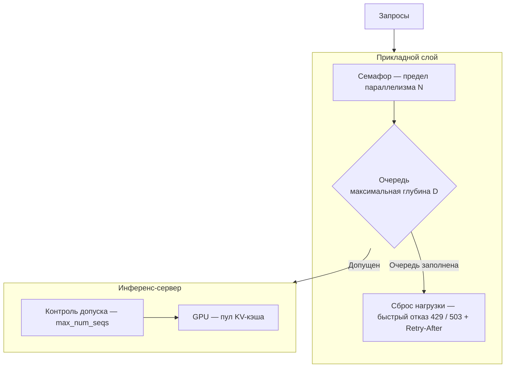
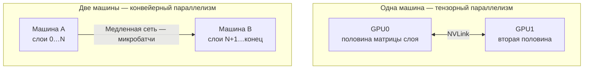

# Откуда берётся пропускная способность, когда сервис попадает под настоящую нагрузку

Это второй, углублённый проход урока про сервинг. [Часть 1](./index.md) завернула пайплайн в сервис — здесь
мы берём тот же сервис и разгоняем его под реальной нагрузкой. Часть 1 предполагается известной: разделение
«сервинг приложения и сервинг модели», асинхронность и стриминг, дельту Docker с весами, GPU и холодным
стартом мы не переобъясняем. Отсюда — вглубь: как настроить ASGI под бой, чем ограничивать очереди, что
происходит внутри vLLM, как раскинуть модель на несколько GPU и машин и как всё это масштабировать.

## Боевая настройка ASGI: процессы, цикл событий и пул потоков

Uvicorn по умолчанию — это один процесс, один цикл событий, одно ядро процессора. Чтобы задействовать больше
ядер, запускают несколько рабочих процессов. На 2026 год их поднимают двумя равноправными способами, и оба
актуальны: классический — gunicorn как менеджер процессов с воркерами `uvicorn.workers.UvicornWorker`; и
собственный флаг uvicorn `--workers`, ставший полноценным (именно его и оборачивает `fastapi run`).
Документация FastAPI по развёртыванию показывает оба, так что «рекомендованный» вариант считай преходящей
деталью — важно то, чем воркер является по сути.

А по сути **рабочий процесс (ASGI worker)** даёт параллелизм на уровне процессов: у каждого воркера свой
процесс ОС, свой интерпретатор Python (а значит, GIL ему не помеха), свой цикл событий, своя память. И вот тут
кроется частая ошибка в подсчёте. Для I/O-bound-прокси к LLM правило синхронного веба `(2 × ядра) + 1` не
работает. Параллелизм здесь даёт не число процессов, а сам цикл событий: один процесс уже перемежает сотни
одновременных ожиданий, потому что запрос к LLM — это почти сплошное ожидание. Воркеры же нужны для другого:
занять несколько ядер и прикрыть немногие процессорные участки — сериализацию запроса и ответа, токенизацию,
разбор JSON. Поэтому число воркеров считают от числа ядер и процессорной нагрузки; к желаемому числу
одновременных запросов оно отношения не имеет.

Сам цикл стоит ускорить бесплатно: **uvloop** — быстрый цикл событий на базе libuv — уже входит в
`uvicorn[standard]` и подменяет стандартный цикл asyncio, давая прибавку в скорости без единой правки в коде.

Отдельная ловушка — **пул потоков** (правило Части 1, но глубже). Обычный `def`-обработчик или зависимость
FastAPI выполняется не в цикле событий, а в пуле потоков anyio (по умолчанию около 40 потоков). Синхронный
`def`-обработчик поэтому не блокирует цикл — но под нагрузкой способен исчерпать пул, и тогда следующие запросы
встают в очередь, ожидая, пока в пуле освободится место. Обратная ошибка тяжелее: блокирующий вызов внутри `async def`-обработчика
замораживает весь цикл событий, а с ним и все запросы, что процесс вёл параллельно, — это и есть механизм за
правилом Части 1 «один блокирующий вызов останавливает всё». Для неизбежной синхронной работы внутри
асинхронного кода есть выход — вынести её в пул потоков: `run_in_threadpool` из Starlette или
`asyncio.to_thread` уводят блокирующий вызов в отдельный поток, и цикл продолжает обслуживать остальных.

Последнее — корректная остановка долгих стримов. На SIGTERM сервер обязан перестать принимать новые соединения
и в отведённое окно доработать те, что уже в полёте (в обработке). Генерация в стриминге тянется десятки секунд — дольше
стандартного окна остановки, — поэтому выставляй тайм-аут корректной остановки по самому длинному ожидаемому
стриму, иначе на очередном обновлении раскатка оборвёт ответы на полуслове. (А как стриминг сталкивается с
выходными [ограничителями (guardrails)](../../part-1-rag/cross-cutting/guardrails/index.md), уже разобрано в
Части 1 — здесь мы это не переигрываем.)

## Очереди и защита от переполнения

Неограниченный параллелизм убивает LLM-сервис тремя способами. Память: каждый запрос в полёте держит KV-кэш и
состояние соединения. Штормы 429: ты превышаешь общую квоту провайдера, и он разом придушивает всех. И коллапс
хвостовой латентности: за порогом ёмкости задержка в очереди взрывается, а p99 улетает следом. Это не отдельные
сбои — это три способа разом уронить весь сервис под нагрузкой.

Насколько рано это случается, показывает **закон Литтла** (Little's Law): `L = λW`. Параллелизм `L` равен
частоте прихода `λ`, умноженной на время в системе `W`. Для генераций `W` — это десятки секунд, поэтому даже
скромная частота прихода даёт большой параллелизм: `λ = 10 запросов/с × W = 20 с ⇒ L = 200` одновременно в
полёте. Вот почему LLM-сервис упирается в свой потолок параллелизма при удивительно низкой частоте запросов.

Ответ на это — **backpressure** (защита от переполнения): сознательно ограничить параллелизм. Семафор ставит
предел на число одновременных генераций, а очередь — конечную максимальную глубину. Когда очередь полна, лучше
честно и быстро отказать — вернуть 429/503 с заголовком `Retry-After` (это **сброс нагрузки**, load shedding),
— чем принять работу, которую не потянешь. Отброшенный запрос клиент повторит; сервис, который лёг для
всех, — нет. Сюда же примыкает **контроль допуска** (admission control): не ставь в очередь работу, которая всё
равно превысит тайм-аут клиента, — отклони её сразу, а не трать слот GPU на ответ, которого уже никто не ждёт.
И справедливость: очереди и лимиты параллелизма на каждого арендатора (tenant) не дают одному тяжёлому пользователю
заморить остальных — это тот самый пользовательский лимит из Части 1, только сделанный структурным.

Главный принцип — ограничивай на дефицитном ресурсе, а не на соединении. Асинхронность делает ждущее соединение
дешёвым (Часть 1), но каждый запрос в полёте всё равно занимает дефицитный слот ниже по течению: слот в батче GPU
или слот в токенном бюджете провайдера. Значит, границу ставят на дефиците — на GPU или на квоте провайдера. На практике уровней получается два: прикладной слой ограничивает своим семафором и очередью, а
инференс-сервер вдобавок держит собственный допуск (`max_num_seqs`, см. ниже). Двойная подстраховка.

## Что происходит внутри vLLM

**Непрерывный батчинг (continuous batching)** — это планирование на уровне итерации, то есть на каждом шаге.
Планировщик подсаживает новые запросы и выселяет завершённые на каждом шаге декодирования, а не как статический
батчинг, что ждёт, пока весь батч догенерирует до конца, и только потом берёт следующий. Приём восходит к статье
Orca (Yu и др., OSDI 2022), где и предложили планирование на уровне итерации; сегодня его реализуют и
[vLLM](https://docs.vllm.ai), и TGI, и TensorRT-LLM.

У генерации две фазы с противоположными узкими местами. **Prefill** (префилл — прогон всего промпта разом)
упирается в вычисления. **Decode** (декодирование — по одному токену за шаг) на каждом шаге заново перечитывает
и веса, и KV-кэш, поэтому упирается в пропускную способность памяти. Они нагружают разные части GPU — и это
открывает пространство для трюков. **Chunked prefill** (префилл, разбитый на части) перемешивает
префилл и декодирование в одном шаге: длинный префилл режется на куски, перемешанные с идущими декодами, и один
большой промпт не стопорит чужое декодирование. За это чуть растёт p50 TTFT (плата за перемешивание) — зато
заметно падает p95. Кэширование префикса (prefix caching) переиспользует KV-кэш общего начала промпта (например,
общего системного промпта) между запросами, пропуская его повторный расчёт.

Держит всё это **PagedAttention**: KV-кэш хранится блоками фиксированного размера, как страницы памяти ОС, —
фрагментация падает почти до нуля, а блоки можно делить между запросами (это и есть механизм под кэшированием
префикса). KV-кэш и есть главный ограничитель памяти и параллелизма: он растёт как длина последовательности,
умноженная на число одновременных последовательностей, и, когда пул KV-кэша заполнен, ты не обслужишь больше ни
одного запроса — сколько бы FLOPS у GPU ни простаивало. Настройки планировщика (снимок vLLM 2026):
`max_num_seqs` — предел одновременных последовательностей; `max_num_batched_tokens` — бюджет токенов на шаг;
`gpu_memory_utilization` — доля видеопамяти под пул KV-кэша. Когда пул заполняется, vLLM вытесняет часть
запросов: либо пересчёт (сбросить их KV и позже вычислить заново), либо своп (перенести KV в оперативную память
и вернуть обратно).

Сам движок за это время переписали: vLLM перестроил ядро — планировщик, менеджер KV-кэша, воркер, API-сервер:
движок V1 вышел альфой в январе 2025 и к 2026 году стал вариантом по умолчанию, включив оптимизации пропускной
способности сразу из коробки (постоянный батч, чистое разделение процессов планировщика и воркера). Имя движка —
преходящая деталь. И, наконец, **квантизация**. База — FP16/BF16. FP8 (аппаратно поддержан тензорными ядрами
Hopper и Blackwell) почти не теряет качества и к 2026 году стал первым разумным шагом. Дальше INT8 (W8A8). INT4
только на весах, через AWQ или GPTQ, срезает память под веса примерно на три четверти — достаточно, чтобы
уместить 70B-модель на одном GPU, ценой умеренной просадки качества. Отдельно стоит квантизация KV-кэша (FP8 KV):
она примерно вдвое увеличивает число токенов, которые вмещает тот же пул, — а значит, длиннее контексты и выше
параллелизм. Плата всегда одна: пропускную способность и память покупают ценой качества.

## Несколько GPU и несколько машин

**Тензорный параллелизм (tensor parallelism)** режет весовые матрицы каждого слоя между GPU. После каждого слоя
нужен all-reduce, чтобы собрать частичные результаты вместе, — обмена получается очень много, поэтому такому
режиму нужен быстрый интерконнект (NVLink) и держать его стоит внутри одной машины. Настройка vLLM —
`tensor_parallel_size`. **Конвейерный параллелизм (pipeline parallelism)** разрезает не матрицы, а сами слои на
ступени, и каждая ступень живёт на своём GPU или своей машине; микробатчи текут со ступени на ступень. Обмена
здесь куда меньше, чем в тензорном, — режим терпит и медленную сеть, а значит, работает между машинами. Плата —
«пузырь» конвейера: ступени простаивают, пока конвейер наполняется и опустошается. Настройка vLLM —
`pipeline_parallel_size`.

Отсюда практическое правило: тензорный параллелизм — внутри машины, по NVLink; конвейерный — между машинами; для
очень большой модели их совмещают. Особняком стоит **параллелизм данных** (data parallelism) — целые копии
модели за балансировщиком: он про чистую пропускную способность, когда модель и так помещается на один GPU.
Многомашинные развёртывания vLLM координирует через [Ray](https://www.ray.io) — и это тоже деталь, которая
устареет.

Когда не надо. Модель, что помещается на один GPU, дешевле обслуживать копиями, чем шардировать: шардирование
добавит только накладные расходы на обмен. Параллелизм — для моделей, которые не влезают, или ради снижения
латентности; бесплатной пропускной способности он не даёт.

## Планирование GPU и автомасштабирование в Kubernetes

Плагин устройств (device plugin) NVIDIA объявляет GPU планируемым ресурсом `nvidia.com/gpu` — и это целое
число, поэтому по умолчанию под (pod) запрашивает GPU целиком: дробной доли GPU из коробки нет. GPU-поды
закрепляют за выделенными GPU-узлами (узел здесь — машина в кластере) тейнтами и толерациями (taints/tolerations)
или через node affinity, чтобы обычные нагрузки не садились на дорогие GPU-машины. Разделить один GPU можно двумя способами.
**MIG (Multi-Instance GPU)** (аппаратное разбиение GPU на изолированные экземпляры) режет A100 или H100 на
отдельные экземпляры, у каждого своя память и своя изоляция сбоев. **Нарезка GPU по времени** (GPU time-slicing —
разделение GPU без изоляции памяти) делит карту, перемежая работу, — без изоляции памяти и сбоев: годится для
разработки, рискованна в проде.

Весь фокус автомасштабирования — в сигнале. Штатный **HPA (Horizontal Pod Autoscaler)** (штатный автоскейлер
подов) масштабирует по CPU и памяти, а для GPU-сервинга это бесполезно: GPU может быть загружен на все 100%,
пока процессор почти простаивает, — и HPA по процессору просто не сработает. Настоящий сигнал — глубина очереди,
число запросов в полёте, токены в секунду, загрузка GPU (её отдаёт DCGM — экспортёр GPU-телеметрии NVIDIA). Их подают как пользовательские или внешние
метрики через Prometheus Adapter или **[KEDA](https://keda.sh)** (автомасштабирование по внешним метрикам). На
какие SLO и бюджеты латентности всё это масштабирование отвечает — в [углублении про
наблюдаемость](../../part-1-rag/cross-cutting/observability/deep-dive.md); здесь мы только подаём сигнал, а не
выводим теорию SLO.

И тут аукается холодный старт из Части 1: реактивное масштабирование запаздывает. Прежде чем новая реплика
ответит хоть на один запрос, ей нужно скачать многогигабайтный образ и загрузить веса — десятки секунд, а то и
минуты. Поэтому держат тёплый запас или масштабируют на упреждение, а не чисто реактивно; Cluster Autoscaler
(добавляет GPU-узлы в кластер) умеет подкинуть машин, но тратит на это минуты — поверх скачивания образа ещё и
подготовка узла. Часть возни снимают готовые слои модельного сервинга: [KServe](https://kserve.github.io/website/)
и Knative дают автомасштабирование, управляемое запросами, — вплоть до масштабирования в ноль и масштабирования
по числу одновременных запросов; Ray Serve — ещё один такой слой. Имена здесь быстро устаревают.

## Serverless-GPU

**Serverless-GPU** — это GPU с посекундной оплатой, масштабированием в ноль и без забот о кластере. Снимок
вендоров на 2026 год: [Modal](https://modal.com), [RunPod](https://www.runpod.io) (в serverless-режиме), [Replicate](https://replicate.com), [Baseten](https://www.baseten.co), Beam — плюс Fal и Cerebrium, — а
ещё Google Cloud Run с GPU; у AWS честного serverless-GPU по сути нет. Список — снимок 2026 года, а вот сама
категория никуда не денется (та же оговорка, что и в Части 1).

Главная беда serverless-GPU — налог холодного старта. Каждый холодный запрос платит за загрузку весов и
инициализацию. Чем это лечат: снимок памяти с восстановлением ([Modal](https://modal.com) снимает состояние уже
загруженной модели, и новый экземпляр готов за секунды, а не за минуты), тёплые пулы (держать минимум прогретых
экземпляров — но это подъедает саму экономию от масштабирования в ноль) и быстрая загрузка весов. За полтора
года отрасль ушла с 30–60 секунд холодного старта к значениям меньше пяти.

Когда стоит и когда нет. Рваный, всплесковый, тестовый или пакетный трафик — под serverless: за простой ты не
платишь. Ровная высокая нагрузка или нулевая терпимость к холодному старту — под выделенный, всегда прогретый
GPU: на высокой загрузке он дешевле за токен и налога холодного старта не берёт. А весь разбор «арендовать или
держать своё» и где вообще работает модель — в соседнем уроке про [облачные AI-платформы](../cloud-platforms/index.md);
здесь мы его не переписываем.

## Что забрать из урока

- Воркеры дают ядра, а не параллелизм. Один процесс с асинхронным циклом уже держит сотни ожидающих запросов;
  воркеры добавляют ядра и прикрывают процессорные участки. Синхронный вызов в `async`-обработчике морозит весь
  цикл — уводи такую работу в пул потоков, а на остановке дай долгим стримам дорисоваться.
- Неограниченный параллелизм убивает LLM-сервис через память, штормы 429 и коллапс хвостовой латентности. По
  закону Литтла даже низкая частота запросов даёт большой параллелизм, так что ограничивай его сознательно —
  семафор плюс очередь конечной глубины, на переполнении честный отказ 429/503 с `Retry-After`. И держи границу
  на дефицитном ресурсе (GPU, квота провайдера), а не на дешёвом соединении.
- Пропускную способность vLLM даёт непрерывный батчинг (планирование на каждом шаге), а потолок задаёт пул
  KV-кэша, а не FLOPS. Prefill упирается в вычисления, decode — в память; chunked prefill, кэширование префикса и
  PagedAttention сглаживают углы, а квантизация (FP8, INT4 через AWQ/GPTQ, отдельно FP8 для KV) выменивает
  качество на память и скорость.
- Тензорный параллелизм — внутри машины по NVLink, конвейерный — между машинами; данными реплицируют модель,
  которая и так влезает. Помещается на один GPU — копии дешевле шардирования: параллелизм берут ради того, что
  не влезает, или ради латентности, а не за бесплатной пропускной способностью.
- В Kubernetes GPU выдаётся целыми штуками (`nvidia.com/gpu`), делится через MIG или нарезку по времени, а
  масштабировать по CPU бессмысленно — сигнал бери из очереди, токенов в секунду и загрузки GPU через KEDA.
  Холодный старт заставляет держать тёплый запас или упреждать, а не догонять нагрузку реактивно.
- Serverless-GPU платит посекундно и уходит в ноль, но упирается в налог холодного старта — его сбивают снимком
  памяти и тёплыми пулами. Всплесковому и тестовому трафику это выгодно; ровной высокой нагрузке дешевле
  выделенный прогретый GPU.
- Через все шесть тем проходит одно: у LLM-сервинга дефицитен GPU и его KV-кэш — под нагрузкой ты защищаешь
  именно этот ресурс, а не соединение и не ядро.

**Новые термины** → [Глоссарий](../../glossary.md): ASGI-воркеры, uvloop, пул потоков, backpressure, load shedding, контроль допуска, закон Литтла, планирование на уровне итерации, prefill / decode, chunked prefill, кэширование префикса, квантизация, квантизация KV-кэша, тензорный параллелизм, конвейерный параллелизм, параллелизм данных, MIG (Multi-Instance GPU), нарезка GPU по времени, KEDA, KServe, serverless-GPU.
