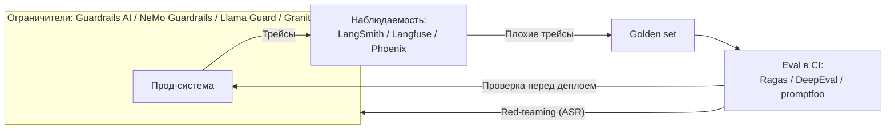

# Чем мерить, чем смотреть, чем защищать

Сквозные уроки Части I заканчивались одной и той же оговоркой в скобках: готовые инструменты — [LangSmith](https://www.langchain.com/langsmith),
[Guardrails AI](https://www.guardrailsai.com) и прочие — отдельный слой, о нём позже, а здесь мы про принцип. Так закрывались уроки про
[наблюдаемость](../part-1-rag/cross-cutting/observability/index.md) и
[guardrails](../part-1-rag/cross-cutting/guardrails/index.md), а урок про
[оценку](../part-1-rag/cross-cutting/evaluation/index.md) отложил разбор устройства метрик на второй проход.
«Позже» наступило. Часть I дала тебе понятия — golden set (эталонный набор примеров), трейс (trace), долю
успешных атак (attack success rate, ASR); этот урок раскладывает по ним рынок готовых инструментов 2026 года и
отвечает на приземлённый вопрос: что именно ставить и когда.

Каждый из трёх сквозных аспектов оброс собственной категорией продуктов: eval-библиотеки, платформы
наблюдаемости, guardrails-фреймворки. Держи при этом в голове разницу сроков годности. Понятия
долговечны, продукты — срез момента: часть имён из этого урока через пару лет устареет, а вопросы, по
которым их выбирать, останутся прежними — какое понятие Части I продукт реализует и в какое место твоего
цикла он встаёт.

Границы категорий при этом проходят прямо внутри продуктов. Платформы наблюдаемости — LangSmith, [Langfuse](https://langfuse.com),
[Phoenix](https://arize.com/phoenix) — несут с собой и eval-функции: датасеты, судей. Причина не в аппетитах поставщиков, а в устройстве самой
работы: цикл «прод-трейс → eval-кейс», та самая обратная связь из урока про наблюдаемость, — это один
непрерывный рабочий процесс, и продукты закрыли оба его конца, потому что команде нужен весь цикл,
а не половина.

## Eval-инструменты: Ragas, DeepEval, promptfoo

[Ragas](https://ragas.io) — открытая библиотека метрик, заточенных под RAG: faithfulness (верность контексту), response
relevancy, context precision, context recall. Считает она их в основном через LLM-as-a-judge: балл выставляет
модель-судья. Словарь узнаваем: context precision и context recall меряют выдачу, faithfulness и
response relevancy — генерацию, то есть библиотека напрямую воспроизводит разделение retrieval- и
generation-метрик из урока про оценку. Одна поправка на возраст словаря: response relevancy раньше
называлась answer relevancy — это ровно та «релевантность ответа», которую ты знаешь по Части I; метрика
та же, имя сменилось.

[DeepEval](https://deepeval.com) — тоже открытый, но с другим характером: это pytest для eval. Кейс оформляется как юнит-тест —
`assert_test`, порог по метрике — и падает точно так же, как падает обычный тест. Поэтому прогон eval в
CI выглядит как ещё один тестовый прогон, без отдельной обвязки.

Третий инструмент, [promptfoo](https://www.promptfoo.dev), — открытый и конфигурируемый: сравнения описываются YAML-файлом. Его стихия —
сравнительные матрицы: несколько промптов, несколько моделей, один прогон — и таблица, где видно, кто где
выигрывает. Вторая его сильная сторона — возможности red-teaming (наступательное тестирование защиты: ты
атакуешь собственную систему) — к ним мы вернёмся в разделе про ограничители. В CI он встраивается так же легко.

Чего eval-инструменты за тебя не сделают — так это golden set. Все три считают метрики по примерам, которые
принёс ты; качество датасета остаётся твоей работой, и правило «чистота важнее объёма» из урока про
оценку никуда не делось. Ragas умеет синтезировать примеры-кандидаты по корпусу (testset generation) —
это ускоряет старт, но последним фильтром качества остаётся вычитка человеком.

## Инструменты наблюдаемости: LangSmith, Langfuse, Phoenix

[LangSmith](https://www.langchain.com/langsmith) — платформа трейсинга и eval из экосистемы [LangChain](https://www.langchain.com). Живёт как SaaS; вариант с развёртыванием
у себя адресован корпоративным клиентам. Если твой стек уже стоит на LangChain или [LangGraph](https://www.langchain.com/langgraph), теснее
интеграции не найти: трейсы из фреймворка штатно текут прямо в LangSmith.

[Langfuse](https://langfuse.com) — открытый код (ядро под MIT; часть корпоративных функций закрыта отдельной лицензией) и
развёртывание у себя через Docker или Kubernetes. Отсюда его роль — выбор по умолчанию там, где данные не
имеют права покидать периметр, — знакомый мотив корпоративной среды. Внутри — трейсинг, управление
промптами (prompt management), датасеты с eval, дашборды стоимости.

[Arize Phoenix](https://arize.com/phoenix) — трейсинг и eval, тоже разворачивается у себя; по формулировке собственной документации,
он построен поверх [OpenTelemetry](https://opentelemetry.io), а инструментирование (instrumentation) обеспечивает [OpenInference](https://github.com/Arize-ai/openinference).
Тонкость в лицензии: Phoenix распространяется под ELv2 — код свободно доступен и живёт на твоих
серверах, но в строгом смысле это source-available, а не open source, так что в один ряд с MIT-ядром
Langfuse его ставить некорректно.

Упоминание OpenTelemetry — сокращённо OTel — здесь важнее, чем кажется. OTel постепенно становится
вендор-нейтральным фундаментом всей категории: в нём стандартизуются GenAI-конвенции — единые имена спанов
и атрибутов для LLM-вызовов: модель, токены, вызовы инструментов. Выгода прямая: инструментирование
пишешь один раз, а экспортёр направляешь в любую платформу — код сбора трейсов переживает любого
конкретного поставщика. Честности ради: на середину 2026-го статус конвенций — Development, то есть
экспериментальный; сами они переехали в отдельный репозиторий `open-telemetry/semantic-conventions-genai`,
где рядом стандартизуют и конвенции для [MCP](../part-2-agents/mcp/index.md) — Часть II передаёт привет.

Положи функции этих платформ рядом — и увидишь, что все они реализуют один и тот же примитив Части I.
Трейс, собранный из спанов (span): запрос → чанки + score → промпт → вывод модели → шаги агента. Стоимость
и латентность, посчитанные по каждому спану. Обратная связь от пользователей, привязанная к конкретному
трейсу. И кнопка «превратить этот плохой трейс в eval-кейс» — тот самый цикл «прод-трейс → eval-кейс» из урока про
наблюдаемость, ставший функцией продукта.

:::tip[▶ Видео]

<YouTube id="446x7GqXdaA" title="AI Agents Best Practices: Monitoring, Governance, & Optimization — IBM Technology" />

Как мониторинг, управление и оптимизация выглядят для агентной системы в проде — категории готовых
инструментов этого урока в действии.

:::

## Ограничители: фреймворки, классификаторы, сервисы платформ

Готовые ограничители (guardrails) бывают двух видов. Первый — **фреймворки**, оборачивающие вход и выход твоей
системы программируемыми проверками. Guardrails AI — библиотека валидаторов на Python с каталогом
Guardrails Hub; среди прочего валидирует структурированный вывод. NVIDIA [NeMo Guardrails](https://developer.nvidia.com/nemo-guardrails) мыслит
диалогами: сценарные правила — сам продукт зовёт их «rails» — описываются конфигурацией на языке Colang.
Второй вид — **модели-классификаторы безопасности** (safety classifier): [Llama Guard](https://www.llama.com/llama-protections/) от Meta и Granite
Guardian от IBM — компактные специализированные модели, которые ставишь на вход и выход, и они
выставляют тексту балл риска по категориям. Разделение труда простое: фреймворки оркеструют проверки,
классификаторы судят текст. И одно с другим сочетается: проверка внутри фреймворка может звать
классификатор безопасности как один из своих шагов.

Всё то же самое можно вообще не разворачивать самому: облачные платформы продают эти проверки как
управляемые сервисы — Bedrock Guardrails, Azure AI Content Safety, фильтры безопасности Vertex и Model Armor из
[урока про облачные платформы](./cloud-platforms/index.md). Развилка знакома по всей Части III: платформенный
сервис — меньше контроля, ноль обслуживания и привязка к поставщику; открытый стек — полный контроль, но
эксплуатация на тебе.

И качество самих ограничителей тоже меряется — той самой долей успешных атак из урока про
guardrails. Наступательная часть уже встроена в eval-продукты: red-teaming есть в promptfoo, свои
red-team-функции предлагают и платформы. Так замыкается ещё один круг: ограничители настраивают,
атакуют, меряют ASR и докручивают.

## В каком порядке внедрять

Отраслевого стандарта на этот счёт нет, поэтому дальше — разумный порядок по умолчанию для типичной
продуктовой команды; относись к нему как к авторскому суждению, которое можно и пересмотреть под свою
ситуацию.

Первым — **трейсинг**. Он дешевле всего добавляется и нужен раньше всего: без него ты в принципе не
видишь провалов, а отлаживать невидимое нельзя. Предварительных условий у него нет — инструментирование
ставится на систему любой зрелости.

Вторым — **eval в CI**, как только начинаешь всерьёз дорабатывать пайплайн. Регрессии («улучшил X — тихо
сломал Y») ловятся только прогоном на эталоне; это та самая разработка через eval (eval-driven development) из Части I. Идёт
он позже трейсинга по прозаической причине: eval требует golden set, а golden set требует труда.

Третьим — **ограничители**, перед выходом на живых пользователей. Им нужна модель угроз, а она обычно
вырастает из реального использования: пока трафика нет, ты защищаешься от гипотез. Два исключения
сдвигают их в самое начало: регулируемая отрасль — и вход, который враждебен с первого дня.

Вся связка целиком — с точками, куда встают продукты этого урока:

Это схема связки из урока про наблюдаемость — «eval мерит, guardrails защищают, observability видит и
возвращает найденное в eval», — только теперь у каждого узла есть имена продуктов. Как эта связка живёт
после релиза — тема [урока про LLMOps](./llmops.md).

Последнее предостережение — самое важное. Поставить eval-инструмент ещё не значит иметь eval: продукт с
крошечным или шумным датасетом рисует уверенные дашборды поверх мусора. «Без эталона весь eval рушится»
звучало ещё в Части I — на уровне готовых инструментов эта фраза верна дословно. Они усиливают
дисциплину, но не заменяют её.

## Что забрать из урока

- Понятия Части I долговечны, продукты — срез 2026 года. Выбирай, ответив на два вопроса: какое понятие
  продукт реализует и куда в твоём цикле встаёт.
- Большая тройка платформ наблюдаемости — LangSmith, Langfuse, Phoenix — обзавелась и eval-функциями,
  потому что «прод-трейс → eval-кейс» — один рабочий процесс.
- Метрики Ragas — словарь Части I: context precision/recall про выдачу, faithfulness и response
  relevancy (бывшая answer relevancy, наша «релевантность ответа») про генерацию.
- Golden set остаётся твоей работой: eval-инструменты считают метрики по твоим примерам, синтезированные
  кандидаты вычитывает человек.
- OpenTelemetry с GenAI-конвенциями — вендор-нейтральная основа: инструментирование один раз, экспорт
  куда угодно; статус пока экспериментальный.
- Ограничители: фреймворки (Guardrails AI, NeMo Guardrails) оркеструют, классификаторы безопасности
  (Llama Guard, [Granite Guardian](https://github.com/ibm-granite/granite-guardian)) судят, платформенные сервисы снимают эксплуатацию с тебя — и всё это
  сочетается между собой; качество меряй долей успешных атак.
- Порядок по умолчанию: трейсинг → eval в CI → ограничители (раньше, если отрасль регулируемая или вход
  враждебный с первого дня).

**Новые термины** → [Глоссарий](../glossary.md): instrumentation, OpenTelemetry GenAI conventions, safety classifier, red-teaming.

---

:::note[Дальше — углубление слоя]

🚧 Второй проход: устройство метрик Ragas изнутри (обещанное ещё в пометке об углублении урока про оценку),
GenAI-конвенции OpenTelemetry на практике, развёртывание Langfuse у себя, собственные валидаторы для
Guardrails AI, плейбуки red-teaming, eval агентных траекторий (trajectory scoring).

:::
