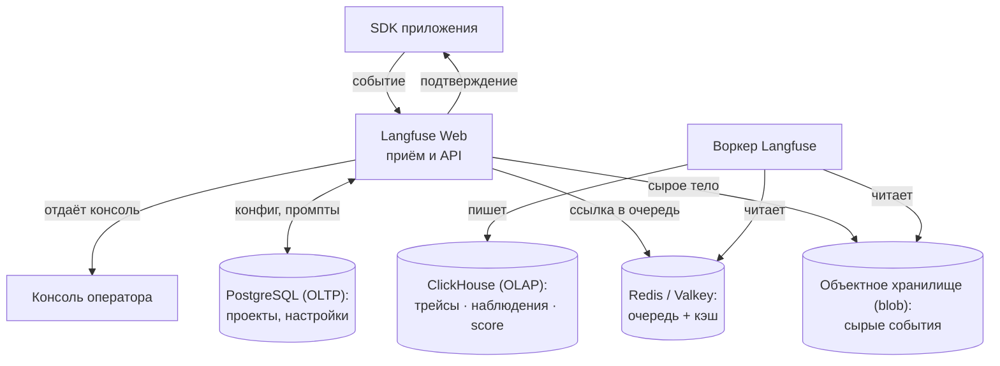
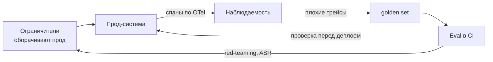

# Как поднять это у себя, написать свою проверку и связать всё в один стек

Это второй, углублённый проход урока про инструменты. [Часть 1](./index.md) разложила понятия Части I по
рынку продуктов 2026 года и ответила на приземлённый вопрос: что ставить и в каком порядке — трейсинг,
потом eval в CI, потом ограничители. Часть 2 берёт тот же набор продуктов и опускается на уровень
эксплуатации: не что выбрать, а как поднять это своими руками и связать между собой.

Ровно поэтому здесь нет теории. Как устроены метрики Ragas, откуда берутся конвенции OpenTelemetry, как
работают spotlighting и защита от инъекций, как оценивают траекторию агента — всё это уже разобрано в
углублениях, которые за эти темы отвечают, и дано ссылкой, а не пересказано. Здесь — топология
развёртывания, устройство собственного валидатора и связка стека воедино. Конкретные имена и версии —
снимок на середину 2026-го: продукты движутся, категории остаются.

## Где живёт теория

Разделение простое и намеренное: теория долговечна, её проходят один раз, а связка меняется от стека к стеку
— и вот её эта страница и разбирает. Поэтому за устройством того, что реализует каждый инструмент, иди туда,
где оно преподаётся:

- Метрики Ragas как LLM-конвейеры (faithfulness, context precision, context recall) — в
  [углублении про оценку](../../part-1-rag/cross-cutting/evaluation/deep-dive.md).
- GenAI-конвенции OpenTelemetry — имена спанов и атрибутов, сэмплирование — в
  [углублении про наблюдаемость](../../part-1-rag/cross-cutting/observability/deep-dive.md); здесь только
  практическая связка (инструментируешь стек, ставишь коллекторы и экспортёры), сами конвенции не
  переизлагаются.
- Наступательное тестирование защиты (red-teaming) и инъекции — spotlighting, каталог атак, конвейер
  обнаружения PII — в [углублении про ограничители](../../part-1-rag/cross-cutting/guardrails/deep-dive.md);
  здесь — только эксплуатационный распорядок (с какой частотой и чем гонять).
- Оценка на уровне траектории агента — в углублениях про
  [планирование и циклы](../../part-2-agents/planning-loops/deep-dive.md) и
  [мультиагентные системы](../../part-2-agents/multi-agent/deep-dive.md).

## Развернуть Langfuse у себя

Зачем вообще разворачивать у себя, а не брать SaaS. Причина из Части 1 одна: данные не имеют права покидать
периметр — регулируемая отрасль, корпоративная тайна. Ядро Langfuse под лицензией MIT и разворачивается у
себя — ради этого его и выбирают вместо инструмента, который живёт только как облачный сервис. Когда
данные периметр покидать всё-таки могут, управляемый Langfuse Cloud или LangSmith избавят от лишней работы.
То есть развёртывание у себя — не путь по умолчанию, а цена, которую ты платишь за контроль и резидентность.
Та самая развилка «строить или брать» из Части 1, теперь на уровне трейс-платформы.

Дальше важное: с версии 3 (стабильна с 9 декабря 2024-го) Langfuse — не один контейнер. Это распределённая
система из нескольких частей, у каждой своя роль.

- **Langfuse Web** — сервер на Next.js: отдаёт консоль и держит API приёма событий.
- **Воркер Langfuse** — асинхронный обработчик, который разбирает очередь событий (и фоновые задачи вроде
  писем).
- **PostgreSQL** — транзакционная СУБД (OLTP): пользователи, проекты, настройки,
  промпты.
- **ClickHouse** — аналитическая СУБД (OLAP): в ней лежат трейсы, наблюдения
  (observations) и score (баллы). Главная перемена третьей версии в том и состоит, что эти три таблицы
  переехали с Postgres на ClickHouse: на миллионах строк Postgres становился узким местом и на приёме, и на
  запросах.
- **Redis / Valkey** — очередь и кэш: та самая очередь приёма, а заодно кэш API-ключей и промптов.
- **Объектное хранилище (blob)** на S3 — хранит все входящие сырые события, мультимодальные входы и крупные
  выгрузки.

Столько частей не от усложнения ради усложнения — так устроен асинхронный приём событий (через очередь), и
это ключ ко всему остальному. Событие от SDK подтверждается сразу: сырое тело события пишется в объектное хранилище,
ссылка на него кладётся в очередь Redis — и клиент свободен. Позже воркер забирает событие из хранилища и
записывает в ClickHouse. Эндпоинт `/api/public/ingestion` асинхронный: бэкенд ставит событие в очередь и
обрабатывает его в стороне от запроса, поэтому всплеск трафика не блокирует клиентов и не заваливает базу.
Отсюда прямой вывод: в один процесс на масштабе это не собрать — очередь, объектное хранилище и аналитическая
база существуют ровно затем, чтобы гасить всплески.



Как это разворачивают — лестница по масштабу. Docker Compose годится для разработки и проверки на одной
машине, но не для прода. Продовый путь — Kubernetes через Helm-чарт; рядом Terraform-модули под
AWS, Azure и GCP и вариант на Railway. На проде держи хотя бы два экземпляра Langfuse Web ради отказоустойчивости,
включай автомасштабирование, когда загрузка процессора переваливает за 50%, и клади на каждый контейнер минимум
около двух ядер и 4 ГБ памяти. Один подвох стоит особняком: все компоненты обязаны работать в UTC —
контейнер с другим часовым поясом возвращает неверные или пустые ответы на запросы. И общий счёт за
самостоятельность: теперь на тебе разом Postgres, ClickHouse, Redis и объектное хранилище. Эта эксплуатационная
нагрузка и есть настоящая цена периметра — потому «просто разверни у себя» и остаётся решением, а не
выбором по умолчанию.

Наконец, честная оговорка о сроке годности. Точный список компонентов — снимок на середину 2026-го: Langfuse
продолжает меняться (в 2026-м заявлено направление «упростить под масштаб», и проект влился в ClickHouse), так
что конкретную топологию считай текущей, но подвижной. Долговечна не она, а форма: сервер без состояния плюс
воркер, транзакционная база под настройки, аналитическая под данные телеметрии, очередь и объектное хранилище
под всплески — так выглядит любая самостоятельно поднятая трейс-платформа.

## Написать собственный валидатор для Guardrails AI

Часть 1 разделила труд так: фреймворки оркеструют проверки, классификаторы безопасности судят текст, а на
Guardrails Hub лежат готовые валидаторы. Загвоздка в том, что твоё правило — конкретная запрещённая формулировка,
бизнес-ограничение, внутренняя схема вывода — на Hub обычно не лежит. Валидатор и есть та единица проверки, которую
ты пишешь сам. Порядок здоровый: сперва ищешь готовый на Hub, свой заводишь только под доменную проверку,
которой там нет.

Готовый ставится одной командой — `guardrails hub install hub://guardrails/<имя>` (скажем,
`hub://guardrails/competitor_check`), дальше импортируешь его из `guardrails.hub`. Свой устроен несложно, и
API у него фиксированный: декоратор `@register_validator` регистрирует проверку, класс наследуется от
`Validator`, а метод `validate` возвращает результат — `PassResult()`, если проверка пройдена, или `FailResult(...)`, если нет. Поле `fix_value` в отказе необязательно: это программная поправка, которую применит действие `fix`.

```python
from typing import Any, Dict
from guardrails import Guard, OnFailAction
from guardrails.validators import (
    Validator, register_validator, PassResult, FailResult, ValidationResult,
)

@register_validator(name="my-org/no_internal_codenames", data_type="string")
class NoInternalCodenames(Validator):
    def validate(self, value: Any, metadata: Dict = {}) -> ValidationResult:
        leaked = [w for w in BANNED_CODENAMES if w in value]  # доменное правило
        if leaked:
            return FailResult(
                error_message=f"В ответе внутренние имена: {leaked}",
                fix_value=redact(value, leaked),  # необязательная поправка
            )
        return PassResult()

guard = Guard().use(NoInternalCodenames, on_fail=OnFailAction.EXCEPTION)
guard.validate(model_output)
```

Самое интересное начинается на последней строке — когда валидатор цепляешь к `Guard` и выбираешь, что делать
при срабатывании. Через `on_fail` и **OnFailAction** один и тот же валидатор ведёт себя совершенно по-разному, и
каждый вариант — своя продовая позиция:

- `exception` — бросить исключение: жёсткая блокировка, срабатывание «в закрытую».
- `reask` — перезапросить модель, чтобы она попробовала снова (лишний вызов, лишние деньги).
- `fix` — починить программно, применив `fix_value`.
- `filter` — отфильтровать нарушающую часть, остальное пропустить.
- `refrain` — вернуть безопасный ответ вместо исходного.
- `noop` — ничего не делать, только записать: наблюдать, не вмешиваясь.

Отсюда — рабочий приём. Начинай с `noop` и меряй на живом трафике, как часто валидатор срабатывает ложно;
убедившись, что ложных срабатываний мало, поднимай до `exception` или `fix`. Сработать «в закрытую» или «в
открытую» — это поворот ручки политики, а не новый код: сам валидатор ты не трогаешь.

Валидатор к тому же неплохо комбинируется. Внутри своей проверки он может позвать классификатор безопасности
— Llama Guard или Granite Guardian — и на его вердикте построить решение: фреймворк оркеструет, классификатор
судит, ровно как в Части 1. А поскольку Guardrails AI проверяет и структурированный вывод (тот самый из урока
про использование инструментов), валидатор способен разбирать JSON-схему поле за полем, а не только вольный
текст.

Когда своего писать не надо — и чем он обходится. Не переписывай то, что уже есть на Hub. Помни, что каждый
валидатор — налог на латентность и деньги на пути запроса, особенно `reask` и любая проверка через
модель-судью: закладывай этот расход заранее. Валидатор с высокой долей ложных срабатываний, поставленный на
`exception`, начнёт блокировать честных пользователей — потому и `noop` сперва. И тестируй валидаторы как код,
потому что это и есть код: здесь eval в CI из Части 1 встречается с ограничителями.

## Стек как связка: открытое против управляемого

Все три категории из Части 1 — оценка, наблюдаемость, ограничители — существуют в двух полосах: открытый код,
который разворачиваешь у себя, и управляемый сервис.

| Категория | Открытый код, у себя | Управляемый / SaaS |
|---|---|---|
| Оценка (eval) | Ragas, DeepEval, promptfoo — гоняются в CI | eval-функции платформ (датасеты и судьи LangSmith / Langfuse / Phoenix; облачные сервисы оценки) |
| Наблюдаемость | Langfuse (MIT, у себя), Phoenix (ELv2 — source-available, у себя) | LangSmith (в первую очередь SaaS), управляемый Langfuse Cloud |
| Ограничители | Guardrails AI, NeMo Guardrails, Llama Guard, Granite Guardian (открытые, у себя) | Bedrock Guardrails, Azure AI Content Safety, Vertex Model Armor (управляемые) |

Звёздочка на Phoenix — та же, что в Части 1: ELv2 это source-available (код открыт для чтения, но лицензия не
open source), в один ряд с MIT-ядром Langfuse его не ставят.

Границы между категориями при этом размыты, и это уже не наблюдение, а факт связки: платформы наблюдаемости
несут eval-функции потому, что прод-трейс и есть сырьё для golden set (эталонного набора примеров). В живом
стеке одна платформа — скажем, Langfuse — часто закрывает и трейсинг, и датасеты с оценкой, а отдельную
eval-библиотеку (Ragas, DeepEval) добавляют только ради метрик, которых ей не хватает. Не бери четыре
инструмента там, где два перекрываются.

Связывает всё это OpenTelemetry — и вот это уже чистая практика развёртывания, а не теория (сами конвенции —
в [углублении про наблюдаемость](../../part-1-rag/cross-cutting/observability/deep-dive.md), их здесь не
переизлагаем). Идея одна: инструментируешь один раз под OpenTelemetry, а экспортёр направляешь куда угодно.
Конкретно это выглядит так: библиотека автоинструментирования (OpenInference для Phoenix, OpenLLMetry или
GenAI-инструментирования OTel) порождает спаны, они идут в **OpenTelemetry Collector** (или напрямую по OTLP),
а оттуда экспортёр отправляет их в твой бэкенд — Langfuse принимает OTLP, Phoenix и вовсе построен на
OTel и OpenInference. Сменить бэкенд — это правка конфигурации экспортёра, а не кода. Подвох ровно один:
не инструментируй дважды. Держать одновременно родной трейсинг SDK и OTel — значит получить задвоенные спаны и
задвоенный счёт; выбери один путь отправки. (Статус GenAI-конвенций на середину 2026-го — Development,
экспериментальный; подробности — по ссылке выше.)

Соберём связку целиком — но смотреть тут надо на швы. Ограничители оборачивают прод-систему; трейсы текут в
наблюдаемость; плохие трейсы уходят в golden set; eval в CI проверяет сборку перед деплоем; red-teaming
меряет долю успешных атак (ASR) по ограничителям. Тот же круг, что рисовала Часть 1, — но здесь важен не сам
круг, а стыки: переход «трейс → eval-кейс» и есть та интеграция, что делает из отдельных инструментов одну
систему, а OTel служит соединительной тканью между ними.



Про сам red-teaming здесь — только распорядок; теория живёт в
[углублении про ограничители](../../part-1-rag/cross-cutting/guardrails/deep-dive.md). На уровне эксплуатации
это выглядит так: ставишь прогоны наступательного тестирования как гейты в CI или перед релизом (red-team в
promptfoo, red-team-функции платформ, PyRIT из того же углубления) и следишь за долей успешных атак во времени
как за метрикой регрессии. Частота и связка — здесь; устройство инъекций остаётся там.

## Что забрать из урока

- Эта страница про эксплуатацию, не про теорию: устройство метрик, конвенции OTel, защита от инъекций и оценка
  траекторий даны ссылками на углубления, которые ими владеют, а не пересказаны.
- Langfuse у себя (версия 3, с декабря 2024-го) — распределённая система, а не контейнер: Web плюс воркер плюс
  Postgres (транзакционная база) плюс ClickHouse (аналитическая: трейсы, наблюдения, score) плюс Redis/Valkey
  (очередь и кэш) плюс объектное хранилище (сырые события). Асинхронный приём через очередь гасит всплески; а
  на руках у тебя теперь четыре хранилища данных — это и есть цена периметра.
- Путь развёртывания растёт по масштабу: Docker Compose для разработки → Kubernetes через Helm или Terraform
  для прода (не меньше двух Web, автомасштабирование при загрузке процессора выше 50%, всё в UTC).
- Собственный валидатор — единица нестандартного ограничителя: `@register_validator` плюс наследник
  `Validator`, чей `validate()` возвращает `PassResult` или `FailResult`; цепляешь через `Guard().use(...)`.
  Сначала загляни на Hub.
- `on_fail` — это ручка политики, а не новый код: `noop` для замера ложных срабатываний на живом трафике,
  затем повышение до `exception`/`fix`/`filter`/`refrain`. Валидатор — налог на латентность и деньги; тестируй
  его как код.
- У каждой категории есть открытая полоса и управляемая; категории размыты (наблюдаемость несёт eval), поэтому
  два перекрывающихся инструмента лучше четырёх. Связывает всё OTel — инструментируй один раз, меняй бэкенд
  конфигом экспортёра, не инструментируй дважды.

**Новые термины** → [Глоссарий](../../glossary.md): instrumentation, OpenTelemetry GenAI conventions, safety
classifier, red-teaming, observability (наблюдаемость), guardrails.
