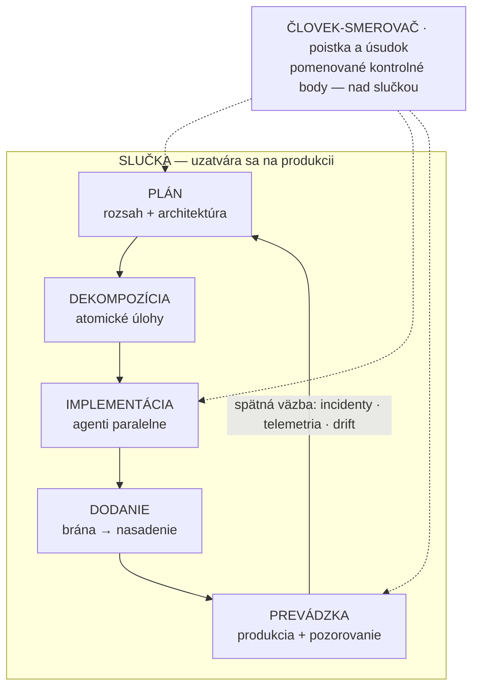

# Ako čítať tento kurz: generovať je lacné, overovať je úzke miesto

Stavať softvér s flotilou kódovacích agentov nie je problém promptovania. Je to problém overovania. Vygenerovať kód je dnes lacné a rýchle. Overiť, že robí to, čo má, lacné nie je. Práve táto nerovnováha — **úzke miesto overovania (verification bottleneck)** — rozhoduje o všetkom ostatnom. Každý mechanizmus, ktorý tu učíme, slúži jednému cieľu: aby overovanie stíhalo tempo generovania.

Druhá téza je rovnako nosná. Slučka učenia sa musí uzatvárať na **produkcii**, nie na internom testovaní. Zlú zmenu má odhaliť a vrátiť späť sám systém, nie používateľ, ktorý sa sťažuje.

## Jedna mapa celého kurzu

Celý kurz drží pohromade jediný obrázok. Vráti sa na začiatku každej Časti, vždy so zvýraznením toho úseku, ktorý práve otvára — „tu sa nachádzaš“.

Horný rad je chrbtica práce: **PLÁN → DEKOMPOZÍCIA → IMPLEMENTÁCIA → DODANIE → PREVÁDZKA**. Nad ním stojí človek. V komunite sa jeho rola volá **human-in-the-loop** (schválenie človekom / človek v rozhodovacom procese). Keďže nie je krokom v slučke, ale rozhoduje nad ňou v pomenovaných kontrolných bodoch, voláme ho v tomto kurze **človek-smerovač**: poistka a úsudok, nie ďalšia zastávka na páse.

Rozhodujúca je spätná hrana z PREVÁDZKY do PLÁNU. Práve ona robí z obrázka slučku, a nie pás. Väčšina publikovaných schém kreslí pás, ktorý končí pri „produkcii“ a nikdy sa nevracia — vrátane praktického korpusu, z ktorého tento kurz čerpá. To je najväčšia štrukturálna medzera v tom, čo sa dnes o téme píše. Túto opravu podáva sám kurz ako svoj rámec: `ASSERTED` (tvrdené) — na rozdiel od `MEASURED` (namerané) a `REPORTED` (hlásené), ktoré naplno zavádza Lekcia 2. Ide o *tvrdenie* podložené výskumom, nie o meranie.

Že hodnota je práve v tej spätnej hrane, naznačuje jeden údaj. `MEASURED`: správa DORA 2025 hlási záporný vzťah medzi nasadzovaním AI a stabilitou dodávky softvéru — zrýchlenie odhalí slabiny ďalej v procese. Čítaj to opatrne. Je to prieskum, kde údaje uvádzajú sami respondenti (približne 5 000 respondentov), nie telemetria — teda vnímaná stabilita, nie meraná.

:::note[Čo mapa zámerne nekreslí ako políčka]

Tri veci sú v obrázku prítomné, no naschvál nie sú políčkom — aby si ich čítal ako niť, nie ako etapu:

- **Overovanie** je votkané do každého švu slučky (revízia · kritik · vynútené brány), nie samostatný krok. Keby bolo políčkom, protirečilo by celej téze.
- **Základ** (Časť I) leží pod celou slučkou: pamäť projektu · pravidlá ako kód · artefakty ako jediné rozhranie. Toto musí platiť skôr, než agent napíše prvý riadok.
- **Tri úrovne zrelosti** (three maturity tiers): každý prvok čítaj na troch úrovniach — soloista · malý tím · enterprise.

:::

*Mapa je zároveň obsah kurzu.* Horný rad (PLÁN → PREVÁDZKA) sú **Časti II–IV** — samotné konanie. Základom celej slučky je **Časť I**, ktorú práve čítaš: čo musí byť pravda skôr, než sa čokoľvek vygeneruje. Tri úrovne zrelosti sú **Časť V**.

:::tip[▶ Video]

<YouTube id="4wMRXmLpdA8" title="AI in the SDLC: Rethinking AI Coding Tools & AI Agents — IBM Technology" />

IBM v tom istom duchu prehodnocuje, čím AI nástroje a agenti v životnom cykle vývoja naozaj sú — dobrý rámec skôr, než sa pustíš do lekcií. (Video je v angličtine.)

:::

## Čestný titulok a čestná metóda

Výstupu je merateľne viac. Či je viac aj **hodnoty**, doložené nie je — a znamienko toho rozdielu určuje práve kapacita revízie a overovania. Toto je čestný titulok celého kurzu: nie „AI zrýchľuje tímy“ ani „AI ich spomaľuje“, ale „výstupu pribudlo, o hodnote nevieme“. Sami tvorcovia najsilnejšieho čísla v prospech AI (Microsoft) hovoria jasne: zlúčený pull request nie je to isté ako hodnota, ktorú prináša, a dohodnuté miery na ten rozdiel odboru stále chýbajú.

Odtiaľ pramení poctivý postoj, ktorý je hlavným rozdielom tohto kurzu oproti bežnému písaniu o téme:

- Každé tvrdenie nesie stupeň dôkazu — `MEASURED`, `REPORTED` alebo `ASSERTED`. Stupeň uvádzame priamo v próze a nikdy ho nepovyšujeme. (Naplno ho zavádza Lekcia 2.)
- Každé číslo vedie k pôvodnému zdroju s dátumom. Pri číslach od dodávateľa platí jednoduché pravidlo: kto nástroj predáva, ten ho nevie nezaujato zmerať — platí to pre Microsoft, Google aj Meta rovnako.
- Sekundárna vrstva skresľuje na obe strany — nadšenci nafukujú, skeptici sa držia zastaraného čísla. Liek je ten istý: choď k pôvodným zdrojom, ohodnoť, čo nájdeš, a povedz to nahlas. Práve tento postoj je obsahom kurzu.

Napokon tri úrovne zrelosti. Každá lekcia je označená pre soloistu, malý tím a enterprise, a rámec znie: *prax je stála, mechanizmus sa škáluje.* Najprv pomenujeme nemennú zásadu, potom mechanizmus pre každú úroveň a nakoniec konkrétne zlyhanie, ktorému ten mechanizmus zabráni — nikdy nie „enterprise má viac peňazí“. A naprieč celým kurzom nesieme jedno spresnenie: čím ďalej je kontrola od miesta škody (blast radius), tým viac je o dôkaze; čím bližšie, tým viac je o schopnosti chybu zachytiť.

## Päť lekcií Časti I

Časť I je základ — čo musí platiť, skôr než agent napíše prvý riadok. Má päť lekcií:

1. **[Overovanie je úzke miesto](./part-1-foundation/verification-bottleneck.md)** — téza celého kurzu, doložená dôkazmi.
2. **Ako čítať dôkazy odboru** — rebrík dôkazov a to, ako sekundárna vrstva skresľuje na obe strany.
3. **Príprava je dôležitejšia než model** — kde rozhoduje nastavenie, nie voľba modelu.
4. **Pamäť projektu a vrstvenie** — trvalá znalosť, ktorú agent prečíta pri každom behu.
5. **Pravidlá, ktoré držia** — pokyn nie je kontrola; vynucujú ju brány, nie vety.

Téza celého kurzu sa dokazuje hneď v Lekcii 1. Poctivý postoj sa uvádza do praxe v Lekcii 2. Základ tvoria Lekcie 3–5. Spätnú hranu „slučka sa uzatvára na produkcii“ rozoberajú až Časti IV a V (Prevádzka a úrovne) — tu ju len značíme, neučíme.
