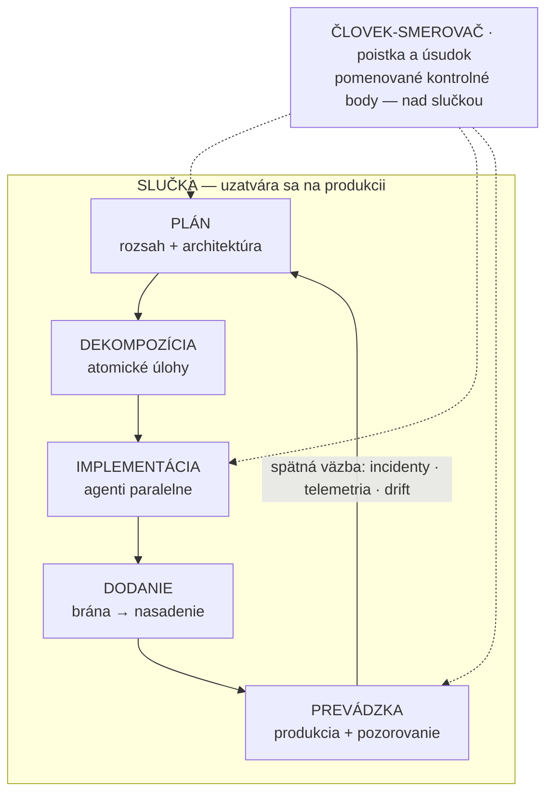

# Ako čítať tento kurz

Tvorba softvéru pomocou flotíl programovacích agentov nie je problém promptovania. Je to problém overovania. Generovanie zlacnelo, kontrola nie. Všetko, čo tento kurz učí, je vo svojej podstate mechanizmus, vďaka ktorému možno overovanie škálovať. A opísaná slučka učenia sa musí uzatvárať na **produkcii**, nie na internom QA. Ak si máš ešte pred začiatkom lekcií odniesť jedinú myšlienku, tak túto: o tom, či má všetka tá rýchlosť vôbec nejakú hodnotu, rozhoduje tvoja schopnosť skontrolovať výstup — nie schopnosť modelu ho vytvoriť.

:::tip[▶ Video]

<YouTube id="4wMRXmLpdA8" title="AI in the SDLC: Rethinking AI Coding Tools & AI Agents — IBM Technology" />

IBM opisuje ten istý posun: čo sa v životnom cykle vývoja softvéru zmení, keď sa z programovacích nástrojov stanú agenti, ktorí konajú, a nie iba automatické dopĺňanie, ktoré navrhuje. (Video je v angličtine.)

:::

## Mapa celého kurzu

Celú argumentáciu nesie jeden diagram. Čítaj ho ako slučku — jeho podstatou je hrana, ktorá vedie zo živej prevádzky späť k plánovaniu.

Pás navrchu znázorňuje úlohu človeka. Komunita pre ňu používa výraz **human-in-the-loop**, teda človek zapojený do rozhodovacej slučky. Tento kurz ju označuje ako **človek-smerovač**: niekto, kto stojí nad slučkou a na niekoľkých pomenovaných kontrolných bodoch uplatňuje poistky a vlastný úsudok, namiesto toho, aby v nej zastupoval ďalšiu fázu. Presne to vyjadrujú prerušované čiary — človek vstupuje do práce na vybraných rozhraniach, nie všade.

Diagram zámerne nezobrazuje tri veci ako samostatné bloky, pretože by tým navádzal na nesprávne pochopenie:

:::note[Čítaj v diagrame aj to, čo odmieta uzavrieť do bloku]

- **Overovanie** nie je samostatná fáza. Je votkané do každého rozhrania slučky — do revízie medzi ľuďmi, kritického posúdenia vygenerovanej práce aj vynútených brán, ktoré zmenu buď prepustia, alebo zastavia. Ak ho uzavrieš do bloku, vytvoríš predstavu, že overovanie stačí odbaviť ako jeden krok a ísť ďalej. Tak to nefunguje; overovanie prebieha medzi blokmi, nie v nich.
- **Základ** (Časť I, v ktorej sa práve nachádzaš) leží pod celou slučkou: pamäť projektu, pravidlá ako kód a artefakty ako jediné rozhranie medzi fázami. Toto všetko musí byť pripravené ešte predtým, ako ktorýkoľvek agent napíše prvý riadok.
- **Tri úrovne zrelosti** (soloista · malý tím · enterprise) sa vzťahujú na každý prvok — každý z nich čítaj na všetkých troch úrovniach zrelosti. Samotný postup zostáva rovnaký; rastie mechanizmus, ktorý zabezpečuje jeho dodržiavanie.

:::

*Mapa je obsahom kurzu.* Horný rad — plán, dekompozícia, implementácia, dodanie, prevádzka — predstavuje Časti II až IV, teda samotnú prácu. Rad základu predstavuje Časť I. Tri úrovne zrelosti sú Časť V. Ten istý diagram sa objaví na začiatku každej Časti so zvýrazneným príslušným výsekom, takže vždy budeš vedieť, kde sa nachádzaš.

## Úprimný titulok a úprimná metóda

Množstvo výstupov preukázateľne rastie. Či rastie aj *hodnota*, zatiaľ nie je potvrdené. A o tom, či bude výsledok kladný alebo záporný, rozhoduje kapacita na revíziu a overovanie. To nie je vyhýbavá formulácia; práve k tomu smerujú aj najsilnejšie čísla v prospech AI. Za jedným z najväčších nameraných nárastov priepustnosti v tejto oblasti stoja priamo výskumníci Microsoftu. Napriek tomu píšu, že zlúčený pull request nie je to isté ako hodnota, ktorú prináša — a že v odbore chýbajú všeobecne prijaté metriky na meranie tohto rozdielu.

Kurz sa preto zaväzuje k metóde, nie k záveru:

- Každé tvrdenie dostane stupeň — `MEASURED` (namerané: potvrdila ho kontrolovaná štúdia), `REPORTED` (hlásené: podľa praxe odborníkov platí) alebo `ASSERTED` (tvrdené: niekto ho obhajuje) — a stupeň je vždy uvedený priamo v texte a nikdy sa potichu nevynechá, aby tvrdenie mohlo pôsobiť ako fakt. (Celý systém hodnotenia je definovaný v 2. lekcii.)
- Každé číslo odkazuje na primárny zdroj s dátumom. Na čísla od dodávateľov sa vzťahuje jednoduché pravidlo: kto nástroj predáva, nemôže byť zároveň tým, kto ho meria.
- Sekundárna vrstva zdrojov skresľuje *oboma* smermi — nadšenci čísla nafukujú, skeptici lipnú na zastaranom údaji a odmietajú ho prehodnotiť. Náprava je v oboch prípadoch rovnaká: vrátiť sa k primárnym zdrojom, ohodnotiť zistenia a jasne to uviesť. Práve tomuto prístupu kurz učí.

Celým kurzom sa tiahne jeden rámec — **tri úrovne zrelosti**: postup zostáva rovnaký, mechanizmus sa škáluje. Pri každom kontrolnom opatrení lekcie najprv uvedú invariant, potom mechanizmus pre každú úroveň a napokon konkrétne zlyhanie, ktorému prechod na vyššiu úroveň zabráni — nikdy nie vysvetlenie typu „enterprise má viac peňazí“. V celom kurze sa opakovane objavuje aj spresnená podoba tejto myšlienky: čím ďalej je kontrolné opatrenie od miesta škody (blast radius), tým viac ide o *dôkaz*; čím je bližšie, tým viac ide o *schopnosť*.

## Prečo slučka, a nie postupnosť krokov

Väčšina publikovaných schém — vrátane materiálov od odborníkov z praxe, z ktorých tento kurz čerpá — zobrazuje postupnosť krokov, ktorá sa končí „produkciou“ a spätnú väzbu už neobsahuje. Práve toto poňatie kurz opravuje. Vnímaj to ako opravu, nie ako dôvod na chválu: najväčšou štrukturálnou medzerou v súčasných textoch je, že slučka učenia sa uzatvára na internom QA, a nie na živej prevádzke. Dobre nastavená slučka chybnú zmenu sama odhalí a vráti späť ešte predtým, ako sa musí ozvať používateľ.

Jeden výsledok merania naznačuje, že hodnota sa ukrýva práve v hrane spätnej väzby. Správa DORA z roku 2025 zistila negatívny vzťah medzi používaním AI a *stabilitou* dodávania — zrýchlenie môže odhaliť slabiny v nadväzujúcich častiach procesu. Tento výsledok však treba čítať pozorne: stupeň `MEASURED` má iba v slabom zmysle sebahodnotiaceho prieskumu s približne 5 000 respondentmi. Ide o vnímanie, nie o telemetriu, a výsledok neoprávňuje tvrdiť ani „AI zrýchľuje tímy“, ani „AI spomaľuje tímy“. Oprávňuje presne na jediný záver: uzatváracia hrana si zaslúži pozornosť, ktorú jej venujú Časti IV a V.

Na záver ešte úprimná poznámka k samotnému diagramu. Je to organizačný rámec so stupňom `ASSERTED` — vlastný spôsob kurzu, ako usporiadať materiál, nie preukázateľne optimálny životný cyklus. Používaj ho na orientáciu; necituj ho ako výsledok.

## Kam pokračovať

Časť I je základ — päť lekcií:

1. **[Úzke miesto overovania (verification bottleneck)](./part-1-foundation/verification-bottleneck.md)** — vyššie uvedená téza podložená dôkazmi.
2. **[Ako čítať dôkazy](./part-1-foundation/reading-the-evidence.md)** — stupnica hodnotenia a spôsoby, akými sekundárna vrstva skresľuje oboma smermi.
3. **[Príprava je dôležitejšia než model](./part-1-foundation/preparation-over-model.md)** — prečo je dôležitejšie, čo agentovi odovzdáš, než ktorému agentovi to odovzdáš.
4. **[Pamäť projektu a úrovne zrelosti](./part-1-foundation/project-memory-and-tiering.md)** — trvalý kontext, s ktorým flotila pracuje.
5. **[Pravidlá, ktoré platia](./part-1-foundation/rules-that-hold.md)** — premena konvencií na obmedzenia, ktorých dodržiavanie vynucuje stroj.

Začni 1. lekciou: dokazuje tvrdenie, na ktorom stojí zvyšok kurzu.
