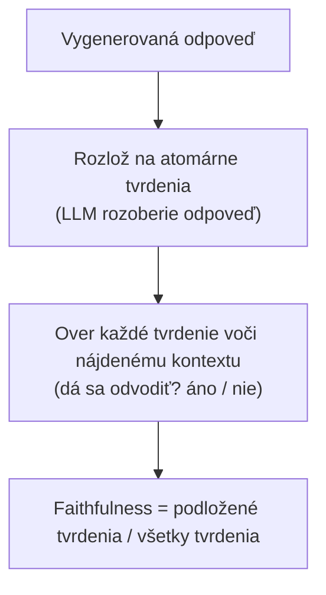

# Keď je metrika sama sudcom, ako ju kalibruješ a na akých ľudských značkách to celé stojí

[Časť 1](./index.md) postavila rámec: vyhľadávanie a generovanie hodnoť oddelene, postav si golden set, voľný text odpovedí skóruj cez LLM-sudcu, never jeho zaujatostiam a over ho voči ľuďom, a spusti to v oboch slučkách — offline v CI aj online v produkcii.

Táto stránka to všetko predpokladá a otvára mechaniku pod tým: čo pomenované metriky naozaj počítajú, ako kalibruješ sudcu, ktorému ti Časť 1 kázala neveriť, a ako vznikajú ľudské značky, na ktorých celá tá stavba stojí.

Najprv si vymedzme jednu hranicu. Táto stránka je o meraní, nie o oprave pipeline. Páky, ktoré metrikou pohnú — lepší chunking, reranking, grounding (opretie odpovede o kontext) — patria do vrstiev [Retrieval](../../retrieval/) a [Generation](../../generation/); tu je predmetom skúmania samotný merací prístroj.

A myšlienka, na ktorej celá stránka stojí a ktorú Časť 1 iba naznačila: väčšina moderných RAG metrík je vo vnútri sama LLM-sudcom. Metrika teda dedí sudcovu omylnosť — a práve preto sú kalibrácia a ľudské značky základom každého čísla tu.

## Otvárame čierne skrinky metrík

V Časti 1 boli názvy metrík čierne skrinky — „faithfulness“, „answer relevance“ a pár ďalších, menovky, ktorým si veril bez toho, aby si videl dovnútra. Na pokročilej úrovni potrebuješ vedieť, čo každá z nich počíta, lebo výpočet ti povie, čo dané číslo dokáže a čo nedokáže zachytiť. A každá z týchto metrík má zdokumentované slepé miesto, ktoré jej názov zakrýva.

Referenčná implementácia, o ktorej sa oplatí uvažovať, je **Ragas** — framework, ktorý zaviedol tento rozklad evaluácie RAG na pomenované, samostatne počítané metriky (Es a kol., „Ragas: Automated Evaluation of Retrieval Augmented Generation“, arXiv 2309.15217, september 2023). Že to pomenúvame, nie je formalita: tieto štyri metriky sú štandardný spôsob, akým odbor problém rozkrája — rozklad, na ktorom sa zhodol, nie súkromný recept jedného dodávateľa.

Pozeraj sa na tú štvoricu cez dve osi. **Os 1** (Časť 1 ju už načrtla): ktorú etapu metrika sleduje — context precision (presnosť kontextu) a context recall (úplnosť kontextu) hodnotia vyhľadávanie, faithfulness a answer relevance hodnotia generovanie. **Os 2** (Časť 1 ju nechala nevypovedanú, hoci v praxi rozhoduje): či metrika potrebuje referenciu — človekom napísanú správnu odpoveď — alebo si vystačí so samotnou otázkou, kontextom a odpoveďou.

| | reference-free (bez etalónu) | reference-based (s etalónom) |
|---|---|---|
| **Vyhľadávanie** | context precision (o relevantnosti rozhoduje LLM) | context recall |
| **Generovanie** | faithfulness, answer relevance | — |

Ten rozdiel poriadne zaváži. Faithfulness a answer relevance bežia na živej produkčnej prevádzke bez jedinej označkovanej odpovede; context recall bez referencie nevypočítaš vôbec. Práve táto os rozhoduje, čo kde vieš odmerať — a preto golden set dostáva na konci vlastnú sekciu.

### Faithfulness — grounding ako podiel podložených tvrdení

**Faithfulness** je práve to číslo, ktoré Časť 1 aj vrstva Generation stále sľubovali sformalizovať: opiera sa odpoveď o nájdený kontext, alebo sa model zatúlal späť do vlastnej pamäte? Ragas ho počíta v troch krokoch:

1. jeden LLM rozloží vygenerovanú odpoveď na **atomárne tvrdenia** — jednotlivé faktické výroky, ktoré odpoveď obsahuje;
2. druhý prechod LLM overí každé tvrdenie voči nájdenému kontextu jedinou otázkou áno/nie: dá sa toto tvrdenie odvodiť z toho, čo sme našli?;
3. z toho vezme podiel.

*faithfulness = supported claims / total claims*, na škále 0 až 1.

Ragas to ukazuje na príklade: na otázku „Kde a kedy sa narodil Einstein?“ môže odpoveď tvrdiť dve veci — miesto a dátum „14. marca 1879“. Ak kontext podporuje miesto, ale nie dátum, jedno z dvoch tvrdení je podložené a faithfulness je 1/2 = 0,5.



A tu je to slepé miesto: faithfulness meria opretie o kontext, nie správnosť. Tvrdenie verne opreté o nesprávny kontext dostane rovnú 1,0 — metrike stačí, že odpoveď vieš vystopovať k tomu, čo sa našlo, aj keď to, čo sa našlo, je nezmysel. A keďže metrika je sama LLM-pipeline (najprv rozlož, potom over), jej číslo nesie aj vlastné chyby sudcu: pokazený rozklad alebo nesprávne posúdené odvodenie posunie skóre, hoci samotná odpoveď je v poriadku.

Faithfulness teda zachytí halucináciu aj prebitie kontextu parametrickou pamäťou — zlyhanie, pred ktorým varovala vrstva Generation. Nesprávnu, ale poctivo podloženú odpoveď však prepustí rovno cez sito. Zaceliť túto medzeru je úloha pre referenciu — o tom nižšie.

### Ako answer relevance ide od odpovede späť k otázke

**Answer relevance** meria to, čoho sa faithfulness vôbec nedotkne: či odpoveď naozaj rieši položenú otázku — je k veci a je úplná? Správnosť (correctness) je pritom samostatná os, ktorú zámerne necháva na pokoji.

Ragas ju počíta tak, že otázku spätne zostrojí z odpovede: z vygenerovanej odpovede necháš LLM napísať N umelých otázok (predvolene tri), na ktoré by tá odpoveď bola dobrou odpoveďou. Každú vygenerovanú otázku aj tú pôvodnú zaembedduješ (prevedieš na vektor) a vezmeš **kosínusovú podobnosť** (cosine similarity) každej vygenerovanej k pôvodnej. Answer relevance je priemer týchto podobností.

```text
answer relevance = (1/N) · Σ cos(E_gen_i, E_orig)
```

Intuícia: z naozaj relevantnej odpovede vieš pôvodnú otázku zrekonštruovať — vygeneruješ otázku a skončíš presne tam, odkiaľ si vyšiel, teda pri vysokom kosínuse. Vyhýbavá, natiahnutá alebo polovičná odpoveď plodí otázky, ktoré sa rozídu inam, a priemerná podobnosť klesne. Preto rovnako trestá neúplnosť aj rozvláčnosť — vata rozriedi signál, ktorý by inak ukazoval späť na otázku.

Aj tu ostáva slepé miesto, čestná hranica hodnotenia bez etalónu: answer relevance výslovne neposudzuje faktickú správnosť; je to zhoda v zámere, nič viac. Postav ju vedľa faithfulness a máš celý dosah reference-free hodnotenia: faithfulness potvrdí, že odpoveď je podložená, answer relevance potvrdí, že je k veci. Správnosť je tretia vec a nedosiahne na ňu ani jedna z nich — na tú treba referenciu, známu správnu odpoveď alebo človeka. Žiadna vychytralosť bez etalónu tú medzeru nezacelí; je štrukturálna.

### Prečo context precision záleží na poradí

**Context precision** sa presúva na stranu vyhľadávania a kladie ostrejšiu otázku než „koľko z vrátených chunkov bolo relevantných?“. Pýta sa, či sú tie relevantné zoradené navrchu. Je citlivá na poradie, čo obyčajný podiel relevantných nie je.

Počíta sa ako vážený priemer po pozíciách. Na každej pozícii k je Precision@k podiel relevantných spomedzi prvých k vrátených chunkov; každú pozíciu zvážiš tým, či je chunk, ktorý na nej sedí, sám relevantný, sčítaš to po pozíciách a vydelíš celkovým počtom relevantných položiek v top-K (K najlepších).

```text
Context Precision@K = Σ_k (Precision@k · v_k) / (total relevant items in top-K)
```

kde v_k je 1, keď je chunk na pozícii k relevantný, a 0 inak. Vzorcom získaš citlivosť na poradie: vezmi množinu výsledkov so skóre okolo 1,0 a presuň jediný nerelevantný chunk z pozície 2 na pozíciu 1 — do množiny nič nepribudlo ani z nej nič neubudlo, zmenilo sa len poradie — a skóre spadne zhruba na 0,5. Rozhoduje pozícia v poradí.

Toto je práve tá metrika, ktorá odmeňuje prácu rerankera z vrstvy Retrieval: dostať správne chunky do množiny je nevyhnutné, ale context precision skóruje až ich poradie — teda či naozaj skončia navrchu.

### Context recall — tá jediná, čo potrebuje etalón

**Context recall** kladie otázku, na ktorej pri vyhľadávaní záleží najviac: priniesli sme späť všetko, čo správna odpoveď potrebuje? Je to najpriamejšia miera zlyhania vyhľadávania, ktoré Časť 1 pomenovala — potrebný chunk, čo sa nikdy nedostal do výsledkov.

Lenže odpovedať na otázku „vyhľadali sme všetko potrebné?“ si žiada vedieť, čo „všetko potrebné“ vlastne je, a tá znalosť nie je zadarmo: toto je tu jediná **reference-based** metrika — jediná, čo potrebuje referenčnú odpoveď. Počíta sa opäť cez LLM: referenčnú odpoveď (etalón) rozložíš na tvrdenia a pri každom overíš, či sa dá pripísať nájdenému kontextu; z toho vezmeš podiel.

*context recall = supported reference claims / total reference claims*

Časť 1 nazvala recall „hlavnou metrikou pre RAG“ a toto je dôvod: nízky context recall znamená, že generovanie fyzicky nemá ako odpovedať, nech je model akokoľvek dobrý — dôkaz jednoducho nemá pred sebou. A práve táto závislosť od referenčnej odpovede je aj dôvod, prečo golden set nie je pre stranu vyhľadávania luxus navyše: bez neho túto metriku vôbec nevypočítaš.

Odstúp o krok a všimni si vzor v tej štvorici — v ňom je celá pointa. Tri z nich — faithfulness, answer relevance, context recall — sú samy malé LLM-pipeline, ktoré rozkladajú, overujú alebo generujú. *Metrika je sudca.* Číslo (skóre), ktoré ti Ragas vráti, je teda dôveryhodné presne natoľko, nakoľko je dôveryhodný LLM, čo ho počíta — a tým sa „ver metrike“ mení na „ver sudcovi“. Lenže sudcovi, ako Časť 1 povedala bez okolkov, sa na slovo veriť nedá. Ďalšia otázka je preto nevyhnutná: ako kalibruješ sudcu, ktorému ti kázali neveriť?

## Kalibrácia sudcu, ktorému nemáš veriť

Časť 1 dala pokyn — sudca má zaujatosti, over ho voči ľuďom — ale nechala ho ako číre „čo“. Táto sekcia je „ako“: zaujatosti majú mená aj mechanizmy, existujú dva protokoly skórovania s odlišnými profilmi zlyhania a „over ho voči ľuďom“ je konkrétny postup podložený číslom.

Vychádzame tu z práce, ktorá LLM-as-a-judge ustanovila ako metódu a spísala jej spôsoby zlyhania (Zheng a kol., „Judging LLM-as-a-Judge with MT-Bench and Chatbot Arena“, arXiv 2306.05685, jún 2023).

### Zaujatosti majú mená a každá má svoju nápravu

**Zaujatosť podľa poradia** (position bias) — sudca uprednostní odpoveď, ktorú vidí ako prvú alebo na pevnom mieste, bez ohľadu na to, ktorá je naozaj lepšia. Náprava je mechanická: každé párové porovnanie spusti v oboch poradiach a víťazstvo počítaj len vtedy, keď verdikt prežije prehodenie. Ak sa s obráteným poradím obráti aj víťaz, rozhodlo poradie, nie kvalita, a výsledok je šum.

**Zaujatosť voči dĺžke** (verbosity bias) — dlhšiu, rozvinutejšiu odpoveď hodnotí vyššie, aj keď tá dĺžka navyše nepridáva nič správne; vata sa číta ako dôkladnosť. Naprávaš ju hodnotiacimi kritériami (rubric), ktoré skórujú obsah, nie objem, a dávaš pozor na príznak: skóre, ktoré kopíruje dĺžku odpovede, je skóre, čo meria nesprávnu vec.

**Self-preference** (uprednostňovanie vlastného štýlu), formálne aj self-enhancement bias — sudca dáva vyššie skóre výstupom vo vlastnom štýle, najmä tým z vlastnej modelovej rodiny. Riešenie: súď modelom z inej rodiny, než je systém, ktorý hodnotíš, alebo zmeraj odchýlku voči ľudským značkám a korekciou ju odčítaj.

Ešte jedna hranica, bez preháňania: článok upozorňuje, že LLM-sudcovia sú slabí hodnotitelia na úlohách, čo si žiadajú náročné uvažovanie alebo matematiku. Sudca je najmenej spoľahlivý presne tam, kde je úloha najťažšia — teda práve tam, kde by si sa oň najradšej oprel. Toto je **strop schopností**, nie posun jedným smerom, tak ho ber oddelene od troch zaujatostí vyššie.

Tie tri zaujatosti majú jednu vlastnosť, ktorú je ľahké pochopiť naopak: sú systematické. Náhodná chyba sa s počtom príkladov vyrovná; systematický posun nie — spusti desaťtisíc porovnaní a position bias nakloní všetkých desaťtisíc na tú istú stranu. Náprava je návrh protokolu a kalibrácia; viac dát s tým nespraví nič.

### Dva spôsoby skórovania: jedna odpoveď, alebo dve proti sebe

**Pointwise** (hodnotenie jednej odpovede) podá sudcovi jednu odpoveď a pýta absolútne skóre podľa hodnotiacich kritérií, prípadne s referenciou (referenčná odpoveď sa vezie v sudcovom prompte). Je lacné, škáluje a dáva ti absolútne číslo, na ktoré vieš postaviť prah. Háčik: absolútne skóre pláva — čo dnes sudca nazve sedmičkou, o týždeň môže byť šestka, a zosúladiť tie čísla naprieč behmi je vážne ťažké.

**Pairwise** (párové porovnanie) ukáže sudcovi dve odpovede a pýta sa, ktorá je lepšia alebo či sú nerozhodné. Na zoraďovanie dvoch systémov je spoľahlivejšie — ľudia sa oveľa ochotnejšie zhodnú na „A je lepšia než B“ než na akomkoľvek absolútnom skóre, a sudcovia rovnako — a práve preto je to protokol pre A/B rozhodnutia. Má dve ceny: zoradiť veľa systémov stojí O(n²) porovnaní a je to protokol najviac vystavený position biasu — kvôli čomu preň vznikla tá náprava „prehoď poradie a žiadaj zhodu“.

Voľba teda vyplýva z otázky. Po pairwise siahni, keď sa pýtaš „prekonala verzia B verziu A?“ — výber modelu, A/B test. Po pointwise vtedy, keď potrebuješ absolútny prah „je táto odpoveď dosť dobrá?“ v CI, kde niet druhej odpovede na porovnanie. Reference-guided pointwise je stredná cesta, keď máš etalónové odpovede, ktoré sudcovi predložíš: absolútne skórovanie ukotvené v známej správnej odpovedi.

### Čo naozaj znamená „kalibrovať voči ľuďom“

Kalibrácia je krok, ktorý sudcovej škále dodá platnosť. Skôr než jeho číslam uveríš na tisícoch príkladov, zmeriaš jeho zhodu s ľudskými značkami na vzorke — ako často sa sudca a človek zhodnú na tom istom verdikte.

Číslo, ktoré sa oplatí nosiť v hlave, určuje čestný strop: silní sudcovia (v experimentoch článku GPT-4) dosahujú nad 80 % zhody s ľudskými preferenciami — zhruba toľko, koľko je zhoda medzi dvoma nezávislými ľuďmi. Čítaj to správne: sudca je tu asi taký konzistentný ako človek, nič viac. Získaš tým škálu — ten istý úsudok na ľudskej úrovni, nasadený na objem, aký by žiadny ľudský tím nezvládol.

Postup z toho vyplýva priamo: odlož si časť ľuďmi označkovaných príkladov, na nej zmeraj zhodu sudcu s človekom a pri pairwise aj konzistentnosť pri prehodení poradia. Ak zhoda prekročí tvoju latku, sudcu nasadíš na objem, aký by nijaký ľudský tím neoznačkoval. Ak neprejde, oprav hodnotiace kritériá, prepni protokol alebo vymeň model sudcu — a než mu uveríš, zmeraj to znova. Kalibruješ voči golden setu — poslednému dieliku, o ktorý sa všetko ostatné potichu opieralo.

Tri výhrady na záver:

1. absolútne skóre nekalibrovaného sudcu sú neukotvené čísla, kým ľudská vzorka nepovie inak — neber ich za bernú mincu;
2. sudca z tej istej modelovej rodiny ako hodnotený systém sa môže prevážiť na self-preference — pri každom tesnom porovnaní drž tie dva v rôznych rodinách;
3. párové zoraďovanie mnohých systémov ťahá so sebou aj nárast O(n²), aj position bias — počítaj s oboma, skôr než po ňom siahneš.

## Ľudské značky, na ktorých všetko stojí

Vráť sa po oboch niťach naspäť a obidve ťa dovedú na to isté miesto. Reference-based metrika (context recall) potrebuje etalónovú odpoveď; sudca, nech beží akýmkoľvek protokolom, potrebuje na kalibráciu zhodu s človekom. Oboje sa opiera o ten istý základ — ľuďmi označkovaný etalón, teda golden set.

Časť 1 povedala, že ho postavíš ručne alebo synteticky a že čistý poráža veľký. Tu je, ako sa naozaj stavia do podoby, voči ktorej sa dá kalibrovať.

### Ako sa stavia golden set

Príklad v golden sete je otázka spárovaná s referenciou: relevantné chunky, správna odpoveď, alebo oboje. Vedú k nemu dve cesty.

**Ručne písané** sady, ktoré tvoria doménoví experti, majú najvyššiu kvalitu a vznikajú najpomalšie.

**Syntetické** sady necháš vygenerovať LLM — dvojice otázka–odpoveď nad tvojím korpusom — a potom postavíš k prehliadke a úprave každej dvojice **human-in-the-loop** (HITL), teda schválenie človekom. Syntetická cesta zoškáluje generovanie, ale práve tá ľudská brána mení výstup modelu na etalón: neprekontrolovaná syntetická sada je len ďalší výstup modelu preoblečený za referenciu.

Tu prestáva byť „kvalita nad objemom“ heslom a dostáva svoj dôvod. Golden set je meradlo, o ktoré sa opiera každé ostatné číslo. Chyba v meradle neostane sedieť na mieste — pokazí každú metriku počítanú voči nemu aj každého sudcu kalibrovaného voči nemu, a spraví to neviditeľne, lebo pokazené čísla stále vyzerajú ako čísla. Malá, čistá sada reprezentatívna pre doménu poráža veľkú a zašumenú preto, že šum v prístroji sa bez obmedzenia prenesie na všetko, čoho sa prístroj dotkne.

### Ako vieš, že značkám sa dá veriť: inter-annotator agreement

Vnútri slova „ľuďmi označkovaný“ sa skrýva problém: ak dvaja experti prečítajú tú istú odpoveď a nezhodnú sa, či je správna, tá značka si názov etalón ešte nezaslúžila — je to mienka jedného experta.

Preto ten nesúlad zmeriaš, cez **inter-annotator agreement** (IAA), zhodu medzi anotátormi: mieru, do akej nezávislí anotátori priradia rovnaké značky. Nesú ju dve štandardné štatistiky a glosár drží ich kanonické zdroje.

- **Cohenova kappa** (Cohen's kappa) — zhoda medzi dvoma anotátormi opravená o náhodu. Surové percento zhody ti lichotí, lebo istá časť každej zhody padne čírou náhodou; kappa práve tú náhodou očakávanú časť odčíta.

  *κ = (p_o − p_e) / (1 − p_e)*, kde p_o je pozorovaná zhoda a p_e zhoda očakávaná náhodou.
- **Fleissova kappa** (Fleiss' kappa) rozširuje tú istú myšlienku na viac než dvoch anotátorov.

Prečo si oprava o náhodu zaslúži miesto: na binárnej značke správne/nesprávne sa dvaja anotátori zhodnú zhruba v polovici prípadov už len hodom mincou, takže „zhodli sme sa v 80 % prípadov“ môže byť slabý výsledok, keď odčítaš tých približne 50 %, ktoré by ti aj tak nadelila náhoda.

Nízka kappa ukazuje na hodnotiace kritériá: pokyny na značkovanie sú natoľko nejednoznačné, že ich dvaja pozorní ľudia čítajú rôzne. Náprava je pokyny zostriť a označkovať znova — brať nesúlad ako signál, ktorým je, nie prehlasovať toho, kto sa odchýlil. Je to tá istá disciplína hodnotiacich kritérií, akú si žiadal sudca v predošlej sekcii, a symetria je presná: nejednoznačné kritériá otrávia ľudské značky aj LLM-sudcu jedným a tým istým spôsobom.

### Kam míňať ľudský rozpočet, aby sa to vrátilo

Ľudské značkovanie je v celej tej stavbe vzácny a drahý zdroj, takže značkovať naslepo je plytvanie. **Active sampling** (aktívne vzorkovanie) vyberá tie príklady, ktorých značky ťa naučia najviac, namiesto rovnomerného naberania. V praxi značkuješ tam, kde je sudca najmenej istý, kde sa ansámbel (súbor) sudcov rozchádza, alebo kde produkcia odhalila zlyhanie, aké golden set nikdy predtým neobsahoval — je to tá slučka z produkcie späť do offline z Časti 1, ktorá vracia skutočné chyby do označkovanej sady.

Výber vedený neistotou prinesie viac kalibračného signálu na jednu ľudskú hodinu než rovnomerné náhodné vzorkovanie, občas s veľkým náskokom.

A tým sa uzatvára slučka, na ktorej celá disciplína stojí: aktívne navzorkované ľudské značky postavia lepší golden set; lepší golden set kalibruje sudcu tesnejšie; tesnejší sudca dáva dôveryhodné metriky vo veľkom; a práve vďaka dôveryhodným metrikám slučka vývoja riadeného hodnotením z Časti 1 naozaj drží, namiesto toho, aby sa rozišla. Ľudská práca je semeno. Sudca ju rozprestrie cez tisíce príkladov, ktoré by sám ručne nikdy nezvládol označkovať.

Jedna výhrada na záver: človeka nikdy celkom neautomatizuješ — jeho prácu len rozprestrieš. Sudca škáluje ľudský úsudok, ale značky, na ktorých bol nakalibrovaný, ostávajú nosné pod ním — a v deň, keď na to zabudneš, tvoje metriky potichu prestanú čokoľvek znamenať. Aj kalibrácia hnije: keď sa posunie model, korpus alebo rozdelenie otázok, sudca, ktorého si nakalibroval minulý štvrťrok, hodnotí voči svetu, ktorý sa medzitým pohol.

Povedané raz a priamo, celý ten reťazec je toto: ľudia vymedzia pravdu na malej čistej sade; tá sada nakalibruje sudcu a podloží reference-based metriky; nakalibrovaný sudca zoškáluje meranie na objem, aký by žiadny ľudský tím nedosiahol; a ty to celé pravidelne zasievaš nanovo čerstvými ľudskými značkami. Vytiahni z tej reťaze ľudí a každé číslo po prúde meria voči ničomu.

## Čo si odniesť z lekcie

- Štyri metriky Ragas prestanú byť čiernymi skrinkami, len čo uvidíš ich aritmetiku: faithfulness je podiel podložených tvrdení zo všetkých; answer relevance je priemerný kosínus medzi pôvodnou otázkou a otázkami, ktoré z odpovede zregeneruje LLM; context precision je presnosť vážená poradím; context recall je podiel podložených referenčných tvrdení zo všetkých.
- Organizujú ich dve osi — etapa (vyhľadávanie verzus generovanie) a bez etalónu verzus s etalónom. Faithfulness a answer relevance nepotrebujú etalónovú odpoveď a bežia na živej prevádzke; context recall bez referencie nevypočítaš.
- Tri zo štyroch metrík sú samy LLM-pipeline, takže metrika je sudca a dedí jeho omylnosť — a to je celý dôvod, prečo kalibrácia nie je nadštandard.
- Metriky bez etalónu ťa dovedú len po istú hranicu: faithfulness potvrdí „podložené“, answer relevance potvrdí „k veci“, správnosť nepotvrdí ani jedna. Na tú treba referenciu alebo človeka.
- Zaujatosti sudcu sú systematické, takže viac príkladov ich nevymyje: position bias (spusti obe poradia a žiadaj zhodu), verbosity bias aj self-preference si každá pýta protokol alebo kalibračnú nápravu.
- Pairwise zoradí dva systémy spoľahlivejšie, ale stojí O(n²) a je najviac vystavené position biasu; pointwise ti dá absolútny prah do CI; tak či onak kalibruješ voči ľuďom a sudca triedy GPT-4 sa zastaví zhruba na ľudskej úrovni zhody — nad 80 %, nie na úrovni orákula.
- Golden set je meradlo, na ktorom všetko stojí: meraj zhodu medzi anotátormi kappou opravenou o náhodu, míňaj vzácny ľudský rozpočet cez aktívne vzorkovanie a prekalibruj, keď sa posunie model, korpus alebo otázky.

**Nové pojmy** → [Glosár](../../../glossary.md): context precision, context recall, faithfulness, answer relevance, reference-free vs reference-based, LLM-judge calibration, position bias, verbosity bias, self-preference / self-enhancement bias, pointwise vs pairwise, inter-annotator agreement (Cohen's kappa, Fleiss' kappa), active sampling / active learning.
